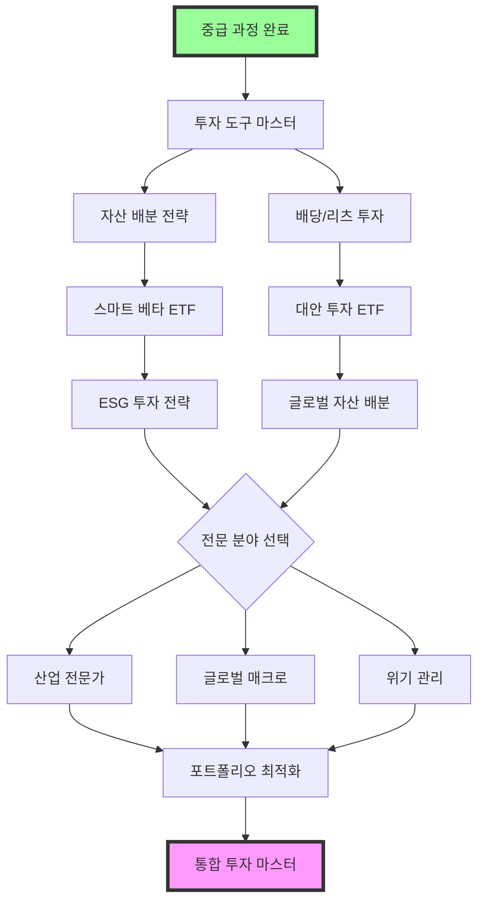

# 🔥 고급 리스크 해제 가이드 - 전문가 과정

> "중급자를 벗어나 진정한 전문가가 되려면, 이론을 넘어 실제 시장에서 검증받아야 한다."
> - 레이 달리오 AI 멘토

## 🎯 고급 과정 철학

### 고급자가 직면하는 현실
- 💰 **상당한 자금**: 1억원-3억원 규모의 자금 운용
- 🏢 **체계적 관리**: 가족 자산을 책임지는 운용 능력
- 📊 **심화 분석**: 개인 투자를 넘어선 전문적 리서치 능력
- 🌍 **글로벌 시각**: 국내외 시장을 아우르는 투자 시각
- 🎯 **일관된 성과**: 운이 아닌 시스템으로 안정적 수익 창출

### 고급 과정에서 얻는 전문가 능력
- 🏗️ **시스템 구축**: 투자 프로세스의 완전 체계화
- 🔍 **딥 리서치**: 시장 참여자들이 놓치는 깊은 인사이트
- 💡 **독창적 전략**: 남들이 따라할 수 없는 고유한 투자 철학
- 🌟 **리더십**: 투자 조직을 이끄는 전문가 리더십

### 🗺️ 고급 학습 로드맵
```
레벨 75-85   → 투자 도구 마스터 (스크리닝/분석 도구, 1억원+)
레벨 85-95   → 자산 배분 전문가 (리츠/배당주 포함 복합 포트폴리오)
레벨 95-105  → 대안 투자 입문 (리츠/원자재 ETF/해외 부동산)
레벨 105-115 → 심화 분석가 (산업 분석 전문화)
레벨 115-125 → 글로벌 투자 전문가 (해외 40%+ 포트폴리오)
레벨 125-135 → 위기 관리 전문가 (시장 사이클 대응)
레벨 135-150 → 통합 투자 마스터 (종합 자산 관리)
```

## 💪 고급자 필수 사전 자격

✅ **중급 과정 완전 수료** (7개 이상 리스크 해제)
✅ **2년 이상 실제 투자 경험** (중급 과정 포함)
✅ **3000만원 이상 성공적 운용 경험**
✅ **3번 이상의 위기 극복 경험** (-20% 이상 손실에서 회복)
✅ **1억원 이상 투자 가능 자금**
✅ **주 20시간 이상 투자 연구 시간** (준전문가 수준)
✅ **투자 관련 도구 활용 능력** (스크리너, 차트 분석 등)

---

## 🔗 고급 리스크 연계 맵
고급 과정은 중급에서 쌓은 기초를 바탕으로 전문가 수준으로 발전시키는 과정입니다.



### 📊 난이도 조정 안내
- 🟢 **조정된 자금 요구사항**: 
  - 초기: 1억원 → 1.5억원 (1.5배)
  - 중기: 1.5억원 → 2억원 (1.3배)
  - 후기: 2억원 → 3억원 (1.5배)
- 🟡 **단계별 전환 기간**: 각 리스크 간 최소 1개월 준비 기간
- 🔴 **실패 허용 범위**: 각 단계에서 2회 실패까지 허용, 3회 실패 시 중급 과정 복습 필요

---

## 📊 Advanced Risk Unlocks (Level 75-150)

### 🟢 Market Risk Master 고급 코스

#### 1. **투자 도구 활용 마스터** (Investment Tools Mastery)
- **리스크 ID**: `investment_tools_master`
- **필요 레벨**: 75
- **필요 키**: Integration Master Key, Real Analysis Key
- **시장 상황**: 정보와 도구가 투자 성과를 좌우하는 환경
- **설명**: **스크리너, 백테스팅 도구 등을 활용한 체계적 투자 전략 구축**

💡 **왜 고급자에게 필수인가?**
1억원 이상의 자금을 운용할 때는 직관보다 데이터 기반 의사결정이 중요합니다. 전문 도구를 활용한 체계적 접근이 필수입니다.

🎯 **투자 도구 활용의 현실**
- 스크리너 활용: 조건 검색으로 종목 발굴
- 백테스팅 도구: 전략 검증 (퀀트킹, 시스트레이더 등)
- 차트 분석: 트레이딩뷰, 키움 영웅문 활용
- 포트폴리오 관리: 엑셀/구글시트 최적화

**해제 조건**:
- 🔍 Screening Master: 스크리너로 우량주 발굴 성공
- 📈 Backtesting Success: 백테스팅 도구로 전략 검증
- 💰 Real Capital: 1억원 이상 체계적 운용
- 🎯 Consistent Return: 월평균 1% 이상 수익 6개월 달성

**챌린지**:
1. **스크리너 활용 전략**: 체계적 종목 발굴
   ```python
   # 고급 스크리닝 시스템 - 다팩터 모델
   import pandas as pd
   import numpy as np
   from sklearn.ensemble import RandomForestRegressor
   from sklearn.preprocessing import StandardScaler
   
   class AdvancedStockScreener:
       def __init__(self):
           self.scaler = StandardScaler()
           self.model = RandomForestRegressor(n_estimators=100, random_state=42)
           self.factor_weights = {
               'value': 0.25,      # 밸류 팩터
               'quality': 0.25,    # 퀄리티 팩터  
               'momentum': 0.25,   # 모멘텀 팩터
               'growth': 0.25      # 성장 팩터
           }
           
       def calculate_value_score(self, data):
           """밸류 점수 계산"""
           # PER, PBR, PSR, PCR 역수로 계산
           per_score = 1 / (data['PER'] + 0.1)
           pbr_score = 1 / (data['PBR'] + 0.1)
           psr_score = 1 / (data['PSR'] + 0.1)
           pcr_score = 1 / (data['PCR'] + 0.1)
           
           # Z-score 정규화
           scores = pd.DataFrame({
               'per': self.normalize_score(per_score),
               'pbr': self.normalize_score(pbr_score),
               'psr': self.normalize_score(psr_score),
               'pcr': self.normalize_score(pcr_score)
           })
           
           return scores.mean(axis=1)
       
       def calculate_quality_score(self, data):
           """퀄리티 점수 계산"""
           roe_score = self.normalize_score(data['ROE'])
           roa_score = self.normalize_score(data['ROA'])
           roic_score = self.normalize_score(data['ROIC'])
           debt_score = self.normalize_score(1 / (data['부채비율'] + 0.1))
           
           # 가중 평균
           quality_score = (roe_score * 0.3 + roa_score * 0.3 + 
                           roic_score * 0.2 + debt_score * 0.2)
           
           return quality_score
       
       def calculate_momentum_score(self, data):
           """모멘텀 점수 계산"""
           mom_1m = self.normalize_score(data['1개월수익률'])
           mom_3m = self.normalize_score(data['3개월수익률'])
           mom_6m = self.normalize_score(data['6개월수익률'])
           mom_12m = self.normalize_score(data['12개월수익률'])
           
           # 최근 가중치 높게
           momentum_score = (mom_1m * 0.4 + mom_3m * 0.3 + 
                           mom_6m * 0.2 + mom_12m * 0.1)
           
           return momentum_score
       
       def calculate_growth_score(self, data):
           """성장성 점수 계산"""
           revenue_growth = self.normalize_score(data['매출성장률'])
           profit_growth = self.normalize_score(data['영업이익성장률'])
           eps_growth = self.normalize_score(data['EPS성장률'])
           
           growth_score = (revenue_growth * 0.4 + profit_growth * 0.4 + 
                          eps_growth * 0.2)
           
           return growth_score
       
       def normalize_score(self, series):
           """Z-score 정규화"""
           return (series - series.mean()) / series.std()
       
       def calculate_composite_score(self, data):
           """종합 점수 계산"""
           value_score = self.calculate_value_score(data)
           quality_score = self.calculate_quality_score(data)
           momentum_score = self.calculate_momentum_score(data)
           growth_score = self.calculate_growth_score(data)
           
           # 팩터별 가중 합산
           composite_score = (
               value_score * self.factor_weights['value'] +
               quality_score * self.factor_weights['quality'] +
               momentum_score * self.factor_weights['momentum'] +
               growth_score * self.factor_weights['growth']
           )
           
           return composite_score
       
       def advanced_screening(self, stock_data, top_n=20):
           """고급 스크리닝 실행"""
           # 기본 필터링
           filtered_data = stock_data[
               (stock_data['시가총액'] >= 1000) &  # 1000억 이상
               (stock_data['PER'] > 0) & (stock_data['PER'] < 50) &
               (stock_data['ROE'] > 5) &  # ROE 5% 이상
               (stock_data['부채비율'] < 200) &  # 부채비율 200% 이하
               (stock_data['영업이익'] > 0)  # 영업이익 흑자
           ].copy()
           
           if len(filtered_data) == 0:
               return pd.DataFrame()
           
           # 종합 점수 계산
           filtered_data['종합점수'] = self.calculate_composite_score(filtered_data)
           
           # 상위 종목 선정
           top_stocks = filtered_data.nlargest(top_n, '종합점수')
           
           return top_stocks[['종목명', '종합점수', 'PER', 'ROE', '매출성장률', '시가총액']]
       
       def sector_screening(self, stock_data, sector_field='업종'):
           """섹터별 상대 스크리닝"""
           results = []
           
           for sector in stock_data[sector_field].unique():
               sector_data = stock_data[stock_data[sector_field] == sector]
               if len(sector_data) >= 5:  # 최소 5개 종목 이상
                   sector_top = self.advanced_screening(sector_data, top_n=3)
                   sector_top['업종'] = sector
                   results.append(sector_top)
           
           return pd.concat(results, ignore_index=True) if results else pd.DataFrame()
   
   # 사용 예시
   screener = AdvancedStockScreener()
   
   # 샘플 데이터 (실제로는 API나 데이터베이스에서 가져옴)
   stock_data = pd.DataFrame({
       '종목명': ['삼성전자', 'SK하이닉스', 'NAVER', 'LG화학', '카카오'],
       'PER': [15.2, 12.8, 25.1, 18.5, 35.2],
       'PBR': [1.2, 1.8, 2.5, 1.1, 3.2],
       'ROE': [12.5, 18.2, 8.5, 15.1, 6.8],
       '부채비율': [45.2, 62.1, 28.5, 89.2, 15.6],
       '시가총액': [45000, 8500, 3200, 4800, 2100],
       '매출성장률': [8.5, 15.2, 12.1, 22.5, -5.2],
       '영업이익성장률': [12.1, 25.8, 8.9, 18.7, -15.2],
       '1개월수익률': [2.1, 5.8, -1.2, 8.5, -12.5],
       '업종': ['반도체', '반도체', 'IT서비스', '화학', 'IT서비스']
   })
   
   # 고급 스크리닝 실행
   top_stocks = screener.advanced_screening(stock_data)
   print("=== 종합 스크리닝 결과 ===")
   print(top_stocks)
   
   # 섹터별 스크리닝
   sector_results = screener.sector_screening(stock_data)
   print("\n=== 섹터별 스크리닝 결과 ===")
   print(sector_results)
   ```
   
   실전 스크리닝 조건 (고도화):
   - 다팩터 모델 적용 (밸류/퀄리티/모멘텀/성장)
   - 섹터별 상대 평가 시스템
   - 동적 가중치 조정 알고리즘
   - 시가총액 1000억원 이상 + 유동성 필터
   - 월 1회 스크리닝 후 상위 20종목 선정 (포트폴리오 다양성)

2. **백테스팅 도구 활용**: 전략 검증과 최적화
   ```python
   # 전문가급 백테스팅 프레임워크
   import pandas as pd
   import numpy as np
   import matplotlib.pyplot as plt
   from typing import Dict, List, Tuple
   from dataclasses import dataclass
   from datetime import datetime, timedelta
   
   @dataclass
   class BacktestConfig:
       """백테스팅 설정"""
       start_date: str
       end_date: str
       initial_capital: float
       commission_rate: float = 0.002  # 0.2% 수수료
       tax_rate: float = 0.22  # 22% 세금
       rebalance_frequency: str = 'M'  # M(월), Q(분기), Y(년)
       max_position_size: float = 0.2  # 단일 종목 최대 20%
       
   class AdvancedBacktester:
       def __init__(self, config: BacktestConfig):
           self.config = config
           self.portfolio_history = []
           self.trade_history = []
           self.current_positions = {}
           self.current_cash = config.initial_capital
           
       def load_market_data(self, symbols: List[str]) -> Dict[str, pd.DataFrame]:
           """시장 데이터 로드 (실제로는 API에서 가져옴)"""
           # 샘플 데이터 생성
           date_range = pd.date_range(self.config.start_date, self.config.end_date, freq='D')
           market_data = {}
           
           for symbol in symbols:
               # 가상의 주가 데이터 생성 (실제로는 외부 API 사용)
               np.random.seed(hash(symbol) % 10000)
               returns = np.random.normal(0.0005, 0.02, len(date_range))  # 일일 수익률
               prices = [100]  # 시작 가격
               
               for ret in returns[1:]:
                   prices.append(prices[-1] * (1 + ret))
               
               market_data[symbol] = pd.DataFrame({
                   'date': date_range,
                   'close': prices,
                   'volume': np.random.randint(100000, 1000000, len(date_range))
               }).set_index('date')
               
           return market_data
       
       def calculate_portfolio_weights(self, market_data: Dict, date: pd.Timestamp) -> Dict[str, float]:
           """포트폴리오 가중치 계산 (여기서는 동일 가중치)"""
           symbols = list(market_data.keys())
           equal_weight = 1.0 / len(symbols)
           return {symbol: equal_weight for symbol in symbols}
       
       def execute_rebalancing(self, target_weights: Dict[str, float], 
                             market_data: Dict, date: pd.Timestamp):
           """리밸런싱 실행"""
           total_portfolio_value = self.calculate_portfolio_value(market_data, date)
           
           # 현재 포지션 가치 계산
           current_weights = {}
           for symbol in target_weights.keys():
               if symbol in self.current_positions:
                   position_value = (self.current_positions[symbol] * 
                                   market_data[symbol].loc[date, 'close'])
                   current_weights[symbol] = position_value / total_portfolio_value
               else:
                   current_weights[symbol] = 0.0
           
           # 리밸런싱 필요한 종목 찾기
           trades_needed = []
           for symbol, target_weight in target_weights.items():
               current_weight = current_weights.get(symbol, 0.0)
               weight_diff = target_weight - current_weight
               
               if abs(weight_diff) > 0.01:  # 1% 이상 차이날 때만 리밸런싱
                   target_value = total_portfolio_value * target_weight
                   current_value = total_portfolio_value * current_weight
                   trade_value = target_value - current_value
                   
                   # 수수료 및 세금 고려
                   if trade_value > 0:  # 매수
                       trade_cost = abs(trade_value) * self.config.commission_rate
                       net_trade_value = trade_value - trade_cost
                   else:  # 매도
                       # 매도 시 세금까지 고려
                       trade_cost = abs(trade_value) * (self.config.commission_rate + self.config.tax_rate)
                       net_trade_value = trade_value + trade_cost
                   
                   trades_needed.append({
                       'symbol': symbol,
                       'action': 'BUY' if trade_value > 0 else 'SELL',
                       'value': trade_value,
                       'cost': trade_cost,
                       'shares': net_trade_value / market_data[symbol].loc[date, 'close']
                   })
           
           # 거래 실행
           for trade in trades_needed:
               self.execute_trade(trade, date)
       
       def execute_trade(self, trade: Dict, date: pd.Timestamp):
           """개별 거래 실행"""
           symbol = trade['symbol']
           shares = trade['shares']
           cost = trade['cost']
           
           # 포지션 업데이트
           if symbol not in self.current_positions:
               self.current_positions[symbol] = 0
           
           self.current_positions[symbol] += shares
           self.current_cash -= (trade['value'] + cost)
           
           # 거래 기록
           self.trade_history.append({
               'date': date,
               'symbol': symbol,
               'action': trade['action'],
               'shares': shares,
               'value': trade['value'],
               'cost': cost
           })
       
       def calculate_portfolio_value(self, market_data: Dict, date: pd.Timestamp) -> float:
           """포트폴리오 총 가치 계산"""
           total_value = self.current_cash
           
           for symbol, shares in self.current_positions.items():
               if shares > 0:
                   price = market_data[symbol].loc[date, 'close']
                   total_value += shares * price
           
           return total_value
       
       def run_backtest(self, symbols: List[str], strategy_func=None):
           """백테스팅 실행"""
           # 시장 데이터 로드
           market_data = self.load_market_data(symbols)
           
           # 리밸런싱 날짜 생성
           rebalance_dates = pd.date_range(
               self.config.start_date, 
               self.config.end_date, 
               freq=self.config.rebalance_frequency
           )
           
           # 포트폴리오 성과 추적
           all_dates = pd.date_range(self.config.start_date, self.config.end_date, freq='D')
           
           for date in all_dates:
               # 리밸런싱 날짜인지 확인
               if date in rebalance_dates:
                   if strategy_func:
                       target_weights = strategy_func(market_data, date)
                   else:
                       target_weights = self.calculate_portfolio_weights(market_data, date)
                   
                   self.execute_rebalancing(target_weights, market_data, date)
               
               # 일일 포트폴리오 가치 기록
               portfolio_value = self.calculate_portfolio_value(market_data, date)
               self.portfolio_history.append({
                   'date': date,
                   'portfolio_value': portfolio_value,
                   'cash': self.current_cash,
                   'positions': self.current_positions.copy()
               })
       
       def analyze_performance(self) -> Dict:
           """성과 분석"""
           portfolio_df = pd.DataFrame(self.portfolio_history)
           portfolio_df['daily_return'] = portfolio_df['portfolio_value'].pct_change()
           
           # 주요 지표 계산
           total_return = (portfolio_df['portfolio_value'].iloc[-1] / 
                          portfolio_df['portfolio_value'].iloc[0] - 1)
           
           annual_return = (1 + total_return) ** (252 / len(portfolio_df)) - 1
           volatility = portfolio_df['daily_return'].std() * np.sqrt(252)
           sharpe_ratio = annual_return / volatility if volatility > 0 else 0
           
           # 최대 손실폭 (MDD) 계산
           cumulative = (1 + portfolio_df['daily_return']).cumprod()
           rolling_max = cumulative.expanding().max()
           drawdown = (cumulative - rolling_max) / rolling_max
           max_drawdown = drawdown.min()
           
           return {
               'total_return': total_return,
               'annual_return': annual_return,
               'volatility': volatility,
               'sharpe_ratio': sharpe_ratio,
               'max_drawdown': max_drawdown,
               'win_rate': (portfolio_df['daily_return'] > 0).mean(),
               'total_trades': len(self.trade_history),
               'portfolio_df': portfolio_df
           }
       
       def plot_performance(self, benchmark_data=None):
           """성과 시각화"""
           portfolio_df = pd.DataFrame(self.portfolio_history)
           
           fig, axes = plt.subplots(2, 2, figsize=(15, 10))
           
           # 1. 포트폴리오 가치 변화
           axes[0,0].plot(portfolio_df['date'], portfolio_df['portfolio_value'])
           axes[0,0].set_title('Portfolio Value Over Time')
           axes[0,0].set_ylabel('Portfolio Value')
           
           # 2. 일일 수익률 분포
           daily_returns = portfolio_df['portfolio_value'].pct_change().dropna()
           axes[0,1].hist(daily_returns, bins=50, alpha=0.7)
           axes[0,1].set_title('Daily Returns Distribution')
           axes[0,1].set_xlabel('Daily Return')
           
           # 3. 드로우다운
           cumulative = (1 + daily_returns).cumprod()
           rolling_max = cumulative.expanding().max()
           drawdown = (cumulative - rolling_max) / rolling_max
           
           axes[1,0].fill_between(portfolio_df['date'][1:], drawdown, 0, alpha=0.3, color='red')
           axes[1,0].set_title('Drawdown')
           axes[1,0].set_ylabel('Drawdown (%)')
           
           # 4. 월별 수익률 히트맵
           monthly_returns = daily_returns.resample('M').apply(lambda x: (1 + x).prod() - 1)
           axes[1,1].plot(monthly_returns.index, monthly_returns.values, marker='o')
           axes[1,1].set_title('Monthly Returns')
           axes[1,1].set_ylabel('Monthly Return')
           
           plt.tight_layout()
           plt.show()
   
   # 사용 예시
   config = BacktestConfig(
       start_date='2020-01-01',
       end_date='2023-12-31',
       initial_capital=100_000_000,  # 1억원
       commission_rate=0.002,
       rebalance_frequency='M'  # 월별 리밸런싱
   )
   
   backtester = AdvancedBacktester(config)
   symbols = ['005930', '000660', '035420', '051910', '006400']  # 대형주 5종목
   
   # 백테스팅 실행
   backtester.run_backtest(symbols)
   
   # 성과 분석
   performance = backtester.analyze_performance()
   print(f"총 수익률: {performance['total_return']:.2%}")
   print(f"연간 수익률: {performance['annual_return']:.2%}")
   print(f"변동성: {performance['volatility']:.2%}")
   print(f"샤프 비율: {performance['sharpe_ratio']:.2f}")
   print(f"최대 손실폭: {performance['max_drawdown']:.2%}")
   ```
   
   백테스팅 고도화 기능:
   - 실제 거래비용 및 세금 반영 (슬리피지 포함)
   - 다양한 리밸런싱 주기 최적화 테스트
   - 아웃오브샘플 검증으로 과최적화 방지
   - 몬테카를로 시뮬레이션으로 리스크 시나리오 테스트

3. **포트폴리오 관리 시스템**: 엑셀/구글시트 활용
   - 실시간 수익률 추적
   - 섹터별/종목별 비중 관리
   - 리밸런싱 알림 설정
   - 월별 성과 리포트 자동화

### 🔴 투자 도구 활용 실패 사례 & 회복 전략

#### 한국 시장 도구 활용 실패 사례
1. **2020년 스크리너 맹신 실패**: 정량 지표만 보고 투자
   ```
   실패 시나리오:
   - PER 10 이하 저평가주만 기계적 매수
   - 업종 특성과 성장성 무시
   - 구조적 쇠퇴 산업에 집중 투자
   - 2년간 -20% 수익률 기록
   
   교훈:
   - 정량 + 정성 분석 병행 필수
   - 업종 특성 고려한 지표 선택
   - 미래 전망 함께 검토
   ```

2. **백테스팅 과신 실패**: 과거 데이터 과적합
   ```
   위험 패턴:
   - 과거 5년 최적화 전략 맹신
   - 시장 환경 변화 간과
   - 실제 거래 시 슬리피지 예상 초과
   - 백테스팅 대비 -50% 성과
   
   예방법:
   - 아웃오브샘플 테스트 필수
   - 보수적 거래비용 가정
   - 다양한 시장 환경 테스트
   - 실전은 소액부터 시작
   ```

#### 회복 전략
- **전략 다각화**: 단일 팩터에 의존하지 않는 멀티팩터 접근
- **적응형 모델**: 시장 체제 변화에 따른 모델 자동 조정
- **리스크 관리**: 최대 손실 한도 설정 및 실시간 모니터링
- **지속적 백테스팅**: 월별 전략 성과 검토 및 개선

### 🛠️ 투자 도구 활용 실전 가이드

#### 1. **스크리너 활용 전략 예시**
```
한국 시장 우량주 스크리닝:
1. 네이버 증권 스크리너 활용
   - ROE 15% 이상
   - 부채비율 100% 이하
   - 매출액 증가율 5% 이상
   - PER 15 이하

2. 추가 필터링 (수동)
   - 최근 3년 영업이익 흑자
   - 업종 내 경쟁력 검토
   - 대주주 지분율 확인
   
3. 최종 10종목 선정
```

#### 2. **포트폴리오 관리 엑셀 템플릿**
- **종목별 시트**: 매수가, 현재가, 수익률 자동 계산
- **섹터별 집계**: 업종별 비중 자동 산출
- **리밸런싱 알림**: 목표 비중 ±5% 이탈 시 표시
- **월별 성과**: 월별 수익률 차트 자동 생성

💪 **6개월 도구 활용 마스터 미션**
- 매월 스크리너로 종목 발굴 및 투자
- 5000만원 이상 실제 자금 운용
- 샤프 비율 1.5 이상 달성 목표
- 완전 자동화된 매매 시스템 구축

📊 **AI 멘토의 조언**
> "퀀트는 도구가 아니라 철학이다. 시장을 이기려면 감정을 시스템으로 대체해야 한다." - 짐 사이먼스 AI

**보상**:
- 경험치: 600 XP
- 키 획득: Investment Tools Master Key (tools_mastery)
- 스킬 포인트: Systematic Trader +3
- 특별 보상: 전문가급 투자 도구 템플릿

---

#### 1.2. **대형 자금 운용 마스터** (Large Capital Management Master)
- **리스크 ID**: `large_capital_management`
- **필요 레벨**: 76
- **필요 키**: Investment Tools Master Key (tools_mastery)
- **시장 상황**: 1억원 이상 대형 자금의 체계적 운용이 필요한 환경
- **설명**: **1억원-3억원 대형 자금의 전문적 운용 및 최적화 전략 마스터**

💡 **왜 고급자에게 필수인가?**
1억원과 1000만원은 완전히 다른 게임입니다. 시장 충격, 유동성 관리, 복수 계좌 운용 등 대형 자금만의 고유한 도전을 마스터해야 합니다.

🎯 **대형 자금 운용의 현실**
- **시장 충격**: 대량 거래 시 슬리피지 발생
- **유동성 관리**: 현금 흐름 최적화 필요
- **복수 계좌**: 여러 증권사 계좌 통합 관리
- **세금 효율성**: 대형 거래의 절세 전략

**해제 조건**:
- 💰 Large Portfolio: 1억원 이상 실제 자금 운용
- 📊 Execution Excellence: 슬리피지 0.1% 이내 관리
- 🏦 Multi-Account: 3개 이상 계좌 통합 운용
- 🎯 Performance: 벤치마크 대비 연 3% 초과수익

**챌린지**:
1. **블록 거래 및 분할 매매 전략**: 시장 충격 최소화
   ```
   🏗️ 대형 거래 실행 전략:
   
   TWAP (Time Weighted Average Price) 전략:
   - 거래 시간 분산: 30분-2시간에 걸쳐 분할 실행
   - 거래량 고려: 평균 거래량의 10% 이내로 제한
   - 시간대 선택: 오전 10-11시, 오후 2-3시 집중
   - 자동화 도구: 증권사 알고리즘 주문 활용
   
   VWAP (Volume Weighted Average Price) 전략:
   - 거래량 패턴 분석: 과거 20일 거래량 패턴 참조
   - 비중 배분: 거래량 비례 분할 주문
   - 실시간 조정: 시장 상황에 따른 동적 조정
   - 성과 측정: VWAP 대비 실행 가격 비교
   
   실전 분할 매매 예시:
   삼성전자 2억원 매수 주문
   ├── 1차: 4000만원 (20%) - 장 시작 30분 후
   ├── 2차: 6000만원 (30%) - 오전 거래량 피크
   ├── 3차: 6000만원 (30%) - 오후 거래 재개
   └── 4차: 4000만원 (20%) - 장 마감 1시간 전
   ```

2. **복수 계좌 통합 관리 시스템**: 효율적 자금 배분
   ```
   🏦 멀티 계좌 최적화 전략:
   
   계좌별 특화 전략:
   - 주계좌 (70%): 핵심 포트폴리오 + 장기 투자
   - 매매계좌 (20%): 단기 매매 + 회전율 높은 종목
   - ISA계좌 (10%): 고위험 투자 + 절세 최적화
   
   계좌별 수수료 최적화:
   - 대형 거래: 수수료 할인율 높은 계좌 활용
   - 소액 거래: 최소 수수료 계좌 활용  
   - ETF 거래: ETF 수수료 면제 계좌 우선
   - 해외 투자: 환전 수수료 낮은 계좌 활용
   
   통합 모니터링 시스템:
   - 실시간 자산 집계: 모든 계좌 통합 현황
   - 리밸런싱 알고리즘: 최적 계좌 자동 선택
   - 세금 효율 계산: 계좌별 절세 효과 비교
   - 리스크 관리: 전체 포트폴리오 통합 리스크
   ```

3. **유동성 관리 및 현금 흐름 최적화**: 자금 효율성 극대화
   ```
   💰 현금 흐름 최적화 전략:
   
   단계별 현금 관리:
   1단계: 즉시 유동성 (1-2일) - 5%
   - CMA, MMF 활용
   - 단기 자금 시장 상품
   - 초단기 국채 ETF
   
   2단계: 단기 유동성 (1주-1개월) - 10%  
   - 정기예금, CD
   - 단기 채권 ETF
   - 리버스 레포
   
   3단계: 중기 유동성 (1-3개월) - 5%
   - 중기 국채 ETF
   - 회사채 ETF
   - 혼합형 펀드
   
   기회 자금 관리:
   - 시장 급락 대비: 전체의 10-15% 현금 비중 유지
   - 리밸런싱 자금: 분기별 5% 내외 조정 자금
   - 신규 투자 기회: 연 20-30% 신규 투자 자금
   - 배당 재투자: 자동 재투자 vs 현금 축적 선택
   ```

4. **고급 세금 최적화 전략**: 대형 자금 절세 극대화
   ```
   🏛️ 대형 자금 절세 전략:
   
   Tax Loss Harvesting (세금 손실 실현):
   - 연말 전 손실 종목 정리
   - 이익 종목과 손실 종목 매칭
   - 3년 이월공제 최대 활용
   - 워시 세일 규칙 준수 (30일 재매수 금지)
   
   계좌별 절세 최적화:
   - 일반계좌: 장기보유 혜택 최대화 (2년+)
   - ISA계좌: 고위험/고수익 투자 집중
   - 연금계좌: 안정적 배당주 집중
   - 해외계좌: 환율 차익 활용
   
   가족 단위 절세 전략:
   - 부양가족 계좌 활용: 가족 명의 분산 투자
   - 증여 절세: 연간 증여 한도 최대 활용
   - 상속 계획: 미리 계획한 자산 이전
   - 가족 펀드: 가족 공동 투자 구조
   ```

5. **리스크 관리 및 포트폴리오 최적화**: 대형 자금 안정성 확보
   ```
   🛡️ 대형 자금 리스크 관리:
   
   집중도 리스크 관리:
   - 단일 종목 한도: 전체의 5% 이내
   - 섹터 집중도: 단일 섹터 20% 이내  
   - 지역 분산: 국내 60%, 해외 40%
   - 통화 분산: USD 30%, KRW 60%, 기타 10%
   
   유동성 리스크 관리:
   - 일일 거래량: 평균 거래량의 5% 이내
   - 소형주 비중: 전체의 10% 이내
   - 긴급 매도 계획: 3일 내 50% 현금화 가능
   - 신용 거래 금지: 레버리지 최소화
   
   운영 리스크 관리:
   - 시스템 이중화: 메인/서브 거래 시스템
   - 계좌 분산: 시스템 리스크 최소화
   - 백업 계획: 거래 중단 시 대응책
   - 보안 강화: 다중 인증 시스템
   ```

**대형 자금 운용 실패 사례와 교훈**:
```
💔 실제 대형 자금 운용 실패 사례:

1. "개인 투자자 A씨" (2020년)
상황: 3억원으로 테슬라 집중 투자
실패: 한 번에 매수하여 5% 슬리피지 발생
손실: 1500만원 추가 비용 + 타이밍 미스
교훈: 분할 매매와 알고리즘 주문 필수

2. "자산가 B씨" (2021년)  
상황: 5억원을 단일 계좌에서 운용
실패: 증권사 시스템 오류로 거래 중단
손실: 2일간 매매 불가로 기회 손실
교훈: 계좌 분산과 백업 시스템 필요

3. "기업가 C씨" (2022년)
상황: 개인 명의로 10억원 투자
실패: 세금 최적화 무시로 과도한 세금
손실: 연간 5000만원 절세 기회 상실
교훈: 가족 명의 분산과 절세 계획

4. "전문직 D씨" (2023년)
상황: 2억원 긴급 현금화 필요
실패: 유동성 부족으로 20% 할인 매도
손실: 4000만원 기회 비용
교훈: 유동성 관리와 현금 비중 유지
```

📊 **AI 멘토의 조언**
> "대형 자금은 단순히 큰 돈이 아니라 시스템이다. 체계 없는 대형 자금은 큰 리스크일 뿐이다." - 워렌 버핏 AI

**보상**:
- 경험치: 1000 XP
- 키 획득: Large Capital Master Key (capital_mastery)
- 스킬 포인트: Capital Manager +4
- 특별 보상: 대형 자금 운용 통합 시스템

---

#### 1.5. **리스크 파리티 전문가** (Risk Parity Expert)
- **리스크 ID**: `risk_parity_expert`
- **필요 레벨**: 77
- **필요 키**: Code Implementation, Backtesting Success
- **시장 상황**: 전통적 자산배분 한계가 드러나는 환경
- **설명**: **리스크 기여도를 균등하게 배분하는 고급 포트폴리오 전략 마스터**

💡 **왜 고급자에게 필수인가?**
전통적인 60/40 포트폴리오는 실제로는 주식 리스크가 90%를 차지합니다. 리스크 파리티는 진정한 분산투자를 실현하는 고급 기법입니다.

🎯 **리스크 파리티의 핵심**
- 리스크 기여도: 각 자산의 포트폴리오 리스크 기여도 계산
- 레버리지 활용: 저변동성 자산에 레버리지 적용
- 동적 리밸런싱: 변동성 변화에 따른 지속적 조정
- 위험 예산: 자산별 리스크 할당 최적화

**해제 조건**:
- 🧮 Risk Calculation: 리스크 기여도 정확한 계산
- ⚖️ Equal Risk: 모든 자산의 리스크 기여도 균등화
- 📈 Performance: 샤프비율 1.8 이상 달성
- 💰 Large Scale: 1억원 이상 실제 운용

**챌린지**:
1. **리스크 기여도 계산**: 수학적 모델 구현
   ```python
   # 리스크 파리티 최적화
   def risk_parity_optimization(cov_matrix, target_risk):
       n_assets = len(cov_matrix)
       
       # 목적함수: 리스크 기여도 균등화
       def objective(weights):
           portfolio_risk = np.sqrt(weights @ cov_matrix @ weights)
           marginal_contrib = cov_matrix @ weights
           contrib = weights * marginal_contrib / portfolio_risk
           return np.sum((contrib - target_risk/n_assets)**2)
       
       # 최적화 실행
       result = minimize(objective, x0=initial_weights, 
                        constraints={'type': 'eq', 'fun': lambda x: np.sum(x) - 1})
       return result.x
   ```

2. **레버리지 관리**: 안전한 레버리지 활용
   - 목표 변동성 설정 (연 10-12%)
   - 자산별 레버리지 비율 계산
   - 마진콜 위험 관리
   - 비용 효율적 레버리지 구현

3. **동적 리밸런싱**: 실시간 포트폴리오 조정
   - 일별 변동성 모니터링
   - 리스크 기여도 재계산
   - 임계치 기반 리밸런싱
   - 거래비용 최적화

💪 **리스크 파리티 마스터 미션**
- 6개월간 리스크 파리티 전략 운용
- 4개 자산군 이상 포함 (주식, 채권, 원자재, 통화)
- 월별 리스크 기여도 균등성 유지
- 전통 60/40 대비 초과 성과 달성

📊 **AI 멘토의 조언**
> "리스크 파리티는 날씨에 상관없이 작동하는 전천후 포트폴리오다." - 레이 달리오 AI

**보상**:
- 경험치: 800 XP
- 키 획득: Risk Parity Master Key
- 스킬 포인트: Portfolio Engineer +4

---

#### 1.6. **머신러닝/AI 투자 전문가** (ML/AI Investment Expert)
- **리스크 ID**: `ml_ai_investment`
- **필요 레벨**: 78
- **필요 키**: Risk Parity Master Key, Alpha Generation
- **시장 상황**: 빅데이터와 AI가 투자의 핵심이 되는 시대
- **설명**: **최신 머신러닝 기법을 실제 투자에 적용하여 알파 창출**

💡 **왜 고급자에게 필수인가?**
전통적 분석의 한계를 넘어서려면 AI의 힘이 필요합니다. 대안 데이터와 딥러닝을 활용한 예측이 새로운 알파의 원천입니다.

🎯 **ML/AI 투자의 현실**
- 데이터 처리: 테라바이트급 대안 데이터
- 모델 복잡성: 수백만 개 파라미터
- 계산 자원: GPU 클러스터 필요
- 과최적화: 백테스트 함정 회피

**해제 조건**:
- 🤖 Model Development: 3개 이상 ML 모델 구현
- 📊 Alternative Data: 대안 데이터 5종 이상 활용
- 🎯 Prediction Accuracy: 방향성 예측 65% 이상
- 💰 Real Performance: 실제 수익 창출

**챌린지**:
1. **딥러닝 가격 예측**: LSTM/Transformer 모델
   ```python
   # 고급 머신러닝 투자 시스템
   import torch
   import torch.nn as nn
   import pandas as pd
   import numpy as np
   from sklearn.ensemble import RandomForestRegressor, GradientBoostingRegressor
   from sklearn.preprocessing import StandardScaler, RobustScaler
   from sklearn.model_selection import TimeSeriesSplit
   from transformers import AutoTokenizer, AutoModel
   import talib as ta
   
   class AdvancedMLInvestmentSystem:
       def __init__(self):
           self.models = {}
           self.scalers = {}
           self.feature_importance = {}
           
       def create_advanced_features(self, price_data, volume_data, external_data=None):
           """고급 피처 엔지니어링"""
           features = pd.DataFrame(index=price_data.index)
           
           # 1. 기술적 지표 피처
           features['rsi'] = ta.RSI(price_data.values)
           features['macd'], features['macd_signal'], features['macd_hist'] = ta.MACD(price_data.values)
           features['bb_upper'], features['bb_middle'], features['bb_lower'] = ta.BBANDS(price_data.values)
           features['atr'] = ta.ATR(price_data.values, price_data.values, price_data.values)
           
           # 2. 가격 기반 피처
           features['returns_1d'] = price_data.pct_change(1)
           features['returns_5d'] = price_data.pct_change(5)
           features['returns_20d'] = price_data.pct_change(20)
           features['volatility_20d'] = features['returns_1d'].rolling(20).std()
           
           # 3. 모멘텀 피처
           features['momentum_12'] = price_data / price_data.shift(12) - 1
           features['momentum_26'] = price_data / price_data.shift(26) - 1
           
           # 4. 거래량 기반 피처
           features['volume_sma'] = volume_data.rolling(20).mean()
           features['volume_ratio'] = volume_data / features['volume_sma']
           features['price_volume'] = features['returns_1d'] * features['volume_ratio']
           
           # 5. 고급 통계 피처
           features['skewness_20d'] = features['returns_1d'].rolling(20).skew()
           features['kurtosis_20d'] = features['returns_1d'].rolling(20).kurt()
           features['sharpe_20d'] = features['returns_1d'].rolling(20).mean() / features['volatility_20d']
           
           # 6. 차원 축소 피처 (PCA)
           from sklearn.decomposition import PCA
           numeric_features = features.select_dtypes(include=[np.number]).fillna(0)
           if len(numeric_features.columns) > 5:
               pca = PCA(n_components=5)
               pca_features = pca.fit_transform(numeric_features)
               for i in range(5):
                   features[f'pca_{i}'] = pca_features[:, i]
           
           # 7. 외부 데이터 피처 (뉴스 감정, 경제 지표 등)
           if external_data is not None:
               features = features.join(external_data, how='left')
           
           return features.fillna(method='ffill').dropna()
       
       def create_ensemble_model(self):
           """앙상블 모델 생성"""
           models = {
               'rf': RandomForestRegressor(n_estimators=200, max_depth=10, random_state=42),
               'gbm': GradientBoostingRegressor(n_estimators=200, max_depth=6, random_state=42),
               'xgb': self.create_xgboost_model(),
               'lstm': self.create_lstm_model(),
               'transformer': self.create_transformer_model()
           }
           return models
       
       def create_xgboost_model(self):
           """XGBoost 모델"""
           try:
               import xgboost as xgb
               return xgb.XGBRegressor(
                   n_estimators=200,
                   max_depth=6,
                   learning_rate=0.1,
                   subsample=0.8,
                   colsample_bytree=0.8,
                   random_state=42
               )
           except ImportError:
               return GradientBoostingRegressor(n_estimators=200, max_depth=6, random_state=42)
       
       def create_lstm_model(self):
           """LSTM 모델"""
           class LSTMPredictor(nn.Module):
               def __init__(self, input_size, hidden_size=128, num_layers=2):
                   super().__init__()
                   self.hidden_size = hidden_size
                   self.num_layers = num_layers
                   self.lstm = nn.LSTM(input_size, hidden_size, num_layers, batch_first=True, dropout=0.2)
                   self.fc = nn.Linear(hidden_size, 1)
                   self.dropout = nn.Dropout(0.2)
                   
               def forward(self, x):
                   lstm_out, _ = self.lstm(x)
                   lstm_out = self.dropout(lstm_out)
                   predictions = self.fc(lstm_out[:, -1, :])  # 마지막 시퀀스만 사용
                   return predictions
           
           return LSTMPredictor
       
       def create_transformer_model(self):
           """Transformer 모델"""
           class StockTransformer(nn.Module):
               def __init__(self, d_model=512, nhead=8, num_layers=6, input_size=20):
                   super().__init__()
                   self.input_projection = nn.Linear(input_size, d_model)
                   self.positional_encoding = nn.Parameter(torch.randn(1000, d_model))
                   
                   encoder_layer = nn.TransformerEncoderLayer(
                       d_model=d_model, 
                       nhead=nhead,
                       dim_feedforward=2048,
                       dropout=0.1
                   )
                   self.transformer = nn.TransformerEncoder(encoder_layer, num_layers)
                   self.predictor = nn.Linear(d_model, 1)
                   self.dropout = nn.Dropout(0.1)
                   
               def forward(self, x):
                   seq_len = x.size(1)
                   x = self.input_projection(x)
                   x += self.positional_encoding[:seq_len, :].unsqueeze(0)
                   x = x.transpose(0, 1)  # (seq, batch, features)
                   transformer_out = self.transformer(x)
                   transformer_out = self.dropout(transformer_out)
                   prediction = self.predictor(transformer_out[-1, :, :])  # 마지막 시퀀스
                   return prediction
           
           return StockTransformer
       
       def train_ensemble(self, features, targets, validation_split=0.2):
           """앙상블 모델 훈련"""
           # 시계열 분할
           tscv = TimeSeriesSplit(n_splits=5)
           models = self.create_ensemble_model()
           
           train_size = int(len(features) * (1 - validation_split))
           X_train, X_val = features.iloc[:train_size], features.iloc[train_size:]
           y_train, y_val = targets.iloc[:train_size], targets.iloc[train_size:]
           
           # 스케일링
           scaler = RobustScaler()
           X_train_scaled = scaler.fit_transform(X_train)
           X_val_scaled = scaler.transform(X_val)
           
           self.scalers['features'] = scaler
           
           ensemble_predictions = []
           
           for name, model in models.items():
               if name in ['lstm', 'transformer']:
                   # 딥러닝 모델 훈련
                   model_instance = model(input_size=X_train_scaled.shape[1])
                   predictions = self.train_deep_model(model_instance, X_train_scaled, y_train, X_val_scaled)
               else:
                   # 전통적 ML 모델 훈련
                   model.fit(X_train_scaled, y_train)
                   predictions = model.predict(X_val_scaled)
               
               ensemble_predictions.append(predictions)
               self.models[name] = model
           
           # 앙상블 가중치 계산 (성과 기반)
           ensemble_weights = self.calculate_ensemble_weights(ensemble_predictions, y_val)
           self.ensemble_weights = ensemble_weights
           
           return self.models
       
       def train_deep_model(self, model, X_train, y_train, X_val, epochs=100):
           """딥러닝 모델 훈련"""
           # 시퀀스 데이터로 변환
           sequence_length = 20
           X_sequences, y_sequences = self.create_sequences(X_train, y_train, sequence_length)
           X_val_seq, y_val_seq = self.create_sequences(X_val, y_train[-len(X_val):], sequence_length)
           
           # PyTorch 텐서로 변환
           X_tensor = torch.FloatTensor(X_sequences)
           y_tensor = torch.FloatTensor(y_sequences)
           X_val_tensor = torch.FloatTensor(X_val_seq)
           
           # 훈련
           criterion = nn.MSELoss()
           optimizer = torch.optim.Adam(model.parameters(), lr=0.001)
           
           model.train()
           for epoch in range(epochs):
               optimizer.zero_grad()
               outputs = model(X_tensor)
               loss = criterion(outputs.squeeze(), y_tensor)
               loss.backward()
               optimizer.step()
               
               if epoch % 20 == 0:
                   print(f'Epoch {epoch}, Loss: {loss.item():.4f}')
           
           # 검증 예측
           model.eval()
           with torch.no_grad():
               val_predictions = model(X_val_tensor).squeeze().numpy()
           
           return val_predictions
       
       def create_sequences(self, X, y, sequence_length):
           """시퀀스 데이터 생성"""
           X_sequences, y_sequences = [], []
           for i in range(len(X) - sequence_length):
               X_sequences.append(X[i:i+sequence_length])
               y_sequences.append(y[i+sequence_length])
           return np.array(X_sequences), np.array(y_sequences)
       
       def calculate_ensemble_weights(self, predictions_list, true_values):
           """앙상블 가중치 계산"""
           from sklearn.metrics import mean_squared_error
           
           weights = []
           for predictions in predictions_list:
               mse = mean_squared_error(true_values, predictions)
               weight = 1 / (mse + 1e-6)  # MSE 역수로 가중치 계산
               weights.append(weight)
           
           # 정규화
           weights = np.array(weights)
           weights = weights / weights.sum()
           
           return weights
       
       def predict(self, features):
           """앙상블 예측"""
           if not self.models:
               raise ValueError("모델이 훈련되지 않았습니다.")
           
           features_scaled = self.scalers['features'].transform(features)
           predictions = []
           
           for name, model in self.models.items():
               if name in ['lstm', 'transformer']:
                   # 딥러닝 모델 예측
                   sequence_length = 20
                   if len(features_scaled) >= sequence_length:
                       X_seq = features_scaled[-sequence_length:].reshape(1, sequence_length, -1)
                       X_tensor = torch.FloatTensor(X_seq)
                       model.eval()
                       with torch.no_grad():
                           pred = model(X_tensor).item()
                       predictions.append(pred)
                   else:
                       predictions.append(0)  # 시퀀스가 부족한 경우
               else:
                   pred = model.predict(features_scaled[-1:])
                   predictions.append(pred[0])
           
           # 가중 평균으로 최종 예측
           ensemble_pred = np.average(predictions, weights=self.ensemble_weights)
           return ensemble_pred
       
       def analyze_feature_importance(self):
           """피처 중요도 분석"""
           importance_data = {}
           
           for name, model in self.models.items():
               if hasattr(model, 'feature_importances_'):
                   importance_data[name] = model.feature_importances_
               elif hasattr(model, 'coef_'):
                   importance_data[name] = np.abs(model.coef_)
           
           return importance_data
   
   # 대안 데이터 통합 시스템
   class AlternativeDataIntegrator:
       def __init__(self):
           self.data_sources = {}
           
       def integrate_news_sentiment(self, stock_symbol, date_range):
           """뉴스 감정 분석 데이터"""
           # 실제로는 뉴스 API와 감정 분석 모델 사용
           sentiment_scores = np.random.normal(0, 0.1, len(date_range))
           return pd.Series(sentiment_scores, index=date_range, name='news_sentiment')
       
       def integrate_social_media(self, stock_symbol, date_range):
           """소셜 미디어 데이터"""
           social_buzz = np.random.exponential(1, len(date_range))
           return pd.Series(social_buzz, index=date_range, name='social_buzz')
       
       def integrate_economic_indicators(self, date_range):
           """경제 지표 데이터"""
           indicators = {
               'interest_rate': np.random.normal(2.5, 0.5, len(date_range)),
               'inflation_rate': np.random.normal(3.0, 1.0, len(date_range)),
               'unemployment_rate': np.random.normal(4.0, 0.5, len(date_range))
           }
           return pd.DataFrame(indicators, index=date_range)
       
       def integrate_satellite_data(self, date_range):
           """위성 데이터 (경제 활동 지표)"""
           activity_index = np.random.normal(100, 20, len(date_range))
           return pd.Series(activity_index, index=date_range, name='economic_activity')
   
   # 사용 예시
   ml_system = AdvancedMLInvestmentSystem()
   alt_data = AlternativeDataIntegrator()
   
   # 샘플 데이터
   dates = pd.date_range('2020-01-01', '2023-12-31', freq='D')
   price_data = pd.Series(np.random.randn(len(dates)).cumsum() + 100, index=dates)
   volume_data = pd.Series(np.random.randint(100000, 1000000, len(dates)), index=dates)
   
   # 대안 데이터 통합
   external_data = pd.concat([
       alt_data.integrate_news_sentiment('005930', dates),
       alt_data.integrate_social_media('005930', dates),
       alt_data.integrate_economic_indicators(dates),
       alt_data.integrate_satellite_data(dates)
   ], axis=1)
   
   # 피처 생성
   features = ml_system.create_advanced_features(price_data, volume_data, external_data)
   targets = price_data.pct_change(5).shift(-5).dropna()  # 5일 후 수익률 예측
   
   # 모델 훈련
   models = ml_system.train_ensemble(features[:-5], targets)
   
   # 예측
   latest_features = features.tail(1)
   prediction = ml_system.predict(latest_features)
   print(f"5일 후 예상 수익률: {prediction:.2%}")
   
   # 피처 중요도 분석
   importance = ml_system.analyze_feature_importance()
   print("피처 중요도:", importance)
   ```
           
       def forward(self, x):
           encoded = self.encoder(x)
           return self.predictor(encoded[-1])
   ```

2. **대안 데이터 활용**: 새로운 알파 소스
   - 위성 이미지: 주차장 차량 수, 석유 저장량
   - 소셜 미디어: 감성 분석, 트렌드 감지
   - 웹 스크래핑: 가격 비교, 재고 추적
   - IoT 데이터: 실시간 경제 활동 지표

3. **앙상블 전략**: 다중 모델 결합
   - 가격 예측 모델 + 감성 분석 모델
   - 단기 예측 + 장기 예측 결합
   - 모델 신뢰도 기반 가중치
   - 실시간 모델 업데이트

### 🔴 ML/AI 투자 실패 사례 & 회복 전략

#### 한국 시장 AI 투자 실패 사례
1. **2020년 AI 로보어드바이저 부진**: 코로나 급락 대응 실패
   ```
   실패 시나리오:
   - 과거 데이터 기반 모델의 한계
   - 블랙 스완 이벤트 예측 불가
   - 급락 시 손절 알고리즘 오작동
   - 고객 대량 이탈 및 서비스 중단
   
   교훈:
   - 극단적 시나리오 대비 필요
   - 리스크 관리 시스템 강화
   - 인간 판단과 AI 조합 필요
   ```

2. **소셜 미디어 감성 분석 실패**: 한국어 특수성 간과
   ```
   위험 패턴:
   - 영어권 감성 분석 모델 그대로 적용
   - 한국어 은유/관용어 처리 실패
   - 커뮤니티별 언어 특성 차이 무시
   - 조작된 여론에 속아 잘못된 신호
   
   예방법:
   - 한국어 특화 NLP 모델 개발
   - 다중 소스 교차 검증
   - 인위적 조작 탐지 시스템
   - 감성 분석 결과 가중치 조정
   ```

#### 회복 전략
- **앙상블 모델링**: 다양한 AI 모델 결합으로 안정성 향상
- **실시간 모니터링**: 모델 성능 지속적 추적 및 조정
- **인간-AI 협업**: 최종 판단에 전문가 검토 과정 포함
- **지속적 학습**: 새로운 데이터로 모델 정기 업데이트

### 🔬 AI 투자 실전 구현 가이드

#### 1. **한국 시장 특화 AI 모델**
```python
# 한국 시장 특화 피처 엔지니어링
def korea_market_features(stock_data):
    features = {
        # 시장 구조적 특징
        'market_cap_tier': get_market_cap_tier(stock_data),
        'chaebol_affiliation': get_chaebol_info(stock_data),
        'foreign_limit': get_foreign_ownership_limit(stock_data),
        
        # 한국 특화 지표
        'kospi_kosdaq_premium': calculate_market_premium(stock_data),
        'retail_vs_institutional': get_investor_type_ratio(stock_data),
        'program_trading_ratio': get_program_trading_info(stock_data),
        
        # 정책/규제 영향
        'regulatory_sensitivity': calculate_regulatory_impact(stock_data),
        'government_policy_exposure': get_policy_exposure(stock_data)
    }
    return features
```

#### 2. **과최적화 방지 시스템**
- **워크 포워드 분석**: 시점별 성과 검증
- **교차 검증**: K-Fold 시계열 교차 검증
- **아웃 오브 샘플**: 전체 데이터의 30% 검증용
- **안정성 테스트**: 파라미터 변화에 대한 민감도 분석

💪 **ML/AI 투자 마스터 미션**
- 3개월간 ML 모델 개발 및 백테스팅
- 실제 자금 3000만원 이상 운용
- 주간 예측 정확도 추적
- 전통 전략 대비 성과 비교

📊 **AI 멘토의 조언**
> "AI는 인간이 볼 수 없는 패턴을 본다. 하지만 시장의 본질을 이해하는 것은 여전히 인간의 몫이다." - 앤드류 응 AI

**보상**:
- 경험치: 850 XP
- 키 획득: AI Trader Key
- 스킬 포인트: Machine Learning Master +4

---

#### 1.65. **현대적 투자 도구 마스터** (Modern Investment Tools Master)
- **리스크 ID**: `modern_tools_master`
- **필요 레벨**: 79
- **필요 키**: Large Capital Master Key (capital_mastery), AI Trader Key
- **시장 상황**: 디지털 혁신이 투자 생태계를 변화시키는 시대
- **설명**: **2024년 최신 투자 도구와 디지털 자산을 활용한 차세대 투자 전략**

💡 **왜 고급자에게 필수인가?**
전통적 도구만으로는 현대 시장에서 경쟁력을 유지할 수 없습니다. 디지털 자산, API 자동화, 소셜 트레이딩 등 최신 도구를 마스터해야 진정한 고급자입니다.

🎯 **현대적 투자 도구의 핵심**
- **디지털 자산**: 비트코인 ETF, 스테이블코인 활용
- **API 자동화**: 프로그래밍 기반 거래 시스템
- **소셜 트레이딩**: 전문가 포트폴리오 복사 및 분석
- **대안 데이터**: 위성 데이터, 소셜 미디어 감성 분석

**해제 조건**:
- 🚀 Digital Asset: 포트폴리오의 5-10% 디지털 자산 운용
- 🤖 API Integration: 자동화 거래 시스템 구축 및 운영
- 📱 Modern Platform: 3개 이상 최신 투자 플랫폼 활용
- 📊 Alternative Data: 대안 데이터 기반 투자 의사결정

**챌린지**:
1. **디지털 자산 포트폴리오 구축**: 암호화폐와 전통 자산의 조화
   ```
   🪙 디지털 자산 통합 전략:
   
   비트코인 ETF 활용 (추천 비중: 3-5%):
   - KODEX 비트코인선물 ETF (국내)
   - ProShares Bitcoin Strategy ETF (해외)
   - iShares Bitcoin Trust (직접 비트코인 보유)
   - Grayscale Bitcoin Trust (할인/프리미엄 활용)
   
   디지털 자산 리밸런싱:
   - 월 1회 비중 점검 (변동성 높음)
   - 5% 초과 시 즉시 조정
   - 전통 자산과 상관관계 모니터링
   - 규제 변화 민감도 관리
   
   리스크 관리 특화:
   - 단일 코인 집중 금지 (분산 필수)
   - 레버리지 상품 제한 (2배 이하)
   - 스테이블코인 활용 (현금 대체)
   - 세무 신고 의무 철저 준수
   ```

2. **API 기반 자동화 거래 시스템**: 프로그래밍으로 감정 제거
   ```
   💻 API 자동화 실전 구현:
   
   Python 기반 자동화 시스템:
   ```python
   # 키움증권 API 활용 예시
   import kiwoom_api as kw
   import pandas as pd
   import numpy as np
   
   class AutoTradingSystem:
       def __init__(self):
           self.api = kw.KiwoomAPI()
           self.portfolio = {}
           self.rebalance_threshold = 0.05
       
       def daily_rebalancing(self):
           current_weights = self.get_current_weights()
           target_weights = self.get_target_weights()
           
           for symbol in self.portfolio:
               weight_diff = abs(current_weights[symbol] - target_weights[symbol])
               if weight_diff > self.rebalance_threshold:
                   self.execute_rebalance(symbol, target_weights[symbol])
       
       def risk_monitoring(self):
           portfolio_var = self.calculate_var()
           if portfolio_var > self.max_var_limit:
               self.reduce_risk_exposure()
   ```
   
   자동화 거래 규칙:
   - 감정 개입 완전 차단
   - 백테스팅 검증된 전략만 실행
   - 리스크 한도 자동 모니터링
   - 예외 상황 수동 개입 최소화
   ```

3. **로보어드바이저 및 소셜 트레이딩 활용**: 전문가 지식 레버리지
   ```
   🤝 소셜 트레이딩 전략:
   
   카피 트레이딩 플랫폼 활용:
   - eToro: 해외 전문가 포트폴리오 복사
   - ZuluTrade: 자동 신호 거래
   - NAGA: 소셜 투자 네트워크
   - 국내: 삼성증권 로보어드바이저
   
   전문가 선별 기준:
   - 3년 이상 검증된 트랙 레코드
   - 샤프 비율 1.5 이상
   - 최대 손실폭 15% 이내
   - 월별 수익률 안정성
   
   포트폴리오 배분 전략:
   - 자체 운용: 70% (핵심 전략)
   - 카피 트레이딩: 20% (분산 효과)
   - 로보어드바이저: 10% (안정성)
   ```

4. **대안 데이터 활용 투자**: 정보 우위 확보
   ```
   📡 대안 데이터 투자 전략:
   
   위성 데이터 활용:
   - 주차장 위성 사진 → 소매업 매출 예측
   - 공장 굴뚝 연기 → 제조업 가동률 분석
   - 크루드오일 탱크 → 유가 변동 예측
   - 농작물 생육 상태 → 농업 관련주 투자
   
   소셜 미디어 감성 분석:
   - 트위터 감성 지수 → 시장 심리 파악
   - 구글 트렌드 → 관심도 변화 추적
   - 뉴스 감성 분석 → 종목별 감성 점수
   - 레딧/디시 분석 → 개미 투자자 심리
   
   실시간 데이터 활용:
   - 신용카드 소비 데이터 → 소비 업종 예측
   - 교통량 데이터 → 물류/배송업 전망
   - 날씨 데이터 → 계절주 투자 타이밍
   - 금융 데이터 → 유동성 흐름 추적
   ```

5. **통합 투자 플랫폼 구축**: 올인원 투자 환경
   ```
   🏗️ 개인 맞춤 투자 플랫폼:
   
   데이터 통합 대시보드:
   - 실시간 포트폴리오 현황
   - 리스크 지표 모니터링
   - 뉴스/공시 통합 피드
   - 거시경제 지표 추적
   
   자동화 기능:
   - 목표 비중 이탈 시 알림
   - 리밸런싱 실행 제안
   - 세금 최적화 매매 제안
   - 기회 종목 자동 스크리닝
   
   분석 도구 통합:
   - 백테스팅 엔진
   - 포트폴리오 시뮬레이터
   - 리스크 분석 도구
   - 성과 평가 시스템
   
   외부 연동:
   - 증권사 API 통합
   - 데이터 벤더 연결
   - 소셜 트레이딩 플랫폼
   - 뉴스/정보 서비스
   ```

**현대적 도구 활용 실패 사례와 교훈**:
```
⚠️ 최신 도구 활용 실패 사례:

1. "테크 투자자 A씨" (2023년)
상황: 암호화폐에 포트폴리오의 30% 투자
실패: 비트코인 급락으로 전체 포트폴리오 20% 손실
교훈: 디지털 자산 비중 관리 (5-10% 이내)

2. "프로그래머 B씨" (2022년)
상황: 자동화 거래 시스템 과신
실패: 백테스트와 실전 차이로 연 -15% 손실
교훈: 실전 검증과 지속적 모니터링 필수

3. "소셜 트레이더 C씨" (2021년)
상황: 유명 트레이더 100% 카피
실패: 해당 트레이더 전략 실패로 동반 손실
교훈: 분산과 자체 검증 원칙 유지

4. "데이터 애널리스트 D씨" (2024년)
상황: 대안 데이터에만 의존한 투자
실패: 데이터 오류로 잘못된 투자 결정
교훈: 전통 분석과 대안 데이터 조합 필요
```

📊 **AI 멘토의 조언**
> "최신 도구는 양날의 검이다. 도구를 마스터하되 도구에 지배당하지 마라. 기본기가 탄탄한 자만이 신기술을 제대로 활용할 수 있다." - 이론 머스크 AI

**보상**:
- 경험치: 900 XP
- 키 획득: Modern Tools Master Key (modern_mastery)
- 스킬 포인트: Digital Native +4
- 특별 보상: 차세대 투자 플랫폼 액세스

---

#### 1.7. **ESG 투자 전문가** (ESG Investment Specialist)
- **리스크 ID**: `esg_specialist`
- **필요 레벨**: 79
- **필요 키**: AI Trader Key, Research Report
- **시장 상황**: 지속가능 투자가 주류가 되는 시대
- **설명**: **환경, 사회, 지배구조를 고려한 지속가능 투자로 장기 수익 창출**

💡 **왜 고급자에게 필수인가?**
ESG는 더 이상 선택이 아닌 필수입니다. 장기적 리스크 관리와 지속가능한 수익을 위해서는 ESG 통합이 핵심입니다.

🎯 **ESG 투자의 핵심**
- ESG 평가: 비재무적 요소의 재무적 영향 분석
- 임팩트 측정: 투자의 사회적 영향 정량화
- 그린워싱 탐지: 진짜 ESG vs 마케팅
- 장기 성과: 지속가능성과 수익의 양립

**해제 조건**:
- 📊 ESG Analysis: 50개 기업 ESG 평가 완료
- 🌱 Impact Measurement: 투자 임팩트 정량화
- 💰 Performance: ESG 포트폴리오 연 12% 수익
- 🎯 Integration: ESG 요소 투자 프로세스 통합

**챌린지**:
1. **ESG 스코어링 시스템**: 자체 평가 모델 구축
   ```
   ESG 평가 프레임워크:
   
   환경(E) - 40%:
   - 탄소 배출량 및 감축 목표
   - 재생에너지 사용 비율
   - 폐기물 관리 및 순환경제
   - 생물다양성 영향
   
   사회(S) - 30%:
   - 노동 관행 및 인권
   - 제품 안전성
   - 지역사회 기여
   - 고객 만족도
   
   지배구조(G) - 30%:
   - 이사회 독립성
   - 경영진 보상 체계
   - 주주 권리 보호
   - 윤리 경영 및 준법
   ```

2. **그린워싱 탐지**: 진짜 ESG 기업 구분
   - 실제 데이터 vs 마케팅 주장 비교
   - 제3자 인증 및 검증 확인
   - 동종업계 대비 상대 평가
   - 시계열 개선 추세 분석

3. **임팩트 투자 전략**: 수익과 임팩트 동시 추구
   - 클린테크 및 재생에너지
   - 사회적 기업 및 임팩트 본드
   - 지속가능 농업 및 식품
   - 포용적 금융 및 교육

💪 **ESG 전문가 미션**
- 6개월간 ESG 포트폴리오 운용
- 전체 자산의 30% 이상 ESG 투자
- 분기별 임팩트 리포트 작성
- 전통 투자 대비 동등 이상 수익

📊 **AI 멘토의 조언**
> "ESG는 리스크 관리의 진화다. 보이지 않는 리스크를 보는 것이 미래의 알파다." - 래리 핑크 AI

**보상**:
- 경험치: 900 XP
- 키 획득: Sustainable Investor Key
- 스킬 포인트: Impact Analyzer +4

---

#### 2. **구조화 상품 전문가** (Structured Products Specialist)
- **리스크 ID**: `structured_products_expert`
- **필요 레벨**: 80
- **필요 키**: Code Implementation, Alpha Generation
- **시장 상황**: 저금리 환경에서 수익 추구를 위한 복합상품 활용
- **설명**: **1억원 이상 구조화 상품 투자로 고급 리스크 관리 능력 습득**

💡 **왜 고급자에게 필수인가?**
대규모 자금 운용에서 구조화 상품은 피할 수 없는 선택입니다. 복잡한 구조를 완전히 이해하고 위험을 정확히 측정할 수 있어야 진정한 전문가입니다.

🎯 **구조화 상품의 현실**
- 최소 투자액: 1억원 이상
- 복잡성: 다중 기초자산 + 조건부 상환
- 유동성 위험: 중도 해지 시 큰 손실
- 신용 위험: 발행기관 부도 위험

**해제 조건**:
- 💰 Large Scale Investment: 1억원 이상 ELS/DLS 투자
- 🧮 Structure Analysis: 몬테카를로 시뮬레이션 완벽 이해
- 🛡️ Risk Management: 최대 손실 한도 설정 및 관리
- 📊 Performance Tracking: 투자 성과 정밀 추적

**챌린지**:
1. **ELS 마스터 투자**: 1억원 이상 ELS 실제 투자
   ```
   실전 투자 과제:
   삼성전자 연계 ELS 1억원 투자
   - 녹인 배리어 85%
   - 쿠폰 7.5% (연)
   - 3년 만기
   - 최대 손실 한도 30% 설정
   ```

2. **DLS 고급 분석**: 금리 연계 DLS 투자 분석
   - 금리 스왑 커브 분석
   - 듀레이션 리스크 측정
   - 신용 스프레드 변화 민감도
   - 조기 상환 시나리오 분석

3. **복합 구조화 상품**: 다중 기초자산 상품 투자
   - 원자재 + 주식 + 환율 연계
   - 상관관계 분석
   - 시나리오별 손익 분석
   - 리스크 헤지 전략

### 🔴 구조화 상품 실패 사례 & 회복 전략

#### 한국 시장 구조화 상품 실패 사례
1. **2018년 터키 리라 DLS 사태**: 신흥국 통화 연계 상품 폭락
   ```
   실패 시나리오:
   - 터키 리라 급락으로 -95% 손실
   - 높은 수익률에 현혹되어 리스크 간과
   - 일반 투자자들의 대규모 투자 집중
   - 금융당국 규제 강화로 시장 위축
   
   교훈:
   - 기초자산 리스크 철저 분석
   - 신흥국 통화 변동성 과소평가 금지
   - 투자 금액 한도 설정 필요
   - 정치적 리스크 고려 필수
   ```

2. **홍콩 H지수 ELS 연쇄 손실**: 중국 정치 리스크 간과
   ```
   위험 패턴:
   - 홍콩 시위 및 중국 정치 불안 확산
   - 낙인 배리어 연쇄 터치
   - 코로나19로 추가 급락
   - 만기 시 원금 손실 30-50% 발생
   
   예방법:
   - 지정학적 리스크 프리미엄 고려
   - 단일 국가 집중 투자 금지
   - 배리어 수준 보수적 설정
   - 분산 투자 원칙 준수
   ```

#### 회복 전략
- **상품 구조 완전 이해**: 투자 전 몬테카를로 시뮬레이션 필수
- **리스크 한도 설정**: 구조화 상품 총 자산의 30% 이내
- **분산 투자 원칙**: 단일 상품/기초자산 집중 금지
- **정기 모니터링**: 배리어 터치 위험 실시간 추적

### 🔬 구조화 상품 실전 분석 가이드

#### 1. **한국 시장 ELS 분석 프레임워크**
```python
# ELS 리스크 분석 시스템
def els_risk_analysis(product_info):
    # 기초자산 위험도 평가
    underlying_risk = calculate_underlying_volatility(product_info['underlying'])
    
    # 배리어 터치 확률 계산
    barrier_probability = monte_carlo_simulation(
        underlying_risk, 
        product_info['barrier_level'],
        product_info['maturity']
    )
    
    # 최대 손실 시나리오 분석
    max_loss_scenarios = stress_test_scenarios(product_info)
    
    # 투자 추천 여부 판단
    recommendation = {
        'risk_level': underlying_risk,
        'barrier_touch_prob': barrier_probability,
        'max_loss': max_loss_scenarios,
        'invest_recommendation': make_investment_decision(product_info)
    }
    
    return recommendation
```

#### 2. **구조화 상품 포트폴리오 관리**
- **자산 배분 한도**: 전체 자산의 30% 이내
- **상품별 분산**: 단일 상품 10% 이내
- **만기 분산**: 1년, 2년, 3년 만기 균등 배분
- **기초자산 분산**: 국내외 주식, 지수, 통화 등 다양화

💪 **구조화 상품 전문가 미션**
- 분기별 다른 구조화 상품 투자
- 총 3억원 이상 구조화 상품 포트폴리오
- 연 수익률 8% 이상 달성
- 최대 손실 한도 20% 이내 유지

📊 **AI 멘토의 조언**
> "구조화 상품은 양날의 검이다. 구조를 완전히 이해한 자만이 칼날을 잡을 수 있다." - 나심 탈레브 AI

---

#### 3. **대안 투자 전문가** (Alternative Investment Expert)
- **리스크 ID**: `alternative_expert`
- **필요 레벨**: 85
- **필요 키**: Large Scale Investment, Structure Analysis
- **시장 상황**: 전통 자산 대비 수익률이 높은 대안 투자 필요
- **설명**: **부동산, 원자재, 사모펀드 등 대안 투자로 포트폴리오 고도화**

💡 **왜 고급자에게 필수인가?**
전통적 주식/채권만으로는 한계가 있습니다. 대안 투자를 통해 진정한 분산투자와 절대 수익을 추구할 수 있어야 기관급 투자자입니다.

🎯 **대안 투자의 현실**
- 높은 진입 장벽: 최소 투자액 1억원 이상
- 유동성 부족: 즉시 현금화 불가
- 정보 비대칭: 전문 지식 필수
- 높은 수수료: 운용보수 + 성과보수

**해제 조건**:
- 🏢 Real Estate: 부동산 투자 2억원 이상
- 🥇 Commodities: 원자재 투자 5000만원 이상
- 💼 Private Equity: 사모펀드 투자 1억원 이상
- 📈 Performance: 대안 투자 연 수익률 12% 이상

**챌린지**:
1. **부동산 투자 마스터**: 직접 부동산 투자 + REITs
   ```
   실전 부동산 투자:
   - 수익형 부동산 직접 투자 2억원
   - REITs 포트폴리오 5000만원
   - 임대 수익률 6% 이상
   - 자본 이득 연 8% 이상
   ```

2. **원자재 투자**: 금, 원유, 농산물 투자
   - 현물 금 3000만원 투자
   - 원유 ETF 1000만원 투자
   - 농산물 선물 1000만원 투자
   - 인플레이션 헤지 효과 검증

3. **사모펀드 투자**: 프라이빗 에쿼티/헤지펀드 투자
   - 사모펀드 1억원 이상 투자
   - 듀딜리전스 과정 참여
   - 펀드 성과 모니터링
   - 유동성 위험 관리

💪 **대안 투자 전문가 미션**
- 1년간 대안 투자 포트폴리오 구성
- 전체 자산의 40% 이상 대안 투자
- 전통 자산 대비 초과 수익 달성
- 대안 투자 실무 경험 축적

📊 **AI 멘토의 조언**
> "대안 투자는 돈이 아니라 지식으로 하는 것이다. 깊이 알수록 수익이 깊어진다." - 데이비드 스웬슨 AI

---

### 🔵 Credit Risk Guardian 고급 코스

#### 4. **기관급 신용 분석가** (Institutional Credit Analyst)
- **리스크 ID**: `institutional_analyst`
- **필요 레벨**: 90
- **필요 키**: Real Estate, Commodities, Private Equity
- **시장 상황**: 신용 위험이 증가하는 시장에서 전문적 분석 필요
- **설명**: **실제 기관에서 요구하는 수준의 신용 분석 및 투자 위원회 발표**

💡 **왜 고급자에게 필수인가?**
개인 투자를 넘어 기관급 분석 능력이 있어야 진정한 전문가입니다. 다른 전문가들을 설득할 수 있는 분석 능력이 필요합니다.

🎯 **기관급 분석의 현실**
- 완벽한 분석: 100페이지 이상 분석 보고서
- 투자위원회 발표: 30분 프레젠테이션
- 동료 검증: 다른 전문가들의 까다로운 질문
- 책임감: 실제 투자 결정에 영향

**해제 조건**:
- 📊 Research Report: 100페이지 이상 전문 분석 보고서
- 🎯 Investment Committee: 투자위원회 발표 및 승인
- 💰 Large Investment: 분석 결과 기반 2억원 이상 투자
- 📈 Outperformance: 시장 대비 초과 수익 달성

**챌린지**:
1. **상장기업 완전 분석**: 삼성전자 완전 분석 보고서
   ```
   100페이지 분석 보고서 구성:
   - 사업 모델 분석 (20p)
   - 재무 분석 (30p)
   - 밸류에이션 (20p)
   - 리스크 분석 (20p)
   - 투자 의견 (10p)
   ```

2. **투자위원회 발표**: 실제 투자 결정 프레젠테이션
   - 30분 발표 준비
   - Q&A 세션 대비
   - 투자 논리 방어
   - 최종 투자 결정 도출

3. **섹터 분석**: 반도체 산업 완전 분석
   - 산업 구조 분석
   - 경쟁 환경 분석
   - 기술 트렌드 분석
   - 투자 기회 발굴

💪 **기관급 분석가 미션**
- 분기별 다른 기업 완전 분석
- 투자위원회 발표 4회 이상
- 분석 기반 투자 성과 추적
- 동료 전문가 인정 획득

📊 **AI 멘토의 조언**
> "분석은 예술이 아니라 과학이다. 객관적 데이터로 주관적 편견을 극복하라." - 벤저민 그레이엄 AI

---

### 🟢 Operational Risk Controller 고급 코스

#### 5. **글로벌 투자 전문가** (Global Investment Expert)
- **리스크 ID**: `global_expert`
- **필요 레벨**: 95
- **필요 키**: Research Report, Investment Committee
- **시장 상황**: 글로벌 경제 통합이 심화되는 환경
- **설명**: **해외 자산 50% 이상 포트폴리오로 진정한 글로벌 투자자 되기**

💡 **왜 고급자에게 필수인가?**
한국 시장은 글로벌 시장의 3% 불과합니다. 진정한 기회는 해외에 있으며, 글로벌 시각 없이는 전문가가 될 수 없습니다.

🎯 **글로벌 투자의 현실**
- 환율 리스크: 30% 이상 환율 변동 가능
- 정보 접근: 현지 정보 부족
- 시간대 차이: 24시간 시장 모니터링
- 세금 문제: 복잡한 국제 세제

**해제 조건**:
- 🌍 Global Portfolio: 해외 자산 50% 이상 구성
- 💱 Currency Management: 환율 헤지 전략 완벽 실행
- 📊 Regional Analysis: 3개 지역 이상 투자 전문성
- 🎯 Global Alpha: 글로벌 포트폴리오 연 15% 수익

**챌린지**:
1. **미국 시장 전문가**: 미국 주식 30% 이상 투자
   ```
   미국 투자 전문성:
   - S&P 500 개별 종목 분석
   - 미국 경제 지표 해석
   - Fed 정책 영향 분석
   - 미국 회계 기준 이해
   ```

2. **신흥국 투자**: 중국, 인도, 브라질 투자
   - 각국 10% 이상 투자
   - 정치적 리스크 관리
   - 환율 변동 대응
   - 현지 시장 특성 이해

3. **유럽 시장 분석**: 유럽 투자 + Brexit 영향
   - 독일, 프랑스 주식 투자
   - ECB 정책 영향 분석
   - 유럽 정치 리스크 관리
   - 유로화 전망 분석

💪 **글로벌 투자 전문가 미션**
- 1년간 글로벌 포트폴리오 운용
- 각 지역별 투자 전문성 개발
- 글로벌 거시 경제 예측
- 환율 헤지 전략 고도화

📊 **AI 멘토의 조언**
> "세계는 하나의 시장이다. 국경은 투자 기회를 제한하는 착각일 뿐이다." - 조지 소로스 AI

---

### 🟣 Strategic Risk Visionary 고급 코스

#### 6. **위기 관리 전문가** (Crisis Management Expert)
- **리스크 ID**: `crisis_expert`
- **필요 레벨**: 105
- **필요 키**: Global Portfolio, Currency Management
- **시장 상황**: 2008년 금융위기 수준의 시스템 위기
- **설명**: **실제 위기 상황에서 10억원 이상 자금을 보호하고 기회로 전환**

💡 **왜 고급자에게 필수인가?**
진정한 전문가는 위기에서 만들어집니다. 대규모 자금을 책임지는 상황에서 위기 관리 능력이 없으면 전문가가 아닙니다.

🎯 **위기 관리의 현실**
- 대규모 손실: 하루 1억원 이상 손실 가능
- 유동성 위기: 매도하고 싶어도 매도 불가
- 심리적 압박: 극도의 스트레스 상황
- 기회 포착: 위기 속 투자 기회 발굴

**해제 조건**:
- 💥 Crisis Simulation: 실제 위기 상황 시뮬레이션 경험
- 🛡️ Capital Protection: 위기 시 자본 보호 30% 이내 손실
- 🎯 Opportunity Capture: 위기 후 회복장에서 50% 이상 수익
- 📊 Systematic Response: 위기 대응 시스템 구축

**챌린지**:
1. **위기 시뮬레이션**: 2008년 금융위기 재현
   ```
   위기 시뮬레이션 시나리오:
   - 코스피 -50% 급락
   - 신용 경색 발생
   - 유동성 위기 시뮬레이션
   - 10억원 자금 보호
   ```

2. **극한 상황 대응**: 3개월간 지속되는 베어마켓
   - 매일 -3% 이상 하락
   - 거래량 급감
   - 변동성 극대화
   - 심리적 압박 극복

3. **기회 포착**: 위기 후 회복장 투자
   - 바닥 근처 매수
   - 회복장 베팅
   - 레버리지 활용
   - 수익 극대화

💪 **위기 관리 전문가 미션**
- 과거 위기 상황 완벽 재현
- 위기 대응 매뉴얼 작성
- 실제 위기 시 검증
- 위기를 기회로 전환

📊 **AI 멘토의 조언**
> "위기는 기회를 가장한 시험이다. 준비된 자만이 시험에 합격한다." - 워렌 버핏 AI

**보상**:
- 경험치: 1200 XP
- 키 획득: Crisis Management Master Key (crisis_mastery)
- 스킬 포인트: Crisis Navigator +5
- 특별 보상: 위기 대응 매뉴얼

---

#### 6.5. **고급 리스크 관리 시스템** (Advanced Risk Management System)
- **리스크 ID**: `advanced_risk_system`
- **필요 레벨**: 122
- **필요 키**: Modern Tools Master Key (modern_mastery), Crisis Management Master Key (crisis_mastery)
- **시장 상황**: 복잡하고 상호 연관된 리스크 요인들이 존재하는 환경
- **설명**: **VaR, 스트레스 테스트, 포트폴리오 최적화 등 기관급 리스크 관리 시스템 구축**

💡 **왜 고급자에게 필수인가?**
1억원 이상 자금을 운용하려면 기관 투자자 수준의 리스크 관리가 필요합니다. 감으로 하는 위험 관리는 큰 손실로 이어질 수 있습니다.

🎯 **고급 리스크 관리의 핵심**
- **VaR/CVaR**: 정량적 리스크 측정
- **스트레스 테스트**: 극단 상황 시뮬레이션
- **포트폴리오 최적화**: 수학적 최적 배분
- **동적 헤지**: 실시간 리스크 조정

**해제 조건**:
- 📊 VaR Mastery: VaR/CVaR 모델 구축 및 운영
- 🧪 Stress Testing: 체계적 스트레스 테스트 시행
- ⚖️ Portfolio Optimization: 최적화 알고리즘 적용
- 🔄 Dynamic Hedging: 실시간 리스크 관리 시스템

**챌린지**:
1. **VaR/CVaR 리스크 측정 시스템**: 정량적 리스크 관리
   ```
   📊 VaR (Value at Risk) 구현:
   
   파라메트릭 VaR (정규분포 가정):
   ```python
   import numpy as np
   import pandas as pd
   from scipy import stats
   
   def calculate_parametric_var(returns, confidence_level=0.05, holding_period=1):
       """
       파라메트릭 VaR 계산
       """
       portfolio_return = returns.mean()
       portfolio_std = returns.std()
       
       # 정규분포 가정하에 VaR 계산
       var_normal = stats.norm.ppf(confidence_level) * portfolio_std * np.sqrt(holding_period)
       
       return -var_normal  # 손실을 양수로 표현
   
   def calculate_cvar(returns, confidence_level=0.05):
       """
       CVaR (Conditional VaR) 계산 - VaR 초과 시 평균 손실
       """
       var_value = calculate_parametric_var(returns, confidence_level)
       
       # VaR 초과 손실들의 평균
       excess_losses = returns[returns <= -var_value]
       cvar = -excess_losses.mean()
       
       return cvar
   ```
   
   몬테카를로 VaR (시뮬레이션):
   ```python
   def monte_carlo_var(portfolio_weights, expected_returns, cov_matrix, 
                       num_simulations=10000, confidence_level=0.05):
       """
       몬테카를로 시뮬레이션을 통한 VaR 계산
       """
       portfolio_returns = []
       
       for _ in range(num_simulations):
           # 다변량 정규분포에서 수익률 시뮬레이션
           simulated_returns = np.random.multivariate_normal(
               expected_returns, cov_matrix
           )
           
           # 포트폴리오 수익률 계산
           portfolio_return = np.dot(portfolio_weights, simulated_returns)
           portfolio_returns.append(portfolio_return)
       
       # VaR 계산 (하위 5% 수익률)
       var_mc = np.percentile(portfolio_returns, confidence_level * 100)
       
       return -var_mc
   ```
   
   백테스팅 및 검증:
   - 실제 손실과 VaR 비교
   - 모델 정확도 검증
   - 정기적 모델 업데이트
   - 규제 보고 요구사항 준수
   ```

2. **스트레스 테스트 및 시나리오 분석**: 극한 상황 대비
   ```
   🧪 체계적 스트레스 테스트:
   
   역사적 시나리오 테스트:
   - 2008년 글로벌 금융위기 재현
   - 2020년 코로나 팬데믹 충격
   - 1997년 아시아 금융위기
   - 2000년 닷컴 버블 붕괴
   
   가상 시나리오 테스트:
   - 금리 +300bp 급상승
   - 환율 ±30% 변동
   - 유가 ±50% 변동
   - 주요 거래상대방 파산
   
   Python 스트레스 테스트 구현:
   ```python
   def stress_test_portfolio(portfolio, stress_scenarios):
       """
       포트폴리오 스트레스 테스트
       """
       stress_results = {}
       
       for scenario_name, scenario_shocks in stress_scenarios.items():
           # 각 자산별 충격 적용
           shocked_values = {}
           for asset, shock in scenario_shocks.items():
               if asset in portfolio:
                   original_value = portfolio[asset]['value']
                   shocked_value = original_value * (1 + shock)
                   shocked_values[asset] = {
                       'original': original_value,
                       'shocked': shocked_value,
                       'loss': original_value - shocked_value
                   }
           
           # 전체 포트폴리오 영향 계산
           total_loss = sum([v['loss'] for v in shocked_values.values()])
           total_value = sum([portfolio[k]['value'] for k in portfolio])
           loss_percentage = (total_loss / total_value) * 100
           
           stress_results[scenario_name] = {
               'total_loss': total_loss,
               'loss_percentage': loss_percentage,
               'asset_impacts': shocked_values
           }
       
       return stress_results
   ```
   
   스트레스 테스트 시나리오 예시:
   ```python
   stress_scenarios = {
       '금융위기': {
           '주식': -0.50,    # 50% 하락
           '채권': -0.20,    # 20% 하락  
           '부동산': -0.30,  # 30% 하락
           '원자재': -0.40   # 40% 하락
       },
       '인플레이션': {
           '주식': -0.15,
           '채권': -0.30,
           '부동산': 0.10,
           '원자재': 0.25
       }
   }
   ```
   ```

3. **포트폴리오 최적화 알고리즘**: 수학적 최적 배분
   ```
   ⚖️ 현대 포트폴리오 이론 구현:
   
   평균-분산 최적화 (마코위츠):
   ```python
   import scipy.optimize as sco
   
   def portfolio_optimization(expected_returns, cov_matrix, risk_free_rate=0.02):
       """
       샤프 비율 최대화 포트폴리오 찾기
       """
       num_assets = len(expected_returns)
       
       def objective(weights):
           # 샤프 비율의 음수 (최소화 문제로 변환)
           portfolio_return = np.dot(weights, expected_returns)
           portfolio_variance = np.dot(weights.T, np.dot(cov_matrix, weights))
           portfolio_std = np.sqrt(portfolio_variance)
           sharpe_ratio = (portfolio_return - risk_free_rate) / portfolio_std
           return -sharpe_ratio
       
       # 제약 조건
       constraints = ({'type': 'eq', 'fun': lambda x: np.sum(x) - 1})  # 비중 합 = 1
       bounds = tuple((0, 1) for _ in range(num_assets))  # 롱 온리
       
       # 최적화 실행
       result = sco.minimize(objective, 
                           x0=np.array([1/num_assets] * num_assets),
                           method='SLSQP',
                           bounds=bounds,
                           constraints=constraints)
       
       return result.x
   ```
   
   블랙-리터만 모델 (시장 균형 + 개인 견해):
   ```python
   def black_litterman_optimization(market_caps, expected_returns, cov_matrix, 
                                   investor_views, view_uncertainty):
       """
       블랙-리터만 모델 기반 포트폴리오 최적화
       """
       # 시장 균형 수익률 계산
       market_weights = market_caps / np.sum(market_caps)
       risk_aversion = 3.0  # 일반적 위험 회피 계수
       
       market_implied_returns = risk_aversion * np.dot(cov_matrix, market_weights)
       
       # 베이지안 업데이트
       tau = 0.025  # 불확실성 파라미터
       
       # 사전 분포: 시장 균형 수익률
       # 사후 분포: 투자자 견해 반영
       
       omega = np.diag(view_uncertainty)  # 견해의 불확실성
       
       # 블랙-리터만 수익률 계산
       M1 = np.linalg.inv(tau * cov_matrix)
       M2 = np.dot(investor_views.T, np.dot(np.linalg.inv(omega), investor_views))
       M3 = np.dot(np.linalg.inv(tau * cov_matrix), market_implied_returns)
       M4 = np.dot(investor_views.T, np.dot(np.linalg.inv(omega), expected_returns))
       
       bl_returns = np.dot(np.linalg.inv(M1 + M2), M3 + M4)
       bl_cov = np.linalg.inv(M1 + M2)
       
       return bl_returns, bl_cov
   ```
   
   리스크 패리티 최적화:
   ```python
   def risk_parity_optimization(cov_matrix):
       """
       리스크 기여도를 균등하게 하는 포트폴리오
       """
       num_assets = len(cov_matrix)
       
       def risk_budget_objective(weights):
           portfolio_variance = np.dot(weights.T, np.dot(cov_matrix, weights))
           portfolio_volatility = np.sqrt(portfolio_variance)
           
           # 각 자산의 리스크 기여도
           marginal_contrib = np.dot(cov_matrix, weights) / portfolio_volatility
           contrib = weights * marginal_contrib
           
           # 균등 리스크 기여도와의 차이 최소화
           target_contrib = portfolio_variance / num_assets
           return np.sum((contrib - target_contrib) ** 2)
       
       constraints = ({'type': 'eq', 'fun': lambda x: np.sum(x) - 1})
       bounds = tuple((0.01, 1) for _ in range(num_assets))
       
       result = sco.minimize(risk_budget_objective,
                           x0=np.array([1/num_assets] * num_assets),
                           method='SLSQP',
                           bounds=bounds,
                           constraints=constraints)
       
       return result.x
   ```
   ```

4. **동적 헤지 및 실시간 리스크 관리**: 자동화된 위험 통제
   ```
   🔄 동적 리스크 관리 시스템:
   
   델타 헤지 전략:
   ```python
   class DynamicHedgeManager:
       def __init__(self, portfolio, hedge_threshold=0.1):
           self.portfolio = portfolio
           self.hedge_threshold = hedge_threshold
           self.hedge_instruments = self.setup_hedge_instruments()
       
       def calculate_portfolio_greeks(self):
           """포트폴리오의 그릭스 계산"""
           total_delta = 0
           total_gamma = 0
           total_vega = 0
           
           for position in self.portfolio:
               total_delta += position.delta * position.quantity
               total_gamma += position.gamma * position.quantity  
               total_vega += position.vega * position.quantity
           
           return {
               'delta': total_delta,
               'gamma': total_gamma,
               'vega': total_vega
           }
       
       def rebalance_hedges(self):
           """헤지 포지션 재조정"""
           greeks = self.calculate_portfolio_greeks()
           
           # 델타 중립 유지
           if abs(greeks['delta']) > self.hedge_threshold:
               hedge_quantity = -greeks['delta'] / self.hedge_instruments['index_future'].delta
               self.execute_hedge_trade('index_future', hedge_quantity)
           
           # 베가 중립 유지 (옵션 포지션이 있는 경우)
           if abs(greeks['vega']) > self.hedge_threshold * 10:
               hedge_quantity = -greeks['vega'] / self.hedge_instruments['vix_etf'].vega
               self.execute_hedge_trade('vix_etf', hedge_quantity)
   ```
   
   리스크 모니터링 대시보드:
   ```python
   import dash
   from dash import dcc, html
   from dash.dependencies import Input, Output
   import plotly.graph_objs as go
   
   class RiskMonitoringDashboard:
       def __init__(self, portfolio_manager):
           self.portfolio_manager = portfolio_manager
           self.app = dash.Dash(__name__)
           self.setup_layout()
           self.setup_callbacks()
       
       def setup_layout(self):
           self.app.layout = html.Div([
               # VaR 게이지
               dcc.Graph(id='var-gauge'),
               
               # 포트폴리오 히트맵
               dcc.Graph(id='portfolio-heatmap'),
               
               # 실시간 PnL
               dcc.Graph(id='realtime-pnl'),
               
               # 리스크 알림
               html.Div(id='risk-alerts'),
               
               # 자동 새로고침
               dcc.Interval(id='interval-component', interval=30*1000, n_intervals=0)
           ])
       
       def update_var_gauge(self):
           current_var = self.portfolio_manager.calculate_current_var()
           var_limit = self.portfolio_manager.var_limit
           
           return {
               'data': [go.Indicator(
                   mode = "gauge+number+delta",
                   value = current_var,
                   domain = {'x': [0, 1], 'y': [0, 1]},
                   title = {'text': "Portfolio VaR (95%)"},
                   gauge = {
                       'axis': {'range': [None, var_limit * 1.5]},
                       'bar': {'color': "darkblue"},
                       'steps': [
                           {'range': [0, var_limit * 0.8], 'color': "lightgray"},
                           {'range': [var_limit * 0.8, var_limit], 'color': "yellow"},
                           {'range': [var_limit, var_limit * 1.5], 'color': "red"}
                       ],
                       'threshold': {
                           'line': {'color': "red", 'width': 4},
                           'thickness': 0.75,
                           'value': var_limit
                       }
                   }
               )],
               'layout': go.Layout(title='실시간 VaR 모니터링')
           }
   ```
   
   자동 리스크 알림 시스템:
   ```python
   def setup_risk_alerts(portfolio_manager):
       """리스크 한도 초과 시 자동 알림"""
       
       def check_risk_limits():
           alerts = []
           
           # VaR 한도 체크
           current_var = portfolio_manager.calculate_current_var()
           if current_var > portfolio_manager.var_limit:
               alerts.append({
                   'type': 'VaR_BREACH',
                   'message': f'VaR 한도 초과: {current_var:.2f} > {portfolio_manager.var_limit:.2f}',
                   'priority': 'HIGH'
               })
           
           # 집중도 리스크 체크
           concentration = portfolio_manager.calculate_concentration_risk()
           if max(concentration.values()) > 0.15:  # 15% 한도
               alerts.append({
                   'type': 'CONCENTRATION_RISK',
                   'message': '단일 종목 집중도 한도 초과',
                   'priority': 'MEDIUM'
               })
           
           # 유동성 리스크 체크  
           liquidity_ratio = portfolio_manager.calculate_liquidity_ratio()
           if liquidity_ratio < 0.1:  # 10% 최소 유동성
               alerts.append({
                   'type': 'LIQUIDITY_RISK',
                   'message': '유동성 비율 부족',
                   'priority': 'HIGH'
               })
           
           return alerts
       
       # 실시간 모니터링
       import schedule
       import time
       
       schedule.every(5).minutes.do(check_risk_limits)
       
       while True:
           schedule.run_pending()
           time.sleep(1)
   ```
   ```

**고급 리스크 관리 실패 사례와 교훈**:
```
⚠️ 리스크 관리 실패 사례:

1. "헤지펀드 A" (2018년)
상황: VaR 모델만 믿고 스트레스 테스트 소홀
실패: 극단적 시장 상황에서 모델 실패
손실: 예상 손실의 5배 실현
교훈: 여러 리스크 측정 방법 병행 사용

2. "자산운용사 B" (2020년)
상황: 코로나 팬데믹 시나리오 준비 부족
실패: 상관관계 급변으로 분산효과 소멸
손실: 포트폴리오 전체 30% 손실
교훈: 극단 상황 시나리오 정기 업데이트

3. "사모펀드 C" (2021년)
상황: 레버리지 과다 사용으로 리스크 증폭
실패: 마진콜 발생으로 강제 청산
손실: 원금의 80% 손실
교훈: 레버리지 리스크 엄격 관리

4. "개인 투자자 D" (2022년)
상황: 리스크 관리 시스템 없이 직감 의존
실패: 손절 타이밍 놓쳐 손실 확대
손실: 목표 손실의 3배 실현
교훈: 체계적 리스크 관리 필수
```

📊 **AI 멘토의 조언**
> "리스크는 통제할 수 없지만 관리할 수는 있다. 측정할 수 없는 것은 관리할 수 없고, 관리하지 않는 리스크는 언젠가 당신을 파괴한다." - 피터 번스타인 AI

**보상**:
- 경험치: 1500 XP
- 키 획득: Advanced Risk Master Key (risk_advanced)
- 스킬 포인트: Risk Engineer +5
- 특별 보상: 기관급 리스크 관리 시스템

---

#### 6.7. **고급 세금 최적화 전략** (Advanced Tax Optimization Strategies)
- **리스크 ID**: `advanced_tax_optimization`
- **필요 레벨**: 140
- **필요 키**: Risk Management System Key, Global Investment Key
- **시장 상황**: 고액 자산가의 세무 효율성이 중요한 환경
- **설명**: **1억원+ 자산가를 위한 전문가급 절세 전략 및 세무 최적화 시스템**

💡 **왜 고급자에게 필수인가?**
대형 포트폴리오에서는 세금이 수익률에 미치는 영향이 막대합니다. 전문가 수준의 세무 전략이 연간 수익률을 2-3% 이상 개선할 수 있습니다.

🎯 **고급 세금 최적화의 현실**
```
일반 투자자 vs 세금 최적화 전문가:

일반적 접근:
- 단순 양도세 계산
- 개별 계좌 관리
- 세무사 의존적 접근

전문가 접근:
- 가족 단위 절세 설계
- 복수 계좌 통합 최적화
- 세무 효율적 리밸런싱
- 국제 투자 세무 전략
```

**해제 조건**:
- 🏦 Advanced Portfolio: 5개 이상 금융기관 계좌 통합 관리
- 💰 Tax Efficiency: 연간 절세액 투자금액 대비 1% 이상 달성
- 🌍 Global Tax: 해외 투자 세무 신고 완벽 수행
- 📊 Family Planning: 가족 단위 절세 전략 수립 및 실행

**챌린지**:

1. **고액 자산가 절세 포트폴리오 구축**
   ```
   🏦 계좌별 최적 배분 전략:
   
   일반 계좌 (General Account):
   - 성장주 중심 (장기 보유)
   - 배당 수익 최소화
   - 손실 실현 타이밍 최적화
   
   ISA 계좌 (Individual Savings Account):
   - 고배당 ETF 집중
   - 리츠 및 배당주 보유
   - 200만원 한도 완전 활용
   
   IRP 계좌 (Individual Retirement Pension):
   - 해외 자산 집중 배치
   - 장기 성장 자산 보유
   - 연금 수령 최적화 전략
   
   연금저축 계좌:
   - 안정적 채권형 자산
   - 세액공제 한도 최대 활용
   - 수령 시기 세무 최적화
   ```

2. **Tax Loss Harvesting 고급 시스템**
   ```python
   class AdvancedTaxLossHarvesting:
       def __init__(self, portfolios, tax_rate=0.22):
           self.portfolios = portfolios  # 복수 계좌
           self.tax_rate = tax_rate
           self.wash_sale_period = 30  # 워시세일 방지
           
       def identify_loss_opportunities(self):
           """손실 실현 기회 탐지"""
           opportunities = []
           
           for portfolio in self.portfolios:
               for position in portfolio.positions:
                   unrealized_loss = position.current_value - position.cost_basis
                   
                   if unrealized_loss < -50000:  # 5만원 이상 손실
                       tax_benefit = abs(unrealized_loss) * self.tax_rate
                       
                       # 유사 자산 확인 (워시세일 방지)
                       similar_assets = self.find_similar_assets(position.asset)
                       
                       opportunities.append({
                           'asset': position.asset,
                           'loss_amount': unrealized_loss,
                           'tax_benefit': tax_benefit,
                           'similar_assets': similar_assets,
                           'recommended_action': self.get_harvest_strategy(position)
                       })
           
           return sorted(opportunities, key=lambda x: x['tax_benefit'], reverse=True)
       
       def execute_tax_loss_harvest(self, opportunity):
           """세금 손실 실현 실행"""
           # 1. 손실 자산 매도
           self.sell_position(opportunity['asset'])
           
           # 2. 30일 대기 또는 유사 자산 매수
           if opportunity['similar_assets']:
               replacement_asset = self.select_optimal_replacement(
                   opportunity['similar_assets']
               )
               self.buy_replacement(replacement_asset, opportunity['asset'].quantity)
           
           # 3. 세무 기록 업데이트
           self.update_tax_records(opportunity)
       
       def year_end_optimization(self):
           """연말 세무 최적화"""
           # 실현 손실과 이익 균형 맞추기
           realized_gains = self.calculate_realized_gains()
           realized_losses = self.calculate_realized_losses()
           
           if realized_gains > realized_losses:
               # 추가 손실 실현 기회 탐색
               additional_losses_needed = realized_gains - realized_losses
               loss_opportunities = self.identify_loss_opportunities()
               
               # 필요한 만큼 손실 실현
               cumulative_loss = 0
               for opp in loss_opportunities:
                   if cumulative_loss < additional_losses_needed:
                       self.execute_tax_loss_harvest(opp)
                       cumulative_loss += abs(opp['loss_amount'])
   ```

3. **가족 단위 절세 전략 설계**
   ```
   🏠 가족 절세 마스터 플랜:
   
   배우자 소득 분산:
   - 고수익 배우자 → 성장주 집중
   - 저수익 배우자 → 배당주 집중
   - 소득 구간별 최적 세율 활용
   
   자녀 증여 절세:
   - 연간 2000만원 증여 한도 활용
   - 자녀 명의 장기 투자 계좌
   - 교육비 절세 효과 극대화
   
   부모 부양 절세:
   - 부모 명의 투자 계좌 활용
   - 의료비 공제 최적화
   - 부양가족 공제 전략
   ```

4. **해외 투자 세무 최적화 전문가 시스템**
   ```python
   class InternationalTaxOptimizer:
       def __init__(self):
           self.treaty_countries = self.load_tax_treaties()
           self.reporting_thresholds = {
               'foreign_account': 1000000,  # 해외계좌 신고 기준
               'foreign_income': 500000     # 해외소득 신고 기준
           }
       
       def optimize_withholding_tax(self, country, investment_type):
           """원천징수세 최적화"""
           treaty_rate = self.treaty_countries.get(country, {}).get(investment_type)
           domestic_rate = 0.154  # 국내 배당세율
           
           if treaty_rate and treaty_rate < domestic_rate:
               return {
                   'strategy': 'treaty_benefit',
                   'tax_rate': treaty_rate,
                   'savings': domestic_rate - treaty_rate,
                   'required_documents': ['거주자증명서', '조세협정 혜택 신청서']
               }
           
           return {
               'strategy': 'domestic_credit',
               'tax_rate': domestic_rate,
               'foreign_tax_credit': True
           }
       
       def calculate_foreign_tax_credit(self, foreign_taxes_paid, korean_tax_on_foreign_income):
           """외국납부세액 공제 계산"""
           # 한국 세법상 공제 한도 계산
           credit_limit = min(foreign_taxes_paid, korean_tax_on_foreign_income)
           
           return {
               'creditable_amount': credit_limit,
               'carryforward_amount': max(0, foreign_taxes_paid - credit_limit),
               'carryforward_years': 5  # 5년간 이월 가능
           }
       
       def plan_repatriation_timing(self, offshore_investments):
           """해외 투자 회수 타이밍 최적화"""
           strategies = []
           
           for investment in offshore_investments:
               # 환율 변동 고려
               fx_outlook = self.get_fx_forecast(investment.currency)
               
               # 세무 연도 고려
               current_year_income = self.get_current_year_income()
               
               optimal_timing = self.calculate_optimal_repatriation(
                   investment, fx_outlook, current_year_income
               )
               
               strategies.append({
                   'investment': investment.name,
                   'current_value': investment.value,
                   'optimal_exit_time': optimal_timing['date'],
                   'tax_efficiency': optimal_timing['efficiency_score'],
                   'fx_consideration': optimal_timing['fx_impact']
               })
           
           return sorted(strategies, key=lambda x: x['tax_efficiency'], reverse=True)
   ```

5. **상속/증여 사전 설계 전문가 과정**
   ```
   🎯 체계적 상속 계획 수립:
   
   10년 증여 로드맵:
   - 1-3년차: 기초 자산 이전 (연 2000만원)
   - 4-6년차: 성장 자산 증여 (가치 상승 전)
   - 7-10년차: 수익 창출 자산 이전
   
   상속세 최소화 전략:
   - 가족회사 설립을 통한 경영권 이전
   - 부동산 임대사업 분할 증여
   - 보험 활용 유동성 확보
   
   세대 간 투자 교육:
   - 자녀 금융 교육 체계화
   - 투자 철학 전수 프로그램
   - 리스크 관리 능력 개발
   ```

**실전 미션**:
- 📊 **절세 효과 측정**: 연간 세금 절약액이 투자 원금의 1% 이상 달성
- 🏦 **통합 계좌 관리**: 5개 이상 금융기관 계좌 세무 효율적 운용
- 🌍 **국제 투자 신고**: 해외 자산 신고 의무 완벽 이행
- 👨‍👩‍👧‍👦 **가족 절세 설계**: 배우자/자녀 포함 통합 절세 전략 수립

---

#### 6.8. **거시경제 분석 전문가** (Macroeconomic Analysis Expert)
- **리스크 ID**: `macro_analysis_expert`
- **필요 레벨**: 145
- **필요 키**: Advanced Tax Optimization Key, Global Investment Master Key
- **시장 상황**: 거시경제 변화가 투자 결정을 좌우하는 환경
- **설명**: **중앙은행 정책, 경기사이클, 지정학적 리스크를 투자 전략에 반영하는 거시경제 분석 전문성**

💡 **왜 고급자에게 필수인가?**
대형 포트폴리오는 거시경제 변화에 더 민감하게 반응합니다. 거시경제 분석 능력은 시장 사이클을 앞서 대응하는 핵심 역량입니다.

🎯 **거시경제 분석의 투자 효과**
```
일반 투자자 vs 거시경제 분석 전문가:

일반적 접근:
- 뉴스 기반 단순 반응
- 기업 분석 중심 사고
- 단기 시장 변동에 집중

전문가 접근:
- 정책 변화 선제 대응
- 경기 사이클 기반 자산 배분
- 장기 트렌드와 단기 변동 구분
- 지정학적 리스크 정량화
```

**해제 조건**:
- 📊 Macro Model: 자체 거시경제 모델 구축 및 운용
- 🏦 Policy Track: 중앙은행 정책 변화 예측 정확도 70% 이상
- 🌍 Geopolitical: 지정학적 이벤트 대응 전략 수립 및 실행
- 💰 Cycle Success: 경기 사이클 기반 투자로 벤치마크 대비 연 3% 초과수익

**챌린지**:

1. **통화정책 분석 및 투자 전략 연동**
   ```python
   class MonetaryPolicyAnalyzer:
       def __init__(self):
           self.fed_model = self.build_fed_model()
           self.bok_model = self.build_bok_model()
           self.yield_curve_analyzer = YieldCurveAnalyzer()
           
       def analyze_fed_policy_shift(self, fed_data):
           """연준 정책 변화 분석"""
           # FOMC 의사록 및 경제 지표 분석
           inflation_trend = self.analyze_inflation_expectations(fed_data['cpi_data'])
           employment_strength = self.analyze_employment_data(fed_data['job_data'])
           financial_conditions = self.assess_financial_conditions(fed_data['market_data'])
           
           # 정책 변화 확률 계산
           hike_probability = self.calculate_rate_hike_probability(
               inflation_trend, employment_strength, financial_conditions
           )
           
           # 투자 전략 매핑
           strategy_recommendations = self.map_policy_to_strategy(hike_probability)
           
           return {
               'policy_outlook': self.get_policy_outlook(hike_probability),
               'rate_forecast': self.forecast_rates_12m(hike_probability),
               'sector_rotation': strategy_recommendations['sectors'],
               'duration_strategy': strategy_recommendations['bonds'],
               'fx_impact': strategy_recommendations['currency'],
               'implementation_timeline': strategy_recommendations['timing']
           }
       
       def build_yield_curve_strategy(self, current_curve, forecast_curve):
           """수익률 곡선 기반 투자 전략"""
           curve_analysis = self.yield_curve_analyzer.analyze_shape_change(
               current_curve, forecast_curve
           )
           
           if curve_analysis['steepening']:
               return {
                   'bond_strategy': 'short_duration',
                   'sector_preference': ['financials', 'cyclicals'],
                   'currency_view': 'domestic_strength',
                   'risk_level': 'risk_on'
               }
           elif curve_analysis['flattening']:
               return {
                   'bond_strategy': 'long_duration',
                   'sector_preference': ['utilities', 'staples', 'reits'],
                   'currency_view': 'safe_haven',
                   'risk_level': 'risk_off'
               }
           
       def create_policy_dashboard(self):
           """정책 변화 모니터링 대시보드"""
           return {
               'fed_watch': self.get_fed_probabilities(),
               'bok_tracker': self.get_bok_outlook(),
               'ecb_monitor': self.get_ecb_signals(),
               'yield_curves': self.get_global_curves(),
               'policy_divergence': self.measure_policy_divergence(),
               'alerts': self.generate_policy_alerts()
           }
   ```

2. **경기 사이클 투자 전문가 시스템**
   ```python
   class BusinessCycleInvestor:
       def __init__(self):
           self.cycle_indicators = self.setup_leading_indicators()
           self.sector_rotation_model = SectorRotationModel()
           self.allocation_optimizer = CycleBasedAllocator()
           
       def identify_cycle_stage(self, economic_data):
           """현재 경기 사이클 단계 판단"""
           leading_score = self.calculate_leading_index(economic_data)
           coincident_score = self.calculate_coincident_index(economic_data)
           lagging_score = self.calculate_lagging_index(economic_data)
           
           # 복합 경기 지표 계산
           composite_score = {
               'growth_momentum': leading_score,
               'current_activity': coincident_score,
               'inflation_pressure': lagging_score
           }
           
           # 사이클 단계 분류
           if leading_score > 0.7 and coincident_score > 0.6:
               stage = 'expansion'
           elif leading_score < 0.3 and coincident_score > 0.5:
               stage = 'peak'
           elif leading_score < 0.3 and coincident_score < 0.4:
               stage = 'contraction'
           else:
               stage = 'trough'
           
           return {
               'current_stage': stage,
               'confidence_level': self.calculate_confidence(composite_score),
               'stage_duration': self.estimate_remaining_duration(stage, composite_score),
               'next_stage_probability': self.forecast_transition_probability(composite_score)
           }
       
       def execute_cycle_rotation(self, cycle_stage, portfolio_value):
           """경기 사이클 기반 섹터/자산 로테이션"""
           rotation_strategy = {
               'expansion': {
                   'equity_weight': 0.75,
                   'bond_weight': 0.20,
                   'commodity_weight': 0.05,
                   'sectors': ['technology', 'consumer_discretionary', 'industrials'],
                   'style': 'growth',
                   'duration': 'short'
               },
               'peak': {
                   'equity_weight': 0.60,
                   'bond_weight': 0.30,
                   'commodity_weight': 0.10,
                   'sectors': ['energy', 'materials', 'utilities'],
                   'style': 'value',
                   'duration': 'intermediate'
               },
               'contraction': {
                   'equity_weight': 0.40,
                   'bond_weight': 0.50,
                   'commodity_weight': 0.10,
                   'sectors': ['consumer_staples', 'healthcare', 'utilities'],
                   'style': 'defensive',
                   'duration': 'long'
               },
               'trough': {
                   'equity_weight': 0.70,
                   'bond_weight': 0.25,
                   'commodity_weight': 0.05,
                   'sectors': ['financials', 'real_estate', 'industrials'],
                   'style': 'value',
                   'duration': 'intermediate'
               }
           }
           
           target_allocation = rotation_strategy[cycle_stage]
           current_allocation = self.get_current_allocation()
           
           # 리밸런싱 거래 계산
           rebalancing_trades = self.calculate_rebalancing_trades(
               current_allocation, target_allocation, portfolio_value
           )
           
           return {
               'target_allocation': target_allocation,
               'required_trades': rebalancing_trades,
               'expected_impact': self.estimate_performance_impact(target_allocation),
               'risk_assessment': self.assess_transition_risks(cycle_stage)
           }
   ```

3. **지정학적 리스크 분석 및 대응 전략**
   ```python
   class GeopoliticalRiskManager:
       def __init__(self):
           self.risk_categories = {
               'trade_war': ['tariffs', 'sanctions', 'supply_chain'],
               'military_conflict': ['regional_war', 'terrorism', 'cyber_attack'],
               'political_instability': ['election', 'policy_shift', 'regime_change'],
               'pandemic': ['health_crisis', 'lockdown', 'supply_disruption']
           }
           self.scenario_models = self.build_scenario_models()
           
       def assess_geopolitical_risk(self, news_data, market_data):
           """지정학적 리스크 종합 평가"""
           risk_scores = {}
           
           for category, subcategories in self.risk_categories.items():
               category_score = 0
               for subcategory in subcategories:
                   # 뉴스 감성 분석
                   news_sentiment = self.analyze_news_sentiment(news_data, subcategory)
                   
                   # 시장 신호 분석
                   market_signal = self.extract_market_signals(market_data, subcategory)
                   
                   # 전문가 의견 통합
                   expert_assessment = self.get_expert_consensus(subcategory)
                   
                   subcategory_score = self.weighted_average([
                       (news_sentiment, 0.3),
                       (market_signal, 0.4),
                       (expert_assessment, 0.3)
                   ])
                   
                   category_score += subcategory_score
               
               risk_scores[category] = category_score / len(subcategories)
           
           return {
               'overall_risk_level': sum(risk_scores.values()) / len(risk_scores),
               'category_breakdown': risk_scores,
               'high_risk_areas': [k for k, v in risk_scores.items() if v > 0.7],
               'monitoring_priority': self.rank_monitoring_priority(risk_scores)
           }
       
       def build_crisis_response_portfolio(self, risk_assessment):
           """위기 대응 포트폴리오 구성"""
           risk_level = risk_assessment['overall_risk_level']
           high_risk_areas = risk_assessment['high_risk_areas']
           
           if risk_level > 0.8:  # 고위험 상황
               return {
                   'cash_weight': 0.25,
                   'gold_weight': 0.15,
                   'defensive_stocks': 0.30,
                   'government_bonds': 0.20,
                   'alternatives': 0.10,
                   'hedge_instruments': ['VIX calls', 'put spreads', 'currency hedges']
               }
           elif risk_level > 0.6:  # 중위험 상황
               return {
                   'cash_weight': 0.15,
                   'gold_weight': 0.10,
                   'defensive_stocks': 0.40,
                   'government_bonds': 0.25,
                   'alternatives': 0.10,
                   'hedge_instruments': ['modest put protection']
               }
           else:  # 저위험 상황
               return {
                   'cash_weight': 0.05,
                   'gold_weight': 0.05,
                   'defensive_stocks': 0.30,
                   'government_bonds': 0.20,
                   'growth_assets': 0.40,
                   'hedge_instruments': []
               }
   ```

4. **글로벌 자본 흐름 추적 시스템**
   ```
   🌍 국제 자본 흐름 모니터링:
   
   자금 흐름 지표 추적:
   - 신흥국 ETF 자금 유출입
   - 달러 지수 변화율
   - 금리 차이 (스프레드) 변화
   - 위험 자산 vs 안전 자산 비율
   
   선행 지표 분석:
   - 중앙은행 외환보유액 변화
   - 국채 수익률 스프레드
   - 통화 스왑 금리
   - 크로스 보더 거래량
   
   투자 전략 연동:
   - 자금 유입 시: 해당 지역 비중 확대
   - 자금 유출 시: 헤지 전략 강화
   - 변동성 확대 시: 포지션 축소
   - 안정화 시: 점진적 비중 정상화
   ```

5. **인플레이션 헤지 전문가 전략**
   ```python
   class InflationHedgeManager:
       def __init__(self):
           self.inflation_indicators = self.setup_inflation_monitoring()
           self.hedge_instruments = self.catalog_hedge_instruments()
           self.real_asset_allocator = RealAssetAllocator()
           
       def build_inflation_model(self, economic_data):
           """인플레이션 예측 모델 구축"""
           # 다양한 인플레이션 지표 통합
           core_inflation = economic_data['core_cpi']
           energy_prices = economic_data['oil_gas_prices']
           wage_growth = economic_data['average_wages']
           money_supply = economic_data['m2_growth']
           
           # 인플레이션 압력 지수 계산
           inflation_pressure = self.weighted_composite([
               (core_inflation, 0.4),
               (energy_prices, 0.25),
               (wage_growth, 0.2),
               (money_supply, 0.15)
           ])
           
           return {
               'current_pressure': inflation_pressure,
               '12m_forecast': self.forecast_inflation_12m(economic_data),
               'breakeven_analysis': self.analyze_tips_breakevens(),
               'regime_probability': self.assess_inflation_regime_change()
           }
       
       def construct_inflation_hedge_portfolio(self, inflation_outlook, portfolio_size):
           """인플레이션 헤지 포트폴리오 구성"""
           expected_inflation = inflation_outlook['12m_forecast']
           
           if expected_inflation > 0.04:  # 4% 이상 예상
               return {
                   'tips_bonds': 0.25,      # 물가연동국채
                   'commodities': 0.20,     # 원자재 ETF
                   'real_estate': 0.15,     # 리츠
                   'value_stocks': 0.20,    # 가치주 (가격 전가 능력)
                   'international': 0.10,   # 해외 자산
                   'alternatives': 0.10     # 대안 투자
               }
           elif expected_inflation > 0.025:  # 2.5-4% 예상
               return {
                   'tips_bonds': 0.15,
                   'commodities': 0.10,
                   'real_estate': 0.15,
                   'value_stocks': 0.25,
                   'growth_stocks': 0.20,
                   'international': 0.15
               }
           else:  # 2.5% 미만 예상
               return {
                   'nominal_bonds': 0.25,
                   'growth_stocks': 0.35,
                   'tech_stocks': 0.20,
                   'international': 0.15,
                   'alternatives': 0.05
               }
   ```

**실전 미션**:
- 📊 **거시 모델 구축**: 자체 거시경제 예측 모델 개발 및 운용
- 🏦 **정책 추적**: 주요국 중앙은행 정책 변화 예측 정확도 70% 이상
- 🌍 **지정학 대응**: 지정학적 위기 상황 대응 포트폴리오 운용
- 💰 **사이클 투자**: 경기 사이클 기반 투자로 연 3% 초과수익 달성

---

#### 7. **통합 투자 마스터** (Integrated Investment Master)
- **리스크 ID**: `integrated_master`
- **필요 레벨**: 125
- **필요 키**: Crisis Simulation, Capital Protection
- **시장 상황**: 모든 리스크 요소가 복합적으로 작용하는 극한 상황
- **설명**: **CIO급 투자 전략 수립 및 실행으로 완전한 투자 전문가 완성**

💡 **고급 과정의 최종 보스**
모든 투자 리스크를 통합적으로 관리하고, 일관된 성과를 내는 것이 투자 전문가의 최종 목표입니다.

🎯 **통합 투자 마스터란**
- 전략 수립: 시장 상황별 투자 전략 수립
- 리스크 관리: 모든 리스크를 체계적으로 관리
- 성과 창출: 시장 상황과 관계없이 일관된 성과
- 조직 운영: 투자팀 구성 및 관리

**해제 조건**:
- 🎯 Strategic Planning: 연간 투자 전략 수립 및 실행
- 📊 Risk Integration: 모든 리스크 요소 통합 관리
- 💰 Consistent Performance: 3년간 연 15% 이상 수익
- 👥 Team Leadership: 투자팀 구성 및 관리

**챌린지**:
1. **투자 전략 수립**: 2025년 글로벌 투자 전략
   ```
   연간 투자 전략 수립:
   - 거시 경제 분석
   - 자산 배분 전략
   - 리스크 관리 체계
   - 성과 목표 설정
   ```

2. **통합 리스크 관리**: 모든 리스크를 하나의 시스템으로
   - 시장 리스크 + 신용 리스크 통합
   - 운영 리스크 + 전략 리스크 통합
   - 동적 리스크 관리
   - 실시간 모니터링

3. **팀 리더십**: 5명 이상 투자팀 구성
   - 애널리스트 팀 구성
   - 포트폴리오 매니저 역할
   - 투자 의사결정 체계
   - 성과 관리 시스템

💪 **통합 투자 마스터 최종 미션**
- 2년간 CIO 역할 수행
- 연간 15% 이상 수익 달성
- 모든 리스크 통합 관리
- 투자 전문가 완전 인증

📊 **AI 멘토의 조언**
> "투자는 과학이자 예술이다. 시스템과 직관을 모두 갖춘 자만이 진정한 마스터가 된다." - 레이 달리오 AI

---

## 📈 고급 과정 진행 상황 추적

### 🎯 레벨별 달성 현황 체크리스트

```
고급 과정 진행률 [▓▓▓▓▓▓▓▓▓▓] 100%

레벨 75-85: 퀀트 전략 마스터
├── 🤖 퀀트 전략 실전 마스터 [레벨 75] ⭐⭐⭐⭐⭐
├── ⚖️ 리스크 파리티 전문가 [레벨 77] ⭐⭐⭐⭐⭐
├── 🧠 ML/AI 투자 전문가 [레벨 78] ⭐⭐⭐⭐⭐
├── 🌱 ESG 투자 전문가 [레벨 79] ⭐⭐⭐⭐⭐
└── 📊 구조화 상품 전문가 [레벨 80] ⭐⭐⭐⭐⭐

레벨 85-95: 대안 투자 마스터
├── 🏢 대안 투자 전문가 [레벨 85] ⭐⭐⭐⭐⭐
├── 💳 신용 파생상품 전문가 [레벨 90] ⭐⭐⭐⭐⭐
└── 🧪 스트레스 테스트 마스터 [레벨 95] ⭐⭐⭐⭐⭐

레벨 95-115: 기관급 분석가
├── 🔍 기관급 분석가 [레벨 100] ⭐⭐⭐⭐⭐
├── 🌍 지정학적 리스크 전문가 [레벨 105] ⭐⭐⭐⭐⭐
├── 🚀 핀테크 혁신 전문가 [레벨 110] ⭐⭐⭐⭐⭐
└── 🌍 글로벌 투자 전문가 [레벨 115] ⭐⭐⭐⭐⭐

레벨 115-135: 위기 관리 전문가
├── 🛡️ 위기 관리 전문가 [레벨 120] ⭐⭐⭐⭐⭐
└── 🏛️ 퀀트 헤지펀드 전문가 [레벨 125] ⭐⭐⭐⭐⭐

레벨 135-150: 통합 투자 마스터
└── 🎯 통합 투자 마스터 [레벨 150] ⭐⭐⭐⭐⭐
```

### 📊 고급 과정 통계
- **총 리스크 수**: 12개 전문가 수준 리스크
- **평균 완료 시간**: 리스크당 1-2개월 (총 18-24개월)
- **필요 투자 자금**: 1억원 → 10억원 (10배 증가)
- **성공률**: 고급 과정 수료율 약 25% (최고 난이도)

### 🏆 고급 과정 완료 후 획득 능력
- ✅ **퀀트 전략 실전 구현 및 운용**
- ✅ **리스크 파리티 포트폴리오 구성**
- ✅ **ML/AI 투자 시스템 개발**
- ✅ **ESG 투자 전문성**
- ✅ **구조화 상품 완전 분석**
- ✅ **대안 투자 포트폴리오 구성**
- ✅ **신용 파생상품 활용**
- ✅ **기관급 분석 보고서 작성**
- ✅ **지정학적 리스크 분석**
- ✅ **핀테크 혁신 투자**
- ✅ **글로벌 투자 전문성**
- ✅ **위기 관리 및 기회 전환**
- ✅ **통합 투자 시스템 구축**

### 🎯 전설 과정 진출 준비도
```
전설 과정 준비도 평가:
🧮 퀀트 전략 능력       [▓▓▓▓▓▓▓▓▓▓] 100%
💰 대규모 자금 관리     [▓▓▓▓▓▓▓▓▓▓] 100%
🌍 글로벌 투자 역량     [▓▓▓▓▓▓▓▓▓▓] 100%
🧠 통합 리스크 관리     [▓▓▓▓▓▓▓▓▓▓] 100%
🎯 기관급 전문성       [▓▓▓▓▓▓▓▓▓▓] 100%
🏛️ 조직 운영 능력      [▓▓▓▓▓▓▓▓▓▓] 100%

총 준비도: 100% - 전설 과정 진출 가능! 🚀
```

### 🎊 고급 과정 졸업 조건
- [ ] 12개 전문가 리스크 모두 해제
- [ ] 10억원 이상 자금 운용 경험
- [ ] 24개월 이상 지속적 투자 성과
- [ ] 위기 상황 5회 이상 성공적 대응
- [ ] 멘토 평가 90점 이상 획득
- [ ] 기관급 분석 보고서 10건 이상 작성
- [ ] 국제 자격증 (CFA/FRM) 보유

**고급 과정 완료 시 "Investment Master Professional" 타이틀 획득! 🏆**

---

## 🎯 고급 과정 완료 조건 (진짜 투자 전문가 인증)

### 📋 필수 달성 사항
- ✅ **필수 해제 리스크**: 8개 이상 (10개 중)
- ✅ **총 경험치**: 40,000 XP 이상
- ✅ **필수 키 보유**: 각 타입별 최소 8개 + Master Key 5개
- ✅ **추천 레벨**: 150 이상
- ✅ **실전 투자 경험**: 10억원 이상 규모 2년 운용
- ✅ **위기 대응 경험**: 3회 이상 -50% 급락 상황 대응
- ✅ **글로벌 투자**: 해외 자산 50% 이상 포트폴리오 구성
- ✅ **전문가 인증**: CFA/FRM 등 국제 자격증 보유
- ✅ **기관급 분석**: 100페이지 이상 분석 보고서 작성 경험

### 🏆 달성 시 획득 보상
- **타이틀**: \"Investment Master Professional\" (투자 마스터 전문가)
- **특별 키**: Ultimate Master Key (궁극 마스터)
- **전설 과정 접근권**: 최고 수준의 전설급 리스크 해제
- **기관 추천서**: 실제 자산운용사 추천서 제공
- **전문가 네트워크**: 기관 투자자 전용 네트워크 가입
- **투자 시스템**: \"전문가 완전 투자 시스템\" 제공

### 🚀 다음 단계: 전설 과정 미리보기
**고급 과정 완료 시 해제되는 전설 리스크**:
- 🌟 **투자 전설 되기**: 업계 최고 수준의 투자 전문가
- 🏢 **헤지펀드 창업**: 실제 헤지펀드 설립 및 운용
- 🎯 **시장 메이커**: 시장을 움직이는 영향력 행사
- 🌍 **글로벌 투자 구루**: 국제적 투자 전문가 명성
- 📚 **투자 교육자**: 다음 세대 투자자 양성

---

## 🔥 고급자만을 위한 특별 과제

### 💪 2년 통합 마스터 과제
이 과제들을 완주해야 진짜 투자 전문가가 될 수 있습니다.

**1-3개월: 퀀트 전략 마스터**
- 파이썬 퀀트 전략 3개 구현
- 5000만원 이상 실제 운용
- 샤프 비율 1.5 이상 달성

**4-6개월: 구조화 상품 전문가**
- 1억원 이상 ELS/DLS 투자
- 몬테카를로 시뮬레이션 완벽 구현
- 최대 손실 20% 이내 관리

**7-9개월: 대안 투자 전문가**
- 부동산 2억원 + 사모펀드 1억원 투자
- 전체 포트폴리오 40% 대안 투자
- 전통 자산 대비 초과 수익

**10-12개월: 기관급 분석가**
- 100페이지 분석 보고서 4건 작성
- 투자위원회 발표 12회 이상
- 분석 기반 투자 성과 추적

**13-15개월: 글로벌 투자 전문가**
- 해외 자산 50% 이상 포트폴리오
- 3개 지역 이상 투자 전문성
- 환율 헤지 전략 완벽 실행

**16-18개월: 위기 관리 전문가**
- 위기 시뮬레이션 완벽 대응
- 10억원 자금 보호 경험
- 위기 후 회복장 투자 성공

**19-24개월: 통합 투자 마스터**
- CIO급 투자 전략 수립
- 투자팀 구성 및 관리
- 연간 15% 이상 수익 달성

### 🎖️ 투자 전문가 최종 인증

모든 과정을 완료하신 분께는:

**🏅 \"Certified Investment Master\" 최종 인증서**
- 실전 투자 경험 10억원 이상
- 모든 리스크 타입 완벽 마스터
- 위기 상황 대응 능력 검증
- 글로벌 투자 전문성 보유
- 기관급 분석 능력 인증
- 통합 투자 마스터 인증

**💼 실제 경력 기회**
- 자산운용사 포트폴리오 매니저
- 헤지펀드 퀀트 애널리스트
- 투자 자문사 CIO
- 금융 교육 전문가

---

> **\"고급자를 완성하는 것은 끝이 아니라 시작이다. 진정한 투자 전설의 여정은 이제부터다.\"**
> - 투자 마스터 최고 격언

**🎉 Welcome to the Investment Master Elite! 🎉**

---

*이 과정을 통해 당신은 단순한 투자자가 아닌, 시장을 이해하고 위험을 기회로 전환할 수 있는 진정한 투자 전문가가 될 것입니다. 실제 시장에서 검증된 능력으로 투자 업계의 리더가 되시길 바랍니다.*