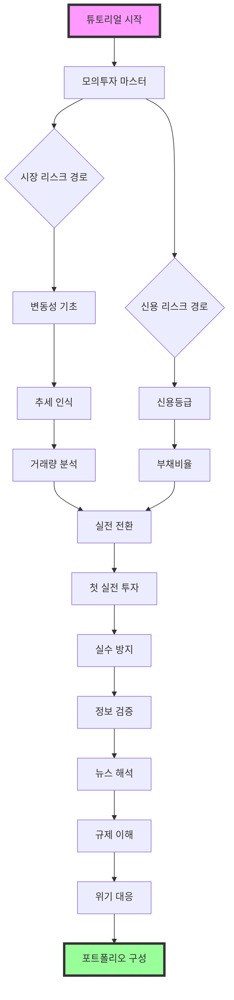

# 🔓 초급 리스크 해제 가이드

> "모든 마스터는 초보자였다. 리스크를 두려워하지 말고, 이해하라."
> - 워렌 버핏 AI 멘토

## 🎯 초급 과정 개요

### 당신이 이 과정에서 배울 것들
- 📈 **시장의 언어 이해하기**: 차트, 지표, 뉴스를 읽는 법
- 🛡️ **기본적인 자기 보호**: 흔한 투자 실수 방지법
- 🔍 **정보 검증 능력**: 가짜 뉴스와 진짜 정보 구분
- 💰 **리스크와 수익의 관계**: 위험과 기회의 균형점 찾기

### 🗺️ 학습 로드맵
```
레벨 1-5    → 시장 기초 (변동성, 추세, 거래량)
레벨 6-10   → 신용 분석 (신용등급, 부채비율)
레벨 11-15  → 운영 리스크 (실수 방지, 정보 검증)
레벨 16-25  → 전략적 사고 (뉴스 해석, 포트폴리오)
```

## 🔗 리스크 연계 맵
초급 과정의 리스크들은 서로 연결되어 있습니다. 효율적인 학습을 위해 다음 순서를 추천합니다:



### 병렬 진행 가능 리스크
- 🔄 **시장 리스크 + 신용 리스크**: 동시 진행 가능
- 🔄 **뉴스 해석 + 규제 이해**: 서로 보완적 학습
- 🔄 **실수 방지 + 정보 검증**: 함께 학습시 시너지

## 📊 Beginner Risk Unlocks (Level 1-25)

### 🎮 튜토리얼 리스크 (Tutorial Risk)

#### 0. **투자의 첫 걸음** (Your First Step to Investment)
- **리스크 ID**: `tutorial_start`
- **필요 레벨**: 0
- **필요 키**: 없음 (게임 시작 시 자동 해제)
- **시장 상황**: 안전한 학습 환경
- **설명**: 투자를 시작하기 전 반드시 알아야 할 기초 개념과 플랫폼 사용법

💡 **왜 튜토리얼이 중요한가?**
아무리 간단해 보여도 투자에는 기본 규칙이 있습니다. 이를 모르고 시작하면 첫날부터 큰 손실을 볼 수 있습니다.

🎯 **튜토리얼 내용**
- 계좌 개설 방법
- 주문 종류 이해 (시장가, 지정가)
- HTS/MTS 기본 사용법
- 기본 용어 정리

**해제 조건**:
- 📱 Platform Setup: 증권사 계좌 개설 완료
- 📚 Basic Terms: 기본 투자 용어 퀴즈 통과
- 💻 System Ready: HTS/MTS 설치 및 로그인

**챌린지**:
1. **계좌 개설 실습**: 실제 증권사 계좌 개설
   ```
   필수 준비물:
   - 신분증 (주민등록증/운전면허증)
   - 본인 명의 은행 계좌
   - 휴대폰 본인인증
   - 공인인증서/금융인증서
   ```

2. **기본 용어 및 주문 종류 마스터**: 투자 필수 개념 완전 정복
   
   **📋 기본 용어 (Basic Terms)**:
   - 매수/매도: 사기/팔기
   - 호가: 가격 제시
   - 체결: 거래 성사
   - 예수금: 투자 가능 현금
   - 평가금액: 현재 주식 가치
   - 수수료: 거래 시 지불하는 비용
   - 세금: 수익 시 국가에 납부하는 금액
   
   **📊 주문 종류의 완전 이해 (Order Types)**:
   ```
   1. 시장가 주문 (Market Order)
   - 즉시 거래 원할 때 사용
   - 현재 시장가격으로 즉시 체결
   - 장점: 확실한 체결
   - 단점: 예상과 다른 가격 체결 가능
   - 사용 시점: 급하게 사거나 팔고 싶을 때
   
   2. 지정가 주문 (Limit Order)
   - 원하는 가격을 정해서 주문
   - 해당 가격이 되면 체결
   - 장점: 원하는 가격에 정확히 거래
   - 단점: 체결 안 될 수 있음
   - 사용 시점: 여유 있게 거래하고 싶을 때
   
   3. 조건부 지정가 (Conditional Limit)
   - 최우선 호가 ± 일정 범위 내에서만 체결
   - 급변동 시 보호장치 역할
   - 시장가의 즉시성 + 지정가의 안전성
   - 초보자에게 가장 추천되는 주문 방식
   
   4. 최유리 지정가
   - 현재 최우선 매도/매수 호가로 주문
   - 시장가보다 안전하고 지정가보다 확실
   - 호가창의 1호가로 자동 설정
   
   5. 최우선 지정가
   - 현재 최우선 호가보다 유리한 가격으로 주문
   - 매수: 최우선 매수호가+1틱, 매도: 최우선 매도호가-1틱
   - 빠른 체결을 원하지만 시장가는 부담스러울 때
   ```
   
   **⚠️ 주문 시 주의사항**:
   ```
   초보자가 자주 하는 실수:
   
   1. 시장가 남발
   - 급등/급락 시 시장가 사용 위험
   - 호가 스프레드가 클 때 손해
   - 해결: 조건부 지정가 사용
   
   2. 지정가 고집
   - 좋은 기회 놓칠 수 있음
   - 1원, 2원 차이로 체결 못하는 경우
   - 해결: 적정선에서 타협
   
   3. 분할 주문 무시
   - 큰 금액을 한 번에 주문
   - 시장 충격 및 불리한 체결
   - 해결: 여러 번 나누어 주문
   
   4. 시간 고려 안함
   - 장 시작/종료 직전 주문 위험
   - 점심시간 유동성 부족
   - 해결: 거래량 많은 시간대 활용
   ```

3. **모의투자 체험**: 가상머니로 첫 거래
   - 모의투자 앱 설치
   - 가상 1000만원으로 시작
   - 삼성전자 1주 매수/매도 체험
   - 주문 취소 연습

📊 **AI 멘토의 조언**
> "모든 전문가도 첫 주문은 떨렸다. 튜토리얼에서 충분히 연습하라." - 초보자 전용 AI

**보상**:
- 경험치: 100 XP
- 키 획득: Tutorial Complete Key
- 스킬 포인트: Platform Navigator +1
- 특별 보상: 모의투자 자금 2000만원 추가

---

#### 0.5. **모의투자 마스터** (Paper Trading Master)
- **리스크 ID**: `paper_trading_master`
- **필요 레벨**: 1
- **필요 키**: Tutorial Complete Key
- **시장 상황**: 실제 시장 데이터 기반 가상 환경
- **설명**: 실전 투자 전 필수 과정! 가상머니로 다양한 전략을 안전하게 테스트

💡 **모의투자가 필수인 이유**
실전에서는 실수 한 번이 큰 손실로 이어집니다. 모의투자에서 충분히 실수하고 배워야 합니다.

🎯 **모의투자 vs 실전투자 차이점**
| 구분 | 모의투자 | 실전투자 |
|------|----------|----------|
| 심리적 압박 | 없음 | 매우 높음 |
| 손실 공포 | 없음 | 실제 존재 |
| 거래 체결 | 즉시 체결 | 호가 경쟁 |
| 슬리피지 | 없음 | 존재 |

**해제 조건**:
- 📊 Performance: 모의투자 수익률 +10% 달성
- 🎯 Strategy Test: 3가지 다른 전략 실행
- 📝 Trading Log: 30일간 매매일지 작성

**챌린지**:
1. **다양한 전략 테스트**: 실전 전 전략 검증
   ```
   필수 테스트 전략:
   1. 분할 매수 전략 (3회 나눠 매수)
   2. 손절 전략 (-5% 시 매도)
   3. 목표 수익 전략 (+10% 시 매도)
   4. 추세 추종 전략 (이동평균선 활용)
   ```

2. **감정 시뮬레이션**: 실전과 유사한 심리 훈련
   - 손실 시에도 계속 기록하기
   - 수익 시 과도한 자신감 경계
   - 매일 같은 시간에 점검
   - 주말에 주간 성과 분석

3. **실전 전환 준비**: 모의→실전 체크리스트
   ```
   실전 전환 체크리스트:
   □ 3개월 이상 모의투자 경험
   □ 누적 수익률 +10% 이상
   □ 최대 손실 -20% 경험 및 회복
   □ 50회 이상 매매 경험
   □ 명확한 매매 원칙 수립
   ```

📊 **AI 멘토의 조언**
> "모의투자에서 잘한다고 자만하지 마라. 실전은 완전히 다른 게임이다." - 심리 전문 AI

**보상**:
- 경험치: 200 XP
- 키 획득: Strategy Test Key
- 스킬 포인트: Risk Simulator +2
- 특별 보상: 실전 투자 가이드북

---

#### 0.75. **비상자금 마스터** (Emergency Fund Master)
- **리스크 ID**: `emergency_fund_master`
- **필요 레벨**: 2
- **필요 키**: Paper Trading Key (paper_complete)
- **시장 상황**: 투자 시작 전 재정 안정성 확보
- **설명**: **투자하기 전 반드시 갖춰야 할 비상자금 관리 능력**

💡 **왜 비상자금이 투자보다 우선인가?**
비상자금 없이 투자하면 예상치 못한 상황에서 손실을 안고 주식을 팔아야 할 수 있습니다. 이는 투자 실패의 가장 큰 원인 중 하나입니다.

🎯 **비상자금의 현실**
```
한국인 평균 비상자금 보유 현황:
- 20대: 월 생활비의 1-2개월분 (부족)
- 30대: 월 생활비의 2-3개월분 (보통)
- 40대: 월 생활비의 3-6개월분 (적정)

권장 비상자금 규모:
- 직장인: 월 생활비의 3-6개월분
- 자영업자: 월 생활비의 6-12개월분
- 부양가족 있는 경우: +3개월분 추가
```

**해제 조건**:
- 💰 Fund Ready: 적정 비상자금 확보 완료
- 🏦 Account Setup: 비상자금 전용 계좌 개설
- 📋 Plan Complete: 비상자금 운용 계획 수립

**챌린지**:
1. **비상자금 규모 계산**: 개인 상황에 맞는 목표 설정
   ```
   개인별 비상자금 계산법:
   
   기본 생활비 계산:
   - 주거비: 월세/관리비/공과금
   - 식비: 생활비의 25-30%
   - 교통비: 대중교통/유류비
   - 통신비: 휴대폰/인터넷
   - 보험료: 건강/자동차 보험
   
   월 생활비 × 안전계수 = 비상자금 목표
   안전계수:
   - 공무원/대기업: 3-4개월
   - 중소기업: 4-6개월
   - 자영업: 6-12개월
   ```

2. **비상자금 계좌 설정**: 접근성과 수익성의 균형
   ```
   비상자금 운용 3단계:
   
   1단계 (즉시 사용): 월 생활비의 1개월분
   - 입출금 자유 적금
   - 수시입출금 가능
   - 금리 낮아도 유동성 최우선
   
   2단계 (단기 사용): 월 생활비의 2-3개월분
   - 정기예금 (3-6개월)
   - 중도해지 수수료 낮은 상품
   - 약간의 수익성 추구
   
   3단계 (비상시 사용): 나머지 금액
   - CMA 또는 MMF
   - 주식시장과 연동성 낮은 상품
   - 안정성과 수익성의 조화
   ```

3. **비상상황 시나리오 대비**: 실제 상황별 대응책
   ```
   주요 비상상황과 대응:
   
   의료비 응급상황:
   - 병원비 선결제 필요 → 즉시 사용 가능 자금
   - 장기 치료비 → 보험 적용 후 부족분 보완
   
   실직/소득 중단:
   - 구직 기간 생활비 → 3-6개월분 비상자금
   - 재취업 준비비용 → 교육비, 이력서 비용
   
   가족 응급상황:
   - 부모님 의료비 → 가족 공동 비상자금
   - 자녀 교육비 급증 → 교육비 전용 준비금
   
   주거 관련 응급상황:
   - 전세금 반환 지연 → 임시 거주비
   - 집 수리비 → 월세보증금 대체자금
   ```

**비상자금과 투자의 관계**:
```
올바른 자금 배분 순서:
1. 생활비 (월 지출) → 최우선
2. 비상자금 (3-6개월분) → 두 번째
3. 단기 목표자금 (1-2년) → 세 번째
4. 투자자금 (3년 이상) → 마지막

잘못된 투자 시작:
❌ 비상자금 없이 투자 → 급전 필요시 손실 매도
❌ 생활비로 투자 → 매월 투자금 인출 필요
❌ 단기자금으로 투자 → 필요시점에 손실 위험

올바른 투자 시작:
✅ 비상자금 확보 → 투자 별도 진행
✅ 장기 여유자금만 투자 → 심리적 안정
✅ 단계적 투자 증액 → 점진적 위험 확대
```

📊 **AI 멘토의 조언**
> "투자의 성공은 좋은 종목을 고르는 것이 아니라, 강제 매도를 당하지 않는 것부터 시작된다." - 안전 우선 AI

**보상**:
- 경험치: 200 XP
- 키 획득: Safety Foundation Key (emergency_prepared)
- 스킬 포인트: Financial Safety +2
- 특별 보상: 투자 심리 안정도 +50

---

### 🟢 Market Risk Master 초급 코스

#### 1. 변동성 기초 이해하기 (Volatility Basics)
- **리스크 ID**: `volatility_intro`
- **필요 레벨**: 1
- **필요 키**: 없음 (튜토리얼 리스크)
- **시장 상황**: 일반적인 시장 환경
- **설명**: 주식 가격이 왜 오르락내리락 하는지 기본 개념을 익히는 첫 번째 관문

💡 **왜 중요한가?**
변동성을 이해하지 못하면 시장의 정상적인 움직임도 두렵게 느껴집니다. 이는 투자의 첫 번째 관문입니다.

🎯 **실전 예시**
- 삼성전자가 하루에 3% 오르내리는 것은 정상
- 코스피가 2% 이상 움직이면 '높은 변동성'
- VIX 지수 20 이상이면 '공포 구간'

**해제 조건**:
- 📚 Theory Key: 변동성 개념 학습
- 📊 Analysis Key: 간단한 가격 차트 분석

**챌린지**:
1. **변동성 계산**: 5일간 주가 데이터로 간단한 표준편차 계산
   ```
   예시: 삼성전자 5일 종가 (82,000 → 84,000 → 81,000 → 83,000 → 85,000)
   일일 변화율: 2.4% → -3.6% → 2.5% → 2.4%
   표준편차 = √(변화율들의 분산) = 2.8%
   ```

2. **차트 읽기**: 기본적인 캔들스틱 차트 해석
   - 🟢 양봉 (상승): 종가 > 시가
   - 🔴 음봉 (하락): 종가 < 시가
   - 긴 꼬리: 강한 매수/매도 압력

3. **용어 매칭**: 변동성 관련 용어 정의 매칭
   - 볼린저 밴드: 변동성 측정 지표
   - ATR: 평균 진폭 범위
   - 베타: 시장 대비 변동성

📊 **AI 멘토의 조언**
> "변동성은 위험이 아니라 기회다. 변동성이 클 때 큰 수익도 가능하다." - 조지 소로스 AI

**보상**:
- 경험치: 150 XP
- 키 획득: Knowledge Key (basic_volatility)
- 스킬 포인트: Volatility Reader +1

---

#### 2. 단순 추세 인식하기 (Simple Trend Recognition)
- **리스크 ID**: `trend_basic`
- **필요 레벨**: 3
- **필요 키**: Knowledge Key (basic_volatility)
- **시장 상황**: 명확한 상승/하락 추세
- **설명**: 주가가 전반적으로 오르는지 내리는지 판단하는 기본 능력

💡 **왜 중요한가?**
"추세는 친구다"라는 말이 있습니다. 시장의 방향을 알면 수익 확률이 높아집니다.

🎯 **실전 예시**
- 2020년 코로나 이후 테크주 상승 추세 (6개월간)
- 2022년 인플레이션 우려로 성장주 하락 추세
- 현재 AI 관련주들의 강한 상승 추세

**해제 조건**:
- 📈 Pattern Key: 추세선 그리기 성공
- 📊 Analysis Key: 추세 방향 정확히 판단

**챌린지**:
1. **추세선 그리기**: 주어진 차트에서 올바른 추세선 식별
   ```
   상승 추세선: 연속된 저점들을 연결
   하락 추세선: 연속된 고점들을 연결
   유효한 추세선: 최소 3개 이상의 점을 터치
   ```

2. **추세 방향 판단**: 상승/하락/횡보 추세 구분
   - 📈 상승 추세: 고점과 저점이 지속적으로 높아짐
   - 📉 하락 추세: 고점과 저점이 지속적으로 낮아짐
   - ↔️ 횡보 추세: 일정 범위 내에서 등락 반복

3. **지지/저항 찾기**: 기본적인 지지선과 저항선 인식
   - 🛡️ 지지선: 가격이 반등하는 수준
   - 🚧 저항선: 가격이 반락하는 수준
   - 돌파 시 역할 전환 (지지↔저항)

📊 **AI 멘토의 조언**
> "추세가 끝나는 신호를 놓치지 마라. 영원한 추세는 없다." - 피터 린치 AI

**보상**:
- 경험치: 200 XP
- 키 획득: Pattern Key (trend_recognition)
- 스킬 포인트: Trend Breaker +1

---

#### 2.5. **기본적 분석 입문** (Fundamental Analysis Basics)
- **리스크 ID**: `fundamental_basics`
- **필요 레벨**: 4
- **필요 키**: Pattern Key (trend_recognition)
- **시장 상황**: 실적 발표 시즌
- **설명**: **차트뿐만 아니라 기업의 진짜 가치를 판단하는 기본 능력 습득**

💡 **왜 기본적 분석이 필요한가?**
차트만 보고 투자하는 것은 겉모습만 보고 사람을 판단하는 것과 같습니다. 기업의 진짜 실력을 알아야 안전한 투자가 가능합니다.

🎯 **기본적 분석 핵심 지표**
- **PER (주가수익비율)**: 주가가 비싼지 싼지 판단
- **PBR (주가순자산비율)**: 회사 자산 대비 주가 수준
- **EPS (주당순이익)**: 주주가 받을 수 있는 이익
- **ROE (자기자본이익률)**: 투자 효율성 지표

⚠️ **실패 시 복구 전략**:
```
실패 유형별 대응 방법:

1. 잘못된 PER 해석으로 손실:
- 업종별 적정 PER 다시 학습
- 동종업체 3개 이상 비교 후 투자
- PER만 보지 말고 성장률도 함께 고려

2. 재무제표 오해로 인한 투자 실패:
- 회계 기초 강의 1주일 재수강
- 간단한 기업부터 다시 분석 시작
- 전문가 분석 리포트와 본인 분석 비교

3. 기본적 분석 포기하고 싶을 때:
- 하루 30분씩 점진적 학습으로 변경
- 친숙한 기업(삼성, LG 등)부터 시작
- 커뮤니티에서 동료와 함께 학습
```

**해제 조건**:
- 📊 Calculation Key: PER, PBR 직접 계산
- 🔍 Analysis Key: 밸류에이션 적정성 판단
- 📈 Comparison Key: 동종업체 비교 분석

**챌린지**:
1. **PER 계산 마스터**: 주가수익비율로 저평가 발굴
   ```
   PER 계산법:
   PER = 주가 ÷ EPS (주당순이익)
   
   예시: 삼성전자
   현재 주가: 75,000원
   EPS: 5,500원
   PER = 75,000 ÷ 5,500 = 13.6배
   
   해석:
   - PER 10 이하: 저평가 가능성
   - PER 15-20: 적정 범위
   - PER 30 이상: 고평가 위험
   ```

2. **업종별 PER 비교**: 같은 업종끼리 비교해야 의미 있음
   ```
   업종별 적정 PER:
   - 은행업: 5-8배 (안정적, 낮은 성장)
   - 제조업: 10-15배 (중간 수준)
   - IT업: 20-30배 (높은 성장성)
   - 바이오: 40배+ (미래 가치 반영)
   ```

3. **재무제표 기초 읽기**: 숫자로 회사 건강도 체크
   ```
   필수 확인 항목:
   □ 매출액: 3년간 꾸준히 증가하는가?
   □ 영업이익: 적자가 아닌가?
   □ 순이익: 일시적 요인 제외하고 흑자인가?
   □ 부채비율: 업종 평균 대비 과도하지 않은가?
   □ 현금: 단기부채보다 많은가?
   ```

**실전 기업 분석 실습**:
```
삼성전자 vs LG전자 비교 (2023년 기준)

삼성전자:
- PER: 13.6배 / PBR: 1.2배
- 매출 성장률: 5% / ROE: 9.1%

LG전자:
- PER: 11.2배 / PBR: 0.8배  
- 매출 성장률: -3% / ROE: 6.8%

분석 결론: 삼성전자가 프리미엄이지만 성장성 고려 시 합리적
```

📊 **AI 멘토의 조언**
> "차트는 시장의 감정이고, 재무제표는 기업의 진실이다. 둘 다 봐야 완전한 투자자가 된다." - 벤저민 그레이엄 AI

**보상**:
- 경험치: 300 XP
- 키 획득: Analysis Key (fundamental_basics)
- 스킬 포인트: Value Investor +2

---

#### 3. 거래량 기초 분석 (Volume Basics)
- **리스크 ID**: `volume_intro`
- **필요 레벨**: 5
- **필요 키**: Analysis Key (fundamental_basics)
- **시장 상황**: 거래량 변화가 있는 시장
- **설명**: 거래량이 주가에 미치는 영향을 이해하는 기본 과정

💡 **왜 중요한가?**
거래량은 '시장의 목소리'입니다. 가격 움직임에 진정성이 있는지 확인하는 핵심 지표입니다.

🎯 **실전 예시**
- 삼성전자 3% 상승 + 거래량 2배 증가 → 진짜 상승
- 카카오 5% 상승 + 거래량 평소와 동일 → 의심스러운 상승
- 급락 시 거래량 폭증 → 공황 매도 (매수 기회 가능성)

**해제 조건**:
- 📊 Analysis Key: 거래량-가격 관계 분석
- 💪 Survival Key: 거래량 급증 상황 대처

**챌린지**:
1. **거래량 패턴**: 거래량 증가와 가격 움직임의 관계 파악
   ```
   거래량-가격 관계 해석:
   📈 상승 + 거래량 증가 = 강한 상승 (매수세 확실)
   📈 상승 + 거래량 감소 = 약한 상승 (매도 준비)
   📉 하락 + 거래량 증가 = 강한 하락 (추가 하락 가능)
   📉 하락 + 거래량 감소 = 약한 하락 (바닥 근접)
   ```

2. **거래량 확인**: 가격 상승/하락 시 거래량 확인법
   - 20일 평균 거래량 대비 1.5배 이상 → 의미 있는 변화
   - 장 시작 30분, 마감 30분 거래량 집중 → 정상
   - 점심시간(12-1시) 거래량 급증 → 특별한 뉴스 확인 필요

3. **이상 거래량**: 평균 거래량 대비 비정상적 거래량 탐지
   - 거래량 급증(3배 이상) → 중요 발표 임박 또는 진행 중
   - 거래량 급감(1/3 이하) → 관심 저하 또는 대기 상태
   - 거래 정지 직전 거래량 폭증 → 내부정보 거래 의심

📊 **AI 멘토의 조언**
> "가격이 거짓말할 수 있지만, 거래량은 거짓말하지 않는다. 거래량 없는 움직임을 믿지 마라." - 조 그란빌 AI

**보상**:
- 경험치: 250 XP
- 키 획득: Analysis Key (volume_analysis)
- 스킬 포인트: Volume Analyzer +1

---

#### 3.5. **한국 주식시장 구조 이해** (Korean Stock Market Structure)
- **리스크 ID**: `korean_market_structure`
- **필요 레벨**: 6
- **필요 키**: Analysis Key (volume_analysis)
- **시장 상황**: 한국 시장에서 투자 시작 전
- **설명**: **한국 주식시장의 독특한 특성과 구조 이해**

💡 **왜 한국 시장을 따로 배워야 하나?**
한국 주식시장은 다른 나라와 다른 독특한 특성들이 있습니다. 이를 모르고 투자하면 예상치 못한 손실을 볼 수 있습니다.

🎯 **한국 시장의 특징**
- **KOSPI vs KOSDAQ**: 두 개의 주요 시장
- **재벌 구조**: 대기업 그룹의 복잡한 지배구조
- **외국인 영향**: 매매의 30-40% 차지
- **정치적 영향**: 정부 정책에 민감한 반응

**해제 조건**:
- 🏛️ Market Knowledge: 시장 구조 완전 이해
- 📊 Sector Analysis: 한국 주요 섹터 특성 파악
- 🌍 External Factor: 외부 영향 요인 인식

**챌린지**:
1. **KOSPI vs KOSDAQ 구분**: 두 시장의 차이점 이해
   ```
   KOSPI (Korea Composite Stock Price Index):
   - 대형주 중심 시장
   - 안정적이지만 성장률 낮음
   - 외국인 투자 비중 높음
   - 대표 종목: 삼성전자, SK하이닉스, LG화학
   
   KOSDAQ (Korea Securities Dealers Automated Quotations):
   - 중소형주, 벤처기업 중심
   - 변동성 크지만 성장 가능성 높음
   - 개인 투자자 비중 높음
   - 대표 종목: 셀트리온헬스케어, 카카오게임즈, 펄어비스
   
   투자 전략:
   - 안정성 원하면 KOSPI 대형주
   - 성장성 원하면 KOSDAQ 우량주
   ```

2. **재벌 구조의 이해**: 한국 대기업의 독특한 지배구조
   ```
   재벌의 특징:
   - 순환출자: A회사→B회사→C회사→A회사
   - 지배력 확대: 적은 지분으로 큰 기업 통제
   - 연관성 높음: 계열사 간 동반 등락
   
   주요 재벌과 계열사:
   - 삼성: 삼성전자, 삼성SDI, 삼성바이오로직스
   - LG: LG전자, LG화학, LG에너지솔루션
   - 현대차: 현대차, 기아, 현대모비스
   - SK: SK하이닉스, SK텔레콤, SK이노베이션
   
   투자 시 고려사항:
   - 지배주주 리스크 (경영권 분쟁 등)
   - 계열사 연관성 (한 회사 악재가 전체 영향)
   - 정부 정책 영향 (재벌 규제 정책)
   ```

3. **한국 특유 리스크 요인**: 다른 나라에 없는 위험들
   ```
   지정학적 리스크:
   - 북한 리스크: 군사적 긴장 → 외국인 자금 이탈
   - 한일 관계: 경제 보복 → 관련 업종 타격
   - 미중 갈등: 수출 의존도 높은 한국에 영향
   
   내수 시장 특성:
   - 부동산 의존: 부동산 정책이 소비에 영향
   - 고령화: 내수 소비 위축 가능성
   - 최저임금: 자영업, 소상공인 영향
   
   정책 리스크:
   - 정권 교체: 정책 방향 급변 가능
   - 규제 변화: 게임, 유통, 통신 등
   - 세제 개편: 투자 수익성에 직접 영향
   ```

**한국 투자자가 알아야 할 필수 개념**:
```
거래 시간과 제도:
- 정규장: 오전 9시 ~ 오후 3시 30분
- 시간외 거래: 오후 4시 ~ 6시
- 상한가/하한가: 전일 대비 ±30% 제한
- 거래 정지: 급등락 시 5분간 매매 중단

투자자 구분:
- 개인: 가장 많은 비중 (약 40%)
- 외국인: 큰 영향력 (약 30%)
- 기관: 안정적 매매 (약 30%)

한국형 이벤트:
- 배당락일: 배당 기준일 다음날 주가 하락
- 액면분할: 주가는 떨어지지만 주식 수 증가
- 감자: 주식 수 감소, 주가 상승 요인
```

📊 **AI 멘토의 조언**
> "한국 시장을 이해하지 못하면 외국인 투자자와 같은 핸디캡을 가지게 된다. 현지인의 이점을 활용하라." - 한국 시장 전문 AI

**보상**:
- 경험치: 250 XP
- 키 획득: Local Knowledge Key (korean_market)
- 스킬 포인트: Korean Market Navigator +2

---

### 🔵 Credit Risk Guardian 초급 코스

#### 4. 신용등급 이해하기 (Credit Rating Basics)
- **리스크 ID**: `credit_rating_intro`
- **필요 레벨**: 7
- **필요 키**: Analysis Key (volume_analysis)
- **시장 상황**: 신용등급 변화 뉴스가 있는 시장
- **설명**: 기업과 국가의 신용등급이 투자에 미치는 영향 학습

💡 **왜 중요한가?**
신용등급은 기업의 '재무 건강 점수'입니다. 등급이 낮으면 부도 위험이 높고, 이는 주가에 직접적인 영향을 미칩니다.

🎯 **실전 예시**
- 2023년 한국전력 신용등급 하락 → 주가 10% 급락
- 2021년 현대차 신용등급 상승 → 주가 5% 상승
- 투자적격(BBB- 이상) vs 투기등급(BB+ 이하) 구분

**해제 조건**:
- 📚 Theory Key: 신용등급 체계 이해
- 🎯 Precision Key: 신용등급 영향 정확한 예측

**챌린지**:
1. **등급 체계 마스터**: 글로벌 3대 신용평가사 등급 체계
   ```
   무디스 / S&P / 피치 등급 비교:
   최우량: Aaa / AAA / AAA
   우량: Aa1-Aa3 / AA+ to AA- / AA+ to AA-
   양호: A1-A3 / A+ to A- / A+ to A-
   적정: Baa1-Baa3 / BBB+ to BBB- / BBB+ to BBB-
   투기: Ba1 이하 / BB+ 이하 / BB+ 이하
   ```

2. **등급 변화 영향 분석**: 실제 사례로 배우는 영향력
   - 신용등급 1단계 하락 → 평균 주가 -3~5% 
   - 투자적격→투기등급 전환 → 주가 -10~20%
   - 등급 전망(Outlook) 변화도 주가에 영향
   - 채권 가격과 금리에 미치는 영향

3. **업종별 신용 리스크 차이**:
   - 🏦 금융업: 자본비율, 부실채권 비율이 핵심
   - 🏭 제조업: 재고 회전율, 설비투자 부담
   - 🛒 유통업: 현금흐름, 재고 관리 능력
   - 🏗️ 건설업: 프로젝트 파이낸싱, 수주잔고

📊 **AI 멘토의 조언**
> "신용등급은 후행지표다. 등급이 떨어지기 전에 징조를 읽어야 한다." - 신용분석 전문 AI

**보상**:
- 경험치: 300 XP
- 키 획득: Theory Key (credit_basics)
- 스킬 포인트: Credit Score Interpreter +1

---

#### 5. 부채비율 기초 분석 (Debt Ratio Basics)
- **리스크 ID**: `debt_ratio_intro`
- **필요 레벨**: 10
- **필요 키**: Theory Key (credit_basics)
- **시장 상황**: 재무제표 발표 시즌
- **설명**: 기업의 부채 수준이 투자 위험에 미치는 영향 분석

💡 **왜 중요한가?**
부채비율은 기업의 재무 안정성을 보여주는 핵심 지표입니다. 부채가 많으면 경기 악화 시 위험이 커집니다.

🎯 **실전 예시**
- 대한항공: 부채비율 800% (항공업 특성상 높음)
- 삼성전자: 부채비율 30% (재무 건전성 우수)
- 부채비율 200% 이상: 주의 필요

**해제 조건**:
- 🧮 Calculation Key: 부채비율 정확한 계산
- 📊 Analysis Key: 업종별 부채비율 비교

**챌린지**:
1. **부채비율 계산 실습**: 실제 기업 재무제표로 계산
   ```
   부채비율 = (총부채 ÷ 총자본) × 100
   
   예시: A기업
   총부채: 500억원
   총자본: 250억원
   부채비율 = (500 ÷ 250) × 100 = 200%
   ```

2. **업종별 적정 부채비율**: 산업 특성에 따른 차이
   - 🏭 제조업: 100-150% (적정)
   - 🏗️ 건설업: 150-200% (업종 특성)
   - ✈️ 항공업: 300-800% (자산 특성)
   - 💻 IT업: 50-100% (낮은 편)
   - 🏦 금융업: 특수 지표 사용 (BIS 비율)

3. **부채비율 변화 추적**: 3년간 추이 분석
   - 지속 상승: 재무구조 악화 신호
   - 지속 하락: 재무구조 개선 중
   - 급격한 변화: 인수합병, 대규모 투자 확인
   - 동종업계 평균과 비교 필수

📊 **AI 멘토의 조언**
> "부채는 레버리지다. 잘 쓰면 수익을 확대하지만, 잘못 쓰면 파산한다." - 재무분석 AI

**실패 케이스 학습**:
- 🚨 대우그룹 (1999): 무리한 차입 경영으로 부도
- 🚨 한진해운 (2016): 과도한 부채로 파산
- 🚨 STX그룹 (2013): 부채비율 400% 초과로 위기

**보상**:
- 경험치: 350 XP
- 키 획득: Calculation Key (debt_analysis)
- 스킬 포인트: Debt Ratio Analyzer +1

---

---

### 🔵 Credit Risk Guardian 초급 코스 (계속)

#### 3.5. **모의에서 실전으로** (From Paper to Real Trading)
- **리스크 ID**: `transition_to_real`
- **필요 레벨**: 8
- **필요 키**: Strategy Test Key, Analysis Key (volume_analysis)
- **시장 상황**: 안정적인 시장 환경
- **설명**: **모의투자 졸업! 실제 돈으로 첫 투자를 시작하는 중요한 전환점**

💡 **전환 시 주의사항**
모의투자와 실제투자는 하늘과 땅 차이입니다. 특히 심리적 압박이 완전히 달라집니다.

🎯 **모의→실전 전환 가이드**
```
단계별 전환 프로세스:

1단계 (1주차): 관찰 기간
- 실전 계좌만 개설하고 거래 안 함
- 매일 시장 관찰하며 모의투자와 비교
- 실제 호가창의 움직임 익히기

2단계 (2주차): 최소 금액 테스트
- 10만원으로 시작 (잃어도 괜찮은 금액)
- 1종목 1주만 매수
- 매수/매도 과정 실제 경험

3단계 (3-4주차): 점진적 증액
- 50만원으로 증액
- 2-3종목으로 분산
- 손절/익절 실제 실행

4단계 (2개월차): 본격 투자
- 월급의 10% 수준으로 증액
- 포트폴리오 구성 시작
- 장기 투자 관점 확립
```

**해제 조건**:
- 🎯 Simulation Success: 모의투자 3개월 & +10% 수익
- 💰 Real Money Ready: 실전 투자금 준비 완료
- 📋 Transition Plan: 단계별 전환 계획 수립

**챌린지**:
1. **심리적 준비**: 실전 투자 마인드셋
   ```
   실전 투자 전 체크:
   □ 이 돈을 잃어도 생활에 지장 없는가?
   □ 가족과 투자 계획을 공유했는가?
   □ 최악의 시나리오를 상상해봤는가?
   □ 감정적 매매를 막을 원칙이 있는가?
   ```

2. **실전 시뮬레이션**: 모의투자에서 실전처럼
   - 실제 투자금액과 동일하게 설정
   - 매매 시 5분간 고민 후 결정
   - 손실 시 실제처럼 고통스러워하기
   - 수익 시에도 과도한 자신감 경계

3. **전환 일지 작성**: 매일 기록하기
   - 모의투자와 실전의 차이점
   - 예상과 다른 부분들
   - 심리적 변화 기록
   - 개선점 도출

📊 **AI 멘토의 조언**
> "모의투자는 수영장, 실전은 바다다. 파도를 만날 준비를 하라." - 전환 전문 AI

**보상**:
- 경험치: 300 XP
- 키 획득: Transition Ready Key
- 스킬 포인트: Mental Preparation +2
- 특별 보상: 실전 투자 심리 가이드

---

#### 3.6. **첫 실전 투자 경험** (First Real Investment)
- **리스크 ID**: `first_real_trade`
- **필요 레벨**: 9
- **필요 키**: Strategy Test Key, Analysis Key (volume_analysis)
- **시장 상황**: 안정적인 시장 환경
- **설명**: **실제 돈으로 첫 투자를 경험하는 필수 과정**

💡 **왜 필수인가?**
모의투자와 실제투자는 완전히 다릅니다. 진짜 돈이 걸려야 진짜 감정을 경험할 수 있습니다.

🎯 **실전 조건**
- **투자 금액**: 월급의 5-10% (절대 생활비 제외)
- **종목 선택**: 코스피 200 대형주 중 1개
- **기간**: 최소 1개월 보유
- **목표**: 수익이 아닌 '감정 경험'

**해제 조건**:
- 💰 Real Money: 실제 돈으로 주식 매수
- 📝 Emotion Log: 매일 감정 변화 기록
- 🧘 Patience Key: 최소 1개월 보유 완료

**챌린지**:
1. **감정 일기**: 매일 투자 감정 변화 기록
   ```
   일일 감정 체크:
   - 오늘 몇 번 주가를 확인했는가? ___회
   - 손실 시 어떤 감정을 느꼈는가? (분노/불안/후회/기타)
   - 수익 시 어떤 감정을 느꼈는가? (기쁨/욕심/안도/기타)
   - 매도하고 싶은 충동이 몇 번 들었는가? ___회
   ```

2. **손실 체험**: -10% 손실 상황에서의 대응
   - 패닉 매도 하지 않기
   - 감정적 추가 매수 하지 않기
   - 손실의 원인 분석하기

3. **수익 체험**: +10% 수익 상황에서의 대응
   - 즉시 매도 충동 억제하기
   - 추가 매수 욕심 조절하기
   - 수익의 원인 분석하기

📊 **AI 멘토의 조언**
> "첫 투자는 학비다. 돈을 잃을 각오로 시작하되, 그 경험에서 최대한 배워라." - 워렌 버핏 AI
> "실제 투자 없이는 절대 투자자가 될 수 없다. 모의투자는 운전면허 필기시험과 같다." - 피터 린치 AI

**보상**:
- 경험치: 500 XP
- 키 획득: Real Experience Key (first_blood)
- 스킬 포인트: Emotion Controller +3
- 특별 보상: "Real Investor" 뱃지

---

### 🟢 Operational Risk Controller 초급 코스

#### 6. 투자 실수 방지하기 (Investment Mistake Prevention)
- **리스크 ID**: `mistake_prevention`
- **필요 레벨**: 12
- **필요 키**: Calculation Key (debt_analysis)
- **시장 상황**: 변동성이 큰 시장
- **설명**: 투자할 때 흔히 저지르는 실수들을 인식하고 예방하는 방법

💡 **왜 중요한가?**
투자 실수는 큰 손실로 이어집니다. 특히 초보자는 감정적 판단으로 인한 실수가 많습니다.

🎯 **실제 사례**
- 2021년 GameStop 사태: 감정적 매수로 인한 손실
- 암호화폐 투자: FOMO(Fear of Missing Out)로 인한 고점 매수
- 레버리지 ETF: 복리 효과를 모르고 장기보유

🚨 **실수 발생 시 즉시 복구 가이드**:
```
실수별 응급처치:

1. 감정적 매수 실수 (FOMO, 추격매수):
   ⏰ 즉시: 추가 매수 중단
   📝 1시간 내: 매수 이유 객관적 재검토
   📊 24시간 내: 손절가 설정 또는 손절 실행
   🔄 1주일 후: 실수 원인 분석 및 예방책 수립

2. 손절 못하는 실수:
   ⏰ 즉시: 현재 손실률 정확히 계산
   💰 1시간 내: "이 돈이 없어도 생활 가능한가?" 자문
   📋 당일: 손절 기준 재설정 (기존보다 엄격하게)
   ✂️ 3일 내: 기계적 손절 실행

3. 정보 확인 없는 투자:
   🛑 즉시: 추가 투자 중단
   🔍 2시간 내: 공식 공시, 뉴스 교차 확인
   📊 당일: 기업 재무제표 기본 검토
   🎯 1주일: 투자 논리 재구성 또는 손절 결정
```

**해제 조건**:
- 🛡️ Defense Key: 실수 상황 성공적 방어
- 🧘 Patience Key: 감정적 판단 억제

**챌린지**:
1. **실수 사례 분석**: 대표적인 투자 실수 사례 학습
   - 🎰 도박형 투자: 올인, 빚내서 투자
   - 📈 추격매수: 급등 후 매수
   - 💔 손절 못함: 손실 인정 거부
   - 🐑 군중심리: 남들 따라하기

2. **감정 조절**: 손실 상황에서 감정적 판단 억제
   ```
   감정 체크리스트:
   □ 지금 화나거나 흥분한 상태인가?
   □ 손실을 빨리 만회하려고 하는가?
   □ 다른 사람의 성공담에 질투를 느끼는가?
   □ 투자 금액이 수면에 영향을 주는가?
   ```

3. **체크리스트**: 투자 전 점검해야 할 항목들
   - ✅ 투자 목적이 명확한가?
   - ✅ 손실 허용 범위를 정했는가?
   - ✅ 기업/상품을 충분히 조사했는가?
   - ✅ 포트폴리오 비중이 적절한가?

4. **손절매 & 위험관리 기초**: 초보자 필수 자기 보호법
   ```
   🛡️ 손절매 (Stop-Loss) 전략:
   
   손절 기준 설정법:
   - 기술적 기준: 지지선 붕괴 시
   - 퍼센트 기준: -5~10% 도달 시  
   - 시간 기준: 예상 기간 초과 시
   - 펀더멘털 기준: 투자 논리 붕괴 시
   
   손절매 실행 방법:
   1. 매수 동시에 손절가 결정
   2. 감정에 흔들리지 않는 기계적 실행
   3. 손절 후 즉시 원인 분석
   4. 같은 실수 반복 방지책 수립
   
   초보자 손절 규칙:
   - 첫 투자: 매수가 대비 -5% 손절
   - 경험 쌓은 후: -7~10%로 점진 확대
   - 절대 원칙: 손절가 도달 시 무조건 실행
   - 추가 하락 기대하며 기다리기 금지
   ```

5. **포지션 사이징**: 얼마나 사야 하는가?
   ```
   💰 초보자 포지션 크기 가이드:
   
   1% 규칙 (권장):
   - 한 종목 손실 한도 = 총 자본의 1%
   - 예: 1000만원 → 한 종목 최대 손실 10만원
   - 5% 손절 기준 → 최대 투자금 200만원
   
   5% 규칙 (보수적):
   - 한 종목 비중 = 총 포트폴리오의 5%
   - 예: 1000만원 → 한 종목 최대 50만원
   - 20개 종목까지 분산 가능
   
   실전 적용 예시:
   투자 자금: 500만원
   - 삼성전자: 50만원 (10%)
   - 카카오: 30만원 (6%)  
   - 현대차: 40만원 (8%)
   - 비중이 10% 초과하지 않도록 관리
   
   ⚠️ 피해야 할 실수:
   - 올인 (한 종목에 전체 자금)
   - 최애주 편중 (좋아하는 주식만)
   - 수익 편중 (오른 주식만 계속 매수)
   ```

6. **감정 관리 실전 기법**: 심리적 실수 예방
   ```
   😤 탐욕 조절법:
   - 목표 수익률 사전 설정 (예: +20%)
   - 분할 매도로 이익 실현
   - "더 오를 것 같다"는 생각을 경계
   - 수익 일부는 반드시 실현하기
   
   😨 공포 극복법:
   - 급락 시 즉시 매도 금지
   - 24시간 냉정 기간 두기
   - 뉴스나 커뮤니티 피하기
   - 장기 관점에서 재평가하기
   
   🚀 FOMO (놓칠까봐 두려움) 방지:
   - 투자 전 3일 대기 원칙
   - 급등주 추격 매수 금지
   - "지금 사지 않으면 기회 없다" 생각 경계
   - 다른 기회는 항상 있다는 마음가짐
   
   📱 정보 과부하 방지:
   - 하루 1-2회만 주가 확인
   - 투자 관련 유튜브/커뮤니티 제한
   - 단기 뉴스에 일희일비 금지
   - 장기 관점 유지하기
   ```

📊 **AI 멘토의 조언**
> "실수를 두려워하지 말고, 반복을 두려워하라. 같은 실수를 두 번 하면 그건 실수가 아니라 습관이다." - 워렌 버핏 AI

**보상**:
- 경험치: 400 XP
- 키 획득: Defense Key (mistake_prevention)
- 스킬 포인트: Fat Finger Protector +1

---

#### 7. 정보 검증하기 (Information Verification)
- **리스크 ID**: `info_verification`
- **필요 레벨**: 15
- **필요 키**: Defense Key (mistake_prevention)
- **시장 상황**: 가짜 뉴스가 유통되는 시장
- **설명**: 투자 정보의 신뢰성을 판단하고 잘못된 정보를 걸러내는 능력

💡 **왜 중요한가?**
정보 전쟁 시대입니다. 잘못된 정보로 인한 투자 손실이 급증하고 있습니다.

🎯 **실제 사례**
- 2020년 "코로나 치료제 개발" 가짜뉴스로 바이오주 폭등 후 폭락
- SNS에서 유명인이 추천한다는 거짓 정보
- "곧 상장폐지" 루머로 멀쩡한 기업 주가 급락

**해제 조건**:
- 🔮 Foresight Key: 정보의 신뢰성 사전 판단
- 📚 Theory Key: 정보 출처 검증 방법

**챌린지**:
1. **출처 확인**: 정보의 1차, 2차 출처 구분
   ```
   신뢰도 등급:
   🟢 1차 출처: 공시, 정부발표, 기업 IR
   🟡 2차 출처: 언론사 기사, 증권사 리포트
   🟠 3차 출처: 블로그, 유튜브, 커뮤니티
   🔴 의심 출처: 익명 게시물, 단톡방 정보
   ```

2. **팩트 체크**: 숫자와 데이터의 논리적 검증
   - 매출 증가율이 과도하게 높지 않은가?
   - 발표 시기가 의심스럽지 않은가? (실적 발표 직전 등)
   - 다른 유사 기업과 비교했을 때 합리적인가?
   - 과거 데이터와 일관성이 있는가?

3. **편향 탐지**: 정보 제공자의 이해관계 파악
   - 정보 제공자가 해당 주식을 보유하고 있는가?
   - 증권사 리포트의 경우 자사 고객사는 아닌가?
   - 광고나 협찬을 받고 있는 것은 아닌가?
   - 과도하게 낙관적이거나 비관적이지 않은가?

📊 **AI 멘토의 조언**
> "의심하라, 그러나 의심만 하지는 마라. 검증 후 행동하라." - 벤저민 그레이엄 AI
> "모든 사람이 사실이라고 믿는 것일수록 더욱 의심하라." - 하워드 막스 AI

**보상**:
- 경험치: 450 XP
- 키 획득: Foresight Key (info_verification)
- 스킬 포인트: Data Integrity Keeper +1

---

### 🟣 Strategic Risk Visionary 초급 코스

#### 8. 시장 뉴스 해석하기 (Market News Interpretation)
- **리스크 ID**: `news_interpretation`
- **필요 레벨**: 18
- **필요 키**: Foresight Key (info_verification)
- **시장 상황**: 중요한 경제 뉴스 발표
- **설명**: 경제 뉴스가 시장에 미치는 영향을 예측하고 대응하는 기본 능력

💡 **왜 중요한가?**
시장은 뉴스에 먼저 반응합니다. 뉴스를 빠르고 정확하게 해석하는 능력이 수익과 손실을 가릅니다.

🎯 **실전 예시**
- "금리 인상" 뉴스 → 성장주 하락, 금융주 상승
- "반도체 수요 증가" → 삼성전자, SK하이닉스 상승
- "중국 규제 강화" → 중국 관련주 급락

**해제 조건**:
- 📈 Pattern Key: 뉴스-시장 반응 패턴 인식
- ⚡ Speed Key: 신속한 뉴스 해석

**챌린지**:
1. **뉴스 영향력 분류**: 시장 반응 강도별 구분
   ```
   🔴 즉시 반응 (1시간 내):
   - 금리 결정, 실적 발표, M&A 뉴스
   
   🟡 단기 반응 (1-3일):
   - 경제지표 발표, 정책 변경, 업계 동향
   
   🟢 장기 반응 (1주 이상):
   - 구조적 변화, 규제 개편, 기술 혁신
   ```

2. **섹터별 뉴스 영향 매트릭스**:
   | 뉴스 유형 | IT | 금융 | 제조업 | 바이오 |
   |----------|----|----|-------|--------|
   | 금리인상 | ⬇️⬇️ | ⬆️ | ⬇️ | ⬇️ |
   | 환율상승 | ➡️ | ⬇️ | ⬆️ | ➡️ |
   | 규제강화 | ⬇️ | ⬇️⬇️ | ⬇️ | ⬇️⬇️ |
   | 기술혁신 | ⬆️⬆️ | ⬆️ | ⬆️ | ⬆️ |

3. **뉴스 트레이딩 실습**: 실시간 대응 훈련
   - 뉴스 발표 후 30분 내 판단
   - 과잉 반응 vs 과소 반응 구분
   - 팩트 vs 루머 신속 판별
   - 2차 영향 (연관 산업) 예측

📊 **AI 멘토의 조언**
> "뉴스에 담긴 것보다 담기지 않은 것이 더 중요할 때가 많다." - 정보분석 AI

**실패 케이스 학습**:
- 🚨 가짜 뉴스 매매: 확인 없이 매수 → -20% 손실
- 🚨 늦은 대응: 뉴스 확인 지연 → 기회 상실
- 🚨 과잉 반응: 단순 루머에 패닉셀 → 바닥 매도

**보상**:
- 경험치: 500 XP
- 키 획득: Pattern Key (news_analysis)
- 스킬 포인트: Business Model Risk Analyzer +1

---

#### 9. 기본 규제 이해하기 (Basic Regulation Understanding)
- **리스크 ID**: `regulation_basics`
- **필요 레벨**: 20
- **필요 키**: Pattern Key (news_analysis)
- **시장 상황**: 규제 변화가 예상되는 시장
- **설명**: 투자자가 알아야 할 기본적인 금융 규제와 그 영향

💡 **왜 중요한가?**
규제는 시장의 룰을 바꿉니다. 규제 변화를 미리 읽으면 큰 기회를 잡을 수 있고, 놓치면 큰 손실을 볼 수 있습니다.

🎯 **실전 예시**
- 2021년 중국 교육업 규제 → 관련주 -90% 폭락
- 2023년 한국 플랫폼 규제 → 카카오, 네이버 주가 하락
- ESG 규제 강화 → 친환경 기업 주가 상승

**해제 조건**:
- 📚 Theory Key: 기본 규제 체계 이해
- ⚖️ Balance Key: 규제 변화 균형적 해석

**챌린지**:
1. **투자자 필수 규제 이해**: 꼭 알아야 할 규제들
   ```
   🏛️ 시장 규제:
   - 서킷브레이커: 시장 급락 시 거래 중단
   - 공매도 규제: 주가 하락 베팅 제한
   - 신용거래 규제: 빚내서 투자 제한
   
   🏢 기업 규제:
   - 공시 의무: 중요 정보 즉시 공개
   - 내부자 거래 금지: 미공개 정보 이용 금지
   - 지배구조 규제: 대주주 전횡 방지
   
   💰 세금 규제:
   - 양도소득세: 주식 매매차익 과세
   - 배당소득세: 배당금 과세
   - 거래세: 매매 시 부과
   ```

2. **규제 변화 영향 분석**: Before & After
   - 🚫 규제 강화 → 해당 산업 주가 하락
   - ✅ 규제 완화 → 해당 산업 주가 상승
   - 🔄 규제 변경 → 수혜주 vs 피해주 교체
   - ⏰ 규제 예고 → 선반영 후 실제 시행 시 무반응

3. **규제 리스크 대응법**: 실전 전략
   - 규제 동향 모니터링 (금융위, 공정위)
   - 업종별 규제 리스크 맵 작성
   - 규제 수혜주 선별 투자
   - 규제 피해주 사전 회피

📊 **AI 멘토의 조언**
> "규제는 위험이자 기회다. 변화의 방향을 먼저 읽는 자가 승리한다." - 규제분석 AI

**실패 케이스 학습**:
- 🚨 규제 무시: 중국 교육주 투자 → -90% 손실
- 🚨 과민 반응: 단순 검토 단계에 매도 → 기회 상실
- 🚨 늦은 대응: 규제 확정 후 매도 → 이미 하락 완료

**보상**:
- 경험치: 550 XP
- 키 획득: Balance Key (regulation_understanding)
- 스킬 포인트: Regulatory Risk Navigator +1

---

#### 9.3. **한국 투자 세금 이해** (Korean Investment Tax Guide)
- **리스크 ID**: `korean_tax_basics`
- **필요 레벨**: 19
- **필요 키**: Balance Key (regulation_understanding)
- **시장 상황**: 실전 투자 시작 전 필수 교육
- **설명**: **한국 투자자가 반드시 알아야 할 세금 기초 지식**

💡 **왜 세금 교육이 필수인가?**
아무리 투자로 수익을 내도 세금을 모르면 결국 손해를 볼 수 있습니다. 특히 한국은 투자 소득에 대한 세금 체계가 복잡합니다.

🎯 **한국 투자 세금 기초**
- **양도소득세**: 주식 매매 차익에 부과
- **배당소득세**: 받은 배당금에 부과  
- **절세 계좌**: ISA, 연금저축 등 세제 혜택
- **대주주 규정**: 1% 이상 보유 시 특별 규정

**해제 조건**:
- 💰 Tax Calculation: 세금 계산 시뮬레이션
- 🏦 Account Setup: 절세 계좌 개설
- 📊 Tax Planning: 연간 세금 계획 수립

**챌린지**:
1. **양도소득세 계산 실습**: 언제 얼마나 세금을 내야 하는지
   ```
   양도소득세 기본 원칙:
   
   대주주 (보유 1% 이상 또는 10억원 이상):
   - 모든 양도차익에 20% 과세
   - 3년 이상 보유 시 10% 감면
   
   소액주주:
   - 연간 양도차익 250만원까지 비과세
   - 250만원 초과분에 20% 과세
   - 코스닥은 연간 250만원까지 완전 비과세
   
   계산 예시:
   삼성전자 1000주 매매
   매수: 70,000원 → 매도: 80,000원
   차익: (80,000-70,000) × 1000 = 1000만원
   세금: (1000만원-250만원) × 20% = 150만원
   ```

2. **배당소득세 이해**: 받은 배당금에서 자동 차감
   ```
   배당소득세 구조:
   - 원천징수세율: 14% (지방세 포함 15.4%)
   - 연간 2000만원 이하: 원천징수로 종료
   - 2000만원 초과: 종합소득세 신고 필요
   
   예시: 삼성전자 배당 1000주
   배당금: 1,000원 × 1000주 = 100만원
   원천징수: 100만원 × 15.4% = 15.4만원
   실수령액: 84.6만원
   ```

3. **절세 계좌 활용법**: ISA, 연금저축 등 세제 혜택 극대화
   ```
   절세 계좌 비교:
   
   ISA (개인종합자산관리계좌):
   - 연간 납입한도: 2000만원
   - 비과세 한도: 연 200만원 (5년간)
   - 장점: 자유로운 매매, 다양한 상품
   
   연금저축:
   - 연간 납입한도: 1800만원  
   - 세액공제: 납입액의 13.2-16.5%
   - 단점: 55세 이후 찾을 수 있음
   
   활용 전략:
   1. ISA 최대한 활용 (연 2000만원)
   2. 연금저축으로 세액공제 (연 400만원)
   3. 일반 계좌는 장기보유로 절세
   ```

**실전 세금 계획 수립**:
```
연간 투자 세금 계획 (예시):
목표 투자금: 3000만원

1단계: ISA 계좌 (2000만원)
- 주식 70% + ETF 30% 구성
- 연 200만원 비과세 혜택

2단계: 연금저축 (400만원)  
- 주식형 펀드 투자
- 세액공제 66만원 혜택

3단계: 일반 계좌 (600만원)
- 장기보유 종목 위주
- 연 250만원 비과세 한도 내 매매
```

📊 **AI 멘토의 조언**
> "투자의 적은 시장이 아니라 세금이다. 세금을 정복하는 자가 진정한 승자다." - 세무 전문 AI

**실전 절세 팁**:
- 손실 종목은 12월에 정리 (손익통산)
- 이익 종목은 다음 해 1월에 매도
- 배당주는 절세 계좌에 우선 배치
- 성장주는 일반 계좌에서 장기보유

**보상**:
- 경험치: 400 XP
- 키 획득: Tax Master Key (korean_tax_basics)
- 스킬 포인트: Tax Optimizer +3
- 특별 보상: 절세 전략 가이드북

---

#### 9.5. **위기 상황 실전 대응** (Crisis Response Training)
- **리스크 ID**: `crisis_response`
- **필요 레벨**: 22
- **필요 키**: Tax Master Key (korean_tax_basics)
- **시장 상황**: 급락장 또는 크래시 상황
- **설명**: **실제 위기 상황에서의 대응 능력 (초보자 탈출의 핵심)**

💡 **왜 필수인가?**
평상시 아무리 공부해도 위기 상황에서 제대로 대응하지 못하면 진짜 투자자가 될 수 없습니다.

🎯 **위기 시나리오**
- 개별 종목 -20% 급락
- 시장 전체 -10% 폭락
- 악재 뉴스 연속 발생
- 본인 포트폴리오 -30% 손실

🆘 **위기 극복 실패 시 재기 전략**:
```
위기 대응 실패 유형별 회복 방법:

1. 패닉셀로 바닥에서 매도 실패:
   - 즉시 행동: 추가 매도 중단, 시장 뉴스 차단 (24시간)
   - 1주일 후: 매도한 종목의 회복 상황 객관적 분석
   - 교훈 정리: "바닥에서 파는 손실 > 손실 확대 리스크" 인정
   - 재투자 규칙: 동일 실수 방지 위해 3개월 대기 기간

2. 위기 시 무분별한 추가 매수 (물타기):
   - 즉시 행동: 추가 자금 투입 완전 중단
   - 자산 정리: 현재 포지션 규모와 평균가 정확히 계산
   - 리스크 재평가: 최악 시나리오에서 감당 가능한 손실인지 점검
   - 단계적 정리: 부담되는 포지션부터 일부 정리

3. 위기 상황에서 감정 통제 실패:
   - 응급처치: 투자 관련 앱, 뉴스, 커뮤니티 1주일 차단
   - 심리 회복: 운동, 독서 등 다른 활동으로 마음 정리
   - 원인 분석: 왜 감정적으로 행동했는지 객관적 기록
   - 시스템 구축: 감정 개입 최소화하는 기계적 원칙 재수립
```

**해제 조건**:
- 🧘 Crisis Calm: 위기 상황에서 냉정 유지
- 📋 Action Plan: 사전 준비한 대응 계획 실행
- 💪 Survival Key: 실제 위기 상황 생존

**챌린지**:
1. **위기 대응 매뉴얼 작성**: 상황별 행동 계획
   ```
   위기 대응 매뉴얼:
   
   📉 개별주 -20% 급락:
   □ 악재 뉴스 확인 (일시적 vs 구조적)
   □ 추가 매수 여력 확인
   □ 손절 기준 재검토
   □ 3일 대기 후 결정
   
   📉 시장 전체 -10% 폭락:
   □ 공포 지수(VIX) 확인
   □ 현금 보유비중 확인
   □ 분할 매수 계획 실행
   □ 1주일 추가 관찰
   
   📉 포트폴리오 -30% 손실:
   □ 생활비 영향 여부 확인
   □ 각 종목별 손실 원인 분석
   □ 리밸런싱 필요성 검토
   □ 전문가 상담 고려
   ```

2. **감정 조절 훈련**: 극한 상황에서의 멘탈 관리
   - 호흡법: 4-7-8 호흡 (4초 들이마시기, 7초 참기, 8초 내쉬기)
   - 현실 점검: "이 돈이 없어도 생활 가능한가?"
   - 장기 관점: "5년 후에도 이 회사가 존재할까?"
   - 경험 축적: "이것도 공부비라고 생각하자"

3. **실전 시뮬레이션**: 과거 위기 상황 재현
   - 2020년 3월 코로나 급락 (-30%)
   - 2018년 미중 무역분쟁 (-20%)
   - 2008년 금융위기 (-50%)
   - 각 상황에서 본인의 대응 방식 시뮬레이션

📊 **AI 멘토의 조언**
> "위기는 기회다. 하지만 준비되지 않은 자에게는 재앙이다." - 워렌 버핏 AI
> "시장이 당신에게 기회를 줄 때는 항상 최악의 순간이다." - 월터 슐로스 AI

**보상**:
- 경험치: 800 XP
- 키 획득: Crisis Master Key (crisis_survivor)
- 스킬 포인트: Mental Strength +5
- 특별 보상: "Crisis Survivor" 타이틀

---

#### 10. 포트폴리오 기초 구성 (Basic Portfolio Construction)
- **리스크 ID**: `portfolio_basics`
- **필요 레벨**: 23
- **필요 키**: Balance Key (regulation_understanding), Crisis Master Key
- **시장 상황**: 다양한 자산군이 활용 가능한 시장
- **설명**: 리스크를 분산하는 기본적인 포트폴리오 구성 원리
- **선행 리스크**: 위기 대응 훈련 완료 필수 (실전 경험 기반)

💡 **왜 중요한가?**
"모든 달걀을 한 바구니에 담지 마라" - 투자의 기본 원칙입니다. 분산투자로 리스크를 줄일 수 있습니다.

🎯 **실전 예시**
- 20대 직장인: 주식 70% + 채권 20% + 현금 10%
- 50대 중년: 주식 50% + 채권 40% + 현금 10%
- 은퇴 준비: 주식 30% + 채권 60% + 현금 10%

**해제 조건**:
- ⚖️ Balance Key: 적절한 자산 배분
- 🌟 Master Key: 초급 과정 종합 이해

**챌린지**:
1. **나만의 포트폴리오 설계**: 개인 맞춤형 자산 배분
   ```
   포트폴리오 설계 체크리스트:
   □ 투자 목표: 은퇴/주택/교육 자금
   □ 투자 기간: 1년/5년/10년 이상
   □ 위험 감수도: 공격적/중립/보수적
   □ 월 투자 가능액: 정기 적립 계획
   □ 비상금: 6개월 생활비 별도 확보
   ```

2. **실전 분산 투자 구성**: 구체적인 종목 선택
   ```
   초보자 추천 포트폴리오:
   주식 60%:
   - 삼성전자 15% (안정적 대형주)
   - KODEX200 ETF 20% (시장 지수)
   - 미국 S&P500 ETF 15% (해외 분산)
   - 성장주 10% (미래 성장 기대)
   
   채권 30%:
   - 국고채 ETF 20%
   - 회사채 ETF 10%
   
   현금 10%:
   - 추가 매수 기회 대비
   ```

3. **리밸런싱 실습**: 실제 시나리오별 조정
   - 📈 주식 급등 시: 이익 실현 후 채권 비중 증가
   - 📉 주식 급락 시: 현금으로 추가 매수
   - 🎂 나이 증가: 매년 주식 비중 1% 감소
   - 💍 라이프 이벤트: 목표 달성 시 안전자산 증가

📊 **AI 멘토의 조언**
> "분산투자는 무지에 대한 보험이다. 만약 무엇을 하는지 안다면 분산투자는 의미가 없다." - 워렌 버핏 AI
> "하지만 초보자라면 분산투자가 필수다. 실력이 늘면 집중투자를 고려하라." - 피터 린치 AI

**실패 케이스 학습**:
- 🚨 과도한 분산: 50개 종목 보유 → 관리 불가능
- 🚨 가짜 분산: 동일 섹터만 투자 → 동반 하락
- 🚨 리밸런싱 실패: 비중 조정 안 함 → 위험 증가

**초급 마스터 인증 조건**:
✅ 실제 포트폴리오 구성 완료
✅ 3개월 이상 운용 경험
✅ 1회 이상 리밸런싱 실행
✅ -10% 이상 손실 경험 및 극복

**보상**:
- 경험치: 600 XP
- 키 획득: Master Key (portfolio_basics)
- 스킬 포인트: Diversification Master +1
- 특별 보상: 중급 과정 해제 권한
- 인증서: "초급 리스크 마스터" 타이틀

---

## 🎯 초급 과정 완료 조건

### 📋 완료 체크리스트 (진짜 초보 탈출 기준)
- ✅ **필수 해제 리스크**: 11개 이상 (13개 중)
- ✅ **총 경험치**: 4,500 XP 이상
- ✅ **필수 키 보유**: 각 타입별 최소 3개
- ✅ **추천 레벨**: 28 이상
- ✅ **실전 경험**: 실제 돈으로 투자 + 1개월 보유 완료
- ✅ **위기 경험**: 10% 이상 손실 경험 및 대응
- ✅ **감정 통제**: 위기 상황에서 매뉴얼대로 행동
- ✅ **정보 검증**: 가짜뉴스 5건 이상 식별 성공

### 🏆 달성 시 획득 보상
- **타이틀**: "True Risk Walker" (진정한 리스크 워커)
- **특별 키**: Real Investor Key (real_investor_complete)
- **중급 과정 접근권**: 실전 중급 리스크 해제
- **AI 멘토 업그레이드**: 전문가급 맞춤 조언 제공
- **커뮤니티 권한**: 초보자 멘토링 자격 획득
- **실전 가이드북**: "초보 탈출 완전 가이드" 제공

### 🚀 다음 단계 미리보기
**초급 과정 완료 시 해제되는 중급 리스크**:
- 🔬 고급 기술적 분석 (RSI, MACD, 볼린저밴드)
- 📊 재무제표 심화 분석 (현금흐름, ROE 분석)
- 🎲 파생상품 기초 (옵션, 선물 개념)
- 🌍 거시경제 지표 분석 (GDP, 금리, 인플레이션)

### 💬 완료 후 추천 활동
1. **커뮤니티 참여**: 다른 초보자들과 경험 공유
2. **멘토링 활동**: 새로운 초보자들에게 조언 제공
3. **실전 투자**: 소액으로 실제 투자 시작
4. **중급 과정 준비**: 다음 단계 학습 계획 수립

---

---

## 🔥 초보 탈출을 위한 필수 실전 과제

### 💸 30일 도전 과제
이 과제들을 완주해야 진짜 초보자를 벗어날 수 있습니다.

**1주차: 시장 감각 기르기**
- 매일 코스피 지수 3번 이상 확인 (7일)
- 매일 주요 경제 뉴스 1건 이상 읽기 (7일)
- 주요 기업 5개 선정하여 매일 주가 변화 기록

**2주차: 간접 투자 체험**
- ETF 또는 펀드로 10만원 이상 투자
- 매일 수익률 체크 및 감정 대응 기록
- 하루 이상 손실 상황 경험 및 대응

**3주차: 개별 주식 도전**
- 코스피 200 대형주 중 1개 종목 선택
- 20-50만원 실제 투자 (생활비 제외)
- 매수 이유 3가지 이상 명확히 작성

**4주차: 위기 경험 및 극복**
- 과거 데이터로 위기 상황 시뮬레이션
- 10% 이상 손실 상황 대응 매뉴얼 따라 행동
- 위기 상황에서의 감정 조절 성공

### 🚨 주요 실패 시나리오와 회복 전략

#### 1. **첫 투자 실패 (-30% 손실)**
```
실패 원인:
- FOMO로 고점 매수
- 손절 타이밍 놓침
- 추가 매수로 손실 확대

회복 전략:
1. 손실 인정 및 손절 실행
2. 실패 원인 분석 보고서 작성
3. 소액으로 재시작 (10만원)
4. 실패 경험을 교훈으로 전환
```

#### 2. **정보 판단 실패 (가짜뉴스 매매)**
```
실패 상황:
- SNS 정보로 매수 → -20% 손실
- 확인 안 된 루머 믿고 매도 → 상승 놓침

회복 방법:
1. 정보 검증 체크리스트 작성
2. 신뢰할 수 있는 정보원 구축
3. 뉴스 교차 검증 습관화
```

#### 3. **감정 통제 실패 (패닉셀/욕심)**
```
실패 패턴:
- 시장 급락에 패닉셀 → 바닥 매도
- 급등에 흥분해 추격매수 → 고점 물림

감정 관리법:
1. 매매 전 10분 쿨다운
2. 사전 설정한 원칙 준수
3. 매매일지에 감정 상태 기록
4. 극단적 감정 시 24시간 거래 중단
```

### 📊 실전 체크리스트
```
💰 자산 관리:
□ 비상금 6개월치 준비 완료
□ 투자 전용 계좌 개설
□ 월 수입의 10% 이하 투자 원칙 수립

📈 기술적 분석:
□ 이동평균선 개념 이해 및 활용
□ RSI 지표 기본 해석 가능
□ 지지/저항선 스스로 그리기 가능

📊 기본적 분석:
□ PER, PBR 계산 및 해석 가능
□ 매출액, 영업이익 증감률 확인 가능
□ 부채비율, 유동비율 의미 이해

📰 뉴스 해석:
□ 금리 변동 영향 예측 가능
□ 실적 발표 전후 대응 가능
□ 가짜뉴스와 진짜뉴스 구분 가능

🧠 심리 관리:
□ 10% 손실에도 패닉하지 않음
□ 20% 수익에도 욕심부리지 않음
□ 언론 따라 충동매매 하지 않음
```

## 📚 추가 학습 자료

### 📖 추천 도서 (단계별)
**1단계: 기초 개념**
- "투자의 정석" - 벤저민 그레이엄
- "주식투자 무작정 따라하기" - 윤재수
- "부자 아빠 가난한 아빠" - 로버트 기요사키

**2단계: 실전 전략**
- "원피스 주식투자" - 피터 린치
- "난다, 주식투자" - 박성호
- "마켓 위자드" - 잭 슈웨거

### 🎥 추천 동영상
- 유튜브: "신사임당" 채널 - 주식 기초
- 유튜브: "슈카" 채널 - 경제 뉴스 해석
- 유튜브: "삼프로TV" 채널 - 투자 전략

### 🔧 추천 도구
- **한국투자증권 MTS**: 실시간 시세 확인
- **네이버 금융**: 기업 정보 조회
- **인베스팅닷컴**: 글로벌 경제 지표

---

## 🤝 커뮤니티 & 지원

### 💬 질문 & 답변
- **Discord 채널**: #beginner-questions
- **카카오톡 오픈채팅**: "리스크 마스터 초보방"
- **Reddit**: r/KoreanInvesting

### 🆘 도움 요청
막힌 부분이 있다면 언제든 도움을 요청하세요:
- **AI 멘토**: 24시간 상담 가능
- **커뮤니티**: 동료 학습자들과 소통
- **전문가**: 주간 Q&A 세션 참여

---

---

## 🏁 초보 탈출 인증서

이 모든 과정을 완료하셨다면, 당신은 이제 **진짜 투자자**입니다.

### 🎆 축하합니다!

당신은 이제:
- 💪 **실전 경험**을 갖진 투자자
- 🧠 **감정 통제**가 가능한 투자자
- 🔍 **정보 검증**이 가능한 투자자
- 🛡️ **위기 대응**이 가능한 투자자

### 📈 당신의 성장 그래프

```
초급 과정 완료 후 능력치:
━━━━━━━━━━━━━━━━━━━━━━━━━
시장 분석력     ████████░░ 80%
리스크 관리     ███████░░░ 70%
감정 통제력     ██████░░░░ 60%
정보 판단력     ███████░░░ 70%
포트폴리오 구성 ██████░░░░ 60%
━━━━━━━━━━━━━━━━━━━━━━━━━

다음 목표:
✓ 중급 과정으로 각 능력치 90% 이상
✓ 전문 분야 1개 이상 마스터
✓ 연 수익률 15% 이상 달성
```

### 🚀 다음 단계로...

이제 중급 과정에서 만나는 더 높은 차원의 리스크들:
- 🔬 **전문가급 기술적 분석**
- 📊 **기업가치 평가 마스터**
- 🌍 **글로벌 경제 리스크 분석**
- 🎲 **파생상품 리스크 전문가**

### 🌟 초급 마스터의 특권

1. **중급 과정 조기 접근**: 레벨 25부터 가능
2. **AI 멘토 업그레이드**: 개인 맞춤형 조언
3. **커뮤니티 멘토 자격**: 신규 초보자 지도
4. **실전 투자 그룹**: 중급자 스터디 참여

> **"진짜 투자자는 만들어지는 것이 아니라 단련되는 것이다. 당신은 이제 그 첫 번째 단련을 마쳤다."**
> - 리스크 마스터 격언

**🎉 Welcome to the Real Investment World! 🎉**