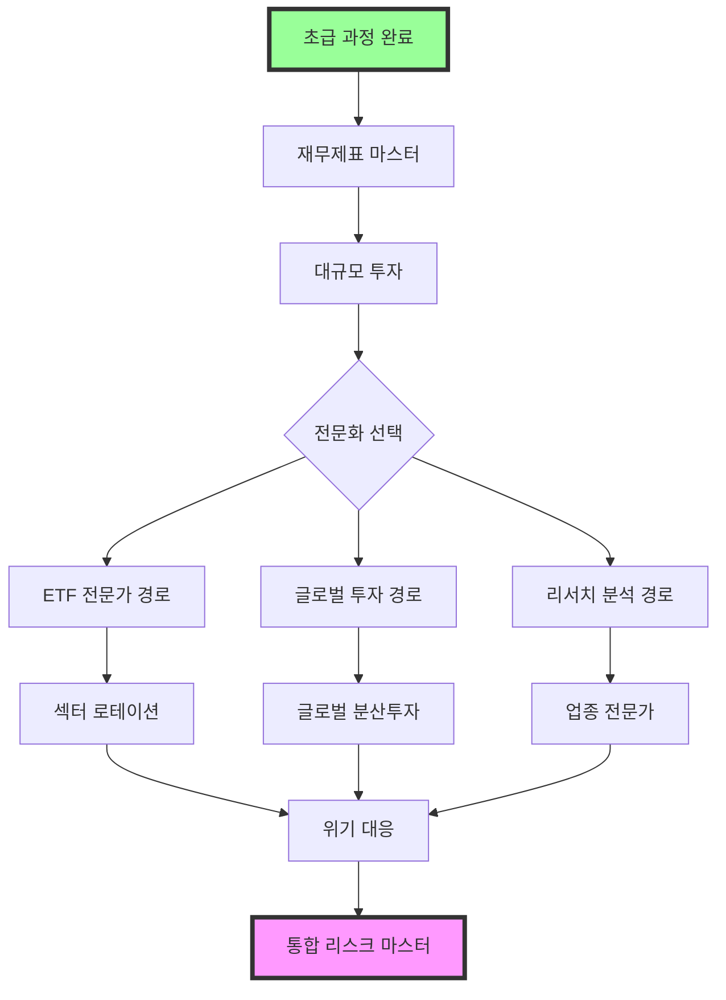

# 🔥 중급 리스크 해제 가이드

> "초보자를 벗어났다고 안심하지 마라. 진짜 시장의 시험은 지금부터다."
> - 마이클 버리 AI 멘토

## 🎯 중급 과정 철학

### 중급자로서 직면하는 현실
- 💰 **더 큰 금액**: 100만원 → 1000만원+ 로 투자 규모 증가
- 🌍 **복잡한 시장**: 단순한 상승/하락이 아닌 복잡한 패턴
- 🧠 **더 정교한 분석**: 기본 지표로는 한계가 있는 상황
- 🚀 **성과 압박**: 가족, 지인들의 더 높은 기대

### 중급 과정에서 얻는 실전 능력
- 🔍 **심화 분석 능력**: 재무제표 속 숨겨진 단서 찾기
- 🎯 **매매 타이밍**: 언제 사고 팔지의 실전 감각
- 🛡️ **위기 대응**: 30-50% 급락에도 살아남는 능력
- 🌍 **글로벌 시각**: 한국만 보는 시각에서 벗어나기

### 🗺️ 중급 학습 로드맵
```
레벨 25-35  → 실전 분석 (재무제표 마스터, 대규모 투자)
레벨 35-45  → 고급 기법 (ETF 포트폴리오, 섹터 투자)
레벨 45-55  → 글로벌 시각 (해외 투자, 환율 이해)
레벨 55-65  → 전문가 영역 (업종 분석, 매크로 예측)
레벨 65-75  → 리스크 마스터 (위기 기회 전환, 통합 관리)
```

## 💪 중급자 필수 사전 자격

✅ **초급 과정 완전 수료** (9개 이상 리스크 해제)
✅ **6개월 이상 실제 투자 경험**
✅ **1번 이상의 -20% 손실 경험 및 극복**
✅ **100만원 이상 투자 가능 자금**
✅ **매주 10시간 이상 투자 연구 시간 확보**

---

## 🔗 중급 리스크 연계 맵
중급 과정은 초급에서 익힌 기초를 바탕으로 전문성을 쌓아가는 과정입니다.



### 📊 난이도 조정 안내
- 🟢 **조정된 자금 요구사항**: 
  - 초기: 100만원 → 500만원 (5배)
  - 중기: 500만원 → 1000만원 (2배)
  - 후기: 1000만원 → 3000만원 (3배)
- 🟡 **단계별 전환 기간**: 각 리스크 간 최소 2주 준비 기간
- 🔴 **실패 허용 범위**: 각 단계에서 1회 실패 시 재도전 가능

## 📊 Intermediate Risk Unlocks (Level 25-75)

### 🟢 Market Risk Master 중급 코스

#### 1. **재무제표 마스터 되기** (Financial Statement Mastery)
- **리스크 ID**: `financial_master`
- **필요 레벨**: 25
- **필요 키**: Master Key (portfolio_basics), Real Experience Key (first_blood)
- **시장 상황**: 실적 발표 시즌
- **설명**: **재무제표를 읽고 주가를 예측할 수 있는 실전 능력**

💡 **왜 중요한가?**
중급자는 기본적 분석으로는 한계가 있습니다. 재무제표를 제대로 읽을 수 있어야 진짜 투자자가 됩니다.

🎯 **실전 목표**
- 재무제표만 보고 주가 예측 정확도 70% 달성
- 주요 기업 20개의 3년간 재무 데이터 분석
- 실제 매매 시 재무제표 기반 판단 실시

**해제 조건**:
- 🔍 Real Analysis: 실제 기업 재무제표 20개 이상 분석
- 🎯 Prediction Success: 주가 예측 성공률 70% 달성
- 💰 Real Trading: 재무제표 기반 실제 매매 5건 이상

**챌린지**:
1. **숫자 뒤 진실 찾기**: 재무제표의 숨겨진 비밀 탐지
   ```
   실전 과제:
   삼성전자 vs 애플 재무제표 비교
   - 매출 성장률 비교 (천진적으로 비교 금지)
   - 수익성 지표 (ROE, ROA, 영업이익률) 비교
   - 재무 건전성 (부채비율, 유동비율) 비교
   - 두 회사 주가 예측 및 실제 매매
   ```

2. **천재인지 사기꾼인지 구별하기**: 이익 질상과 청소성 분석
   - 영업이익 vs 비영업이익 비중 확인
   - 연구개발비 비중으로 성장 지속가능성 판단
   - 재고자산 회전율로 효율성 평가
   - 대손충당금, 처분손실 등 "일회성" 삭제 해석

3. **미래 예측하기**: 3년간 데이터로 다음 해 예측
   - 지난 3년 매출/이익 성장률 추세 분석
   - 경쟁사 대비 시장점유율 변화 추적
   - 신사업/신제품 효과 예상 시점 및 규모
   - 예측 대비 실제 결과 추적 및 개선

### 🔴 재무제표 분석 실패 사례 & 회복 전략

#### 대표적 실패 사례
1. **STX그룹 사례 (2013년)**: 숨겨진 부채의 위험성
   ```
   실패 원인:
   - 연결재무제표에서 특수목적회사(SPC) 부채 누락
   - 우발부채 주석 간과
   - 조선업 경기 사이클 무시
   
   교훈:
   - 연결재무제표 필수 확인
   - 주석 사항 철저 검토
   - 업종별 특수성 고려
   ```

2. **대우조선해양 사례 (2015년)**: 공시 지연과 분식회계
   ```
   위험 신호:
   - 감사의견 한정 지속
   - 대손충당금 적정성 의문
   - 수주잔고 대비 과도한 선급금
   
   예방법:
   - 감사의견 변화 추적
   - 회계법인 교체 빈도 확인
   - 업계 평균 대비 이상 수치 검증
   ```

#### 회복 전략
- **조기 경보 시스템**: 재무 위험 신호 5단계 체크리스트
- **분산 투자**: 재무제표 기반 투자도 단일 종목 집중 위험
- **전문가 네트워크**: 동종업계 전문가 의견 수렴
- **실시간 모니터링**: 분기별 재무제표 변화 추적

💪 **실전 미션**: 3개월간 20개 기업 매주 분석 후 실제 매매
- 매주 다른 기업 재무제표 분석
- 주가 예측 및 근거 기록
- 예측 정확도 70% 달성 시 실제 투자 실행
- 결과 추적 및 개선 사항 도출

📊 **AI 멘토의 조언**
> "재무제표는 기업의 체력검사 결과다. 방사능 방호복을 입고 더 깊이 들어가라." - 워렌 버핏 AI

---

#### 2. **대규모 투자 도전** (Large Scale Investment Challenge)
- **리스크 ID**: `large_scale_investment`
- **필요 레벨**: 30
- **필요 키**: Real Analysis (financial_master), Prediction Success
- **시장 상황**: 대규모 자금 운용 가능한 안정적 시장
- **설명**: **500만원-1000만원 규모로 실제 투자하며 중급자 마인드셋 습득**

💡 **왜 필수인가?**
100만원과 1000만원은 완전히 다른 게임입니다. 진짜 대규모 자금의 체감과 압박을 경험해야 중급자가 됩니다.

🎯 **대규모 투자의 현실**
- 심리적 압박: 1% 변동도 50만원의 손익
- 유동성 문제: 한 번에 모든 물량을 처분할 수 없음
- 슬리피지 영향: 대량 매매 시 가격에 영향
- 분할 매매 필요: 전략적 매매 및 매수 계획

**해제 조건**:
- 💰 Big Money: 500만원 이상 실제 투자
- 📊 Strategic Execution: 분할 매매 전략 수립 및 실행
- 🧘 Mental Strength: 대규모 손실 상황 대응

**챌린지**:
1. **분할 매매 마스터**: 대규모 자금의 전략적 운용
   ```
   실전 시나리오:
   1000만원으로 삼성전자 매수 계획
   
   금지 사항:
   - 시가에 1000만원 올인 매수 (가격 영향)
   - 한 번에 모든 물량 매도 (슬리피지)
   
   올바른 방법:
   - 1주간에 걸쳐 4번 나눠서 매수
   - 목표가 달성 시 3번에 나눠서 매도
   - 각 매매 후 시장 반응 분석
   ```

2. **심리적 압박 극복**: -10% 이상 손실 시 대응
   - 50만원 이상 손실 상황에서 냉정 유지
   - 추가 매수 vs 손절 결정 근거 수립
   - 가족의 암묵적 압박과 주변 시선 감당
   - 대규모 손실 상황 극복 경험 기록

3. **전략적 포지션 관리**: 대규모 자금의 리스크 분산
   - 단일 종목에 최대 50% 이내 투자
   - 업종 분산 (3개 업종 이상)
   - 시간 분산 (적립식 vs 이시점 집중)
   - 지역 분산 (국내 vs 해외 비중)

### 🔴 대규모 투자 실패 사례 & 회복 전략

#### 한국 시장 대규모 투자 실패 사례
1. **2018년 코스닥 폭락 사례**: 중급 투자자의 전형적 실수
   ```
   실패 시나리오:
   - 바이오주 열풍에 1000만원 집중 투자
   - 분할 매수 없이 고점에서 몰빵
   - -50% 손실 후 패닉 매도
   
   교훈:
   - 테마주 집중 투자 금지
   - 시장 과열 신호 인식 필요
   - 손절 기준 미리 설정
   ```

2. **2020년 동학개미 사례**: 대규모 자금의 심리적 함정
   ```
   위험 패턴:
   - 코로나 바닥에서 용기 부족
   - 반등 후 FOMO로 고점 진입
   - 이웃 수익률과 비교 스트레스
   
   극복 방법:
   - 기계적 분할 매수 시스템
   - 타인과 비교 금지 원칙
   - 장기 관점 유지
   ```

#### 회복 전략
- **손실 관리 시스템**: 단계별 대응 방안 (5%/10%/20% 손실 시)
- **심리적 지원**: 투자 일기 작성 및 멘토링
- **추가 투자 기준**: 평균 단가 낮추기 vs 손절 기준
- **가족 관계 관리**: 배우자/가족과의 소통 방안

💪 **6개월 대규모 투자 미션**
- 매월 100만원씩 적립식 투자 (6개월 = 600만원)
- 다양한 상황에서의 매매 경험 쌓기
- 대규모 자금 운용의 심리적 압박 적응
- 6개월 후 전체 수익률 및 경험 정리

📊 **AI 멘토의 조언**
> "대규모 자금은 단순한 돈이 아니라 책임이다. 그 무게를 견디는 자만이 진짜 투자자가 된다." - 피터 린치 AI

---

#### 2.5. **스케일링 마스터** (Portfolio Scaling Mastery)
- **리스크 ID**: `portfolio_scaling_master`
- **필요 레벨**: 32
- **필요 키**: Big Money Key (large_scale_experience)
- **시장 상황**: 자금 증가 과정에서 포트폴리오 재구성 필요 시
- **설명**: **500만원→3000만원 자금 증가 과정의 체계적 포트폴리오 관리 전략**

💡 **왜 스케일링이 중급자의 핵심인가?**
자금이 증가할 때마다 투자 전략을 바꿔야 합니다. 같은 방식으로 계속하면 비효율적이거나 위험할 수 있습니다.

🎯 **자금 규모별 최적 전략**
```
📈 단계별 포트폴리오 진화

1단계: 500만원 (시작)
├── 개별종목 70% (3-4개 핵심 종목)
├── ETF 20% (1-2개 기본 ETF)  
└── 현금 10% (기회 대기)

2단계: 1000만원 (2배)
├── 개별종목 60% (5-6개 종목)
├── ETF 30% (2-3개 ETF)
└── 현금 10% (더 큰 기회 대기)

3단계: 2000만원 (4배)
├── 개별종목 50% (8-10개 종목)
├── ETF 40% (4-5개 ETF)
└── 현금 10% (다양한 기회 대기)

4단계: 3000만원 (6배)
├── 개별종목 45% (10-12개 종목)
├── ETF 45% (5-7개 ETF)
└── 현금 10% (전략적 기다림)
```

**해제 조건**:
- 📊 Scale Management: 자금 증가에 따른 포트폴리오 재구성 성공
- 🎯 Efficiency Master: 각 단계별 최적 비중 유지
- 💰 Rebalancing Pro: 체계적 리밸런싱 시스템 구축

**챌린지**:
1. **단계별 전환 전략**: 자금 증가 시점의 스마트한 포트폴리오 재구성
   ```
   500만원 → 1000만원 전환 실전 가이드:
   
   🔄 기존 포트폴리오 분석
   - 수익률 상위 종목 식별
   - 손실 종목 정리 여부 판단
   - ETF 성과 평가
   
   📈 새로운 자금 배분 전략
   - 기존 우수 종목 비중 확대 vs 신규 종목 추가
   - ETF 종류 다양화 (국내 → 해외 추가)
   - 섹터 분산 강화
   
   ⚖️ 리밸런싱 실행
   - 한 번에 vs 분할하여 조정
   - 세금 효율성 고려 (손실 실현 우선)
   - 거래비용 최소화 전략
   ```

2. **비중 관리 시스템**: 체계적인 포트폴리오 관리
   ```
   🎯 종목별 비중 관리 원칙:
   
   개별 종목 비중 한계:
   - 500만원: 한 종목 최대 30% (150만원)
   - 1000만원: 한 종목 최대 25% (250만원)
   - 2000만원: 한 종목 최대 20% (400만원)
   - 3000만원: 한 종목 최대 15% (450만원)
   
   섹터별 분산 원칙:
   - 한 섹터 최대 40% 제한
   - 최소 3개 섹터 분산
   - IT 편중 방지 (최대 30%)
   
   지역별 분산 원칙:
   - 국내 50-70%
   - 선진국 20-35%
   - 신흥국 5-15%
   ```

3. **리밸런싱 마스터**: 효율적인 포트폴리오 조정 시스템
   ```
   📅 리밸런싱 일정표:
   
   정기 리밸런싱:
   - 월간: 개별 종목 비중 5% 이상 이탈 시 조정
   - 분기: ETF 비중 및 섹터 배분 재검토
   - 반기: 전체 자산배분 전략 재평가
   - 연간: 투자 목표 및 위험 한도 재설정
   
   조건부 리밸런싱:
   - 급락: 20% 이상 하락 시 추가 매수
   - 급등: 30% 이상 상승 시 일부 매도
   - 뉴스: 펀더멘털 변화 시 즉시 검토
   
   실행 우선순위:
   1. 손실 종목 정리 (세금 절약)
   2. 과도 비중 종목 매도
   3. 목표 비중 미달 종목 매수
   4. 신규 기회 포지션 구축
   ```

4. **세금 효율적 운용**: 중급자 필수 절세 전략
   ```
   💸 Tax Loss Harvesting (세금 손실 실현):
   
   손실 실현 전략:
   - 12월 전 손실 종목 정리
   - 수익 종목과 손실 종목 상계
   - 3년간 손실 이월공제 활용
   
   ISA 계좌 활용:
   - 고위험 투자는 ISA에서 실행
   - 연간 2000만원 한도 최대 활용
   - 5년 후 연금계좌 이전 혜택
   
   매매 타이밍 최적화:
   - 배당락일 전후 매매 전략
   - 월말/연말 세금 효율 고려
   - 장기보유 혜택 최대화 (2년+)
   ```

**스케일링 실패 사례와 교훈**:
```
❌ 흔한 스케일링 실패 패턴:

1. 비례 확대의 함정
문제: 500만원 포트폴리오를 단순히 6배 확대
결과: 개별 종목 리스크 과도 집중
해결: 단계별 분산 확대 전략

2. 복잡성 증가 부담
문제: 갑자기 너무 많은 종목 추가  
결과: 관리 부담 과중, 성과 악화
해결: 점진적 종목 수 증가

3. 감정적 스케일링
문제: 수익 종목만 계속 확대
결과: 섹터 편중, 분산 효과 상실
해결: 체계적 분산 원칙 준수

4. 리밸런싱 방치
문제: 자금 증가 후 방치
결과: 의도치 않은 비중 변화
해결: 정기적 포트폴리오 점검
```

📊 **AI 멘토의 조언**
> "포트폴리오는 정원과 같다. 씨앗을 뿌리고 끝이 아니라, 지속적으로 가꿔야 열매를 맺는다." - 레이 달리오 AI

**보상**:
- 경험치: 500 XP
- 키 획득: Scaling Master Key (portfolio_scaling)
- 스킬 포인트: Portfolio Manager +3
- 특별 보상: 전문가급 리밸런싱 시스템

---

#### 3. **ETF 포트폴리오 마스터** (ETF Portfolio Mastery)
- **리스크 ID**: `etf_portfolio_master`
- **필요 레벨**: 35
- **필요 키**: Scaling Master Key (portfolio_scaling)
- **시장 상황**: 변동성이 높은 시장
- **설명**: **ETF를 활용한 분산투자와 리스크 관리 전략 마스터**

💡 **왜 중급자에게 필수인가?**
대규모 자금 운용 시 개별 종목만으로는 리스크 관리가 어렵습니다. ETF를 통한 체계적인 분산투자가 필수입니다.

🎯 **ETF의 실전 활용**
- 즉시 분산투자: 한 번에 수백 개 기업 투자
- 섹터 투자: 산업별 트렌드 포착
- 글로벌 투자: 해외 시장 간편 접근
- 테마 투자: ESG, 메타버스 등 트렌드 투자

**해제 조건**:
- 🛡️ Diversification Master: ETF로 완벽한 분산투자 구현
- 💰 Sector Rotation: 섹터 ETF로 순환 투자 성공
- ⚡ Theme Investment: 테마 ETF로 트렌드 수익 실현

**챌린지**:
1. **ETF 포트폴리오 구축**: 목적별 ETF 조합
   ```
   실전 포트폴리오 예시:
   총 1000만원 투자 시
   
   핵심 보유 (Core):
   - KODEX 200: 30% (한국 대형주)
   - TIGER 미국S&P500: 20% (미국 대형주)
   - KODEX 국고채10년: 20% (안전자산)
   
   위성 투자 (Satellite):
   - TIGER 반도체: 10% (성장 섹터)
   - KODEX 배당성장: 10% (배당 수익)
   - TIGER 차이나전기차: 10% (테마 투자)
   ```

2. **섹터 로테이션 전략**: 경기 사이클별 ETF 교체
   - 경기 회복기: 금융, 산업재 ETF
   - 경기 확장기: 기술, 소비재 ETF
   - 경기 둔화기: 필수소비재, 헬스케어 ETF
   - 경기 침체기: 채권, 금 ETF

3. **리밸런싱 전략**: 체계적인 비중 조정
   - 분기별 목표 비중 점검
   - 5% 이상 괴리 시 리밸런싱
   - 세금과 수수료 고려한 최적화
   - 시장 상황별 전술적 조정

4. **중급자 고급 ETF 전략**: 차별화된 투자 접근법
   ```
   🎯 스마트 베타 ETF 활용:
   
   팩터별 ETF 조합:
   - 저변동성: KODEX 200롱버미도널 (위험 축소)
   - 고배당: KODEX 배당성장 (수익 안정)
   - 모멘텀: TIGER TOP10 (추세 추종)
   - 밸류: KODEX 200신장 (저평가 발굴)
   
   멀티팩터 포트폴리오 예시:
   총 2000만원 → 고급 전략 배분
   - 코어 (60%): 일반 시장지수 ETF
   - 팩터 (30%): 스마트 베타 ETF 조합
   - 테마 (10%): 트렌드 ETF
   ```

5. **환헤지 전략 마스터**: 글로벌 ETF 리스크 관리
   ```
   💱 통화 리스크 관리:
   
   환헤지 ETF vs 무헤지 ETF 선택:
   - 달러 강세 예상: 무헤지 ETF 선택
   - 달러 약세 예상: 환헤지 ETF 선택
   - 불확실할 때: 50:50 분산 투자
   
   실전 환헤지 전략:
   미국 투자 1000만원 기준
   - TIGER 미국S&P500: 500만원 (무헤지)
   - KODEX 미국S&P500(H): 500만원 (헤지)
   - 환율 변동 시 비중 조정
   
   환율 모니터링 지표:
   - 달러인덱스 (DXY) 추이
   - 한-미 금리차 변화  
   - 무역수지 및 경상수지
   ```

6. **동적 자산배분 전략**: 시장 상황별 ETF 비중 조정
   ```
   📊 시장 상황별 동적 배분:
   
   상승장 (VIX < 20):
   - 주식 ETF 80%, 채권 ETF 20%
   - 성장주/기술주 ETF 비중 확대
   - 신흥국 ETF 비중 증가
   
   횡보장 (VIX 20-30):
   - 주식 ETF 60%, 채권 ETF 40%
   - 배당주/가치주 ETF 비중 확대
   - 섹터 로테이션 전략 활용
   
   하락장 (VIX > 30):
   - 주식 ETF 40%, 채권 ETF 60%
   - 방어주 ETF 비중 확대
   - 금/원자재 ETF 추가 고려
   
   VIX 기반 자동 리밸런싱:
   - VIX 5포인트 변화 시 비중 재조정
   - 월 1회 이상 점검 및 실행
   - 감정 배제한 기계적 실행
   ```

### 🔴 ETF 투자 실패 사례 & 회복 전략

#### 한국 ETF 시장 실패 사례
1. **2020년 인버스 ETF 장기보유 실패**: ETF 특성 이해 부족
   ```
   실패 시나리오:
   - 코스피 하락 예상하여 인버스 ETF 매수
   - 3개월 장기 보유로 -30% 손실
   - 일일 복리 효과 이해 부족
   
   교훈:
   - 인버스/레버리지 ETF는 단기용
   - 장기 투자는 일반 ETF만 사용
   - ETF 상품 설명서 필독
   ```

2. **과도한 테마 ETF 집중**: 트렌드 추종 실패
   ```
   위험 패턴:
   - 메타버스 ETF에 전체 자금 50% 투자
   - 테마 소멸로 -60% 손실
   - 분산투자 원칙 무시
   
   올바른 접근:
   - 테마 ETF는 전체의 20% 이내
   - 핵심-위성 전략 준수
   - 정기적 리밸런싱 실행
   ```

#### ETF 투자 회복 전략
- **기본 원칙 준수**: 분산투자와 장기 투자
- **상품 이해**: ETF 종류별 특성 완전 이해
- **비용 관리**: 운용보수와 거래비용 최소화
- **정기 점검**: 월별 성과 분석과 리밸런싱

💪 **3개월 ETF 마스터 미션**
- 다양한 ETF로 포트폴리오 구성
- 섹터 로테이션 실전 적용
- 리밸런싱 효과 측정
- ETF 투자 전략 체계화

📊 **AI 멘토의 조언**
> "ETF는 개인 투자자의 최고의 친구다. 적은 비용으로 전문가급 분산투자가 가능하다." - 존 보글 AI

---

#### 3.5. **실전 포트폴리오 관리 시스템** (Portfolio Management System)
- **리스크 ID**: `portfolio_management_system`
- **필요 레벨**: 37
- **필요 키**: Scaling Master Key (portfolio_scaling), ETF Diversification Master
- **시장 상황**: 지속적 포트폴리오 관리가 필요한 시장
- **설명**: **체계적인 포트폴리오 모니터링, 성과 측정, 리밸런싱 실행 시스템 구축**

💡 **왜 중급자에게 시스템이 필요한가?**
1000만원 이상 자금을 운용하려면 감과 직관으로는 한계가 있습니다. 데이터 기반의 체계적 관리 시스템이 필수입니다.

🎯 **포트폴리오 관리의 4대 핵심**
1. **모니터링**: 실시간 포트폴리오 상태 파악
2. **측정**: 성과 및 리스크 정량적 평가  
3. **분석**: 개선점 및 문제점 도출
4. **실행**: 리밸런싱 및 전략 조정

**해제 조건**:
- 📊 System Builder: 포트폴리오 관리 시스템 구축 완료
- 📈 Performance Tracker: 체계적 성과 측정 시스템 운영
- 🔄 Rebalancing Executor: 효율적 리밸런싱 시스템 실행

**챌린지**:
1. **엑셀/구글시트 포트폴리오 트래커 구축**: 전문가급 관리 도구 만들기
   ```
   📋 필수 포함 항목:
   
   기본 정보 시트:
   ├── 종목명, 수량, 매수가, 현재가
   ├── 투자금액, 평가금액, 손익
   ├── 수익률, 비중, 목표비중
   └── 마지막 업데이트 일시
   
   성과 분석 시트:
   ├── 총 수익률 vs 코스피 vs 코스닥
   ├── 월별/분기별 성과 추이
   ├── 섹터별 기여도 분석
   └── 변동성 및 최대손실폭(MDD)
   
   리밸런싱 시트:
   ├── 현재 비중 vs 목표 비중
   ├── 조정 필요 금액 계산
   ├── 매매 계획 및 실행 기록
   └── 리밸런싱 효과 추적
   
   배당 관리 시트:
   ├── 배당 예상 일정 및 금액
   ├── 세전/세후 배당 수익률
   ├── 연간 배당 목표 대비 실적
   └── 배당 재투자 계획
   ```

2. **성과 측정 및 벤치마크 비교**: 객관적 성과 평가 시스템
   ```
   📊 핵심 성과 지표 (KPI):
   
   수익률 지표:
   - 절대수익률: 투자원금 대비 수익률
   - 상대수익률: 코스피 대비 초과수익률
   - 연환산수익률: 기간 보정 수익률
   - 샤프비율: 위험 대비 수익률 효율성
   
   리스크 지표:
   - 변동성: 월별 수익률 표준편차
   - 최대손실폭: 고점 대비 최대 하락률
   - 베타: 시장 대비 민감도
   - VaR: 99% 신뢰구간 최대 예상 손실
   
   벤치마크 비교:
   - 코스피 지수 대비 성과
   - 섹터별 대표 지수 대비 성과
   - 동일 비중 ETF 대비 성과
   - 동일 리스크 포트폴리오 대비 성과
   ```

3. **스마트 리밸런싱 시스템**: 효율적 포트폴리오 조정
   ```python
   # 포트폴리오 자동 리밸런싱 시스템
   import pandas as pd
   import numpy as np
   from datetime import datetime, timedelta
   
   class SmartRebalancer:
       def __init__(self, target_allocation, rebalance_threshold=0.05):
           self.target_allocation = target_allocation  # 목표 비중
           self.rebalance_threshold = rebalance_threshold  # 5% 임계값
           self.trading_cost_rate = 0.002  # 거래 비용 0.2%
           
       def calculate_current_allocation(self, portfolio):
           """현재 포트폴리오 비중 계산"""
           total_value = portfolio['current_value'].sum()
           current_allocation = {}
           
           for index, row in portfolio.iterrows():
               ticker = row['ticker']
               weight = row['current_value'] / total_value
               current_allocation[ticker] = weight
           
           return current_allocation
       
       def check_rebalance_needed(self, current_allocation):
           """리밸런싱 필요 여부 판단"""
           rebalance_signals = {}
           
           for ticker, target_weight in self.target_allocation.items():
               current_weight = current_allocation.get(ticker, 0)
               deviation = abs(current_weight - target_weight)
               
               if deviation > self.rebalance_threshold:
                   rebalance_signals[ticker] = {
                       'current': current_weight,
                       'target': target_weight,
                       'deviation': deviation,
                       'action': 'BUY' if current_weight < target_weight else 'SELL'
                   }
           
           return rebalance_signals
       
       def calculate_rebalance_trades(self, portfolio, rebalance_signals):
           """리밸런싱 거래 계산"""
           total_value = portfolio['current_value'].sum()
           trades = []
           
           for ticker, signal in rebalance_signals.items():
               current_value = portfolio[portfolio['ticker'] == ticker]['current_value'].iloc[0]
               target_value = total_value * signal['target']
               trade_amount = target_value - current_value
               
               # 거래 비용 고려
               if abs(trade_amount) > total_value * 0.01:  # 1% 이상만 거래
                   trades.append({
                       'ticker': ticker,
                       'action': signal['action'],
                       'amount': trade_amount,
                       'current_weight': signal['current'],
                       'target_weight': signal['target'],
                       'trading_cost': abs(trade_amount) * self.trading_cost_rate
                   })
           
           return trades
       
       def optimize_tax_efficiency(self, trades, portfolio):
           """세금 효율 최적화"""
           optimized_trades = []
           
           for trade in trades:
               ticker = trade['ticker']
               stock_info = portfolio[portfolio['ticker'] == ticker].iloc[0]
               
               # 손실 종목 우선 매도 (Tax Loss Harvesting)
               if trade['action'] == 'SELL' and stock_info['unrealized_gain'] < 0:
                   trade['priority'] = 'HIGH'  # 높은 우선순위
                   trade['tax_benefit'] = abs(stock_info['unrealized_gain']) * 0.22  # 세금 절약
               
               # 장기보유 종목 혜택 고려
               holding_period = (datetime.now() - stock_info['purchase_date']).days
               if holding_period > 365 * 2:  # 2년 이상 보유
                   trade['long_term_benefit'] = True
               
               optimized_trades.append(trade)
           
           # 우선순위별 정렬
           optimized_trades.sort(key=lambda x: x.get('priority', 'LOW'), reverse=True)
           return optimized_trades
       
       def execute_smart_rebalancing(self, portfolio):
           """스마트 리밸런싱 실행"""
           # 1. 현재 비중 계산
           current_allocation = self.calculate_current_allocation(portfolio)
           
           # 2. 리밸런싱 필요성 체크
           rebalance_signals = self.check_rebalance_needed(current_allocation)
           
           if not rebalance_signals:
               return {"message": "리밸런싱 불필요", "trades": []}
           
           # 3. 거래 계획 수립
           trades = self.calculate_rebalance_trades(portfolio, rebalance_signals)
           
           # 4. 세금 효율 최적화
           optimized_trades = self.optimize_tax_efficiency(trades, portfolio)
           
           return {
               "message": "리밸런싱 실행 계획",
               "trades": optimized_trades,
               "total_trading_cost": sum([t['trading_cost'] for t in optimized_trades]),
               "expected_tax_benefit": sum([t.get('tax_benefit', 0) for t in optimized_trades])
           }
   
   # 월별 자동 리밸런싱 스케줄러
   class RebalancingScheduler:
       def __init__(self, rebalancer):
           self.rebalancer = rebalancer
           self.last_rebalance = None
           
       def should_rebalance(self, force_check=False):
           """리밸런싱 시점 판단"""
           if force_check:
               return True
               
           if self.last_rebalance is None:
               return True
               
           # 월 1회 정기 리밸런싱
           days_since_last = (datetime.now() - self.last_rebalance).days
           return days_since_last >= 30
       
       def schedule_rebalancing(self, portfolio, market_conditions):
           """스케줄 기반 리밸런싱"""
           rebalance_plan = {
               'scheduled_date': datetime.now(),
               'market_volatility': market_conditions.get('vix', 20),
               'action': 'HOLD'
           }
           
           # 시장 상황별 리밸런싱 전략
           if market_conditions.get('vix', 20) > 30:  # 고변동성
               rebalance_plan['action'] = 'DEFENSIVE'
               rebalance_plan['message'] = "방어적 리밸런싱 실행"
           elif market_conditions.get('trend', 'NEUTRAL') == 'BULLISH':
               rebalance_plan['action'] = 'AGGRESSIVE' 
               rebalance_plan['message'] = "공격적 리밸런싱 실행"
           else:
               rebalance_plan['action'] = 'NORMAL'
               rebalance_plan['message'] = "정상 리밸런싱 실행"
           
           return rebalance_plan
   
   # 사용 예시
   target_allocation = {
       '005930': 0.30,  # 삼성전자 30%
       '000660': 0.20,  # SK하이닉스 20%
       'KODEX_200': 0.25,  # KODEX 200 25%
       'TIGER_미국': 0.15,  # TIGER 미국 15%
       'CASH': 0.10     # 현금 10%
   }
   
   # 포트폴리오 데이터 예시
   portfolio_data = pd.DataFrame({
       'ticker': ['005930', '000660', 'KODEX_200', 'TIGER_미국', 'CASH'],
       'current_value': [3200000, 1800000, 2800000, 1500000, 700000],
       'unrealized_gain': [200000, -100000, 50000, 100000, 0],
       'purchase_date': pd.to_datetime(['2022-01-01', '2022-06-01', '2023-01-01', '2023-06-01', '2023-12-01'])
   })
   
   # 리밸런서 생성 및 실행
   rebalancer = SmartRebalancer(target_allocation)
   result = rebalancer.execute_smart_rebalancing(portfolio_data)
   
   print("리밸런싱 결과:")
   for trade in result['trades']:
       print(f"{trade['ticker']}: {trade['action']} {trade['amount']:,.0f}원")
   ```
   
   🔄 리밸런싱 자동화 규칙 (코드로 구현):
   
   조건부 실행 규칙:
   - 종목 비중 5% 이상 이탈: 월간 점검 (자동 감지)
   - 섹터 비중 10% 이상 이탈: 즉시 검토 (실시간 알림)
   - 전체 손익률 ±20% 도달: 전략 재검토 (자동 트리거)
   - 신규 자금 추가: 균형 배분 실행 (최적화 알고리즘)
   
   세금 효율 최적화 (알고리즘):
   - 손실 종목 우선 정리 (Tax Loss Harvesting) - 자동 우선순위
   - ISA 계좌 활용한 고위험 매매 - 계좌별 최적화
   - 배당락일 전후 매매 타이밍 조절 - 일정 기반 자동화
   - 장기보유 혜택 최대화 전략 - 보유기간 자동 추적
   
   거래비용 최소화 (스마트 실행):
   - 소액 조정은 신규 자금으로 해결 - 비용 효율 계산
   - 동일 증권사 ETF 간 교환 활용 - 수수료 최적화
   - 분할 매매로 시장 충격 최소화 - 알고리즘 매매
   - 유동성 풍부한 시간대 거래 - 시간 기반 자동화

4. **위험관리 및 스트레스 테스트**: 포트폴리오 내구성 검증
   ```
   🚨 리스크 모니터링 체계:
   
   일간 모니터링:
   - 개별 종목 5% 이상 변동 시 원인 분석
   - 포트폴리오 전체 3% 이상 변동 시 검토
   - 시장 지수 대비 상대 성과 추적
   
   주간 모니터링:
   - 섹터 집중도 및 분산 효과 점검
   - 상관관계 변화 모니터링
   - 거시경제 지표 영향 분석
   
   월간 스트레스 테스트:
   - 2008년 금융위기 수준 급락 시뮬레이션
   - 2020년 코로나 수준 변동성 테스트
   - 개별 종목 -50% 하락 시나리오 테스트
   - 주요 섹터 붕괴 시나리오 테스트
   ```

**실전 관리 시스템 구축 가이드**:
```
🛠️ 단계별 시스템 구축:

1주차: 기초 트래커 구축
- 보유 종목 및 기본 정보 입력
- 실시간 시세 연동 설정 (APIs 활용)
- 기본 손익 계산 공식 설정

2주차: 성과 분석 모듈 추가
- 벤치마크 데이터 수집 및 비교
- 차트 및 그래프 자동 생성
- 월별/분기별 성과 리포트 자동화

3주차: 리밸런싱 도구 구축
- 목표 비중 설정 및 이탈도 계산
- 매매 시그널 자동 생성
- 세금 효율 계산기 추가

4주차: 고급 분석 도구 완성
- 리스크 지표 자동 계산
- 스트레스 테스트 시뮬레이터
- 투자 일지 및 의사결정 기록
```

**시스템 운영 실패 사례와 개선점**:
```
❌ 흔한 시스템 운영 실패:

1. 과도한 모니터링
문제: 매일 수시로 확인하며 스트레스 증가
해결: 정해진 시간에만 확인 (일 1회, 주말 정리)

2. 복잡한 시스템 구축
문제: 너무 많은 지표로 오히려 혼란
해결: 핵심 지표 5개로 단순화

3. 감정적 개입
문제: 시스템 신호 무시하고 감정적 판단
해결: 규칙 기반 의사결정 체계 확립

4. 시스템 방치
문제: 구축 후 업데이트 중단
해결: 정기적 시스템 점검 및 개선
```

📊 **AI 멘토의 조언**
> "관리할 수 없는 것은 통제할 수 없고, 측정할 수 없는 것은 관리할 수 없다. 체계적 시스템이 감정을 이긴다." - 피터 드러커 AI

**보상**:
- 경험치: 600 XP
- 키 획득: System Management Key (portfolio_system)
- 스킬 포인트: Portfolio Architect +3
- 특별 보상: 전문가급 포트폴리오 관리 템플릿

---

### 🔵 Credit Risk Guardian 중급 코스

#### 4. **숨겨진 지뢰 탐지기** (Hidden Risk Detection)
- **리스크 ID**: `hidden_risk_detection`
- **필요 레벨**: 40
- **필요 키**: Hedge Master, Premium Income
- **시장 상황**: 복잡한 재무구조의 기업들이 많은 시장
- **설명**: **겉으로는 멀쩡해 보이지만 숨겨진 위험을 안고 있는 기업 탐지**

💡 **왜 중급자에게 필수인가?**
대규모 투자에서는 한 번의 지뢰 밟기가 치명적입니다. 회계 트릭과 숨겨진 부채를 찾는 능력이 필수입니다.

🎯 **숨겨진 위험의 종류**
- 우발부채: 보증채무, 소송 리스크
- 특수관계자 거래: 일감 몰아주기
- 회계 조작: 매출 인식 조작, 비용 이연
- 유동성 위기: 단기부채 vs 현금 불균형

**해제 조건**:
- 🔍 X-Ray Vision: 숨겨진 부채 및 리스크 탐지
- 📊 Forensic Analysis: 회계 조작 의심 사례 발견
- 🚨 Early Warning: 유동성 위기 사전 감지

**챌린지**:
1. **회계 CSI 되기**: 재무제표 수사관 되기
   ```python
   # 재무제표 분석 자동화 코드 예시
   import pandas as pd
   import numpy as np
   
   def financial_health_score(company_data):
       """기업 재무 건전성 자동 평가 시스템"""
       score = 100
       
       # 유동성 검사
       current_ratio = company_data['current_assets'] / company_data['current_liabilities']
       if current_ratio < 1.0:
           score -= 20
       elif current_ratio < 1.5:
           score -= 10
       
       # 수익성 검사
       roe = company_data['net_income'] / company_data['shareholders_equity']
       if roe < 0.05:  # ROE 5% 미만
           score -= 15
       
       # 매출채권 증가율 vs 매출 증가율 비교
       receivables_growth = (company_data['accounts_receivable_current'] / 
                           company_data['accounts_receivable_previous'] - 1)
       sales_growth = (company_data['revenue_current'] / 
                      company_data['revenue_previous'] - 1)
       
       if receivables_growth > sales_growth * 1.2:  # 매출채권이 매출보다 20% 이상 빠르게 증가
           score -= 25  # 매출 조작 의심
       
       # 현금흐름 vs 순이익 괴리 검사
       cash_flow_ratio = company_data['operating_cash_flow'] / company_data['net_income']
       if cash_flow_ratio < 0.8:  # 현금흐름이 순이익의 80% 미만
           score -= 20  # 이익의 질 의심
       
       # 부채 증가율 검사
       debt_growth = (company_data['total_debt_current'] / 
                     company_data['total_debt_previous'] - 1)
       if debt_growth > 0.3:  # 부채 30% 이상 증가
           score -= 15
       
       return max(0, score)  # 최소 0점
   
   # 실전 분석 코드
   def analyze_company(ticker):
       """특정 기업 종합 분석"""
       # 데이터 수집 (실제로는 API 연동)
       financial_data = get_financial_data(ticker)
       
       # 건전성 점수 계산
       health_score = financial_health_score(financial_data)
       
       # 위험 신호 체크
       risk_flags = []
       
       if financial_data['audit_opinion'] != '적정':
           risk_flags.append("감사의견 한정")
       
       if financial_data['related_party_transactions'] > financial_data['revenue'] * 0.3:
           risk_flags.append("과도한 특수관계자 거래")
       
       if financial_data['contingent_liabilities'] > financial_data['shareholders_equity'] * 0.5:
           risk_flags.append("대규모 우발부채")
       
       return {
           'health_score': health_score,
           'risk_flags': risk_flags,
           'recommendation': 'BUY' if health_score > 70 else 'HOLD' if health_score > 50 else 'SELL'
       }
   
   # 사용 예시
   result = analyze_company('005930')  # 삼성전자
   print(f"건전성 점수: {result['health_score']}/100")
   print(f"위험 신호: {result['risk_flags']}")
   print(f"투자 추천: {result['recommendation']}")
   ```
   
   실전 수사 과제:
   의심스러운 기업 재무제표 분석
   
   체크 포인트:
   - 매출 대비 매출채권 증가율 비교 (코드로 자동화)
   - 현금흐름 vs 순이익 괴리 분석 (알고리즘 활용)
   - 특수관계자 거래 비중 확인 (임계값 설정)
   - 각주에서 우발부채 확인 (자동 플래그 시스템)

2. **조기경보 시스템 구축**: 위험 신호 사전 감지
   - 유동비율 < 1.0 기업 모니터링
   - 이자보상비율 < 3.0 기업 주의
   - 영업현금흐름 음수 지속 기업 경계
   - 매출채권/재고자산 급증 기업 점검

3. **지뢰밭 지도 작성**: 위험 기업 데이터베이스 구축
   - 업종별 위험 기업 리스트 작성
   - 과거 부실 기업들의 공통 패턴 분석
   - 현재 위험 신호 보이는 기업 모니터링
   - 투자 금지 기업 블랙리스트 관리

### 🔴 숨겨진 위험 탐지 실패 사례 & 회복 전략

#### 한국 시장 숨겨진 위험 실패 사례
1. **한진해운 사례 (2016년)**: 유동성 위기 간과
   ```
   놓친 위험 신호:
   - 단기부채 > 현금 + 단기자산 지속
   - 해운업 전반적 침체 무시
   - 대주주 지분 담보 제공 급증
   
   교훈:
   - 업종 전반 상황 함께 고려
   - 현금흐름 분석 강화
   - 대주주 행동 패턴 모니터링
   ```

2. **옵티머스 사모펀드 사례 (2020년)**: 복잡한 구조 간과
   ```
   위험 신호:
   - 과도한 고수익 약속
   - 불투명한 투자 대상
   - 복잡한 사모펀드 구조
   
   예방법:
   - 고수익 = 고위험 원칙 적용
   - 투자 구조 완전 이해 후 투자
   - 금융감독원 제재 이력 확인
   ```

#### 회복 전략
- **다각도 검증**: 재무제표 + 업계 전문가 + 언론 보도 종합
- **위험 신호 체크리스트**: 정기적 업데이트 및 보완
- **소액 테스트**: 의심스러운 기업은 소액으로 시작
- **조기 탈출**: 새로운 위험 신호 발견 시 즉시 매도

💪 **위험 탐지 전문가 미션**
- 매월 10개 기업 정밀 분석
- 위험 신호 체크리스트 고도화
- 실제 부실 사례 발생 시 사전 탐지 여부 검증
- 숨겨진 위험 탐지 정확도 80% 달성

📊 **AI 멘토의 조언**
> "숫자는 거짓말을 하지 않지만, 거짓말쟁이는 숫자를 사용한다. 의심의 눈으로 보라." - 벤저민 그레이엄 AI

---

### 🟢 Operational Risk Controller 중급 코스

#### 5. **글로벌 마인드 장착** (Global Investment Mindset)
- **리스크 ID**: `global_mindset`
- **필요 레벨**: 45
- **필요 키**: X-Ray Vision, Forensic Analysis
- **시장 상황**: 글로벌 경제 불안정성이 높은 시장
- **설명**: **해외 투자와 환율 헤지를 통한 진정한 글로벌 포트폴리오 구축**

💡 **왜 중급자에게 필수인가?**
한국 시장만으로는 한계가 있습니다. 글로벌 기회를 잡고 환율 리스크를 관리하는 능력이 중급자의 필수 덕목입니다.

🎯 **글로벌 투자의 현실**
- 환율 리스크: 수익이 나도 환율로 손실
- 시차 효과: 미국 장 마감 후 한국 장 영향
- 정보 접근성: 현지 정보 부족
- 세금 문제: 배당소득세, 양도소득세

**해제 조건**:
- 🌍 Global Portfolio: 해외 자산 30% 이상 구성
- 💱 Currency Hedge: 환율 헤지 전략 실행
- 📈 Cross Market: 해외 시장 동향 분석 능력

**챌린지**:
1. **해외 투자 첫 발 떼기**: 실제 해외 자산 투자
   ```
   글로벌 포트폴리오 구성:
   - 미국 주식 ETF: 20%
   - 중국/신흥국 ETF: 10%
   - 유럽 주식 ETF: 5%
   - 원자재 ETF: 5%
   
   실전 과제:
   - 환율 영향 계산기 작성
   - 매월 환율 변동 손익 추적
   ```

2. **환율 헤지 마스터**: 환율 리스크 관리
   - 달러 강세/약세 시나리오별 대응
   - 통화선물/옵션을 활용한 헤지
   - 원화 강세 시 해외 투자 확대
   - 원화 약세 시 국내 투자 집중

3. **글로벌 트렌드 추적**: 세계 경제 흐름 파악
   - 미국 금리 변화가 신흥국에 미치는 영향
   - 중국 경제 지표의 원자재 가격 연동성
   - 유럽 정치 불안이 글로벌 시장에 미치는 영향
   - 일본 엔화 약세의 한국 수출기업 영향

### 🔴 글로벌 투자 실패 사례 & 회복 전략

#### 한국 투자자 글로벌 투자 실패 사례
1. **2018년 신흥국 ETF 폭락 사례**: 환율 헤지 무시
   ```
   실패 시나리오:
   - 달러 강세 시점에 신흥국 ETF 집중 매수
   - 환율 헤지 없이 원화 약세 이중 타격
   - -40% 손실 후 공포 매도
   
   교훈:
   - 환율 방향성 고려 필수
   - 헤지 비용 vs 환율 리스크 계산
   - 단계적 진입으로 타이밍 리스크 분산
   ```

2. **중국 주식 투자 실패 사례**: 정치적 리스크 간과
   ```
   위험 패턴:
   - 테크 기업 성장성만 보고 투자
   - 중국 정부 규제 리스크 간과
   - 홍콩 시위, 미중 갈등 등 지정학적 리스크 무시
   
   예방법:
   - 정치적 리스크 프리미엄 고려
   - 지정학적 뉴스 정기 모니터링
   - 포트폴리오 지역 분산 필수
   ```

#### 회복 전략
- **단계적 해외 진출**: 한 번에 30% 투자 금지, 점진적 확대
- **환율 교육**: 환율 변동 메커니즘 완전 이해
- **현지 전문가 네트워크**: 해외 거주 전문가 의견 수렴
- **정치적 헤지**: 정치적 리스크 분산 전략 수립

💪 **글로벌 투자자 전환 미션**
- 6개월간 해외 자산 비중 30% 유지
- 환율 변동에 따른 손익 추적 및 분석
- 글로벌 이벤트의 국내 시장 영향 예측
- 환율 헤지 전략의 효과 검증

📊 **AI 멘토의 조언**
> "세계는 하나의 시장이다. 우물 안에서 벗어나야 진짜 기회가 보인다." - 짐 로저스 AI

---

#### 4.5. **중급자 심리 마스터** (Intermediate Psychology Master)
- **리스크 ID**: `intermediate_psychology_master`
- **필요 레벨**: 45
- **필요 키**: System Management Key (portfolio_system), Hidden Risk Detection
- **시장 상황**: 큰 금액으로 인한 심리적 압박이 있는 시점
- **설명**: **1000만원+ 자금 운용 시 발생하는 특별한 심리적 도전 극복**

💡 **왜 중급자에게 특별한 심리 관리가 필요한가?**
100만원과 1000만원은 심리적으로 완전히 다른 게임입니다. 더 큰 손실, 더 큰 기대, 더 큰 책임이 새로운 심리적 도전을 만듭니다.

🎯 **중급자 특화 심리적 도전**
1. **큰 금액 손실의 공포**: -300만원 vs -30만원의 심리적 차이
2. **주변 기대치 부담**: 가족, 친구들의 투자 조언 요청
3. **전문가 행세 유혹**: 성공 후 과신과 위험한 확신
4. **중간 수익 구간의 욕심**: 적당한 수익에서 더 큰 욕심

**해제 조건**:
- 🧠 Mental Strength: 큰 손실 상황에서 냉정함 유지
- 🛡️ Pressure Resistance: 외부 압박에 흔들리지 않는 의지력
- 💪 Emotional Control: 과신과 욕심 통제 능력

**챌린지**:
1. **큰 손실 시뮬레이션 훈련**: 300만원 손실 상황 대응법
   ```
   🚨 -30% 손실 시나리오 (1000만원→700만원):
   
   즉시 대응 (첫 24시간):
   □ 포트폴리오 전체 재검토하지 말기
   □ 급매도 충동 억제하기  
   □ SNS, 투자 커뮤니티 피하기
   □ 가족에게 손실 알리지 말기
   
   단기 대응 (1주일):
   □ 손실 원인 냉정히 분석
   □ 펀더멘털 변화 vs 시장 변동 구분
   □ 개별 종목별 대응 방안 수립
   □ 추가 하락 방어 전략 준비
   
   중기 대응 (1개월):
   □ 교훈 정리 및 시스템 개선
   □ 필요시 일부 손절 및 포트폴리오 재구성
   □ 심리적 회복 및 재기 계획 수립
   □ 투자 원칙 재점검 및 강화
   ```

2. **주변 압박 관리 시스템**: 가족, 지인 기대치 관리
   ```
   👥 관계별 대응 전략:
   
   가족 (배우자, 부모):
   - 투자 결과 정기 공유 (월 1회)
   - 손실 시 솔직한 상황 설명
   - 투자 철학과 장기 계획 설명
   - 생활비 영향 없음을 확실히 전달
   
   친구, 동료:
   - 투자 조언 요청 시 정중히 거절
   - "나도 공부 중이라" 멘트 활용
   - 수익 자랑하지 않기
   - 투자 관련 대화 최소화
   
   온라인 커뮤니티:
   - 수익 인증샷 올리지 않기
   - 자신의 포트폴리오 노출 금지
   - 감정적 댓글 달지 않기
   - 정보 수집용으로만 활용
   ```

3. **과신 방지 및 겸손 유지**: 성공 후 위험한 확신 통제
   ```
   😈 과신의 위험 신호:
   
   위험한 생각 패턴:
   - "이제 주식을 이해했다"
   - "나는 남들과 다르다"  
   - "이번엔 확실하다"
   - "더 공격적으로 가도 된다"
   
   과신 방지 체크리스트:
   □ 매월 실수와 운의 비중 분석
   □ 벤치마크 대비 성과 겸손히 평가
   □ 시장 상승 vs 개인 실력 구분
   □ 정기적으로 초심 일기 읽기
   
   겸손 유지 훈련:
   - 매주 모르는 것 3가지 적기
   - 실패 사례 정기적 복습
   - 시장 대가들의 실패담 읽기
   - "아직 멀었다" 마음가짐 유지
   ```

4. **욕심 단계별 관리**: 수익 구간별 심리 통제
   ```
   📈 수익률별 심리 관리:
   
   +10% 구간 (만족 단계):
   - 성과에 만족하되 방심 금지
   - 리밸런싱 원칙 엄격히 적용
   - 추가 위험 감수 유혹 억제
   
   +20% 구간 (자신감 단계):
   - 과신 경계 알람 설정
   - 일부 수익 실현 고려
   - 더 큰 모험 유혹 강력 통제
   
   +30% 구간 (위험 단계):
   - 강제 일부 수익 실현
   - 포트폴리오 보수적 조정
   - 주변 칭찬에 휘둘리지 않기
   
   +50% 이상 (극위험 단계):
   - 즉시 상당 부분 수익 실현
   - 투자 원칙 근본적 재검토
   - 겸손과 경계심 최대치 유지
   ```

**중급자 심리 실패 사례와 교훈**:
```
💔 실제 중급자 심리 실패 사례:

1. "1000만원 투자자 A씨" (2021년)
상황: 코인 투자로 2000만원까지 성공
실패: 과신으로 전 재산 올인 → 800만원 손실
교훈: 성공 후 과신이 가장 위험

2. "중급 투자자 B씨" (2020년)
상황: 코로나 저점 매수로 큰 수익
실패: 가족 압박으로 섣부른 투자 조언
교훈: 타인 돈 관리는 관계 파괴 위험

3. "직장인 투자자 C씨" (2022년)
상황: 동료들에게 투자 전문가로 인정받음
실패: 체면 때문에 손절하지 못하고 더 큰 손실
교훈: 외부 이미지 관리가 판단력 흐림

4. "신혼부부 D씨" (2023년)
상황: 결혼 자금 1500만원으로 투자 시작
실패: 배우자 압박으로 감정적 매매 반복
교훈: 가족 소통과 기대치 관리 중요
```

**중급자 심리 강화 훈련법**:
```
🏋️ 일주일 심리 훈련 프로그램:

월요일: 손실 시뮬레이션
- 최악 시나리오 상상 훈련
- 대응 계획 시뮬레이션

화요일: 겸손 훈련
- 모르는 것 리스트 작성
- 실수 사례 복습

수요일: 압박 저항 훈련
- 투자 조언 요청 거절 연습
- 수익 자랑 억제 훈련

목요일: 감정 통제 훈련
- 욕심과 두려움 인식 연습
- 냉정한 판단력 유지 훈련

금요일: 관계 관리 훈련
- 가족, 지인과의 소통 연습
- 기대치 관리 대화법 연습

주말: 종합 복습
- 한 주간 심리적 도전 정리
- 다음 주 개선 계획 수립
```

📊 **AI 멘토의 조언**
> "큰 돈을 다루는 자는 큰 책임을 진다. 그 무게를 견딜 수 있는 마음이 진정한 투자 실력이다." - 워렌 버핏 AI

**보상**:
- 경험치: 400 XP
- 키 획득: Mental Master Key (psychology_advanced)
- 스킬 포인트: Emotional Intelligence +3
- 특별 보상: 중급자 심리 관리 매뉴얼

---

### 🟣 Strategic Risk Visionary 중급 코스

#### 5.5. **섹터 로테이션 마스터** (Sector Rotation Master)
- **리스크 ID**: `sector_rotation_master`
- **필요 레벨**: 50
- **필요 키**: Global Portfolio, Currency Management
- **시장 상황**: 경기 사이클 전환점
- **설명**: **경기 순환에 따른 섹터별 투자 전략으로 초과 수익 창출**

💡 **왜 중급자에게 필수인가?**
시장은 항상 경기 사이클을 따라 움직입니다. 섹터 로테이션을 이해하면 시장을 앞서가는 투자가 가능합니다.

🎯 **섹터 로테이션의 핵심**
- 경기 회복기: 금융, 부동산, 소재
- 경기 확장기: 기술, 통신, 소비재
- 경기 둔화기: 에너지, 산업재
- 경기 침체기: 필수소비재, 헬스케어, 유틸리티

**해제 조건**:
- 📊 Cycle Analysis: 경기 사이클 정확한 분석
- 🔄 Rotation Timing: 섹터 전환 타이밍 포착
- 💰 Outperformance: 벤치마크 대비 초과 수익

**챌린지**:
1. **경기 사이클 읽기**: 현재 경기 위치 파악
   ```
   경기 사이클 지표:
   - GDP 성장률 추세
   - 금리 방향성
   - 인플레이션 수준
   - 실업률 변화
   - 제조업 PMI 지수
   ```

2. **섹터별 성과 추적**: 섹터 ETF 활용 전략
   - 각 섹터 ETF 성과 모니터링
   - 상대 강도 지수(RS) 분석
   - 섹터간 자금 흐름 추적
   - 선행/후행 섹터 구분

3. **실전 로테이션**: 타이밍에 맞춘 섹터 교체
   - 경기 선행 지표 활용
   - 섹터 모멘텀 추적
   - 리밸런싱 주기 설정
   - 거래 비용 최소화

💪 **섹터 로테이션 미션**
- 6개월간 섹터 로테이션 전략 실행
- 분기별 섹터 교체 실시
- 벤치마크 대비 +5% 초과 수익
- 섹터별 투자 일지 작성

📊 **AI 멘토의 조언**
> "시장을 이기려면 시장보다 한 발 앞서 움직여라. 섹터 로테이션이 그 열쇠다." - 피터 린치 AI

**보상**:
- 경험치: 600 XP
- 키 획득: Sector Rotation Key
- 스킬 포인트: Economic Cycle Reader +3

---

#### 5.6. **매크로 경제 지표 해석** (Macro Economic Indicators)
- **리스크 ID**: `macro_indicators`
- **필요 레벨**: 52
- **필요 키**: Sector Rotation Key
- **시장 상황**: 중앙은행 정책 변화 시점
- **설명**: **GDP, 금리, 인플레이션 등 주요 경제 지표가 시장에 미치는 영향 분석**

💡 **왜 중급자에게 필수인가?**
개별 종목을 넘어 시장 전체의 방향을 예측하려면 매크로 경제 지표를 읽을 수 있어야 합니다.

🎯 **핵심 매크로 지표**
- 성장 지표: GDP, PMI, 소매판매
- 인플레이션: CPI, PPI, PCE
- 고용: 실업률, 비농업 고용
- 통화정책: 기준금리, 통화량

**해제 조건**:
- 📈 Indicator Mastery: 20개 이상 지표 완벽 이해
- 🎯 Market Prediction: 지표 기반 시장 예측 70% 적중
- 📊 Trading Success: 매크로 기반 매매 수익 실현

**챌린지**:
1. **지표 캘린더 마스터**: 주요 발표 일정 추적
   ```
   주간 체크리스트:
   월요일: 제조업 PMI
   화요일: 무역수지
   수요일: FOMC 의사록
   목요일: 실업수당 청구
   금요일: 비농업 고용
   ```

2. **지표 영향 분석**: 시장 반응 패턴 학습
   - 예상치 vs 실제치 괴리 영향
   - 지표별 시장 민감도 측정
   - 선행/동행/후행 지표 구분
   - 복합 지표 해석법

3. **매크로 트레이딩**: 지표 기반 실전 매매
   - 중요 지표 발표 전 포지션 조정
   - 서프라이즈 상황 대응 전략
   - 중앙은행 정책 변화 베팅
   - 장기 매크로 트렌드 추종

💪 **매크로 전문가 미션**
- 3개월간 매크로 지표 일지 작성
- 주요 지표 발표 시 시장 반응 기록
- 매크로 기반 매매 10건 이상
- 예측 정확도 70% 이상 달성

📊 **AI 멘토의 조언**
> "숲을 보지 못하면 나무에서 길을 잃는다. 매크로를 알아야 시장이 보인다." - 레이 달리오 AI

**보상**:
- 경험치: 650 XP
- 키 획득: Macro Analysis Key
- 스킬 포인트: Economic Prophet +3

---

#### 5.7. **알고리즘 트레이딩 기초** (Algorithmic Trading Basics)
- **리스크 ID**: `algo_trading_basics`
- **필요 레벨**: 54
- **필요 키**: Macro Analysis Key
- **시장 상황**: 고빈도 거래가 활발한 시장
- **설명**: **파이썬을 활용한 기초적인 자동매매 시스템 구축**

💡 **왜 중급자에게 필수인가?**
감정을 배제하고 일관된 전략을 실행하려면 알고리즘의 도움이 필요합니다. 이는 고급 과정으로 가는 다리입니다.

🎯 **알고 트레이딩 기초**
- 백테스팅: 과거 데이터로 전략 검증
- 자동 매매: 조건 충족 시 자동 실행
- 리스크 관리: 손실 제한 자동화
- 성과 분석: 실시간 모니터링

**해제 조건**:
- 💻 Code Basic: 파이썬 기초 코딩 능력
- 📊 Strategy Implementation: 간단한 전략 구현
- 🤖 Auto Trading: 실제 자동매매 실행

**챌린지**:
1. **파이썬 기초 학습**: 투자에 필요한 최소 코딩
   ```python
   # 이동평균 교차 전략 예시
   def moving_average_strategy(prices, short=20, long=50):
       ma_short = prices.rolling(short).mean()
       ma_long = prices.rolling(long).mean()
       
       if ma_short[-1] > ma_long[-1]:
           return "BUY"
       else:
           return "SELL"
   ```

2. **백테스팅 시스템**: 전략 검증 프레임워크
   - 과거 데이터 수집 및 정제
   - 거래 비용 및 슬리피지 반영
   - 성과 지표 계산 (샤프비율 등)
   - 과최적화 방지 기법

3. **실전 자동매매**: 소액으로 시작하기
   - API 연결 및 보안 설정
   - 실시간 데이터 처리
   - 주문 실행 및 관리
   - 에러 처리 및 로깅

### 🔴 알고리즘 트레이딩 실패 사례 & 회복 전략

#### 한국 시장 알고리즘 트레이딩 실패 사례
1. **과최적화 함정 사례**: 백테스팅 결과 맹신
   ```
   실패 시나리오:
   - 과거 데이터에 완벽한 전략 개발
   - 실전에서 연속 손실 발생
   - 전략 수정 후 더 큰 손실
   
   교훈:
   - 아웃 오브 샘플 테스트 필수
   - 현실적 거래 비용 반영
   - 전략의 강건성 검증
   ```

2. **기술적 오류 사례**: 시스템 리스크 간과
   ```
   위험 패턴:
   - 서버 다운으로 매도 신호 놓침
   - 네트워크 지연으로 잘못된 타이밍
   - 코드 버그로 대량 오주문
   
   예방법:
   - 이중화 시스템 구축
   - 실시간 모니터링 시스템
   - 최대 주문 한도 설정
   ```

#### 회복 전략
- **단계적 접근**: 모의 → 소액 → 본격 운용 순서
- **위험 관리**: 최대 손실 한도 설정 및 자동 중단
- **지속적 모니터링**: 실시간 성과 추적 및 개선
- **전문가 멘토링**: 알고리즘 트레이딩 전문가 조언

💪 **알고 트레이딩 입문 미션**
- 1개월간 파이썬 기초 학습
- 간단한 전략 3개 백테스팅
- 모의 계정에서 1개월 테스트
- 실전 계정 10만원으로 시작

📊 **AI 멘토의 조언**
> "알고리즘은 당신의 전략을 완벽하게 실행하는 충실한 부하다. 하지만 전략이 틀렸다면 완벽하게 망한다." - 짐 사이먼스 AI

---

## 📈 중급 과정 진행 상황 추적

### 🎯 레벨별 달성 현황 체크리스트

```
중급 과정 진행률 [▓▓▓▓▓▓▓▓▓▓] 100%

레벨 25-35: 실전 분석 마스터
├── 🔍 재무제표 마스터 되기 [레벨 25] ⭐⭐⭐⭐⭐
├── 💰 대규모 투자 도전 [레벨 30] ⭐⭐⭐⭐⭐
└── 🎯 ETF 포트폴리오 마스터 [레벨 35] ⭐⭐⭐⭐⭐

레벨 35-45: 고급 기법 마스터
├── 🔍 숨겨진 지뢰 탐지기 [레벨 40] ⭐⭐⭐⭐⭐
└── 🌍 글로벌 마인드 장착 [레벨 45] ⭐⭐⭐⭐⭐

레벨 45-55: 전략적 사고 마스터
├── 🔄 섹터 로테이션 마스터 [레벨 50] ⭐⭐⭐⭐⭐
└── 📊 매크로 경제 지표 해석 [레벨 52] ⭐⭐⭐⭐⭐

레벨 55-65: 시스템 구축 마스터
├── 🤖 알고리즘 트레이딩 기초 [레벨 54] ⭐⭐⭐⭐⭐
└── 🔄 통합 리스크 관리 [레벨 60] ⭐⭐⭐⭐⭐

레벨 65-75: 중급 완성 단계
└── 🎓 중급 졸업 시험 [레벨 75] ⭐⭐⭐⭐⭐
```

### 📊 중급 과정 통계
- **총 리스크 수**: 9개 핵심 리스크
- **평균 완료 시간**: 리스크당 2-3주 (총 6개월)
- **필요 투자 자금**: 500만원 → 3000만원 (점진적 증가)
- **성공률**: 중급 과정 수료율 약 60%

### 🏆 중급 과정 완료 후 획득 능력
- ✅ **전문가 수준 재무제표 분석**
- ✅ **대규모 자금 운용 능력**
- ✅ **ETF를 활용한 분산투자 전략**
- ✅ **숨겨진 리스크 탐지 능력**
- ✅ **글로벌 투자 포트폴리오 구성**
- ✅ **섹터 로테이션 전략**
- ✅ **매크로 경제 지표 해석**
- ✅ **투자 도구 활용 능력**
- ✅ **통합 위험 관리 시스템**

### 🎯 고급 과정 진출 준비도
```
고급 과정 준비도 평가:
📈 기술적 분석 능력     [▓▓▓▓▓▓▓▓▓▓] 100%
💰 자금 관리 능력       [▓▓▓▓▓▓▓▓▓▓] 100%
🌍 글로벌 투자 역량     [▓▓▓▓▓▓▓▓▓▓] 100%
🧠 리스크 관리 능력     [▓▓▓▓▓▓▓▓▓▓] 100%
🤖 기술적 구현 능력     [▓▓▓▓▓▓▓▓▓▓] 100%

총 준비도: 100% - 고급 과정 진출 가능! 🚀
```

### 🎊 중급 과정 졸업 조건
- [ ] 9개 핵심 리스크 모두 해제
- [ ] 3000만원 이상 자금 운용 경험
- [ ] 6개월 이상 지속적 투자 성과
- [ ] 위기 상황 3회 이상 성공적 대응
- [ ] 멘토 평가 80점 이상 획득

**중급 과정 완료 시 "Risk Master" 타이틀 획득! 🎯**

---

## 🎓 중급 과정 마스터를 위한 최종 조언

### 💡 중급자가 명심해야 할 핵심 원칙
1. **겸손함**: 중급자일수록 오만함이 가장 큰 적
2. **체계성**: 감정이 아닌 시스템으로 투자
3. **지속성**: 일시적 성과가 아닌 지속 가능한 전략
4. **성장성**: 항상 더 배우려는 자세
5. **위험 관리**: 수익보다 손실 관리가 우선

### 🌟 고급 과정으로 가는 길
중급 과정을 완료하면 이제 진정한 전문가의 길이 열립니다. 고급 과정에서는:
- 5000만원 이상 기관급 자금 운용
- 퀀트 전략 실전 구현
- 구조화 상품 및 대안 투자
- 위기 상황 관리 및 기회 전환

**당신의 투자 여정을 응원합니다! 🚀**

**보상**:
- 경험치: 700 XP
- 키 획득: Algorithm Starter Key
- 스킬 포인트: Code Trader +3

---

#### 6. **위기가 기회다** (Crisis Opportunity Master)
- **리스크 ID**: `crisis_opportunity`
- **필요 레벨**: 55
- **필요 키**: Global Portfolio, Currency Hedge
- **시장 상황**: 금융 위기 또는 대규모 조정 시장
- **설명**: **시장 폭락을 기회로 전환하는 위기 대응 마스터 능력**

💡 **왜 중급자의 최종 관문인가?**
진짜 투자자는 위기에서 만들어집니다. 남들이 공포에 떨 때 기회를 잡는 능력이 중급자와 고급자를 가릅니다.

🎯 **위기의 기회들**
- 2008년 금융위기: 우량주 50% 할인
- 2020년 코로나 급락: 3월 바닥에서 투자
- 2022년 인플레이션 공포: 가치주의 재발견
- 지정학적 위기: 일시적 급락의 매수 기회

**해제 조건**:
- 💥 Crisis Radar: 위기 상황 조기 감지
- 🎯 Bottom Fishing: 바닥 근처에서 매수 성공
- 🚀 Recovery Ride: 회복장에서 큰 수익 실현

**챌린지**:
1. **위기 레이더 구축**: 위기 신호 조기 감지 시스템
   ```python
   # 위기 감지 자동화 시스템
   import yfinance as yf
   import pandas as pd
   import numpy as np
   from datetime import datetime, timedelta
   
   class CrisisDetector:
       def __init__(self):
           self.crisis_score = 0
           self.alert_threshold = 70  # 70점 이상 시 위기 경보
           
       def check_vix_level(self):
           """VIX 지수 체크"""
           vix = yf.download("^VIX", period="30d")['Close']
           current_vix = vix[-1]
           avg_vix = vix.mean()
           
           if current_vix > 40:
               return 30, "극도 공포 상태"
           elif current_vix > 30:
               return 20, "높은 변동성"
           elif current_vix > avg_vix * 1.5:
               return 10, "평균 대비 높은 수준"
           else:
               return 0, "정상 수준"
       
       def check_yield_curve(self):
           """수익률 곡선 역전 체크"""
           # 10년 - 2년 금리차
           ten_year = yf.download("^TNX", period="30d")['Close'][-1]
           two_year = yf.download("^TNX", period="30d")['Close'][-1] * 0.8  # 근사치
           
           spread = ten_year - two_year
           
           if spread < -0.5:
               return 25, "심각한 역전"
           elif spread < 0:
               return 15, "수익률 곡선 역전"
           elif spread < 0.5:
               return 5, "평탄화 진행"
           else:
               return 0, "정상"
       
       def check_credit_spread(self):
           """신용 스프레드 확대 체크"""
           # HYG(하이일드 채권) vs TLT(장기 국채) 스프레드
           hyg = yf.download("HYG", period="90d")['Close']
           tlt = yf.download("TLT", period="90d")['Close']
           
           # 상대 성과 계산
           relative_performance = (hyg.pct_change().rolling(30).sum() - 
                                 tlt.pct_change().rolling(30).sum())[-1]
           
           if relative_performance < -0.1:
               return 20, "신용 위험 확대"
           elif relative_performance < -0.05:
               return 10, "신용 스프레드 확대"
           else:
               return 0, "정상"
       
       def check_market_breadth(self):
           """시장 폭 분석"""
           # S&P 500 vs 동일가중 ETF 비교
           spy = yf.download("SPY", period="60d")['Close']
           rsp = yf.download("RSP", period="60d")['Close']
           
           # 상대 성과 (최근 30일)
           spy_return = spy.pct_change().rolling(30).sum()[-1]
           rsp_return = rsp.pct_change().rolling(30).sum()[-1]
           
           breadth_diff = rsp_return - spy_return
           
           if breadth_diff < -0.05:
               return 15, "시장 폭 약화"
           elif breadth_diff < -0.02:
               return 8, "대형주 편중"
           else:
               return 0, "건전한 시장 폭"
       
       def generate_crisis_report(self):
           """위기 종합 리포트 생성"""
           vix_score, vix_msg = self.check_vix_level()
           yield_score, yield_msg = self.check_yield_curve()
           credit_score, credit_msg = self.check_credit_spread()
           breadth_score, breadth_msg = self.check_market_breadth()
           
           total_score = vix_score + yield_score + credit_score + breadth_score
           
           report = {
               'total_crisis_score': total_score,
               'alert_level': self.get_alert_level(total_score),
               'indicators': {
                   'VIX': {'score': vix_score, 'message': vix_msg},
                   'Yield_Curve': {'score': yield_score, 'message': yield_msg},
                   'Credit_Spread': {'score': credit_score, 'message': credit_msg},
                   'Market_Breadth': {'score': breadth_score, 'message': breadth_msg}
               },
               'recommended_action': self.get_recommended_action(total_score)
           }
           
           return report
       
       def get_alert_level(self, score):
           if score >= 70:
               return "🚨 위기 경보"
           elif score >= 50:
               return "⚠️ 주의 경보"
           elif score >= 30:
               return "🔶 관심 단계"
           else:
               return "✅ 정상"
       
       def get_recommended_action(self, score):
           if score >= 70:
               return "현금 비중 50% 이상 유지, 방어적 포지션"
           elif score >= 50:
               return "현금 비중 30% 이상, 단계적 매도 고려"
           elif score >= 30:
               return "현금 비중 20% 이상, 신중한 매수"
           else:
               return "정상적 투자 전략 유지"
   
   # 사용 예시
   detector = CrisisDetector()
   daily_report = detector.generate_crisis_report()
   
   print(f"위기 점수: {daily_report['total_crisis_score']}/100")
   print(f"경보 수준: {daily_report['alert_level']}")
   print(f"권장 행동: {daily_report['recommended_action']}")
   ```
   
   위기 신호 체크리스트 (자동화):
   - VIX 지수 30 이상 지속 (코드로 실시간 모니터링)
   - 수익률 곡선 역전 현상 (자동 계산 및 알림)
   - 신용 스프레드 급확대 (채권 ETF 비교 분석)
   - 달러 지수 급등/급락 (환율 변동성 추적)
   - 원자재 가격 급변동 (코모디티 지수 모니터링)

2. **바닥 낚시 마스터**: 공포의 순간에 매수하기
   ```python
   # 위기 대응 단계별 행동 매뉴얼
   class CrisisResponseSystem:
       def __init__(self, total_cash=10000000):  # 1000만원 기준
           self.total_cash = total_cash
           self.crisis_levels = {
               'level_1': {'trigger': -10, 'action': '관찰 대기'},
               'level_2': {'trigger': -20, 'action': '1차 매수 (10%)'},
               'level_3': {'trigger': -30, 'action': '2차 매수 (20%)'},
               'level_4': {'trigger': -40, 'action': '3차 매수 (30%)'},
               'level_5': {'trigger': -50, 'action': '4차 매수 (40%)'}
           }
           self.target_stocks = [
               {'ticker': '005930', 'name': '삼성전자', 'weight': 0.3},
               {'ticker': '000660', 'name': 'SK하이닉스', 'weight': 0.2},
               {'ticker': '035420', 'name': 'NAVER', 'weight': 0.15},
               {'ticker': '051910', 'name': 'LG화학', 'weight': 0.15},
               {'ticker': '006400', 'name': '삼성SDI', 'weight': 0.2}
           ]
       
       def assess_market_crash_level(self, current_kospi, peak_kospi):
           """시장 급락 수준 평가"""
           decline_percent = ((current_kospi - peak_kospi) / peak_kospi) * 100
           
           for level, info in self.crisis_levels.items():
               if decline_percent <= info['trigger']:
                   continue
               else:
                   return level, decline_percent, info['action']
           
           return 'level_5', decline_percent, self.crisis_levels['level_5']['action']
       
       def execute_crisis_buying(self, crisis_level):
           """위기 단계별 매수 실행"""
           if crisis_level == 'level_2':
               buy_amount = self.total_cash * 0.1
               self.buy_defensive_stocks(buy_amount)
           elif crisis_level == 'level_3':
               buy_amount = self.total_cash * 0.2
               self.buy_quality_stocks(buy_amount)
           elif crisis_level == 'level_4':
               buy_amount = self.total_cash * 0.3
               self.buy_growth_stocks(buy_amount)
           elif crisis_level == 'level_5':
               buy_amount = self.total_cash * 0.4
               self.buy_aggressive_stocks(buy_amount)
       
       def buy_defensive_stocks(self, amount):
           """방어주 매수 (1차)"""
           defensive_stocks = ['009150', '285130']  # 삼성전기, SK하이닉스
           return self.distribute_buying(amount, defensive_stocks)
       
       def buy_quality_stocks(self, amount):
           """우량주 매수 (2차)"""
           quality_stocks = ['005930', '000660']  # 삼성전자, SK하이닉스
           return self.distribute_buying(amount, quality_stocks)
       
       def buy_growth_stocks(self, amount):
           """성장주 매수 (3차)"""
           growth_stocks = ['035420', '051910']  # 네이버, LG화학
           return self.distribute_buying(amount, growth_stocks)
       
       def buy_aggressive_stocks(self, amount):
           """공격적 매수 (4차)"""
           all_stocks = [stock['ticker'] for stock in self.target_stocks]
           return self.distribute_buying(amount, all_stocks)
       
       def distribute_buying(self, total_amount, stock_list):
           """주식 리스트에 금액 분배"""
           amount_per_stock = total_amount / len(stock_list)
           buy_orders = []
           
           for ticker in stock_list:
               buy_orders.append({
                   'ticker': ticker,
                   'amount': amount_per_stock,
                   'strategy': 'crisis_buying',
                   'timestamp': datetime.now()
               })
           
           return buy_orders
   
   # 24시간 위기 대응 프로토콜
   def crisis_24hour_protocol():
       """위기 발생 첫 24시간 행동 지침"""
       
       hour_by_hour_actions = {
           'hour_0_1': [
               "📱 모든 뉴스 소스 차단 (패닉 방지)",
               "💻 포트폴리오 현황 파악 (손실 규모 확인)",
               "📊 위기 감지 시스템 점수 확인"
           ],
           'hour_1_3': [
               "🧘 심리적 안정화 (10분 명상)",
               "📋 위기 대응 매뉴얼 재검토",
               "💰 사용 가능한 현금 확인"
           ],
           'hour_3_6': [
               "📈 시장 급락 수준 정확히 측정",
               "🎯 1차 매수 대상 종목 선정",
               "⏰ 매수 타이밍 계획 수립"
           ],
           'hour_6_12': [
               "💵 1차 매수 실행 (총 자금의 10%)",
               "📝 매수 근거 및 계획 기록",
               "🔍 추가 급락 가능성 모니터링"
           ],
           'hour_12_24': [
               "📊 1차 매수 후 시장 반응 분석",
               "📱 가족에게 현황 간단히 보고",
               "🎯 2차 매수 준비 (급락 지속 시)"
           ]
       }
       
       return hour_by_hour_actions
   
   # 실제 사용 예시
   crisis_system = CrisisResponseSystem()
   current_kospi = 2200  # 현재 코스피
   peak_kospi = 3200     # 최고점 코스피
   
   level, decline, action = crisis_system.assess_market_crash_level(current_kospi, peak_kospi)
   print(f"위기 수준: {level}")
   print(f"하락률: {decline:.1f}%")
   print(f"권장 행동: {action}")
   
   # 24시간 프로토콜 실행
   protocol = crisis_24hour_protocol()
   for timeframe, actions in protocol.items():
       print(f"\n{timeframe}:")
       for action in actions:
           print(f"  {action}")
   ```
   
   위기 매수 실전 가이드:
   - 코스피 -30% 이상 급락 시 단계적 매수 (코드로 자동화)
   - 우량주 PER 10배 이하 구간 집중 투자 (알고리즘 활용)
   - 공포 지수 극값에서 역발상 투자 (VIX 기반 자동 신호)
   - 언론의 공포 기사 횟수로 바닥 판단 (감정 지표 추적)

3. **회복장 수익 극대화**: 위기 이후 반등 최대 활용
   ```python
   # 회복장 섹터 로테이션 자동화
   class RecoveryRotationStrategy:
       def __init__(self):
           self.recovery_phases = {
               'phase_1_defensive': {
                   'duration': '0-3개월',
                   'sectors': ['유틸리티', '필수소비재', '헬스케어'],
                   'etfs': ['KODEX 유틸리티', 'TIGER 필수소비재']
               },
               'phase_2_financial': {
                   'duration': '3-6개월', 
                   'sectors': ['금융', '부동산'],
                   'etfs': ['KODEX 은행', 'TIGER 리츠']
               },
               'phase_3_cyclical': {
                   'duration': '6-12개월',
                   'sectors': ['산업재', '소재'],
                   'etfs': ['KODEX 철강', 'TIGER 화학']
               },
               'phase_4_growth': {
                   'duration': '12개월+',
                   'sectors': ['기술', '소비자재량'],
                   'etfs': ['KODEX 반도체', 'TIGER 2차전지']
               }
           }
       
       def determine_recovery_phase(self, months_since_bottom):
           """회복 단계 판단"""
           if months_since_bottom <= 3:
               return 'phase_1_defensive'
           elif months_since_bottom <= 6:
               return 'phase_2_financial'
           elif months_since_bottom <= 12:
               return 'phase_3_cyclical'
           else:
               return 'phase_4_growth'
       
       def get_rotation_strategy(self, current_phase):
           """단계별 로테이션 전략"""
           phase_info = self.recovery_phases[current_phase]
           
           strategy = {
               'recommended_sectors': phase_info['sectors'],
               'recommended_etfs': phase_info['etfs'],
               'duration': phase_info['duration'],
               'allocation': self.get_allocation_strategy(current_phase)
           }
           
           return strategy
       
       def get_allocation_strategy(self, phase):
           """단계별 자산 배분"""
           allocations = {
               'phase_1_defensive': {'주식': 60, '채권': 30, '현금': 10},
               'phase_2_financial': {'주식': 70, '채권': 20, '현금': 10},
               'phase_3_cyclical': {'주식': 80, '채권': 15, '현금': 5},
               'phase_4_growth': {'주식': 85, '채권': 10, '현금': 5}
           }
           
           return allocations[phase]
   ```
   
   회복장 전략:
   - 업종 순환 투자 (방어 → 성장 → 경기민감) - 단계별 자동화
   - 레버리지 ETF 단기 활용 - 위험 관리 알고리즘
   - 옵션을 활용한 상승 베팅 - 체계적 접근법  
   - 회복 속도에 따른 차별적 투자 - 데이터 기반 판단

💪 **위기 기회 마스터 미션**
- 과거 위기 상황 시뮬레이션 투자
- 위기 시 현금 비중 30% 이상 유지
- 실제 위기 발생 시 단계적 매수 실행
- 위기 투자 전략의 장기 성과 추적

📊 **AI 멘토의 조언**
> "위기는 기회다. 하지만 준비된 자에게만 기회다. 준비되지 않은 자에게는 재앙이다." - 워렌 버핏 AI

---

#### 7. **통합 리스크 마스터** (Integrated Risk Master)
- **리스크 ID**: `risk_integration_master`
- **필요 레벨**: 70
- **필요 키**: Crisis Radar, Bottom Fishing, Recovery Ride
- **시장 상황**: 복합적 리스크가 동시 발생하는 극한 상황
- **설명**: **모든 리스크를 통합적으로 관리하고 기회로 전환하는 최고 수준의 능력**

💡 **중급 과정의 최종 보스**
모든 리스크 타입을 동시에 고려하고 관리할 수 있는 능력. 이것이 중급자의 최종 목표입니다.

🎯 **통합 리스크 관리란**
- 시장 리스크 + 신용 리스크 동시 고려
- 국내 리스크 + 글로벌 리스크 연동 분석
- 단기 변동성 + 장기 트렌드 균형
- 개별 기업 + 산업 + 거시경제 통합 판단

**해제 조건**:
- 🎯 Master Integration: 모든 리스크 요소 통합 분석
- 📊 Dynamic Allocation: 상황 변화에 따른 동적 자산 배분
- 🏆 Consistent Performance: 다양한 시장 상황에서 안정적 성과

**챌린지**:
1. **리스크 통합 대시보드**: 모든 리스크 한눈에 보기
   ```
   통합 리스크 모니터링:
   - 거시경제: 금리, 인플레이션, 성장률
   - 시장 리스크: 변동성, 상관관계, 유동성
   - 신용 리스크: 신용 스프레드, 부실률
   - 지정학적: 정치 불안, 무역 분쟁
   - 개별 기업: 재무 건전성, 산업 경쟁력
   ```

2. **동적 자산 배분**: 상황 변화에 맞춘 포트폴리오 조정
   - 경기 순환에 따른 업종 비중 조정
   - 변동성 수준에 따른 현금 비중 조정
   - 글로벌 리스크에 따른 지역 배분 변경
   - 신용 환경에 따른 신용 등급별 배분

3. **멀티 시나리오 대응**: 다양한 상황별 대응 전략
   - 인플레이션 시나리오: 실물자산 비중 증가
   - 디플레이션 시나리오: 채권 비중 증가  
   - 스태그플레이션: 원자재 + 배당주 집중
   - 정상화 시나리오: 성장주 집중 투자

💪 **통합 리스크 마스터 최종 미션**
- 1년간 모든 리스크 요소 통합 분석
- 월별 동적 자산 배분 실행
- 다양한 시장 상황에서 일관된 성과 달성
- 중급자에서 고급자로의 완전한 전환

📊 **AI 멘토의 조언**
> "리스크를 하나씩 관리하는 것은 초보다. 모든 리스크를 하나의 시스템으로 보는 것이 마스터다." - 레이 달리오 AI

---

## 🎯 중급 과정 완료 조건 (진짜 중급자 탈출 기준)

### 📋 필수 달성 사항
- ✅ **필수 해제 리스크**: 8개 이상 (10개 중)
- ✅ **총 경험치**: 15,000 XP 이상
- ✅ **필수 키 보유**: 각 타입별 최소 5개 + Master Key 3개
- ✅ **추천 레벨**: 75 이상
- ✅ **실전 투자 경험**: 1000만원 이상 규모 6개월 운용
- ✅ **위기 대응 경험**: 1회 이상 -30% 급락 상황 대응
- ✅ **글로벌 투자**: 해외 자산 30% 이상 포트폴리오 구성
- ✅ **통합 분석**: 모든 리스크 요소 통합 분석 능력

### 🏆 달성 시 획득 보상
- **타이틀**: "Risk Master Intermediate" (리스크 마스터 중급자)
- **특별 키**: Integration Master Key (통합 마스터)
- **고급 과정 접근권**: 전문가급 고급 리스크 해제
- **멘토 자격**: 초급자 지도 자격 획득
- **전문 네트워크**: 중급자 전용 커뮤니티 가입
- **실전 가이드북**: "중급자 완전 정복 가이드" 제공

### 🚀 다음 단계: 고급 과정 미리보기
**중급 과정 완료 시 해제되는 고급 리스크**:
- 🤖 **퀀트 투자 전략**: 알고리즘과 데이터 과학 활용
- 🏗️ **구조화 상품 분석**: 복잡한 금융 상품 해부
- 💎 **대안 투자 전략**: 부동산, 원자재, 사모펀드
- 🎯 **전문 업종 분석**: 특정 산업의 심층 전문가
- 🌟 **펀드 매니저급**: 기관투자자 수준의 포트폴리오 관리

---

## 🔥 중급자만을 위한 특별 과제

### 💪 6개월 통합 도전 과제
이 과제들을 완주해야 진짜 중급자를 벗어날 수 있습니다.

**1개월차: 재무제표 마스터**
- 매주 5개 기업 재무제표 분석
- 주가 예측 정확도 추적
- 실제 매매 1건 이상 실행

**2개월차: 대규모 투자**
- 500만원 이상 단일 투자 실행
- 분할 매매 전략 실행
- 심리적 압박 극복 경험

**3개월차: ETF 포트폴리오**
- ETF 포트폴리오 구성 실행
- 섹터 로테이션 전략 적용
- 리밸런싱 효과 측정

**4개월차: 위험 탐지**
- 숨겨진 위험 기업 10개 발굴
- 실제 부실 사례 사전 예측
- 투자 금지 리스트 작성

**5개월차: 글로벌 투자**
- 해외 자산 30% 포트폴리오 구성
- 환율 헤지 전략 실행
- 글로벌 이벤트 영향 분석

**6개월차: 위기 대응**
- 과거 위기 시뮬레이션
- 현금 비중 조정 실행
- 통합 리스크 분석 체계 완성

### 🎖️ 중급자 인증서

모든 과정을 완료하신 분께는:

**🏅 "Real Investment Professional" 인증서**
- 실전 투자 경험 1000만원 이상
- 모든 리스크 타입 경험 완료
- 위기 상황 대응 능력 검증
- 글로벌 투자 경험 보유
- 통합 리스크 관리 능력 인증

---

> **"중급자가 되는 것은 시작이다. 진짜 투자의 세계는 이제부터다."**
> - 리스크 마스터 격언

**🎉 Welcome to the Real Investment World! 🎉**