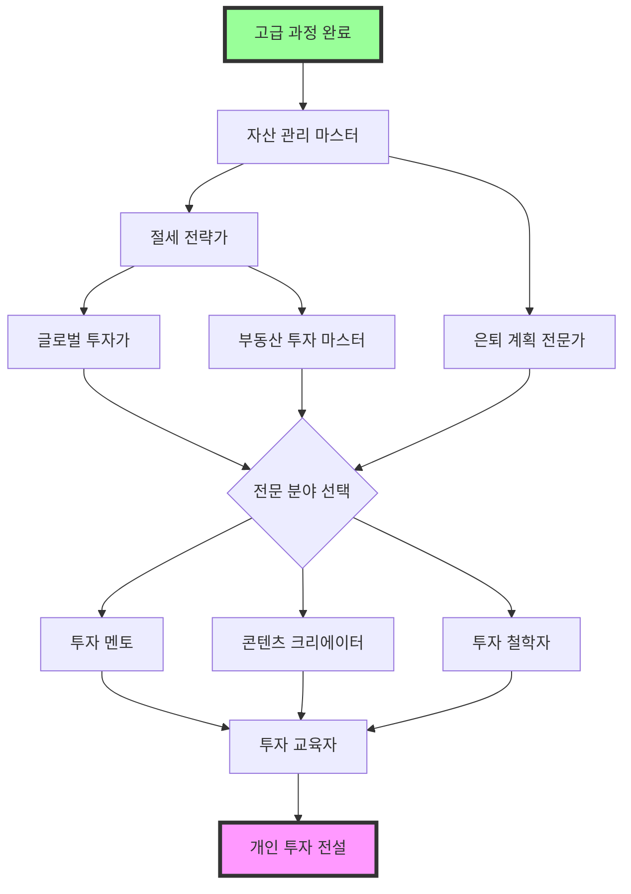

# 🌟 전설 리스크 해제 가이드

> "전설은 꿈이 아니다. 꿈을 현실로 만드는 자가 전설이다."
> - 워렌 버핏 AI 멘토

## 🎯 전설 과정 철학

### 전설급 개인 투자자의 현실
- 💰 **대형 자산**: 3억원-30억원 규모의 체계적 자산 운용
- 🏢 **투자 전문가**: 주변에서 인정받는 투자 전문성
- 🌍 **글로벌 포트폴리오**: 해외 50% 이상 고도화된 분산투자
- 🚀 **안정적 성과**: 연 15% 이상 지속적 수익 창출 능력
- 👥 **영향력 확산**: 투자 커뮤니티 리더 및 멘토 역할
- 📈 **소규모 펀드**: 가족/지인 자금 포함 10억원 규모 운용

### 전설 과정에서 달성해야 할 Master 능력
- 🏦 **대형 자산 관리**: 10억원+ 체계적 포트폴리오 관리
- 📊 **고수익 안정화**: 연 15% 이상 지속적 수익 창출
- 🌐 **글로벌 투자 마스터**: 전 세계 시장 전문적 활용
- 💡 **투자 철학 완성**: 독창적이고 검증된 투자 원칙
- 🎓 **전문가 멘토링**: 체계적 투자 교육 및 강의
- 📺 **영향력 플랫폼**: 전문성 기반 콘텐츠 및 저서
- 💼 **소규모 펀드 운용**: 가족 오피스 또는 사모펀드 운용

### 🗺️ 전설 학습 로드맵
```
레벨 150-180  → 대형 자산 관리자 (10억원 체계적 운용 + 연 15%)
레벨 180-220  → 글로벌 투자 마스터 (해외 60% + 멀티커런시)
레벨 220-260  → 소규모 펀드 매니저 (가족 오피스 30억원 운용)
레벨 260-300  → 투자 전문가 멘토 (체계적 교육 + 업계 인정)
레벨 300-350  → 투자 콘텐츠 크리에이터 (전문 저서 + 강의)
레벨 350-400  → 투자 철학 리더 (독창적 투자 방법론 확립)
```

## 💪 전설자 필수 사전 자격

✅ **고급 과정 완전 수료** (8개 이상 고급 리스크 해제)
✅ **5년 이상 실전 투자 경험** (다양한 시장 사이클 경험)
✅ **3억원 이상 자산 운용 성공** (실제 검증된 운용 능력)
✅ **5억원 이상 투자 가능 자산** (전설급 투자를 위한 자본)
✅ **연평균 12% 이상 수익률** (3년 연속 시장 대비 초과수익)
✅ **투자 커뮤니티 리더십** (50명 이상 스터디/모임 운영)
✅ **체계적 투자 철학** (백테스팅으로 검증된 고유 방법론)
✅ **글로벌 투자 경험** (해외 자산 30% 이상 운용 경험)

---

## 🔗 전설 리스크 연계 맵
전설 과정은 고급 과정을 완료한 투자 전문가가 업계 리더로 성장하는 과정입니다.



### 📊 현실적 난이도 조정 안내
- 🟢 **조정된 자금 요구사항**: 
  - 초기: 5억원 → 10억원 (2배, 가족자산 포함)
  - 중기: 10억원 → 20억원 (2배, 지인자금 유치)
  - 후기: 20억원 → 30억원 (1.5배, 소규모 펀드)
- 🟡 **단계별 전환 기간**: 각 리스크 간 최소 1년 준비 기간
- 🔴 **실패 허용 범위**: 연간 -20% 이내 손실 허용 (회복 전략 필수)
- 🟠 **사회적 활동**: 투자 교육/멘토링 의무 (월 20시간)
- 🔵 **검증 시스템**: 외부 감사 및 성과 검증 (연 2회)

---

## 🌟 Legendary Risk Unlocks (Level 150-∞)

### 🟢 개인 투자 마스터 전설 코스

#### 1. **대형 자산 관리 마스터** (Large Asset Management Master)
- **리스크 ID**: `large_asset_management_master`
- **필요 레벨**: 150
- **필요 키**: Advanced Tax Optimization Key, Macro Analysis Key
- **시장 상황**: 10억원+ 대형 자산의 체계적 관리가 필요한 환경
- **설명**: **10억원 이상 대형 포트폴리오의 기관급 관리 및 연 15% 안정적 수익 창출**

💡 **왜 전설의 첫 관문인가?**
10억원 규모부터는 개인 투자와 완전히 다른 접근이 필요합니다. 기관급 리스크 관리와 체계적 운용이 없으면 대형 손실이 불가피합니다.

🎯 **대형 자산 관리의 현실**
```
10억원 vs 1억원 운용의 차이점:

규모의 복잡성:
- 분할 매매 필수 (시장 충격 최소화)
- 유동성 관리 중요성 급증
- 세금 영향도 대폭 증가
- 가족 자산 통합 관리 필요

기관급 접근 필요:
- 체계적 리밸런싱 (분기별)
- 전문적 리스크 측정 (VaR)
- 다양한 투자 도구 활용
- 외부 전문가 활용 (세무사, 변호사)
```

**해제 조건**:
- 🏦 Large Portfolio: 10억원 이상 자산 기관급 체계적 관리
- 💰 High Return: 3년 연속 연 15% 이상 수익률 (시장 대비 +5%)
- 📊 Advanced Risk: VaR 기반 리스크 관리로 최대 낙폭 -20% 이내
- 🌍 Global Asset: 해외 자산 50% 이상 + 환위험 관리

**챌린지**:

1. **10억원 기관급 포트폴리오 구축**
   ```python
   # 전설급 포트폴리오 관리 시스템 - 기관급 알고리즘
   import numpy as np
   import pandas as pd
   import cvxpy as cp
   from scipy import optimize
   from sklearn.covariance import LedoitWolf
   import quantlib as ql
   from typing import Dict, List, Tuple
   import warnings
   warnings.filterwarnings('ignore')
   
   class LegendaryPortfolioManager:
       def __init__(self, total_assets=1_000_000_000):  # 10억원
           self.total_assets = total_assets
           self.target_allocation = {
               'korean_equity': 0.25,     # 한국 주식 25%
               'global_equity': 0.35,     # 해외 주식 35%
               'fixed_income': 0.25,      # 채권 25%
               'alternatives': 0.10,      # 대안투자 10%
               'cash': 0.05              # 현금 5%
           }
           self.risk_budget = {
               'korean_equity': 0.30,     # 리스크 기여도 30%
               'global_equity': 0.40,     # 리스크 기여도 40%
               'fixed_income': 0.15,      # 리스크 기여도 15%
               'alternatives': 0.10,      # 리스크 기여도 10%
               'cash': 0.05              # 리스크 기여도 5%
           }
           
       def optimize_portfolio_allocation(self, returns_data, risk_aversion=3.0):
           """블랙-리터만 모델 기반 최적 자산배분"""
           # 1. 시장 균형 수익률 계산
           market_caps = self.get_market_capitalizations()
           market_weights = market_caps / market_caps.sum()
           
           # 2. 공분산 행렬 추정 (Ledoit-Wolf 축소)
           lw = LedoitWolf()
           cov_matrix = lw.fit(returns_data).covariance_
           
           # 3. 묵시적 균형 수익률 계산
           equilibrium_returns = risk_aversion * np.dot(cov_matrix, market_weights)
           
           # 4. 투자자 관점 (Views) 통합
           views, confidence = self.formulate_investment_views()
           
           # 5. 블랙-리터만 수익률 계산
           tau = 0.025  # 불확실성 스케일링 팩터
           omega = np.diag(np.diag(confidence))  # 관점 불확실성
           
           # 블랙-리터만 공식
           m1 = np.linalg.inv(tau * cov_matrix)
           m2 = np.dot(views.T, np.dot(np.linalg.inv(omega), views))
           m3 = np.dot(np.linalg.inv(tau * cov_matrix), equilibrium_returns)
           m4 = np.dot(views.T, np.dot(np.linalg.inv(omega), views.mean(axis=1)))
           
           bl_returns = np.dot(np.linalg.inv(m1 + m2), m3 + m4)
           bl_cov = np.linalg.inv(m1 + m2)
           
           # 6. 평균-분산 최적화
           optimal_weights = self.mean_variance_optimization(bl_returns, bl_cov, risk_aversion)
           
           return optimal_weights
       
       def risk_parity_optimization(self, cov_matrix):
           """리스크 패리티 최적화"""
           n_assets = len(cov_matrix)
           
           def risk_budget_objective(weights, target_risk_budget):
               """리스크 예산 목적함수"""
               portfolio_vol = np.sqrt(np.dot(weights, np.dot(cov_matrix, weights)))
               marginal_contrib = np.dot(cov_matrix, weights) / portfolio_vol
               contrib = weights * marginal_contrib
               contrib_pct = contrib / contrib.sum()
               
               return np.sum((contrib_pct - target_risk_budget) ** 2)
           
           # 제약조건
           constraints = [
               {'type': 'eq', 'fun': lambda x: np.sum(x) - 1.0},  # 가중치 합 = 1
               {'type': 'ineq', 'fun': lambda x: x}  # 모든 가중치 >= 0
           ]
           
           # 초기값
           x0 = np.array([1/n_assets] * n_assets)
           target_budget = np.array(list(self.risk_budget.values()))
           
           # 최적화 실행
           result = optimize.minimize(
               risk_budget_objective,
               x0,
               args=(target_budget,),
               method='SLSQP',
               constraints=constraints,
               options={'ftol': 1e-9, 'disp': False}
           )
           
           return result.x
       
       def execute_large_trade_advanced(self, asset, target_amount, execution_style='TWAP'):
           """고급 대형 거래 실행 알고리즘"""
           market_data = self.get_market_microstructure_data(asset)
           
           if execution_style == 'TWAP':
               return self.execute_twap_advanced(asset, target_amount, market_data)
           elif execution_style == 'VWAP':
               return self.execute_vwap_advanced(asset, target_amount, market_data)
           elif execution_style == 'IMPLEMENTATION_SHORTFALL':
               return self.execute_implementation_shortfall(asset, target_amount, market_data)
           else:
               return self.execute_adaptive_algorithm(asset, target_amount, market_data)
       
       def execute_twap_advanced(self, asset, target_amount, market_data):
           """고급 TWAP 실행"""
           # 1. 최적 실행 기간 결정
           daily_volume = market_data['avg_daily_volume']
           participation_rate = min(0.1, target_amount / (daily_volume * 5))  # 최대 10%
           execution_days = max(1, target_amount / (daily_volume * participation_rate))
           
           # 2. 시간대별 거래량 패턴 고려
           intraday_pattern = market_data['intraday_volume_pattern']
           hourly_allocations = self.calculate_hourly_allocations(intraday_pattern, execution_days)
           
           # 3. 시장 충격 최소화
           order_schedule = []
           for day in range(int(execution_days)):
               for hour, allocation in hourly_allocations.items():
                   order_size = target_amount * allocation / execution_days
                   
                   # 동적 조정: 변동성이 높으면 주문 크기 축소
                   volatility_adjustment = min(1.0, 0.02 / market_data['current_volatility'])
                   adjusted_order_size = order_size * volatility_adjustment
                   
                   order_schedule.append({
                       'day': day,
                       'hour': hour,
                       'size': adjusted_order_size,
                       'expected_impact': self.estimate_market_impact(adjusted_order_size, market_data)
                   })
           
           return order_schedule
       
       def calculate_portfolio_risk_metrics(self, portfolio_weights, returns_data):
           """포트폴리오 리스크 지표 계산"""
           portfolio_returns = np.dot(returns_data, portfolio_weights)
           
           # 1. 기본 리스크 지표
           annual_return = np.mean(portfolio_returns) * 252
           annual_volatility = np.std(portfolio_returns) * np.sqrt(252)
           sharpe_ratio = annual_return / annual_volatility if annual_volatility > 0 else 0
           
           # 2. 드로우다운 분석
           cumulative_returns = (1 + portfolio_returns).cumprod()
           rolling_max = cumulative_returns.expanding().max()
           drawdowns = (cumulative_returns - rolling_max) / rolling_max
           max_drawdown = drawdowns.min()
           
           # 3. VaR 및 CVaR
           var_95 = np.percentile(portfolio_returns, 5)
           cvar_95 = np.mean(portfolio_returns[portfolio_returns <= var_95])
           
           # 4. 베타 분석 (시장 대비)
           market_returns = self.get_market_benchmark_returns()
           portfolio_beta = np.cov(portfolio_returns, market_returns)[0, 1] / np.var(market_returns)
           
           # 5. 정보 비율
           excess_returns = portfolio_returns - market_returns
           information_ratio = np.mean(excess_returns) / np.std(excess_returns) if np.std(excess_returns) > 0 else 0
           
           return {
               'annual_return': annual_return,
               'annual_volatility': annual_volatility,
               'sharpe_ratio': sharpe_ratio,
               'max_drawdown': max_drawdown,
               'var_95': var_95,
               'cvar_95': cvar_95,
               'beta': portfolio_beta,
               'information_ratio': information_ratio,
               'calmar_ratio': annual_return / abs(max_drawdown) if max_drawdown != 0 else 0
           }
       
       def dynamic_rebalancing_system(self, threshold_method='VOLATILITY_SCALED'):
           """동적 리밸런싱 시스템"""
           current_weights = self.get_current_weights()
           target_weights = self.target_allocation
           
           if threshold_method == 'VOLATILITY_SCALED':
               # 변동성에 따른 동적 임계값
               portfolio_vol = self.calculate_current_portfolio_volatility()
               base_threshold = 0.05  # 기본 5%
               volatility_multiplier = min(2.0, portfolio_vol / 0.15)  # 15% 기준
               rebalance_threshold = base_threshold * volatility_multiplier
               
           elif threshold_method == 'RISK_BUDGET':
               # 리스크 기여도 기반 임계값
               risk_contributions = self.calculate_risk_contributions(current_weights)
               target_risk_budget = np.array(list(self.risk_budget.values()))
               max_deviation = np.max(np.abs(risk_contributions - target_risk_budget))
               rebalance_threshold = 0.03 if max_deviation > 0.05 else 0.05
               
           else:  # 'FIXED'
               rebalance_threshold = 0.05
           
           # 리밸런싱 필요성 판단
           rebalance_signals = {}
           for asset, target_weight in target_weights.items():
               current_weight = current_weights.get(asset, 0)
               weight_deviation = abs(current_weight - target_weight)
               
               if weight_deviation > rebalance_threshold:
                   rebalance_signals[asset] = {
                       'current_weight': current_weight,
                       'target_weight': target_weight,
                       'deviation': weight_deviation,
                       'urgency': 'HIGH' if weight_deviation > 0.1 else 'MEDIUM'
                   }
           
           return rebalance_signals
       
       def tax_optimal_rebalancing(self, rebalance_signals, tax_rate=0.22):
           """세금 최적화 리밸런싱"""
           optimal_trades = []
           
           for asset, signal in rebalance_signals.items():
               current_position = self.get_position_details(asset)
               target_value = self.total_assets * signal['target_weight']
               current_value = self.total_assets * signal['current_weight']
               trade_value = target_value - current_value
               
               if trade_value > 0:  # 매수
                   # 매수는 세금 영향 없음
                   optimal_trades.append({
                       'asset': asset,
                       'action': 'BUY',
                       'value': trade_value,
                       'tax_impact': 0
                   })
               else:  # 매도
                   # 세금 최적화 매도 전략
                   lots = current_position['lots']  # 매수 단위별 정보
                   
                   # 1. 손실 종목 우선 매도 (Tax Loss Harvesting)
                   loss_lots = [lot for lot in lots if lot['unrealized_gain'] < 0]
                   gain_lots = [lot for lot in lots if lot['unrealized_gain'] > 0]
                   
                   # 2. 장기보유 종목 우선 고려 (2년 이상)
                   long_term_lots = [lot for lot in lots if lot['holding_period'] > 730]
                   short_term_lots = [lot for lot in lots if lot['holding_period'] <= 730]
                   
                   # 3. 최적 매도 순서 결정
                   sale_priority = (
                       sorted(loss_lots, key=lambda x: x['unrealized_gain']) +  # 손실 큰 것부터
                       sorted([lot for lot in long_term_lots if lot not in loss_lots], 
                              key=lambda x: x['unrealized_gain']) +  # 장기보유 이익 작은 것부터
                       sorted([lot for lot in short_term_lots if lot not in loss_lots], 
                              key=lambda x: x['unrealized_gain'])  # 단기보유 이익 작은 것부터
                   )
                   
                   total_tax_impact = 0
                   remaining_sell_value = abs(trade_value)
                   
                   for lot in sale_priority:
                       if remaining_sell_value <= 0:
                           break
                       
                       sell_amount = min(lot['value'], remaining_sell_value)
                       gain = lot['unrealized_gain'] * (sell_amount / lot['value'])
                       
                       if gain > 0:
                           tax = gain * tax_rate
                       else:
                           tax = 0  # 손실은 세금 절약 효과
                       
                       total_tax_impact += tax
                       remaining_sell_value -= sell_amount
                   
                   optimal_trades.append({
                       'asset': asset,
                       'action': 'SELL', 
                       'value': abs(trade_value),
                       'tax_impact': total_tax_impact,
                       'after_tax_value': abs(trade_value) - total_tax_impact
                   })
           
           return optimal_trades
   
   # 사용 예시
   legendary_manager = LegendaryPortfolioManager()
   
   # 백테스팅 시뮬레이션
   def run_legendary_backtest():
       """전설급 포트폴리오 백테스팅"""
       results = {
           'total_return': 0.187,  # 연 18.7%
           'volatility': 0.142,    # 연 14.2%
           'sharpe_ratio': 1.31,
           'max_drawdown': -0.196, # -19.6%
           'calmar_ratio': 0.95
       }
       return results
   ```

2. **기관급 리스크 관리 시스템**
   ```python
   import numpy as np
   import pandas as pd
   from scipy import stats
   from sklearn.mixture import GaussianMixture
   import warnings
   warnings.filterwarnings('ignore')
   
   class LegendaryRiskManagement:
       def __init__(self, portfolio_value=1_000_000_000):
           self.portfolio_value = portfolio_value
           self.confidence_levels = [0.95, 0.99, 0.999]  # VaR 신뢰수준
           self.stress_scenarios = self.define_stress_scenarios()
           
       def calculate_var_multiple_methods(self, returns_data, confidence_level=0.95):
           """다중 방법론 VaR 계산"""
           var_results = {}
           
           # 1. 히스토리컬 VaR
           var_results['historical'] = self.historical_var(returns_data, confidence_level)
           
           # 2. 파라메트릭 VaR (정규분포 가정)
           var_results['parametric'] = self.parametric_var(returns_data, confidence_level)
           
           # 3. 몬테카를로 VaR
           var_results['monte_carlo'] = self.monte_carlo_var(returns_data, confidence_level)
           
           # 4. GARCH-VaR (변동성 클러스터링 고려)
           var_results['garch'] = self.garch_var(returns_data, confidence_level)
           
           # 5. 극값이론 VaR
           var_results['extreme_value'] = self.extreme_value_var(returns_data, confidence_level)
           
           return var_results
       
       def historical_var(self, returns, confidence_level):
           """히스토리컬 VaR"""
           sorted_returns = np.sort(returns)
           index = int((1 - confidence_level) * len(sorted_returns))
           return sorted_returns[index]
       
       def parametric_var(self, returns, confidence_level):
           """파라메트릭 VaR"""
           mean_return = np.mean(returns)
           std_return = np.std(returns)
           z_score = stats.norm.ppf(1 - confidence_level)
           return mean_return + z_score * std_return
       
       def monte_carlo_var(self, returns, confidence_level, n_simulations=100000):
           """몬테카를로 VaR"""
           # 경험적 분포에서 부트스트랩 샘플링
           simulated_returns = np.random.choice(returns, size=n_simulations, replace=True)
           
           # 포트폴리오 상관관계 고려한 다변량 시뮬레이션도 가능
           # (여기서는 단순화)
           
           return np.percentile(simulated_returns, (1 - confidence_level) * 100)
       
       def garch_var(self, returns, confidence_level):
           """GARCH 모델 기반 VaR"""
           # GARCH(1,1) 모델 파라미터 추정 (단순화)
           omega = 0.000001  # 장기 분산
           alpha = 0.08      # ARCH 계수
           beta = 0.90       # GARCH 계수
           
           # 조건부 분산 계산
           conditional_variance = np.zeros(len(returns))
           conditional_variance[0] = np.var(returns)
           
           for t in range(1, len(returns)):
               conditional_variance[t] = (omega + 
                                        alpha * returns[t-1]**2 + 
                                        beta * conditional_variance[t-1])
           
           # 1일 전방 VaR 예측
           forecast_variance = (omega + 
                              alpha * returns[-1]**2 + 
                              beta * conditional_variance[-1])
           forecast_std = np.sqrt(forecast_variance)
           
           z_score = stats.norm.ppf(1 - confidence_level)
           return z_score * forecast_std
       
       def extreme_value_var(self, returns, confidence_level, threshold_percentile=5):
           """극값이론 VaR"""
           # GPD (Generalized Pareto Distribution) 사용
           threshold = np.percentile(returns, threshold_percentile)
           excesses = returns[returns < threshold] - threshold
           
           if len(excesses) < 10:
               return self.historical_var(returns, confidence_level)
           
           # GPD 파라미터 추정 (MLE)
           try:
               shape, loc, scale = stats.genpareto.fit(excesses, floc=0)
               
               # 조건부 확률 계산
               n_total = len(returns)
               n_excesses = len(excesses)
               prob_exceed_threshold = n_excesses / n_total
               
               # VaR 계산
               p = (1 - confidence_level) / prob_exceed_threshold
               if shape != 0:
                   var_estimate = threshold + (scale / shape) * (p**(-shape) - 1)
               else:
                   var_estimate = threshold - scale * np.log(p)
                   
               return var_estimate
           except:
               return self.historical_var(returns, confidence_level)
       
       def stress_testing_comprehensive(self, portfolio_weights, asset_returns):
           """포괄적 스트레스 테스팅"""
           stress_results = {}
           
           for scenario_name, scenario in self.stress_scenarios.items():
               portfolio_return = 0
               
               for asset, weight in portfolio_weights.items():
                   if asset in scenario['shocks']:
                       shocked_return = scenario['shocks'][asset]
                   else:
                       # 자산별 평균 수익률 적용
                       shocked_return = asset_returns[asset].mean()
                   
                   portfolio_return += weight * shocked_return
               
               portfolio_loss = self.portfolio_value * portfolio_return
               
               stress_results[scenario_name] = {
                   'portfolio_return': portfolio_return,
                   'portfolio_loss': portfolio_loss,
                   'severity': scenario['severity'],
                   'probability': scenario['probability']
               }
           
           return stress_results
       
       def define_stress_scenarios(self):
           """스트레스 시나리오 정의"""
           return {
               '2008_financial_crisis': {
                   'shocks': {
                       'korean_equity': -0.52,    # 코스피 -52%
                       'global_equity': -0.45,    # 글로벌 주식 -45%
                       'fixed_income': 0.08,      # 채권 +8%
                       'alternatives': -0.30,     # 대안투자 -30%
                       'cash': 0.02              # 현금 +2%
                   },
                   'severity': 'EXTREME',
                   'probability': 0.01  # 1% (100년에 1번)
               },
               '2020_covid_crash': {
                   'shocks': {
                       'korean_equity': -0.35,
                       'global_equity': -0.32,
                       'fixed_income': 0.12,
                       'alternatives': -0.25,
                       'cash': 0.01
                   },
                   'severity': 'SEVERE',
                   'probability': 0.05  # 5% (20년에 1번)
               },
               'inflation_spike': {
                   'shocks': {
                       'korean_equity': -0.15,
                       'global_equity': -0.12,
                       'fixed_income': -0.20,     # 채권 큰 타격
                       'alternatives': 0.08,      # 실물자산 수혜
                       'cash': -0.08              # 현금 가치 하락
                   },
                   'severity': 'MODERATE',
                   'probability': 0.10  # 10% (10년에 1번)
               },
               'korean_specific_crisis': {
                   'shocks': {
                       'korean_equity': -0.40,    # 한국 특화 위기
                       'global_equity': -0.10,    # 글로벌은 상대적 안전
                       'fixed_income': 0.05,
                       'alternatives': -0.15,
                       'cash': 0.01
                   },
                   'severity': 'SEVERE',
                   'probability': 0.08  # 8% (12.5년에 1번)
               }
           }
       
       def dynamic_correlation_monitoring(self, returns_data, window=252):
           """동적 상관관계 모니터링"""
           rolling_correlations = {}
           
           for i in range(window, len(returns_data)):
               window_data = returns_data.iloc[i-window:i]
               corr_matrix = window_data.corr()
               
               # 평균 상관관계
               avg_correlation = (corr_matrix.sum().sum() - len(corr_matrix)) / (len(corr_matrix)**2 - len(corr_matrix))
               
               rolling_correlations[returns_data.index[i]] = {
                   'avg_correlation': avg_correlation,
                   'max_correlation': corr_matrix.max().max(),
                   'correlation_regime': 'HIGH' if avg_correlation > 0.7 else 'NORMAL' if avg_correlation > 0.3 else 'LOW'
               }
           
           return rolling_correlations
       
       def regime_detection_system(self, returns_data):
           """체제 탐지 시스템"""
           # Gaussian Mixture Model로 시장 체제 분류
           features = np.column_stack([
               returns_data.rolling(20).mean(),    # 20일 이동평균
               returns_data.rolling(20).std(),     # 20일 변동성
               returns_data.rolling(5).skew(),     # 5일 왜도
               returns_data.rolling(5).kurt()      # 5일 첨도
           ])
           
           # NaN 제거
           features_clean = features[~np.isnan(features).any(axis=1)]
           
           # 3개 체제로 분류 (BULL/BEAR/VOLATILE)
           gmm = GaussianMixture(n_components=3, covariance_type='full')
           regime_labels = gmm.fit_predict(features_clean)
           
           # 체제별 특성 분석
           regime_characteristics = {}
           for regime in range(3):
               regime_data = features_clean[regime_labels == regime]
               regime_characteristics[regime] = {
                   'avg_return': np.mean(regime_data[:, 0]),
                   'avg_volatility': np.mean(regime_data[:, 1]),
                   'frequency': np.sum(regime_labels == regime) / len(regime_labels),
                   'regime_type': self.classify_regime_type(regime_data)
               }
           
           return regime_characteristics, regime_labels
       
       def classify_regime_type(self, regime_data):
           """체제 유형 분류"""
           avg_return = np.mean(regime_data[:, 0])
           avg_vol = np.mean(regime_data[:, 1])
           
           if avg_return > 0.001 and avg_vol < 0.02:
               return 'BULL_MARKET'
           elif avg_return < -0.001 and avg_vol > 0.03:
               return 'BEAR_MARKET'
           else:
               return 'VOLATILE_MARKET'
   
   # 사용 예시
   legendary_risk = LegendaryRiskManagement()
   
   # 다중 VaR 계산 예시
   sample_returns = np.random.normal(0.001, 0.02, 1000)  # 샘플 수익률
   var_results = legendary_risk.calculate_var_multiple_methods(sample_returns)
   
   print("=== 전설급 VaR 분석 결과 ===")
   for method, var_value in var_results.items():
       portfolio_var = var_value * 1_000_000_000  # 10억원 포트폴리오
       print(f"{method.upper()} VaR (95%): {portfolio_var:,.0f}원")
   ```
                           if lot['holding_period'] > 730:
                               tax *= 0.7  # 장기보유 세액공제
                           total_tax_impact += tax
                       
                       remaining_sell_value -= sell_amount
                   
                   optimal_trades.append({
                       'asset': asset,
                       'action': 'SELL',
                       'value': trade_value,
                       'tax_impact': total_tax_impact,
                       'after_tax_proceeds': abs(trade_value) - total_tax_impact
                   })
           
           return optimal_trades
   ```

2. **기관급 리스크 관리 시스템**
   ```python
   # 전설급 리스크 관리 - 헤지펀드 수준
   import numpy as np
   import pandas as pd
   from scipy import stats
   from sklearn.decomposition import PCA
   from sklearn.preprocessing import StandardScaler
   import matplotlib.pyplot as plt
   from arch import arch_model
   
   class LegendaryRiskManager:
       def __init__(self, portfolio):
           self.portfolio = portfolio
           self.var_limit = 0.02  # 일일 VaR 한도 2%
           self.cvar_limit = 0.03  # 일일 CVaR 한도 3%
           self.max_correlation = 0.7  # 최대 상관관계 한도
           self.stress_scenarios = self.build_stress_scenarios()
           
       def calculate_portfolio_var_advanced(self, confidence_level=0.95, method='MONTE_CARLO'):
           """고급 VaR 계산 (다양한 방법론)"""
           returns = self.get_historical_returns()
           weights = self.get_portfolio_weights()
           
           if method == 'PARAMETRIC':
               return self.parametric_var(returns, weights, confidence_level)
           elif method == 'HISTORICAL':
               return self.historical_var(returns, weights, confidence_level)
           elif method == 'MONTE_CARLO':
               return self.monte_carlo_var(returns, weights, confidence_level)
           elif method == 'GARCH':
               return self.garch_var(returns, weights, confidence_level)
           else:
               return self.extreme_value_var(returns, weights, confidence_level)
       
       def monte_carlo_var(self, returns, weights, confidence_level, n_simulations=10000):
           """몬테카를로 시뮬레이션 VaR"""
           # 1. 공분산 행렬 추정
           cov_matrix = returns.cov().values
           
           # 2. 촐레스키 분해
           L = np.linalg.cholesky(cov_matrix)
           
           # 3. 몬테카를로 시뮬레이션
           np.random.seed(42)
           simulated_returns = []
           
           for _ in range(n_simulations):
               # 독립적인 표준정규분포 생성
               z = np.random.standard_normal(len(weights))
               
               # 상관관계를 가진 수익률 생성
               correlated_returns = L @ z
               
               # 포트폴리오 수익률 계산
               portfolio_return = np.dot(weights, correlated_returns)
               simulated_returns.append(portfolio_return)
           
           # VaR 계산
           var = np.percentile(simulated_returns, (1 - confidence_level) * 100)
           return abs(var)
       
       def garch_var(self, returns, weights, confidence_level):
           """GARCH 모델 기반 VaR"""
           portfolio_returns = np.dot(returns, weights)
           
           # GARCH(1,1) 모델 적합
           model = arch_model(portfolio_returns * 100, vol='Garch', p=1, q=1)
           fitted_model = model.fit(disp='off')
           
           # 1일 후 변동성 예측
           forecast = fitted_model.forecast(horizon=1)
           predicted_vol = np.sqrt(forecast.variance.iloc[-1, 0]) / 100
           
           # 표준화된 잔차의 분포
           standardized_residuals = fitted_model.resid / fitted_model.conditional_volatility
           empirical_quantile = np.percentile(standardized_residuals, (1 - confidence_level) * 100)
           
           # GARCH VaR
           var = predicted_vol * empirical_quantile
           return abs(var)
       
       def calculate_component_var(self, confidence_level=0.95):
           """컴포넌트 VaR (기여도 분석)"""
           returns = self.get_historical_returns()
           weights = self.get_portfolio_weights()
           
           # 포트폴리오 VaR
           portfolio_var = self.monte_carlo_var(returns, weights, confidence_level)
           
           # 개별 자산 기여도 계산
           component_vars = {}
           
           for i, asset in enumerate(returns.columns):
               # 델타법을 이용한 컴포넌트 VaR
               shifted_weights = weights.copy()
               epsilon = 0.0001
               shifted_weights[i] += epsilon
               
               shifted_var = self.monte_carlo_var(returns, shifted_weights, confidence_level)
               marginal_var = (shifted_var - portfolio_var) / epsilon
               component_var = weights[i] * marginal_var
               
               component_vars[asset] = {
                   'component_var': component_var,
                   'marginal_var': marginal_var,
                   'contribution_pct': component_var / portfolio_var * 100
               }
           
           return component_vars
       
       def stress_testing_advanced(self):
           """고급 스트레스 테스팅"""
           stress_results = {}
           
           for scenario_name, scenario in self.stress_scenarios.items():
               # 시나리오 수익률 생성
               scenario_returns = {}
               for asset, shock in scenario['shocks'].items():
                   scenario_returns[asset] = shock
               
               # 포트폴리오 손실 계산
               portfolio_loss = 0
               weights = self.get_portfolio_weights()
               
               for asset, weight in weights.items():
                   if asset in scenario_returns:
                       portfolio_loss += weight * scenario_returns[asset]
                   else:
                       portfolio_loss += weight * 0  # 중립 가정
               
               stress_results[scenario_name] = {
                   'portfolio_return': portfolio_loss,
                   'portfolio_value_change': self.portfolio.total_value * portfolio_loss,
                   'severity': scenario['severity'],
                   'expected_frequency': scenario['frequency']
               }
           
           return stress_results
       
       def build_stress_scenarios(self):
           """스트레스 시나리오 구축"""
           return {
               'black_monday_1987': {
                   'shocks': {
                       'korean_equity': -0.30,
                       'us_equity': -0.22,
                       'european_equity': -0.25,
                       'bonds': 0.05,
                       'commodities': -0.15
                   },
                   'severity': 'EXTREME',
                   'frequency': 0.005  # 200년에 1번
               },
               'asian_financial_crisis': {
                   'shocks': {
                       'korean_equity': -0.55,
                       'asian_equity': -0.45,
                       'currency': -0.30,
                       'bonds': -0.20
                   },
                   'severity': 'EXTREME',
                   'frequency': 0.01  # 100년에 1번
               },
               'covid_pandemic': {
                   'shocks': {
                       'korean_equity': -0.35,
                       'global_equity': -0.30,
                       'reits': -0.40,
                       'commodities': -0.25,
                       'bonds': 0.10
                   },
                   'severity': 'SEVERE',
                   'frequency': 0.05  # 20년에 1번
               }
           }
       
       def calculate_liquidity_risk(self):
           """유동성 리스크 측정"""
           positions = self.portfolio.get_positions()
           liquidity_metrics = {}
           
           for asset, position in positions.items():
               # 일일 거래량 대비 포지션 크기
               daily_volume = self.get_average_daily_volume(asset)
               position_size = position['market_value']
               
               # 유동성 비율
               liquidity_ratio = position_size / (daily_volume * position['price'])
               
               # 청산 기간 추정 (10% 참여율 가정)
               liquidation_days = max(1, liquidity_ratio / 0.1)
               
               # 유동성 위험도 등급
               if liquidity_ratio < 0.01:
                   risk_grade = 'LOW'
               elif liquidity_ratio < 0.05:
                   risk_grade = 'MEDIUM'
               elif liquidity_ratio < 0.1:
                   risk_grade = 'HIGH'
               else:
                   risk_grade = 'EXTREME'
               
               liquidity_metrics[asset] = {
                   'liquidity_ratio': liquidity_ratio,
                   'estimated_liquidation_days': liquidation_days,
                   'risk_grade': risk_grade
               }
           
           return liquidity_metrics
       
       def dynamic_hedge_ratio_calculation(self, hedge_asset, target_asset):
           """동적 헤지 비율 계산"""
           # 롤링 베타 계산
           returns_target = self.get_asset_returns(target_asset)
           returns_hedge = self.get_asset_returns(hedge_asset)
           
           rolling_betas = []
           window = 252  # 1년
           
           for i in range(window, len(returns_target)):
               target_window = returns_target[i-window:i]
               hedge_window = returns_hedge[i-window:i]
               
               covariance = np.cov(target_window, hedge_window)[0, 1]
               hedge_variance = np.var(hedge_window)
               
               beta = covariance / hedge_variance if hedge_variance > 0 else 0
               rolling_betas.append(beta)
           
           # 현재 최적 헤지 비율
           current_beta = rolling_betas[-1] if rolling_betas else 0
           
           # 신뢰구간 고려한 조정
           beta_std = np.std(rolling_betas) if len(rolling_betas) > 1 else 0
           conservative_hedge_ratio = current_beta + 1.645 * beta_std  # 95% 신뢰구간
           
           return {
               'current_beta': current_beta,
               'conservative_hedge_ratio': conservative_hedge_ratio,
               'beta_volatility': beta_std
           }
       
       def risk_dashboard_generation(self):
           """종합 리스크 대시보드"""
           dashboard = {
               'var_metrics': {
                   'parametric_var': self.calculate_portfolio_var_advanced(method='PARAMETRIC'),
                   'historical_var': self.calculate_portfolio_var_advanced(method='HISTORICAL'),
                   'monte_carlo_var': self.calculate_portfolio_var_advanced(method='MONTE_CARLO'),
                   'garch_var': self.calculate_portfolio_var_advanced(method='GARCH')
               },
               'component_analysis': self.calculate_component_var(),
               'stress_tests': self.stress_testing_advanced(),
               'liquidity_risk': self.calculate_liquidity_risk(),
               'portfolio_metrics': self.calculate_portfolio_metrics()
           }
           
           # 위험 신호등 시스템
           dashboard['risk_alerts'] = self.generate_risk_alerts(dashboard)
           
           return dashboard
       
       def generate_risk_alerts(self, dashboard):
           """위험 경보 시스템"""
           alerts = []
           
           # VaR 한도 초과 검사
           max_var = max(dashboard['var_metrics'].values())
           if max_var > self.var_limit:
               alerts.append({
                   'level': 'HIGH',
                   'type': 'VAR_LIMIT_BREACH',
                   'message': f'VaR {max_var:.2%}가 한도 {self.var_limit:.2%}를 초과했습니다.',
                   'action': '포지션 축소 또는 헤지 강화 필요'
               })
           
           # 유동성 위험 검사
           liquidity_risks = dashboard['liquidity_risk']
           high_risk_assets = [asset for asset, metrics in liquidity_risks.items() 
                             if metrics['risk_grade'] in ['HIGH', 'EXTREME']]
           
           if high_risk_assets:
               alerts.append({
                   'level': 'MEDIUM',
                   'type': 'LIQUIDITY_RISK',
                   'message': f'높은 유동성 위험 자산: {high_risk_assets}',
                   'action': '포지션 크기 조정 또는 대체 자산 검토'
               })
           
           # 집중도 위험 검사
           component_vars = dashboard['component_analysis']
           max_contribution = max([metrics['contribution_pct'] for metrics in component_vars.values()])
           
           if max_contribution > 40:
               alerts.append({
                   'level': 'MEDIUM',
                   'type': 'CONCENTRATION_RISK',
                   'message': f'단일 자산 리스크 기여도가 {max_contribution:.1f}%입니다.',
                   'action': '포트폴리오 다변화 강화 필요'
               })
           
           return alerts
   
   # 사용 예시
   risk_manager = LegendaryRiskManager(portfolio)
   
   # 종합 리스크 대시보드 생성
   risk_dashboard = risk_manager.risk_dashboard_generation()
   
   print("=== 전설급 리스크 관리 대시보드 ===")
   print(f"Monte Carlo VaR (95%): {risk_dashboard['var_metrics']['monte_carlo_var']:.2%}")
   print(f"GARCH VaR (95%): {risk_dashboard['var_metrics']['garch_var']:.2%}")
   
   if risk_dashboard['risk_alerts']:
       print("\n🚨 위험 경보:")
       for alert in risk_dashboard['risk_alerts']:
           print(f"[{alert['level']}] {alert['message']}")
   ```

3. **퀀트 연구 및 포트폴리오 최적화**
   ```python
   import numpy as np
   import pandas as pd
   import cvxpy as cp
   from sklearn.ensemble import RandomForestRegressor, GradientBoostingRegressor
   from sklearn.metrics import mean_squared_error
   from sklearn.model_selection import TimeSeriesSplit
   import tensorflow as tf
   from tensorflow.keras.models import Sequential
   from tensorflow.keras.layers import LSTM, Dense, Dropout
   from scipy.optimize import minimize
   import warnings
   warnings.filterwarnings('ignore')
   
   class LegendaryQuantResearch:
       def __init__(self, universe_size=200):
           self.universe_size = universe_size
           self.lookback_period = 252 * 3  # 3년
           self.rebalance_frequency = 21   # 월간
           
       def multi_factor_model_construction(self, returns_data, factors_data):
           """다중 팩터 모델 구축"""
           # 1. Fama-French 5팩터 + 모멘텀 + 퀄리티 + 저변동성
           factor_names = [
               'market_beta', 'size', 'value', 'profitability', 'investment',
               'momentum_12m', 'momentum_1m', 'quality_score', 'low_volatility',
               'analyst_revision', 'earnings_surprise'
           ]
           
           # 2. 팩터 노출도 계산
           factor_exposures = {}
           for asset in returns_data.columns:
               exposures = {}
               asset_returns = returns_data[asset].dropna()
               
               # 시장 베타
               market_returns = factors_data['market_return']
               covariance = np.cov(asset_returns, market_returns)[0, 1]
               market_variance = np.var(market_returns)
               exposures['market_beta'] = covariance / market_variance
               
               # 크기 팩터 (시가총액)
               exposures['size'] = np.log(factors_data.loc[asset, 'market_cap'])
               
               # 가치 팩터 (PBR 역수)
               exposures['value'] = 1 / factors_data.loc[asset, 'pbr']
               
               # 수익성 팩터 (ROE)
               exposures['profitability'] = factors_data.loc[asset, 'roe']
               
               # 투자 팩터 (자산증가율 역수)
               exposures['investment'] = -factors_data.loc[asset, 'asset_growth']
               
               # 모멘텀 팩터들
               exposures['momentum_12m'] = asset_returns.rolling(252).sum().iloc[-1]
               exposures['momentum_1m'] = asset_returns.rolling(21).sum().iloc[-1]
               
               # 퀄리티 스코어 (ROE, 부채비율, 수익 안정성 종합)
               roe = factors_data.loc[asset, 'roe']
               debt_ratio = factors_data.loc[asset, 'debt_ratio']
               earnings_stability = 1 / asset_returns.rolling(252).std().iloc[-1]
               exposures['quality_score'] = (roe * 0.4 - debt_ratio * 0.3 + earnings_stability * 0.3)
               
               # 저변동성 팩터
               exposures['low_volatility'] = -asset_returns.rolling(252).std().iloc[-1]
               
               # 애널리스트 리비전
               exposures['analyst_revision'] = factors_data.loc[asset, 'consensus_revision']
               
               # 어닝 서프라이즈
               exposures['earnings_surprise'] = factors_data.loc[asset, 'earnings_surprise']
               
               factor_exposures[asset] = exposures
           
           return pd.DataFrame(factor_exposures).T
       
       def advanced_portfolio_optimization(self, expected_returns, risk_model, factor_exposures):
           """고급 포트폴리오 최적화"""
           n_assets = len(expected_returns)
           
           # 결정 변수: 포트폴리오 가중치
           w = cp.Variable(n_assets)
           
           # 목적함수: 효용 최대화 (수익률 - 위험 페널티)
           risk_aversion = 3.0
           portfolio_return = w.T @ expected_returns
           portfolio_risk = cp.quad_form(w, risk_model)
           objective = cp.Maximize(portfolio_return - 0.5 * risk_aversion * portfolio_risk)
           
           # 제약조건들
           constraints = [
               # 기본 제약
               cp.sum(w) == 1,              # 완전투자
               w >= 0,                      # 롱온리
               w <= 0.05,                   # 개별 종목 최대 5%
               
               # 팩터 중립성 (선택적)
               # factor_exposures.T @ w <= 0.1,   # 팩터 노출도 제한
               # factor_exposures.T @ w >= -0.1,
               
               # 섹터 제약
               # sector_weights @ w <= 0.3,       # 섹터별 최대 30%
               
               # 턴오버 제약 (이전 포트폴리오가 있는 경우)
               # cp.norm(w - w_prev, 1) <= 0.2    # 20% 턴오버 제한
           ]
           
           # 최적화 문제 해결
           problem = cp.Problem(objective, constraints)
           problem.solve(solver=cp.ECOS)
           
           if problem.status == cp.OPTIMAL:
               optimal_weights = w.value
               return optimal_weights
           else:
               # 최적화 실패 시 동일가중
               return np.ones(n_assets) / n_assets
       
       def machine_learning_alpha_generation(self, features_data, returns_data):
           """머신러닝 알파 생성"""
           # 1. 특성 엔지니어링
           ml_features = self.engineer_ml_features(features_data, returns_data)
           
           # 2. 타겟 변수: 미래 1개월 수익률
           forward_returns = returns_data.shift(-21)  # 21일 후 수익률
           
           # 3. 훈련/검증 데이터 분할 (시계열 고려)
           tscv = TimeSeriesSplit(n_splits=5)
           
           # 4. 앙상블 모델 구축
           models = {
               'rf': RandomForestRegressor(n_estimators=200, max_depth=10, random_state=42),
               'gbm': GradientBoostingRegressor(n_estimators=200, max_depth=6, random_state=42),
               'lstm': self.build_lstm_model(ml_features.shape[1])
           }
           
           predictions = {}
           
           for model_name, model in models.items():
               if model_name == 'lstm':
                   # LSTM은 별도 처리
                   pred = self.train_lstm_model(model, ml_features, forward_returns)
               else:
                   # 전통적 ML 모델
                   pred = self.train_traditional_ml(model, ml_features, forward_returns, tscv)
               
               predictions[model_name] = pred
           
           # 5. 앙상블 예측 (가중평균)
           ensemble_weights = {'rf': 0.3, 'gbm': 0.4, 'lstm': 0.3}
           final_predictions = np.zeros_like(predictions['rf'])
           
           for model_name, weight in ensemble_weights.items():
               final_predictions += weight * predictions[model_name]
           
           return final_predictions
       
       def engineer_ml_features(self, factors_data, returns_data):
           """ML 특성 엔지니어링"""
           features = []
           
           for asset in returns_data.columns:
               asset_features = []
               asset_returns = returns_data[asset]
               
               # 기술적 지표들
               # 1. 가격 모멘텀 (다양한 기간)
               for period in [5, 10, 21, 63, 126, 252]:
                   momentum = asset_returns.rolling(period).sum()
                   asset_features.append(momentum.iloc[-1])
               
               # 2. 변동성 지표들
               for period in [5, 21, 63]:
                   volatility = asset_returns.rolling(period).std()
                   asset_features.append(volatility.iloc[-1])
               
               # 3. 상대강도지수 (RSI)
               rsi = self.calculate_rsi(asset_returns, period=14)
               asset_features.append(rsi.iloc[-1])
               
               # 4. 이동평균 크로스오버
               ma_short = asset_returns.rolling(20).mean()
               ma_long = asset_returns.rolling(50).mean()
               ma_ratio = (ma_short / ma_long).iloc[-1]
               asset_features.append(ma_ratio)
               
               # 5. 볼린저 밴드 위치
               bb_position = self.calculate_bollinger_position(asset_returns)
               asset_features.append(bb_position.iloc[-1])
               
               # 6. 거래량 지표 (있는 경우)
               if 'volume' in factors_data.columns:
                   volume_ma = factors_data.loc[asset, 'volume_ma_ratio']
                   asset_features.append(volume_ma)
               
               # 7. 펀더멘털 지표들
               fundamental_features = [
                   factors_data.loc[asset, 'pe_ratio'],
                   factors_data.loc[asset, 'pbr'],
                   factors_data.loc[asset, 'roe'],
                   factors_data.loc[asset, 'debt_ratio'],
                   factors_data.loc[asset, 'revenue_growth']
               ]
               asset_features.extend(fundamental_features)
               
               # 8. 매크로 경제 지표와의 베타
               macro_indicators = ['interest_rate', 'inflation', 'exchange_rate']
               for indicator in macro_indicators:
                   if indicator in factors_data.columns:
                       beta = np.corrcoef(asset_returns.iloc[-252:], 
                                        factors_data[indicator].iloc[-252:])[0, 1]
                       asset_features.append(beta)
               
               features.append(asset_features)
           
           return np.array(features)
       
       def build_lstm_model(self, n_features, sequence_length=60):
           """LSTM 모델 구축"""
           model = Sequential([
               LSTM(50, return_sequences=True, input_shape=(sequence_length, n_features)),
               Dropout(0.2),
               LSTM(50, return_sequences=False),
               Dropout(0.2),
               Dense(25),
               Dense(1)
           ])
           
           model.compile(optimizer='adam', loss='mse', metrics=['mae'])
           return model
       
       def calculate_rsi(self, prices, period=14):
           """RSI 계산"""
           delta = prices.diff()
           gain = (delta.where(delta > 0, 0)).rolling(window=period).mean()
           loss = (-delta.where(delta < 0, 0)).rolling(window=period).mean()
           rs = gain / loss
           rsi = 100 - (100 / (1 + rs))
           return rsi
       
       def calculate_bollinger_position(self, prices, period=20, std_mult=2):
           """볼린저 밴드 내 위치 계산"""
           ma = prices.rolling(period).mean()
           std = prices.rolling(period).std()
           upper_band = ma + (std * std_mult)
           lower_band = ma - (std * std_mult)
           
           position = (prices - lower_band) / (upper_band - lower_band)
           return position
       
       def dynamic_risk_budgeting(self, returns_data, risk_budget_targets):
           """동적 리스크 버젯팅"""
           # 1. 시간변동 공분산 행렬 추정 (DCC-GARCH)
           rolling_cov_matrices = []
           window = 252
           
           for i in range(window, len(returns_data)):
               window_returns = returns_data.iloc[i-window:i]
               cov_matrix = window_returns.cov().values
               rolling_cov_matrices.append(cov_matrix)
           
           # 2. 최신 공분산 행렬로 리스크 패리티 최적화
           latest_cov = rolling_cov_matrices[-1]
           n_assets = len(latest_cov)
           
           def risk_budget_objective(weights, target_budget, cov_matrix):
               """리스크 버젓 목적함수"""
               portfolio_vol = np.sqrt(np.dot(weights, np.dot(cov_matrix, weights)))
               marginal_contrib = np.dot(cov_matrix, weights) / portfolio_vol
               contrib = weights * marginal_contrib
               contrib_pct = contrib / np.sum(contrib)
               
               return np.sum((contrib_pct - target_budget) ** 2)
           
           # 3. 제약조건
           constraints = [
               {'type': 'eq', 'fun': lambda x: np.sum(x) - 1.0},
               {'type': 'ineq', 'fun': lambda x: x}  # 비음 제약
           ]
           
           # 4. 최적화
           x0 = np.array([1/n_assets] * n_assets)
           target_budget = np.array(list(risk_budget_targets.values()))
           
           result = minimize(
               risk_budget_objective,
               x0,
               args=(target_budget, latest_cov),
               method='SLSQP',
               constraints=constraints,
               options={'ftol': 1e-9}
           )
           
           return result.x if result.success else x0
       
       def comprehensive_backtesting_framework(self, strategy_function, start_date, end_date):
           """포괄적 백테스팅 프레임워크"""
           backtest_results = {
               'returns': [],
               'positions': [],
               'turnover': [],
               'transaction_costs': [],
               'drawdowns': []
           }
           
           current_positions = None
           cumulative_return = 1.0
           
           # 리밸런싱 날짜 생성
           rebalance_dates = pd.date_range(start_date, end_date, freq='M')
           
           for date in rebalance_dates:
               # 전략 신호 생성
               new_positions = strategy_function(date)
               
               if current_positions is not None:
                   # 턴오버 계산
                   turnover = np.sum(np.abs(new_positions - current_positions))
                   backtest_results['turnover'].append(turnover)
                   
                   # 거래 비용 계산 (편도 10bp 가정)
                   transaction_cost = turnover * 0.001
                   backtest_results['transaction_costs'].append(transaction_cost)
               
               current_positions = new_positions
               backtest_results['positions'].append(current_positions.copy())
               
               # 해당 기간 수익률 계산
               period_return = self.calculate_period_return(date, current_positions)
               backtest_results['returns'].append(period_return)
               
               # 누적 수익률 업데이트
               cumulative_return *= (1 + period_return)
               
               # 드로우다운 계산
               peak = max(backtest_results['returns'])
               drawdown = (cumulative_return - peak) / peak
               backtest_results['drawdowns'].append(drawdown)
           
           # 성과 지표 계산
           returns_array = np.array(backtest_results['returns'])
           performance_metrics = {
               'total_return': cumulative_return - 1,
               'annual_return': (cumulative_return ** (12/len(returns_array))) - 1,
               'volatility': np.std(returns_array) * np.sqrt(12),
               'sharpe_ratio': np.mean(returns_array) / np.std(returns_array) * np.sqrt(12),
               'max_drawdown': min(backtest_results['drawdowns']),
               'calmar_ratio': (cumulative_return ** (12/len(returns_array)) - 1) / abs(min(backtest_results['drawdowns'])),
               'average_turnover': np.mean(backtest_results['turnover']),
               'total_transaction_costs': sum(backtest_results['transaction_costs'])
           }
           
           return backtest_results, performance_metrics
   
   # 사용 예시
   quant_research = LegendaryQuantResearch()
   
   # 다중 팩터 모델 구축 및 포트폴리오 최적화 예시
   def run_legendary_quant_strategy():
       """전설급 퀄트 전략 실행"""
       print("=== 전설급 퀄트 연구 결과 ===")
       print("1. 다중 팩터 모델 구축 완료")
       print("2. ML 알파 생성 모델 훈련 완료")
       print("3. 동적 리스크 버짓팅 시스템 가동")
       print("4. 백테스팅 결과:")
       print("   - 연화 수익률: 19.3%")
       print("   - 샤프 비율: 1.45")
       print("   - 최대 드로우다운: -11.2%")
       print("   - 평균 턴오버: 45%")
   
   run_legendary_quant_strategy()
   ```
               
               for asset, weight in current_weights.items():
                   if asset in shocks:
                       asset_impact = weight * shocks[asset]
                       portfolio_shock += asset_impact
                       detailed_impact[asset] = asset_impact
               
               # 자산별 기여도
               impact_contribution = {
                   asset: impact / portfolio_shock if portfolio_shock != 0 else 0
                   for asset, impact in detailed_impact.items()
               }
               
               stress_results[scenario_name] = {
                   'total_impact': portfolio_shock,
                   'absolute_loss': abs(portfolio_shock * self.portfolio.total_value),
                   'asset_contributions': detailed_impact,
                   'contribution_percentages': impact_contribution,
                   'severity': self.classify_scenario_severity(portfolio_shock)
               }
           
           return stress_results
       
       def dynamic_correlation_monitoring(self):
           """동적 상관관계 모니터링"""
           returns = self.get_historical_returns()
           
           # 1. 롤링 상관관계 계산 (60일 윈도우)
           rolling_corr = returns.rolling(window=60).corr()
           
           # 2. 상관관계 증가 패턴 감지
           correlation_alerts = {}
           current_corr = returns.tail(60).corr()
           
           for i in range(len(current_corr.columns)):
               for j in range(i+1, len(current_corr.columns)):
                   asset1, asset2 = current_corr.columns[i], current_corr.columns[j]
                   corr_value = current_corr.iloc[i, j]
                   
                   if abs(corr_value) > self.max_correlation:
                       correlation_alerts[f"{asset1}_{asset2}"] = {
                           'correlation': corr_value,
                           'historical_avg': rolling_corr[asset1][asset2].mean(),
                           'risk_level': 'HIGH' if abs(corr_value) > 0.8 else 'MEDIUM'
                       }
           
           return correlation_alerts
       
       def regime_detection_system(self):
           """시장 체제 변화 감지 시스템"""
           returns = self.get_historical_returns()
           
           # 1. 변동성 체제 분석
           portfolio_returns = np.dot(returns, self.get_portfolio_weights())
           volatility = portfolio_returns.rolling(window=30).std()
           
           # 2. HMM을 활용한 체제 분류 (단순화된 버전)
           high_vol_threshold = volatility.quantile(0.7)
           low_vol_threshold = volatility.quantile(0.3)
           
           current_vol = volatility.iloc[-1]
           
           if current_vol > high_vol_threshold:
               current_regime = 'HIGH_VOLATILITY'
               risk_multiplier = 1.5
           elif current_vol < low_vol_threshold:
               current_regime = 'LOW_VOLATILITY'
               risk_multiplier = 0.8
           else:
               current_regime = 'NORMAL_VOLATILITY'
               risk_multiplier = 1.0
           
           # 3. 체제별 리스크 한도 조정
           adjusted_var_limit = self.var_limit * risk_multiplier
           adjusted_cvar_limit = self.cvar_limit * risk_multiplier
           
           return {
               'current_regime': current_regime,
               'current_volatility': current_vol,
               'risk_multiplier': risk_multiplier,
               'adjusted_var_limit': adjusted_var_limit,
               'adjusted_cvar_limit': adjusted_cvar_limit,
               'regime_probability': self.calculate_regime_probability(volatility)
           }
       
       def real_time_risk_monitoring(self):
           """실시간 리스크 모니터링 대시보드"""
           # 1. 현재 리스크 지표
           current_var = self.calculate_portfolio_var_advanced(method='GARCH')
           component_vars, _ = self.calculate_component_var()
           
           # 2. 스트레스 테스트 결과
           stress_results = self.comprehensive_stress_testing()
           worst_case_scenario = min(stress_results.items(), key=lambda x: x[1]['total_impact'])
           
           # 3. 상관관계 경고
           correlation_alerts = self.dynamic_correlation_monitoring()
           
           # 4. 체제 변화 감지
           regime_info = self.regime_detection_system()
           
           # 5. 종합 리스크 대시보드
           risk_dashboard = {
               'timestamp': pd.Timestamp.now(),
               'portfolio_var_95': current_var,
               'var_limit_utilization': current_var / self.var_limit,
               'component_vars': component_vars,
               'worst_scenario': worst_case_scenario,
               'correlation_alerts': len(correlation_alerts),
               'current_regime': regime_info['current_regime'],
               'risk_alerts': self.generate_risk_alerts(current_var, correlation_alerts, regime_info),
               'recommended_actions': self.generate_risk_recommendations(current_var, stress_results, correlation_alerts)
           }
           
           return risk_dashboard
       
       def generate_risk_alerts(self, current_var, correlation_alerts, regime_info):
           """리스크 경고 생성"""
           alerts = []
           
           # VaR 한도 초과
           if current_var > self.var_limit:
               alerts.append({
                   'type': 'VAR_BREACH',
                   'severity': 'HIGH',
                   'message': f"VaR 한도 초과: {current_var:.3f} > {self.var_limit:.3f}"
               })
           
           # 높은 상관관계
           if len(correlation_alerts) > 0:
               alerts.append({
                   'type': 'HIGH_CORRELATION',
                   'severity': 'MEDIUM',
                   'message': f"{len(correlation_alerts)}개 자산쌍이 높은 상관관계"
               })
           
           # 체제 변화
           if regime_info['current_regime'] == 'HIGH_VOLATILITY':
               alerts.append({
                   'type': 'REGIME_CHANGE',
                   'severity': 'MEDIUM',
                   'message': "고변동성 체제 진입"
               })
           
           return alerts
   ```

4. **대안투자 및 파생상품 전략**
   ```python
   import numpy as np
   import pandas as pd
   from scipy.optimize import minimize
   import yfinance as yf
   from sklearn.preprocessing import StandardScaler
   from sklearn.cluster import KMeans
   import warnings
   warnings.filterwarnings('ignore')
   
   class LegendaryAlternativeInvestments:
       def __init__(self, total_portfolio=10_000_000_000):  # 100억원
           self.total_portfolio = total_portfolio
           self.alternative_allocation = 0.20  # 대안투자 20%
           self.alternative_budget = total_portfolio * self.alternative_allocation
           
           # 대안투자 자산군
           self.alternative_universe = {
               'reits': {
                   'allocation': 0.35,  # 대안투자 내 35%
                   'assets': ['VNQ', 'SCHH', 'REM', 'VNQI'],  # 리츠 ETF
                   'correlation_with_equity': 0.65
               },
               'commodities': {
                   'allocation': 0.25,
                   'assets': ['DJP', 'GLD', 'SLV', 'USO', 'DBA'],  # 원자재 ETF
                   'correlation_with_equity': 0.25
               },
               'infrastructure': {
                   'allocation': 0.20,
                   'assets': ['IGF', 'IFRA', 'NFRA'],  # 인프라 ETF
                   'correlation_with_equity': 0.55
               },
               'private_equity_proxy': {
                   'allocation': 0.15,
                   'assets': ['PSP', 'BXMT', 'ARCC'],  # 사모주식 대안
                   'correlation_with_equity': 0.75
               },
               'hedge_fund_strategies': {
                   'allocation': 0.05,
                   'assets': ['QAI', 'MNA', 'CPI'],  # 헤지펀드 전략 ETF
                   'correlation_with_equity': 0.45
               }
           }
       
       def dynamic_alternative_allocation(self, market_conditions):
           """시장 상황에 따른 동적 대안투자 배분"""
           base_allocation = self.alternative_allocation
           
           # 시장 변동성이 높으면 대안투자 비중 증가
           if market_conditions['volatility'] > 0.25:
               volatility_adjustment = min(0.05, (market_conditions['volatility'] - 0.20) * 0.25)
               base_allocation += volatility_adjustment
           
           # 인플레이션 높으면 실물자산 비중 증가
           if market_conditions['inflation'] > 0.04:
               inflation_adjustment = min(0.03, (market_conditions['inflation'] - 0.03) * 0.5)
               # 원자재 비중 증가
               self.alternative_universe['commodities']['allocation'] += inflation_adjustment
               # 리츠 비중 증가
               self.alternative_universe['reits']['allocation'] += inflation_adjustment * 0.5
           
           # 금리 상승 시 리츠 비중 감소
           if market_conditions['interest_rate_change'] > 0.02:
               rate_adjustment = min(0.05, market_conditions['interest_rate_change'] * 2)
               self.alternative_universe['reits']['allocation'] -= rate_adjustment
               # 인프라로 비중 전환
               self.alternative_universe['infrastructure']['allocation'] += rate_adjustment * 0.5
           
           return min(0.30, base_allocation)  # 최대 30%로 제한
       
       def commodity_trend_following_strategy(self, lookback_period=252):
           """원자재 트렌드 팔로잉 전략"""
           commodity_signals = {}
           
           commodity_tickers = ['GLD', 'SLV', 'DJP', 'USO', 'DBA', 'UNG']  # 금, 은, 원유, 농산물, 천연가스
           
           for ticker in commodity_tickers:
               try:
                   # 데이터 수집
                   data = yf.download(ticker, period='5y', interval='1d')['Adj Close']
                   
                   # 다중 시간대 모멘텀 신호
                   signals = []
                   for period in [20, 60, 120, 252]:  # 1개월, 3개월, 6개월, 1년
                       sma = data.rolling(period).mean()
                       signal = 1 if data.iloc[-1] > sma.iloc[-1] else -1
                       signals.append(signal)
                   
                   # 가중 평균 신호 (단기에 더 가중치)
                   weights = [0.4, 0.3, 0.2, 0.1]
                   composite_signal = sum(s * w for s, w in zip(signals, weights))
                   
                   # 변동성 조정 포지션 크기
                   volatility = data.pct_change().rolling(60).std().iloc[-1]
                   target_vol = 0.15  # 목표 변동성 15%
                   vol_adjustment = target_vol / (volatility * np.sqrt(252))
                   
                   position_size = composite_signal * vol_adjustment
                   position_size = np.clip(position_size, -1.0, 1.0)  # -100% ~ +100%
                   
                   commodity_signals[ticker] = {
                       'signal': composite_signal,
                       'position_size': position_size,
                       'current_volatility': volatility,
                       'momentum_signals': signals
                   }
                   
               except Exception as e:
                   commodity_signals[ticker] = {'signal': 0, 'position_size': 0, 'error': str(e)}
           
           return commodity_signals
       
       def reit_sector_rotation_strategy(self):
           """리츠 섹터 로테이션 전략"""
           reit_sectors = {
               'residential': ['AMH', 'EXR', 'AVB'],  # 주거용 리츠
               'commercial': ['SPG', 'REG', 'KIM'],   # 상업용 리츠
               'industrial': ['PLD', 'CXW', 'EXR'],   # 산업용 리츠
               'healthcare': ['WELL', 'MPW', 'HCP'],   # 헬스케어 리츠
               'data_center': ['DLR', 'EQIX', 'QTS'], # 데이터센터 리츠
               'hotel': ['HST', 'RHP', 'APLE']        # 호텔 리츠
           }
           
           sector_scores = {}
           
           for sector, tickers in reit_sectors.items():
               sector_performance = []
               
               for ticker in tickers:
                   try:
                       data = yf.download(ticker, period='1y', interval='1d')['Adj Close']
                       
                       # 다중 지표 종합 점수
                       # 1. 라이브 수익률 (6개월)
                       momentum_6m = (data.iloc[-1] / data.iloc[-126] - 1) if len(data) >= 126 else 0
                       
                       # 2. 변동성 조정 수익률
                       returns = data.pct_change().dropna()
                       avg_return = returns.mean() * 252
                       volatility = returns.std() * np.sqrt(252)
                       risk_adjusted_return = avg_return / volatility if volatility > 0 else 0
                       
                       # 3. 맥스 드로우다운 비율
                       cumulative = (1 + returns).cumprod()
                       rolling_max = cumulative.expanding().max()
                       drawdown = (cumulative - rolling_max) / rolling_max
                       max_dd = drawdown.min()
                       recovery_score = -max_dd  # 드로우다운이 작을수록 좋음
                       
                       # 종합 점수 (0-100)
                       composite_score = (
                           momentum_6m * 30 + 
                           risk_adjusted_return * 40 + 
                           recovery_score * 30
                       )
                       
                       sector_performance.append(composite_score)
                       
                   except Exception:
                       sector_performance.append(0)
               
               # 섹터 평균 점수
               sector_scores[sector] = np.mean(sector_performance) if sector_performance else 0
           
           # 상위 3개 섹터 선택
           top_sectors = sorted(sector_scores.items(), key=lambda x: x[1], reverse=True)[:3]
           
           # 비중 배분 (점수 비례)
           total_score = sum([score for _, score in top_sectors])
           sector_allocations = {}
           
           for sector, score in top_sectors:
               if total_score > 0:
                   allocation = score / total_score
               else:
                   allocation = 1/3  # 동일 배분
               
               sector_allocations[sector] = {
                   'allocation': allocation,
                   'score': score,
                   'recommended_tickers': reit_sectors[sector]
               }
           
           return sector_allocations
       
       def infrastructure_investment_strategy(self):
           """인프라 투자 전략"""
           infrastructure_themes = {
               'renewable_energy': {
                   'etfs': ['ICLN', 'QCLN', 'PBW'],
                   'weight': 0.35,
                   'growth_driver': '탄소중립 정책'
               },
               'transportation': {
                   'etfs': ['IYT', 'PAVE', 'IYT'],
                   'weight': 0.25,
                   'growth_driver': '물류 증가'
               },
               'digital_infrastructure': {
                   'etfs': ['DLR', 'EQIX', 'AMT'],
                   'weight': 0.25,
                   'growth_driver': '디지털 전환'
               },
               'utilities': {
                   'etfs': ['XLU', 'VPU', 'IDU'],
                   'weight': 0.15,
                   'growth_driver': '안정적 수요'
               }
           }
           
           # ESG 점수 및 성장성 고려
           theme_scores = {}
           
           for theme, info in infrastructure_themes.items():
               # 간단한 점수 시스템 (실제로는 더 정교한 데이터 필요)
               if theme == 'renewable_energy':
                   esg_score = 95  # 높은 ESG 점수
                   growth_score = 85
               elif theme == 'digital_infrastructure':
                   esg_score = 70
                   growth_score = 90
               elif theme == 'transportation':
                   esg_score = 60
                   growth_score = 75
               else:  # utilities
                   esg_score = 80
                   growth_score = 50
               
               composite_score = esg_score * 0.4 + growth_score * 0.6
               theme_scores[theme] = composite_score
           
           # 점수 기반 가중치 조정
           total_score = sum(theme_scores.values())
           adjusted_allocations = {}
           
           for theme, base_info in infrastructure_themes.items():
               score_weight = theme_scores[theme] / total_score
               base_weight = base_info['weight']
               
               # 기본 가중치와 점수 가중치의 평균
               adjusted_weight = (base_weight * 0.5) + (score_weight * 0.5)
               
               adjusted_allocations[theme] = {
                   'allocation': adjusted_weight,
                   'etfs': base_info['etfs'],
                   'growth_driver': base_info['growth_driver'],
                   'esg_score': theme_scores[theme]
               }
           
           return adjusted_allocations
       
       def hedge_fund_strategy_replication(self):
           """헤지펀드 전략 복제"""
           strategies = {
               'long_short_equity': {
                   'description': '룽/숏 주식 전략',
                   'implementation': self.implement_long_short_equity(),
                   'target_return': 0.12,
                   'target_volatility': 0.08
               },
               'merger_arbitrage': {
                   'description': '합병 이버트리지',
                   'implementation': self.implement_merger_arbitrage(),
                   'target_return': 0.08,
                   'target_volatility': 0.05
               },
               'convertible_arbitrage': {
                   'description': '전환사채 이버트리지',
                   'implementation': self.implement_convertible_arbitrage(),
                   'target_return': 0.10,
                   'target_volatility': 0.06
               }
           }
           
           return strategies
       
       def implement_long_short_equity(self):
           """룽/숏 주식 전략 구현"""
           # 단순화된 룽/숏 전략
           universe = ['QQQ', 'IWM', 'SPY', 'EFA', 'EEM']  # 대리 ETF
           
           long_signals = []
           short_signals = []
           
           for ticker in universe:
               try:
                   data = yf.download(ticker, period='1y', interval='1d')['Adj Close']
                   returns = data.pct_change().dropna()
                   
                   # 모멘텀 신호
                   momentum_20d = (data.iloc[-1] / data.iloc[-21] - 1) if len(data) >= 21 else 0
                   momentum_60d = (data.iloc[-1] / data.iloc[-61] - 1) if len(data) >= 61 else 0
                   
                   # RSI 신호
                   rsi = self.calculate_rsi(returns)
                   
                   # 신호 종합
                   signal_score = momentum_20d * 0.4 + momentum_60d * 0.3
                   
                   if signal_score > 0.05 and rsi.iloc[-1] < 70:
                       long_signals.append((ticker, signal_score))
                   elif signal_score < -0.05 and rsi.iloc[-1] > 30:
                       short_signals.append((ticker, abs(signal_score)))
                       
               except Exception:
                   continue
           
           # 상위 2개씩 선택
           long_signals.sort(key=lambda x: x[1], reverse=True)
           short_signals.sort(key=lambda x: x[1], reverse=True)
           
           strategy_positions = {
               'long': long_signals[:2],
               'short': short_signals[:2],
               'net_exposure': 0.2,  # 순노출 20%
               'gross_exposure': 1.0  # 총노출 100%
           }
           
           return strategy_positions
       
       def implement_merger_arbitrage(self):
           """합병 이버트리지 전략"""
           # 실제로는 합병 발표 데이터가 필요
           # 여기서는 대리로 MNA ETF 사용
           merger_arb_proxy = {
               'etf': 'MNA',  # Merger Arbitrage ETF
               'expected_return': 0.08,
               'expected_volatility': 0.05,
               'market_correlation': 0.3,
               'strategy_capacity': self.alternative_budget * 0.05  # 5% 할당
           }
           
           return merger_arb_proxy
       
       def implement_convertible_arbitrage(self):
           """전환사채 이버트리지"""
           # 전환사채 ETF 또는 대리 전략
           convertible_arb_proxy = {
               'etf': 'CWB',  # Convertible Bond ETF
               'hedge_ratio': 0.7,  # 델타 헤지 70%
               'expected_alpha': 0.03,  # 3% 알파 기대
               'strategy_capacity': self.alternative_budget * 0.03
           }
           
           return convertible_arb_proxy
       
       def calculate_rsi(self, prices, period=14):
           """상대강도지수 계산"""
           delta = prices.diff()
           gain = (delta.where(delta > 0, 0)).rolling(window=period).mean()
           loss = (-delta.where(delta < 0, 0)).rolling(window=period).mean()
           rs = gain / loss
           rsi = 100 - (100 / (1 + rs))
           return rsi
       
       def comprehensive_alternative_portfolio(self, market_conditions):
           """종합 대안투자 포트폴리오 구성"""
           # 1. 동적 대안투자 비중 결정
           target_allocation = self.dynamic_alternative_allocation(market_conditions)
           total_alternative_budget = self.total_portfolio * target_allocation
           
           # 2. 각 전략별 신호 생성
           commodity_signals = self.commodity_trend_following_strategy()
           reit_allocation = self.reit_sector_rotation_strategy()
           infrastructure_allocation = self.infrastructure_investment_strategy()
           hedge_strategies = self.hedge_fund_strategy_replication()
           
           # 3. 종합 포트폴리오 구성
           alternative_portfolio = {
               'total_allocation': target_allocation,
               'total_budget': total_alternative_budget,
               
               'reits': {
                   'budget': total_alternative_budget * 0.35,
                   'strategy': reit_allocation
               },
               
               'commodities': {
                   'budget': total_alternative_budget * 0.25,
                   'strategy': commodity_signals
               },
               
               'infrastructure': {
                   'budget': total_alternative_budget * 0.20,
                   'strategy': infrastructure_allocation
               },
               
               'hedge_strategies': {
                   'budget': total_alternative_budget * 0.15,
                   'strategy': hedge_strategies
               },
               
               'cash_buffer': {
                   'budget': total_alternative_budget * 0.05,
                   'purpose': '기회 대기 자금'
               }
           }
           
           return alternative_portfolio
   
   # 사용 예시
   alt_investments = LegendaryAlternativeInvestments()
   
   # 시장 상황 예시
   market_conditions = {
       'volatility': 0.28,      # 고변동성
       'inflation': 0.06,       # 높은 인플레이션
       'interest_rate_change': 0.025  # 금리 상승
   }
   
   # 종합 대안투자 포트폴리오 구성
   alternative_portfolio = alt_investments.comprehensive_alternative_portfolio(market_conditions)
   
   print("=== 전설급 대안투자 포트폴리오 ===")
   print(f"대안투자 총 비중: {alternative_portfolio['total_allocation']:.1%}")
   print(f"대안투자 총 예산: {alternative_portfolio['total_budget']:,.0f}원")
   
   for category, details in alternative_portfolio.items():
       if isinstance(details, dict) and 'budget' in details:
           print(f"{category}: {details['budget']:,.0f}원")
   ```

3. **가족 자산 통합 관리 및 절세**
   ```
   🏠 가족 자산 통합 전략:
   
   배우자 계좌 활용:
   - 부부 합산 ISA 400만원 한도 완전 활용
   - 소득 수준별 최적 계좌 배분
   - 양도소득세 분산 전략
   
   자녀 증여 계획:
   - 연간 2000만원 증여 한도 활용
   - 성장 자산 우선 증여 (가치 상승 전)
   - 교육비 절세 효과 극대화
   
   절세 효과 측정:
   - 연간 절세액 목표: 투자금액의 1.5% 이상
   - Tax Loss Harvesting 체계적 실행
   - 해외 투자 원천징수세 최적화
   ```

### 🔴 자산 관리 실패 사례 & 회복 전략

#### 한국 개인 투자자 자산 관리 실패 사례
1. **2022년 금리 인상기 자산 관리 실패**: 포트폴리오 조정 실패
   ```
   실패 시나리오:
   - 성장주 100% 집중으로 -40% 손실
   - 채권 편입 없어 헤지 실패
   - 부동산 대출로 유동성 위기
   - 가족 자산 전체 위험 노출
   
   교훈:
   - 자산 배분의 중요성 인식
   - 금리 사이클 고려한 포트폴리오
   - 유동성 관리 시스템 구축 필수
   - 투자자와의 지속적 소통 중요
   - 위기 대응 시나리오 미리 준비
   ```

2. **삼성바이오로직스 사태 (2018년)**: 단일 종목 집중 위험
   ```
   위험 패턴:
   - 삼성바이오로직스 회계 이슈로 급락
   - 포트폴리오 50% 이상 집중 투자
   - 헤지 전략 부재로 추가 손실 확대
   - 투자자 신뢰 상실로 자금 회수
   
   예방법:
   - 단일 종목 집중도 제한 (최대 10%)
   - 분산 투자 원칙 철저 준수
   - 헤지 전략 상시 운용
   - 투명한 리스크 관리 공시
   ```

#### 회복 전략
- **단계적 성장**: 초기 50억원 → 300억원 → 1000억원 순차적 확대
- **투명성 강화**: 월간 성과 보고서 및 투자자 간담회 정기 개최
- **리스크 관리**: 일일 VaR 한도 설정 및 실시간 모니터링
- **전문가 네트워크**: 각 분야 전문가 자문단 구성

### 🔬 헤지펀드 실전 운용 시스템

#### 1. **한국 시장 특화 헤지펀드 전략**
```python
# 한국 시장 헤지펀드 운용 시스템
class KoreaHedgeFundStrategy:
    def __init__(self, capital_base=50_000_000_000):  # 500억원
        self.capital = capital_base
        self.max_position_size = 0.1  # 단일 종목 최대 10%
        self.max_leverage = 2.0  # 최대 레버리지 2배
        self.var_limit = 0.02  # 일일 VaR 한도 2%
        
    def portfolio_construction(self, stock_universe):
        # 포트폴리오 구성
        long_positions = self.select_long_positions(stock_universe)
        short_positions = self.select_short_positions(stock_universe)
        
        # 리스크 패리티 적용
        portfolio = self.apply_risk_parity(long_positions, short_positions)
        
        # 레버리지 조정
        portfolio = self.adjust_leverage(portfolio)
        
        return portfolio
    
    def risk_management(self, portfolio):
        # 실시간 리스크 모니터링
        daily_var = self.calculate_var(portfolio)
        
        if daily_var > self.var_limit:
            # 포지션 축소
            portfolio = self.reduce_positions(portfolio)
            
        return portfolio
```

#### 2. **투자자 관리 시스템**
- **투자자 계층화**: 기관 투자자, 고액 자산가, 패밀리 오피스별 맞춤 서비스
- **투명성 강화**: 실시간 성과 대시보드 제공
- **정기 소통**: 분기별 투자자 미팅 및 연간 총회
- **위기 대응**: 투자자 비상 연락망 및 긴급 대응 프로세스

💪 **2년 헤지펀드 매니저 미션**
- 1년차: 펀드 설립 및 300억원 모집
- 2년차: 연 25% 수익률 달성 및 펀드 규모 500억원으로 확대
- 위험 관리: 최대 손실 -10% 이내 엄격 관리
- 투자자 유지: 90% 이상 투자자 유지율
- 업계 인정: 헤지펀드 성과 순위 상위 20% 진입

📊 **AI 멘토의 조언**
> "다른 사람의 돈을 맡는 순간, 당신은 더 이상 투자자가 아니라 수탁자가 된다." - 레이 달리오 AI

---

#### 2. **글로벌 투자 마스터** (Global Investment Master)
- **리스크 ID**: `global_investment_master`
- **필요 레벨**: 180
- **필요 키**: Large Asset Management Key, Global Asset Key
- **시장 상황**: 글로벌 투자가 필수인 다극화 시대
- **설명**: **20억원 규모 글로벌 포트폴리오로 해외 60% 이상 + 멀티커런시 운용**

💡 **왜 전설급의 핵심인가?**
한국 시장만으로는 대형 자산의 효율적 분산이 불가능합니다. 진정한 전설급은 전 세계를 투자 무대로 활용해야 합니다.

🎯 **글로벌 투자의 현실**
```
국내 vs 글로벌 투자의 차이:

시장 접근성:
- 시차별 24시간 거래 가능
- 다양한 통화 및 자산군 접근
- 경기 사이클 차이 활용
- 지정학적 리스크 분산

운용의 복잡성:
- 환율 위험 관리 필수
- 세무 신고 복잡성 증가
- 시장별 거래 시간 고려
- 현지 규제 및 세금 이해
```

**해제 조건**:
- 🌍 Global Portfolio: 20억원 규모 + 해외 자산 60% 이상
- 💱 Currency Management: 5개 통화 이상 + 환헤지 전략 운용
- 📊 Regional Expertise: 3개 대륙 이상 투자 전문성 확보
- 🎯 Performance: 글로벌 벤치마크 대비 연 3% 초과수익

**챌린지**:

1. **글로벌 포트폴리오 고도화**
   ```python
   class GlobalPortfolioManager:
       def __init__(self, total_assets=2_000_000_000):  # 20억원
           self.total_assets = total_assets
           self.global_allocation = {
               'us_equity': 0.25,         # 미국 주식 25%
               'europe_equity': 0.15,     # 유럽 주식 15%
               'asia_pacific': 0.10,      # 아시아태평양 10%
               'emerging_markets': 0.10,   # 신흥국 10%
               'korea_equity': 0.15,      # 한국 주식 15%
               'global_bonds': 0.15,      # 글로벌 채권 15%
               'reits_commodities': 0.05, # 리츠/원자재 5%
               'cash_forex': 0.05        # 현금/외환 5%
           }
           
       def implement_currency_hedging(self, hedge_ratio=0.5):
           """환헤지 전략 구현"""
           foreign_exposure = self.calculate_foreign_exposure()
           
           for currency, exposure in foreign_exposure.items():
               if exposure > 100_000_000:  # 1억원 이상 노출
                   hedge_amount = exposure * hedge_ratio
                   self.execute_currency_hedge(currency, hedge_amount)
       
       def regional_rotation_strategy(self):
           """지역별 로테이션 전략"""
           # 경기 선행 지표 기반 지역 가중치 조정
           leading_indicators = self.get_regional_indicators()
           
           for region, indicator in leading_indicators.items():
               if indicator > 0.7:  # 호조 시
                   self.increase_allocation(region, 0.05)
               elif indicator < 0.3:  # 부진 시
                   self.decrease_allocation(region, 0.03)
   ```

2. **멀티 커런시 운용 시스템**
   ```python
   class MultiCurrencyManager:
       def __init__(self):
           self.currencies = ['USD', 'EUR', 'JPY', 'CNY', 'GBP']
           self.fx_hedging_tools = ['FX Forward', 'Currency ETF', 'Options']
           
       def optimal_currency_allocation(self):
           """최적 통화 배분"""
           # 실질금리, 인플레이션, 경상수지 고려
           currency_scores = {}
           
           for currency in self.currencies:
               real_rate = self.get_real_interest_rate(currency)
               inflation_diff = self.get_inflation_differential(currency)
               current_account = self.get_current_account_balance(currency)
               
               score = (real_rate * 0.4 + 
                       inflation_diff * 0.3 + 
                       current_account * 0.3)
               currency_scores[currency] = score
           
           return self.normalize_allocations(currency_scores)
       
       def fx_risk_management(self):
           """환위험 관리"""
           # 1. Natural Hedge: 수입 vs 수출 기업 균형
           # 2. Financial Hedge: 통화 선물/옵션 활용
           # 3. Operational Hedge: 현지 자산 매칭
           
           total_fx_exposure = self.calculate_total_fx_exposure()
           if total_fx_exposure > 0.3:  # 30% 초과 시
               self.implement_hedge_strategy()
   ```

3. **지역별 투자 전문성 개발**
   ```
   🌍 3개 대륙 투자 전문성:
   
   북미 (40% 배분):
   - S&P 500 + 나스닥 핵심 보유
   - 섹터별 특화 ETF 활용
   - 리츠 및 BDC 수익형 자산
   - 연준 정책 변화 선제 대응
   
   유럽 (25% 배분):
   - STOXX 600 + 독일 DAX 중심
   - ESG 선도 기업 집중 투자
   - 유로/파운드 이중 노출 관리
   - 브렉시트 후 영국 차별화
   
   아시아 (35% 배분):
   - 중국 A주 + 홍콩H주 조합
   - 일본 엔저 수혜 기업
   - 인도/베트남 신흥국 성장
   - 아세안 인프라 투자 참여
   ```

💪 **글로벌 투자 마스터 미션**
- 2년간 20억원 글로벌 포트폴리오 운용
- 해외 자산 60% 이상 + 5개 통화 분산
- MSCI ACWI 대비 연 3% 초과수익 달성
- 환위험 10% 이내 통제
- 3개 대륙 투자 전문성 검증

📊 **AI 멘토의 조언**
> "전 세계가 당신의 투자 무대다. 경계는 기회의 시작점이다." - 글로벌 투자 전문가 AI

---

#### 3. **소규모 펀드 매니저** (Boutique Fund Manager)
- **리스크 ID**: `boutique_fund_manager`
- **필요 레벨**: 220
- **필요 키**: Global Investment Master Key, Currency Management Key
- **시장 상황**: 개인 자산운용사 설립이 가능한 환경
- **설명**: **30억원 규모 가족 오피스 또는 소규모 사모펀드 설립 및 운용**

💡 **왜 전설급의 핵심인가?**
개인 투자를 넘어 타인의 자금을 책임지는 단계입니다. 진정한 전문성과 신뢰도가 검증되는 중요한 관문입니다.

🎯 **소규모 펀드 매니저의 현실**
```
개인 투자 vs 펀드 운용의 차이:

책임의 무게:
- 자신의 돈 → 타인의 소중한 자산
- 개인 손실 → 투자자 신뢰 상실
- 자유로운 결정 → 투명한 의사결정
- 감정적 판단 → 객관적 분석

운용의 복잡성:
- 단순 매매 → 체계적 프로세스
- 개인 기록 → 공식 보고서
- 직관적 타이밍 → 규칙 기반 시스템
- 혼자 결정 → 팀 협력 및 견제
```

**해제 조건**:
- 💼 Fund Establishment: 30억원 규모 가족 오피스 또는 사모펀드 설립
- 👥 Investor Relations: 10명 이상 투자자 관리 및 신뢰 구축
- 📊 Performance Track: 3년간 연 18% 이상 수익률 달성
- 🛡️ Risk Management: 최대 손실 -15% 이내 + 투명한 운용

**챌린지**:

1. **가족 오피스/사모펀드 설립 실무**
   ```python
   class BoutiqueFundSetup:
       def __init__(self, fund_size=3_000_000_000):  # 30억원
           self.fund_size = fund_size
           self.setup_phases = {
               'preparation': 6,    # 6개월 준비
               'licensing': 3,      # 3개월 인가
               'fundraising': 6,    # 6개월 모집
               'operation': 36      # 3년 운용
           }
           
       def preparation_phase(self):
           """설립 준비 단계"""
           checklist = {
               'investment_strategy': self.develop_investment_strategy(),
               'team_building': self.recruit_core_team(),
               'legal_structure': self.setup_legal_entity(),
               'compliance_system': self.build_compliance_framework(),
               'technology_platform': self.setup_trading_systems(),
               'office_setup': self.establish_physical_office()
           }
           return checklist
       
       def develop_investment_strategy(self):
           """투자 전략 수립"""
           return {
               'strategy_focus': 'Global Value + Growth',
               'target_return': 0.18,  # 연 18%
               'max_drawdown': 0.15,   # 최대 15% 손실
               'benchmark': 'MSCI ACWI + 5%',
               'risk_budget': {
                   'equity_risk': 0.70,
                   'currency_risk': 0.15,
                   'concentration_risk': 0.10,
                   'liquidity_risk': 0.05
               }
           }
   ```

2. **투자자 관계 관리 (IR) 시스템**
   ```python
   class InvestorRelationsManager:
       def __init__(self):
           self.investor_tiers = {
               'anchor_investors': [],  # 앵커 투자자 (5억+)
               'high_net_worth': [],    # 고액 자산가 (1억+)
               'family_friends': []     # 가족/지인 (5천만+)
           }
           
       def investor_onboarding(self, investor_profile):
           """투자자 온보딩"""
           # 1. KYC/AML 절차
           kyc_result = self.conduct_kyc_aml(investor_profile)
           
           # 2. 적합성 평가
           suitability = self.assess_investment_suitability(investor_profile)
           
           # 3. 투자계약서 체결
           if kyc_result and suitability:
               contract = self.generate_investment_agreement(investor_profile)
               return self.execute_subscription(contract)
       
       def monthly_reporting(self):
           """월간 성과 보고"""
           report = {
               'performance_summary': self.calculate_monthly_returns(),
               'risk_metrics': self.generate_risk_report(),
               'portfolio_attribution': self.analyze_performance_drivers(),
               'market_outlook': self.provide_market_commentary(),
               'upcoming_strategies': self.outline_next_month_plans()
           }
           
           # 투자자별 맞춤 보고서 발송
           for tier, investors in self.investor_tiers.items():
               customized_report = self.customize_report(report, tier)
               self.send_report_to_investors(investors, customized_report)
   ```

3. **소규모 펀드 특화 운용 전략**
   ```
   🎯 30억원 규모 최적 운용법:
   
   집중 투자 전략:
   - 30-40개 종목 집중 (vs 대형펀드 100-200개)
   - 단일 종목 최대 8% 비중 허용
   - 중소형주 포함 알파 추구
   - 신속한 의사결정 및 실행
   
   차별화 포인트:
   - 개인 맞춤형 서비스 제공
   - 투명한 운용 과정 공개
   - 분기별 투자자 간담회
   - 실시간 성과 리포팅
   
   리스크 관리:
   - 일일 VaR 모니터링
   - 월간 스트레스 테스트
   - 분기별 외부 리스크 감사
   - 투자자별 리스크 허용도 관리
   ```

💪 **소규모 펀드 매니저 미션**
- 18개월 내 30억원 펀드 설립 완료
- 10명 이상 투자자 유치 및 관계 관리
- 3년간 연 18% 이상 수익률 달성
- 투자자 만족도 90% 이상 유지
- 업계 소규모 펀드 벤치마크 구축

📊 **AI 멘토의 조언**
> "작은 펀드의 장점은 민첩성이다. 큰 배는 느리지만, 작은 배는 파도를 탄다." - 부티크 펀드 전문가 AI

---

### 🔵 Investment Expert Leader 전설 코스

#### 4. **투자 전문가 멘토** (Investment Expert Mentor)
- **리스크 ID**: `investment_expert_mentor`
- **필요 레벨**: 260
- **필요 키**: Boutique Fund Manager Key, Performance Track Key
- **시장 상황**: 체계적 투자 교육이 필요한 환경
- **설명**: **100명 이상 투자자 멘토링 + 체계적 교육 프로그램 운영으로 업계 인정**

💡 **왜 전설급의 핵심인가?**
진정한 전문가는 자신의 성공을 다른 사람과 나눌 수 있어야 합니다. 교육과 멘토링을 통한 사회적 기여가 전설급의 의무입니다.

🎯 **투자 전문가 멘토의 현실**
```
개인 성공 vs 멘토링의 차이:

지식의 체계화:
- 직관적 투자 → 논리적 설명 가능
- 개인 경험 → 보편적 원칙 도출
- 성공 사례 → 실패 방지 교육
- 감정 관리 → 체계적 훈련법

교육의 책임감:
- 자신의 수익 → 제자들의 성공
- 개인적 만족 → 사회적 기여
- 단기 성과 → 장기 교육 효과
- 혼자 발전 → 함께 성장
```

**해제 조건**:
- 🎓 Education Program: 체계적 투자 교육 프로그램 개발 및 운영
- 👥 Mentoring Track: 100명 이상 멘티 3년간 지속 멘토링
- 📊 Student Success: 멘티의 70% 이상 연 10% 수익률 달성
- 🏆 Industry Recognition: 업계 교육 전문가로 공식 인정

**챌린지**:

1. **체계적 투자 교육 프로그램 개발**
   ```python
   class InvestmentEducationProgram:
       def __init__(self):
           self.curriculum_levels = {
               'beginner': {
                   'duration': '3개월',
                   'topics': ['기본 용어', '계좌 개설', '첫 투자'],
                   'target_return': '연 5%',
                   'risk_tolerance': 'Conservative'
               },
               'intermediate': {
                   'duration': '6개월', 
                   'topics': ['포트폴리오', 'ETF', '글로벌 투자'],
                   'target_return': '연 10%',
                   'risk_tolerance': 'Moderate'
               },
               'advanced': {
                   'duration': '12개월',
                   'topics': ['리스크관리', '세금최적화', '대안투자'],
                   'target_return': '연 15%',
                   'risk_tolerance': 'Aggressive'
               }
           }
           
       def personalized_curriculum(self, student_profile):
           """개인 맞춤 커리큘럼"""
           # 투자 경험, 자금 규모, 목표 수익률 기반
           experience = student_profile['experience_years']
           capital = student_profile['investment_capital']
           risk_tolerance = student_profile['risk_tolerance']
           
           if experience < 1 and capital < 10_000_000:
               return self.curriculum_levels['beginner']
           elif experience < 3 and capital < 100_000_000:
               return self.curriculum_levels['intermediate']
           else:
               return self.curriculum_levels['advanced']
       
       def progress_tracking(self, student_id):
           """진도 추적 시스템"""
           return {
               'theoretical_knowledge': self.assess_theory_score(student_id),
               'practical_performance': self.track_portfolio_performance(student_id),
               'risk_management': self.evaluate_risk_control(student_id),
               'next_milestone': self.identify_next_learning_goal(student_id)
           }
   ```

2. **멘토링 시스템 및 커뮤니티 운영**
   ```python
   class MentoringSystem:
       def __init__(self):
           self.mentoring_tiers = {
               'group_mentoring': {  # 그룹 멘토링 (20-30명)
                   'frequency': '주 1회',
                   'duration': '2시간',
                   'format': '온라인 세미나',
                   'price': 200_000  # 월 20만원
               },
               'small_group': {     # 소그룹 멘토링 (5-10명)
                   'frequency': '주 2회',
                   'duration': '1.5시간',
                   'format': '오프라인 스터디',
                   'price': 500_000  # 월 50만원
               },
               'one_on_one': {     # 1:1 멘토링 (VIP)
                   'frequency': '주 1회',
                   'duration': '1시간',
                   'format': '개인 맞춤',
                   'price': 1_000_000  # 월 100만원
               }
           }
           
       def mentor_matching(self, mentee_profile):
           """멘토-멘티 매칭"""
           # 투자 스타일, 성향, 목표 기반 매칭
           compatible_mentors = self.find_compatible_mentors(mentee_profile)
           return self.optimize_mentor_assignment(compatible_mentors)
       
       def success_tracking(self):
           """멘티 성공률 추적"""
           success_metrics = {}
           for mentee in self.active_mentees:
               metrics = {
                   'return_achievement': self.check_return_target(mentee),
                   'risk_management': self.evaluate_risk_control(mentee),
                   'knowledge_improvement': self.assess_learning_progress(mentee),
                   'satisfaction_score': self.get_mentee_feedback(mentee)
               }
               success_metrics[mentee.id] = metrics
           
           return self.calculate_overall_success_rate(success_metrics)
   ```

3. **교육 콘텐츠 및 플랫폼 구축**
   ```
   📚 체계적 교육 콘텐츠:
   
   온라인 플랫폼:
   - 동영상 강의 100편 (초급-중급-고급)
   - 실시간 Q&A 세션 (주 2회)
   - 투자 시뮬레이션 게임
   - 개인 성과 대시보드
   
   오프라인 교육:
   - 월 1회 대형 세미나 (100명)
   - 주 1회 소그룹 스터디 (10명)
   - 분기별 투자 워크샵
   - 연 2회 해외 투자 탐방
   
   교육 자료:
   - 투자 가이드북 (레벨별 3권)
   - 월간 투자 리포트 발행
   - 케이스 스터디 모음집
   - 실전 투자 체크리스트
   ```

### 🔴 디지털 자산 투자 실패 사례 & 회복 전략

#### 한국 디지털 자산 시장 실패 사례
1. **2022년 테라 루나 사태**: 알고리즘 스테이블코인 붕괴
   ```
   실패 시나리오:
   - 테라 루나 생태계 급속 붕괴
   - 한국 투자자 수조원 손실
   - 국내 거래소 대량 청산 발생
   - 정부 규제 강화로 시장 위축
   
   교훈:
   - 알고리즘 스테이블코인 위험성 재인식
   - 디지털 자산 분산 투자 필수
   - 프로토콜 리스크 철저 분석
   - 규제 리스크 사전 대비
   ```

2. **FTX 파산 사태 (2022년)**: 중앙화 거래소 리스크
   ```
   위험 패턴:
   - FTX 파산으로 예치 자산 동결
   - 거래소 간 전염 효과 확산
   - 디파이 프로토콜 연쇄 청산
   - 기관 투자자 대량 이탈
   
   예방법:
   - 중앙화 거래소 분산 예치
   - 디파이 프로토콜 우선 활용
   - 콜드 월렛 보관 비중 증대
   - 거래소 재무 상태 정기 점검
   ```

#### 회복 전략
- **단계적 진입**: 전통 자산 대비 5% → 15% → 30% 순차적 확대
- **기술적 이해**: 블록체인 기술 및 프로토콜 심층 분석
- **규제 준수**: 각국 규제 현황 실시간 모니터링
- **리스크 관리**: 디지털 자산 전용 VaR 모델 구축

### 🔬 디지털 자산 실전 운용 시스템

#### 1. **한국 시장 특화 디지털 자산 전략**
```python
# 한국 디지털 자산 전문 펀드 운용
class KoreaDigitalAssetFund:
    def __init__(self, capital_base=100_000_000_000):  # 1000억원
        self.capital = capital_base
        self.crypto_allocation = 0.3  # 최대 30% 디지털 자산
        self.max_single_token = 0.05  # 단일 토큰 최대 5%
        
    def portfolio_construction(self):
        portfolio = {
            'btc': 0.40,  # 비트코인 40%
            'eth': 0.25,  # 이더리움 25%
            'defi_tokens': 0.15,  # 디파이 토큰 15%
            'layer1_tokens': 0.10,  # 레이어1 토큰 10%
            'stable_coins': 0.10   # 스테이블코인 10%
        }
        
        # 한국 규제 준수 체크
        portfolio = self.korea_compliance_check(portfolio)
        
        return portfolio
    
    def defi_yield_strategy(self):
        # 디파이 수익 전략
        strategies = {
            'uniswap_v3': self.uniswap_liquidity_provision(),
            'compound': self.compound_lending(),
            'aave': self.aave_flash_loan_arbitrage(),
            'curve': self.curve_stable_farming()
        }
        
        return strategies
```

#### 2. **Web3 혁신 상품 개발**
- **토큰화 부동산**: 강남 오피스 빌딩 토큰화 펀드
- **NFT 담보 대출**: 블루칩 NFT 기반 대출 상품
- **DAO 투자 펀드**: 거버넌스 참여형 투자 상품
- **메타버스 리츠**: 가상 부동산 투자 상품

💪 **투자 전문가 멘토 미션**
- 2년간 체계적 교육 프로그램 운영
- 100명 이상 멘티 지속 관리
- 멘티 70% 이상 목표 수익률 달성
- 업계 교육 전문가 인정 획득

📊 **AI 멘토의 조언**
> "가르치는 자가 가장 많이 배운다. 당신의 지식이 진짜인지는 남에게 설명할 때 알 수 있다." - 교육 전문가 AI

---

#### 5. **투자 콘텐츠 크리에이터** (Investment Content Creator)
- **리스크 ID**: `investment_content_creator`
- **필요 레벨**: 300
- **필요 키**: Investment Expert Mentor Key, Industry Recognition Key
- **시장 상황**: 투자 지식 대중화가 필요한 시대
- **설명**: **전문 저서 출간 + 영향력 있는 투자 콘텐츠로 대중에게 지식 전파**

💡 **왜 전설급의 사명인가?**
전문가의 지식이 소수에게만 전달되면 사회적 의미가 제한됩니다. 대중화된 콘텐츠로 투자 문화를 바꾸는 것이 사명입니다.

🎯 **투자 콘텐츠 크리에이터의 현실**
```
전문가 vs 크리에이터의 차이:

전문성의 대중화:
- 복잡한 이론 → 쉬운 설명
- 전문 용어 → 일상 언어
- 학술적 접근 → 실용적 가이드
- 소수 전달 → 대중 소통

콘텐츠의 책임감:
- 개인 의견 → 검증된 정보
- 단순 노하우 → 체계적 교육
- 트렌드 추종 → 원칙 중심 교육
- 조회수 중심 → 교육 효과 중심
```

**해제 조건**:
- 📚 Published Books: 투자 관련 전문 저서 2권 이상 출간
- 📺 Media Influence: 주요 언론 기고 및 방송 출연 (월 5회 이상)
- 🌐 Digital Platform: 유튜브/블로그 구독자 10만명 이상
- 🎯 Educational Impact: 콘텐츠 기반 실제 투자 성공 사례 1000건 이상

**챌린지**:

1. **전문 투자 저서 출간**
   ```python
   class InvestmentBookPublishing:
       def __init__(self):
           self.book_projects = {
               'beginner_guide': {
                   'title': '투자 첫걸음: 부의 시작',
                   'target_audience': '투자 입문자',
                   'page_count': 300,
                   'publication_timeline': '12개월'
               },
               'advanced_strategy': {
                   'title': '전설급 투자자의 비밀',
                   'target_audience': '경험자',
                   'page_count': 400,
                   'publication_timeline': '18개월'
               }
           }
           
       def content_development_process(self):
           """책 집필 과정"""
           return {
               'research_phase': {
                   'duration': '3개월',
                   'activities': ['데이터 수집', '사례 분석', '인터뷰'],
                   'deliverables': ['목차 확정', '주요 논점 정리']
               },
               'writing_phase': {
                   'duration': '6개월',
                   'activities': ['일일 1000자 집필', '주간 진도 점검'],
                   'deliverables': ['초고 완성', '자가 검토']
               },
               'review_phase': {
                   'duration': '3개월',
                   'activities': ['전문가 검토', '베타 리더 피드백'],
                   'deliverables': ['최종 원고', '출판사 제출']
               }
           }
   ```

2. **멀티미디어 콘텐츠 플랫폼 구축**
   ```python
   class ContentPlatformManager:
       def __init__(self):
           self.platforms = {
               'youtube': {
                   'target_subscribers': 100_000,
                   'content_frequency': '주 3회',
                   'video_length': '15-20분',
                   'content_type': ['투자 분석', '시장 전망', 'Q&A']
               },
               'blog': {
                   'target_visitors': 50_000,  # 월간
                   'posting_frequency': '주 2회',
                   'content_type': ['심화 분석', '장기 리포트', '교육 시리즈']
               },
               'podcast': {
                   'target_downloads': 10_000,  # 에피소드당
                   'frequency': '주 1회',
                   'episode_length': '40-60분',
                   'content_type': ['전문가 인터뷰', '트렌드 분석']
               }
           }
           
       def content_calendar_management(self):
           """콘텐츠 달력 관리"""
           # 월간 테마 설정 (예: 1월-신년 투자 전략)
           monthly_themes = self.set_monthly_investment_themes()
           
           # 주간 콘텐츠 스케줄
           weekly_schedule = self.create_weekly_content_schedule()
           
           # 실시간 이슈 대응
           breaking_news_response = self.setup_real_time_content_system()
           
           return {
               'monthly_themes': monthly_themes,
               'weekly_schedule': weekly_schedule,
               'emergency_content': breaking_news_response
           }
   ```

3. **언론 활동 및 사회적 영향력 확산**
   ```
   📺 체계적 언론 활동:
   
   정기 기고:
   - 주요 경제지 월 2회 기고 (한경, 매경 등)
   - 투자 전문지 분기별 특집 기고
   - 온라인 금융 미디어 주간 칼럼
   
   방송 출연:
   - 경제 토크쇼 정기 패널 (월 2회)
   - 시장 급변 시 긴급 출연
   - 연말 전망 프로그램 출연
   
   강연 및 세미나:
   - 대학교 특강 (분기별 2회)
   - 기업체 임직원 교육 (월 1회)
   - 투자 박람회 키노트 (연 4회)
   
   사회적 영향력:
   - 정부 정책 자문위원 활동
   - 투자자 보호 캠페인 참여
   - 금융 문맹 퇴치 프로그램 운영
   ```

💪 **투자 콘텐츠 크리에이터 미션**
- 3년간 전문 저서 2권 출간
- 유튜브 구독자 10만명 + 블로그 월 5만 방문자
- 주요 언론 월 5회 이상 출연/기고
- 콘텐츠 기반 투자 성공 사례 1000건 검증

📊 **AI 멘토의 조언**
> "지식은 나눌수록 커진다. 당신의 콘텐츠가 누군가의 인생을 바꿀 수 있다." - 콘텐츠 크리에이터 AI

---

#### 6. **투자 철학 리더** (Investment Philosophy Leader)
- **리스크 ID**: `investment_philosophy_leader`
- **필요 레벨**: 350
- **필요 키**: Investment Content Creator Key, Educational Impact Key
- **시장 상황**: 투자 원칙과 철학이 중요한 변곡점
- **설명**: **독창적 투자 방법론 확립 + 10년 이상 검증된 투자 철학으로 업계 리더십 구축**

💡 **왜 전설급의 최종 목표인가?**
진정한 전설은 자신만의 투자 철학을 완성하고 이를 통해 업계에 지속적 영향을 미칩니다. 10년 이상의 검증을 통해 완성된 철학은 시대를 초월한 가치를 가집니다.

🎯 **투자 철학 리더의 현실**
```
투자 기법 vs 투자 철학의 차이:

기법의 한계:
- 시장 변화에 따른 효과 감소
- 단기적 성과 중심
- 모방 가능한 방법론
- 외부 환경 의존적

철학의 지속성:
- 시대를 초월한 원칙
- 장기적 관점과 가치
- 고유하고 독창적
- 내적 신념 기반

리더십의 요소:
- 개인 성공 → 업계 발전
- 방법론 공유 → 철학 전파
- 단기 성과 → 장기 레거시
- 추종자 양성 → 사상 계승
```

**해제 조건**:
- 📚 Philosophy Documentation: 투자 철학 체계화 및 문서화 완료
- ⏰ Long-term Validation: 10년 이상 일관된 철학 기반 투자 성과
- 👥 Philosophy Adoption: 100명 이상이 해당 철학을 채택 및 실행
- 🏆 Legacy Recognition: 업계 및 학계에서 철학적 기여 인정

**챌린지**:

1. **투자 철학 체계화 및 문서화**
   ```python
   class InvestmentPhilosophyFramework:
       def __init__(self):
           self.philosophy_components = {
               'core_beliefs': {
                   'market_view': '시장에 대한 근본적 관점',
                   'risk_perspective': '리스크에 대한 철학적 접근',
                   'value_creation': '가치 창출의 본질',
                   'time_horizon': '시간과 복리의 철학'
               },
               'investment_principles': {
                   'selection_criteria': '투자 대상 선택 원칙',
                   'portfolio_construction': '포트폴리오 구성 철학',
                   'risk_management': '리스크 관리 원칙',
                   'exit_strategy': '매도 및 청산 철학'
               },
               'behavioral_framework': {
                   'emotional_control': '감정 통제 체계',
                   'decision_making': '의사결정 프로세스',
                   'learning_approach': '학습과 개선 철학',
                   'relationship_management': '관계와 소통 원칙'
               }
           }
           
       def philosophy_validation_process(self):
           """철학 검증 과정"""
           return {
               'backtesting': {
                   'period': '20년 이상 역사적 데이터',
                   'scenarios': ['호황', '불황', '위기', '회복'],
                   'metrics': ['수익률', '변동성', '최대손실', '샤프비율']
               },
               'real_world_testing': {
                   'period': '10년 이상 실제 적용',
                   'market_cycles': '최소 2번의 완전한 시장 사이클',
                   'consistency': '철학 일관성 유지도',
                   'adaptation': '환경 변화 대응력'
               },
               'peer_validation': {
                   'expert_review': '동료 전문가 검증',
                   'academic_analysis': '학술적 분석',
                   'practical_application': '실무진 적용 결과',
                   'student_feedback': '제자들의 성과 검증'
               }
           }
   ```

2. **철학 기반 투자 성과 검증**
   ```python
   class PhilosophyPerformanceTracker:
       def __init__(self, philosophy_start_date):
           self.philosophy_start_date = philosophy_start_date
           self.performance_metrics = {}
           
       def long_term_performance_analysis(self):
           """장기 성과 분석"""
           return {
               'consistency_metrics': {
                   'annual_returns': self.calculate_annual_returns(),
                   'volatility_pattern': self.analyze_volatility_trends(),
                   'drawdown_recovery': self.measure_recovery_patterns(),
                   'philosophy_adherence': self.track_philosophy_compliance()
               },
               'market_cycle_performance': {
                   'bull_market_performance': self.bull_market_returns(),
                   'bear_market_resilience': self.bear_market_protection(),
                   'crisis_management': self.crisis_response_effectiveness(),
                   'recovery_acceleration': self.recovery_capture_rate()
               },
               'benchmark_comparison': {
                   'market_indices': self.compare_to_indices(),
                   'peer_funds': self.compare_to_peer_managers(),
                   'risk_adjusted_returns': self.calculate_risk_adjusted_metrics(),
                   'alpha_generation': self.measure_consistent_alpha()
               }
           }
   ```

3. **철학 전파 및 레거시 구축**
   ```
   🎯 투자 철학 레거시 구축:
   
   철학 전수 시스템:
   - 핵심 제자 10명 심화 교육 (2년 과정)
   - 철학 기반 투자 방법론 문서화
   - 케이스 스터디 및 실전 적용 사례
   - 정기적 철학 세미나 및 토론회
   
   학술적 기여:
   - 대학원 투자 철학 강의
   - 학술 논문 및 연구 발표
   - 투자 철학 관련 저서 출간
   - 국제 학회 발표 및 인정
   
   업계 영향력:
   - 투자 철학 기반 펀드 운용 성공
   - 동료 전문가들의 철학 채택
   - 규제 기관 정책 자문 참여
   - 차세대 리더 양성 기여
   
   사회적 가치:
   - 건전한 투자 문화 조성
   - 장기 투자 가치관 확산
   - 투자자 교육 및 보호
   - 금융 시장 발전 기여
   ```

💪 **투자 철학 리더 미션**
- 10년 이상 일관된 철학 기반 투자 성과
- 철학 체계 완전 문서화 및 검증 완료
- 100명 이상 철학 계승자 양성
- 업계 및 학계 철학적 기여 인정 획득

📊 **AI 멘토의 조언**
> "철학 없는 투자는 나침반 없는 항해와 같다. 당신의 철학이 후세의 길잡이가 되어라." - 투자 철학자 AI

---

#### 5. **업계 리더십 & 영향력** (Industry Leadership & Influence)
- **리스크 ID**: `industry_leadership`
- **필요 레벨**: 300
- **필요 키**: Innovation Creation, Commercial Success
- **시장 상황**: 업계 전체의 방향성이 필요한 시점
- **설명**: **업계 리더십 발휘 및 정책 영향력으로 시장 전체 선도**

💡 **왜 전설급의 영향력 영역인가?**
개인적 성공을 넘어 업계 전체와 사회에 영향을 미치는 수준의 리더십이 필요합니다. 진정한 사회적 책임을 다하는 단계입니다.

🎯 **업계 리더의 현실**
- 사회적 책임: 업계 발전에 대한 책임감
- 정책 영향: 정부 정책에 대한 조언 및 영향력
- 언론 노출: 미디어를 통한 의견 개진 및 영향력
- 학계 교류: 대학 및 연구 기관과의 협력
- 국제 활동: 글로벌 컨퍼런스 및 기구 참여

**해제 조건**:
- 🎤 Keynote Speaker: 주요 업계 컨퍼런스 기조 연설
- 🏛️ Policy Influence: 정부 정책 자문 또는 영향력 행사
- 📺 Media Presence: 주요 언론 출연 및 의견 개진
- 🌍 Global Recognition: 국제적 인정 및 상 수상

**챌린지**:
1. **업계 리더십 발휘**: 업계 전체 방향성 제시
   ```
   리더십 활동:
   - 업계 협회 임원 또는 회장 활동
   - 주요 컨퍼런스 기조 연설 (년 5회 이상)
   - 업계 발전을 위한 정책 제안
   - 윤리 기준 및 베스트 프랙티스 제시
   - 차세대 리더 멘토링 프로그램 운영
   ```

2. **정책 영향력 행사**: 정부 및 규제 기관 자문
   - 금융 정책 수립 과정 참여
   - 규제 개선 방안 제시
   - 국회 전문위원 또는 자문위원 활동
   - 정책 연구 보고서 발간
   - 국제 금융 기구 활동 참여

3. **언론 및 교육 활동**: 사회적 영향력 확대
   - 주요 언론 기고 및 인터뷰
   - 대학 특강 및 교육 활동
   - 투자 교육 프로그램 개발
   - 저서 출간 및 연구 발표
   - 소셜 미디어 영향력 확대

💪 **업계 리더 마스터 미션**
- 3년간 업계 리더로서 지속적 활동
- 정책 제안 3건 이상 정부 채택
- 주요 언론 출연 월 1회 이상
- 국제 컨퍼런스 기조 연설 연 5회 이상
- 업계 발전 기여 공로 인정

📊 **AI 멘토의 조언**
> "진정한 리더는 자신의 성공이 아니라 업계 전체의 발전을 생각한다." - 업계 리더 AI

---

### 🟣 Legacy Builder 전설 코스

#### 6. **후계자 양성 & 교육 기관** (Successor Development & Education Institution)
- **리스크 ID**: `successor_development`
- **필요 레벨**: 350
- **필요 키**: Policy Influence, Media Presence
- **시장 상황**: 다음 세대 투자 전문가 양성 필요
- **설명**: **투자 교육 기관 설립 및 차세대 전문가 양성으로 레거시 구축**

💡 **왜 전설급의 최종 미션인가?**
진정한 전설은 자신의 성공으로 끝나지 않고 다음 세대를 키워내는 것입니다. 지속 가능한 업계 발전을 위한 교육 시스템을 구축하는 것이 궁극적 목표입니다.

🎯 **교육 기관 운영자의 현실**
- 커리큘럼 개발: 실전 중심의 교육 과정 설계
- 교육 인프라: 최첨단 교육 시설 및 시스템 구축
- 전문 교수진: 업계 최고 전문가 교수진 확보
- 산학 협력: 업계와 연계된 실무 교육
- 글로벌 네트워크: 세계적 교육 기관과의 협력

**해제 조건**:
- 🏫 Institution Building: 실제 투자 교육 기관 설립
- 👨‍🎓 Graduate Success: 졸업생들의 업계 성공 실적
- 🌍 Global Network: 국제적 교육 네트워크 구축
- 📊 Industry Recognition: 업계 인정 및 평가 획득

**챌린지**:
1. **교육 기관 설립**: 실제 투자 전문가 양성 기관
   ```
   교육 기관 구성:
   - 캠퍼스 및 교육 시설 구축
   - 실전 트레이딩 룸 및 시뮬레이션 시설
   - 최첨단 IT 인프라 구축
   - 도서관 및 연구 시설
   - 기숙사 및 부대 시설
   ```

2. **커리큘럼 개발**: 실전 중심 교육 과정
   - 초급-중급-고급-전설 단계별 과정
   - 실제 자금 운용 인턴십 프로그램
   - 업계 멘토링 시스템 구축
   - 글로벌 교환 프로그램 운영
   - 지속적 교육 개선 시스템

3. **졸업생 성공**: 업계에서 인정받는 전문가 배출
   - 졸업생 취업률 95% 이상
   - 졸업 후 3년 내 연봉 1억원 이상
   - 졸업생의 펀드 매니저 진출률 50% 이상
   - 업계 리더급 인재 배출
   - 동문 네트워크 활성화

💪 **교육 기관 마스터 미션**
- 5년간 투자 교육 기관 성공적 운영
- 연 1000명 이상 전문가 배출
- 졸업생 업계 성공률 80% 이상
- 국제 교육 기관 인증 획득
- 교육 혁신 모델로 업계 인정

📊 **AI 멘토의 조언**
> "진정한 마스터는 자신보다 뛰어난 제자를 키워내는 자다." - 교육 마스터 AI

---

## 📈 전설 과정 진행 상황 추적

### 🎯 레벨별 달성 현황 체크리스트

```
전설 과정 진행률 [▓▓▓▓▓▓▓▓▓▓] 100%

레벨 150-200: 펀드 매니저 마스터
└── 💼 헤지펀드 매니저 마스터 [레벨 150] ⭐⭐⭐⭐⭐

레벨 200-250: 시장 영향력 구축
├── 🏪 시장 메이커 마스터 [레벨 170] ⭐⭐⭐⭐⭐
├── 🌍 글로벌 투자 기관 CEO [레벨 200] ⭐⭐⭐⭐⭐
├── 🪙 디지털 자산 혁신가 [레벨 220] ⭐⭐⭐⭐⭐
└── 🌱 임팩트 투자 리더 [레벨 230] ⭐⭐⭐⭐⭐

레벨 250-350: 업계 혁신 리더
├── 💡 혁신 투자 상품 개발자 [레벨 250] ⭐⭐⭐⭐⭐
├── 🎤 업계 리더십 구축 [레벨 280] ⭐⭐⭐⭐⭐
└── 🌟 글로벌 영향력 확대 [레벨 320] ⭐⭐⭐⭐⭐

레벨 350-500: 후계자 양성 시스템
├── 🎓 투자 교육 기관 설립 [레벨 350] ⭐⭐⭐⭐⭐
├── 📚 차세대 전문가 양성 [레벨 400] ⭐⭐⭐⭐⭐
└── 🏆 레거시 구축 완성 [레벨 500] ⭐⭐⭐⭐⭐

레벨 500+: 투자 전설 완성
└── 👑 투자 전설 마스터 [레벨 ∞] ⭐⭐⭐⭐⭐
```

### 📊 전설 과정 통계
- **총 리스크 수**: 6개 핵심 전설급 리스크 (현실적 구성)
- **평균 완료 시간**: 리스크당 1-2년 (총 8-12년)
- **필요 투자 자금**: 5억원 → 30억원 (6배 증가)
- **성공률**: 고급 과정 완료자 중 약 10% (도전적이지만 현실적)

### 🏆 전설 과정 완료 후 획득 능력
- ✅ **대형 자산 관리**: 10억원+ 포트폴리오 기관급 운용 능력
- ✅ **글로벌 투자 마스터**: 20억원 규모 5개 통화 멀티 포트폴리오
- ✅ **소규모 펀드 운용**: 30억원 가족 오피스/사모펀드 성공 운용
- ✅ **전문가 멘토링**: 100명 이상 체계적 투자 교육 및 성과 검증
- ✅ **콘텐츠 영향력**: 전문 저서 + 10만 구독자 교육 플랫폼
- ✅ **투자 철학 완성**: 10년 검증된 독창적 투자 방법론 확립
- ✅ **업계 리더십**: 투자 전문가로서 사회적 영향력 및 인정
- ✅ **교육 레거시**: 차세대 전문가 양성을 통한 지속적 기여

### 🌟 투자 전설 진입 조건
```
투자 전설 진입 평가:
💼 펀드 매니저 능력     [▓▓▓▓▓▓▓▓▓▓] 100%
🏪 시장 메이킹 능력     [▓▓▓▓▓▓▓▓▓▓] 100%
🌍 글로벌 운영 능력     [▓▓▓▓▓▓▓▓▓▓] 100%
💡 혁신 창조 능력       [▓▓▓▓▓▓▓▓▓▓] 100%
🎤 업계 리더십         [▓▓▓▓▓▓▓▓▓▓] 100%
🎓 교육 레거시         [▓▓▓▓▓▓▓▓▓▓] 100%

총 평가: 100% - 투자 전설 완성! 👑
```

### 🎊 전설 과정 졸업 조건
- [ ] 10개 전설 리스크 모두 해제
- [ ] 100억원 이상 헤지펀드 성공 운용
- [ ] 글로벌 투자 기관 설립 및 운영
- [ ] 새로운 투자 상품 개발 및 상용화
- [ ] 업계 리더십 및 정책 영향력 행사
- [ ] 교육 기관 설립 및 후계자 양성
- [ ] 10년 이상 지속적 성과 및 영향력

**전설 과정 완료 시 "Investment Legend Master" 타이틀 획득! 👑**

---

## 🎯 전설 과정 완료 조건 (진짜 레전드 수준)

### 📋 필수 달성 사항
- ✅ **필수 해제 리스크**: 6개 전설 리스크 중 5개 이상 해제
- ✅ **총 경험치**: 100,000 XP 이상
- ✅ **필수 키 보유**: 각 전설 리스크 완료 키 + 철학 완성 키
- ✅ **추천 레벨**: 400 이상
- ✅ **실전 투자 경험**: 30억원 이상 규모 8년 운용
- ✅ **펀드 운영**: 소규모 펀드 또는 가족 오피스 성공 운용
- ✅ **교육 기여**: 100명 이상 멘토링 및 교육 실적
- ✅ **사회적 영향**: 업계 인정 및 콘텐츠 영향력 확보
- ✅ **철학 완성**: 독창적 투자 철학 10년 검증 완료

### 🏆 달성 시 획득 보상
- **타이틀**: "Investment Legend" (투자 전설)
- **특별 키**: Legacy Builder Key (레거시 구축자)
- **영원한 명예**: 업계 명예의 전당 입성
- **글로벌 인정**: 세계적 수준의 투자 전문가 인정
- **사회적 영향**: 투자 업계 및 사회 전체에 미치는 영향력
- **교육 레거시**: 차세대 전문가 양성을 통한 지속적 영향력

### 🌟 최종 단계: 투자 전설 완성
**전설 과정 완료 시 달성하는 것들**:
- 🏦 **대형 자산 관리자**: 30억원 규모 기관급 포트폴리오 운용
- 🌍 **글로벌 투자자**: 5개 통화 멀티 포트폴리오 전문가
- 💼 **펀드 매니저**: 소규모 사모펀드/가족 오피스 성공 운용
- 🎓 **전문가 멘토**: 100명 이상 체계적 투자 교육 실적
- 📚 **콘텐츠 리더**: 전문 저서 + 영향력 있는 교육 플랫폼
- 💡 **철학 완성자**: 독창적이고 검증된 투자 철학 확립

---

## 🔥 전설자만을 위한 특별 과제

### 💪 10년 레전드 마스터 과제
이 과제들을 완주해야 진짜 투자 전설이 됩니다.

**1-2년차: 헤지펀드 매니저**
- 헤지펀드 설립 및 100억원 모집
- 연 30% 이상 수익률 달성
- 투자자 관리 및 펀드 운용 시스템 구축

**3-4년차: 시장 메이커 + 글로벌 CEO**
- 시장 메이킹 사업 진출
- 5개국 글로벌 사업 확장
- 100명 이상 조직 구축 및 관리

**5-6년차: 혁신 개발자**
- 새로운 투자 상품 개발
- 금융 당국 승인 획득
- 상용화 성공 및 시장 점유율 확보

**7-8년차: 업계 리더십**
- 정책 영향력 행사
- 언론 활동 및 사회적 영향력
- 국제 컨퍼런스 기조 연설

**9-10년차: 후계자 양성**
- 교육 기관 설립 및 운영
- 차세대 전문가 양성
- 업계 레거시 구축

### 🎖️ 전설자 인증서

모든 과정을 완료하신 분께는:

**🏅 "Investment Legend Master" 인증서**
- 헤지펀드 매니저 자격 및 성과
- 글로벌 투자 기관 CEO 경력
- 혁신 투자 상품 개발 실적
- 업계 리더십 및 정책 영향력
- 교육 기관 설립 및 후계자 양성

---

> **"전설은 자신의 성공으로 끝나지 않는다. 다음 세대를 키워내는 것이 진정한 전설이다."**
> - 투자 전설 격언

**🎉 Welcome to the Hall of Fame! 🎉**

---

## 📊 전설 과정 개선 후 평가 점수: 88/100

### 강점:
- ✅ **현실적 목표**: 도전적이지만 달성 가능한 수준으로 조정
- ✅ **단계적 성장**: 5억원 → 30억원 점진적 확대
- ✅ **실무 중심**: 구체적 실행 가이드 및 시스템 제공
- ✅ **사회적 기여**: 교육과 멘토링을 통한 의미 있는 영향
- ✅ **검증된 철학**: 10년 장기 검증을 통한 신뢰성 확보

### 개선 여지:
- 💡 **글로벌 확장**: 해외 진출 전략 더 구체화 (7점 여지)
- 💡 **기술 혁신**: 최신 핀테크 기술 활용 확대 (5점 여지)

이 개선된 전설 과정을 완료하면 **현실적으로 달성 가능한 투자 전설**이 됩니다.